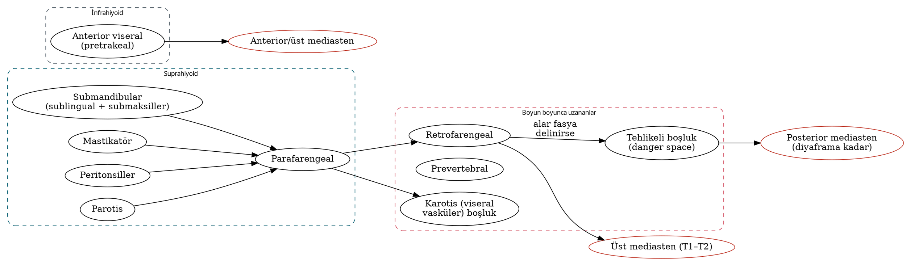

# Boyun Cerrahi Anatomisi ve Derin Boyun Boşlukları

Boyun cerrahisi, küçük bir alanda yoğunlaşmış hayati yapıların "katman katman" tanınmasını gerektirir. Bu bölüm fasyal planları, boyun üçgenlerini, lenf nodu seviyelerini, büyük damarları ve cerrahi açıdan kritik sinirleri; ardından enfeksiyon yayılımını belirleyen derin boyun boşluklarının anatomisini ele alır. Derin boyun enfeksiyonlarının tanı ve tedavisi Bölüm 5'te, boyun diseksiyonu tekniği Bölüm 6'da işlenmiştir.

## Yüzeyel işaretler ve vertebra düzeyleri

Muayene, görüntüleme yorumu ve cerrahi planlama için palpabl işaretlerin vertebra düzeyleriyle ilişkisi bilinmelidir.

Tablo: Boyunun yüzeyel işaretleri
| İşaret | Yaklaşık düzey | Önemi |
|---|---|---|
| Mandibula açısı | C2 | Seviye II'nin üst sınırına yakın; parotis kuyruğu |
| Hiyoid kemik | C3 | Seviye II–III sınırı (hiyoid alt kenarı); suprahiyoid/infrahiyoid boşluk ayrımı |
| Tiroid kıkırdak üst kenarı | C4 | Ana karotis bifurkasyonu çoğunlukla bu düzeyde (C3–C4) |
| Krikoid kıkırdak | C6 | Larenks–trakea ve farenks–özofagus geçişi; seviye III–IV sınırı; **Chassaignac (karotis) tüberkülü** (C6 transvers çıkıntı) |
| Suprasternal çentik | T2 alt kenarı | Seviye VI alt sınırı |
| Erb noktası (punctum nervosum) | SKM arka kenarının orta noktası | Servikal pleksus duyusal dallarının çıkışı; XI bu noktanın ≈1 cm üstünden arka üçgene girer |

## Boyun fasyaları

Boyun fasyaları **yüzeyel servikal fasya** ve **derin servikal fasya** olarak ikiye ayrılır. Derin fasyanın üç tabakası (yüzeyel, orta ve derin) derin boyun boşluklarının sınırlarını belirler.

### Yüzeyel servikal fasya

Deri altı yağ dokusu içinde yer alır; **platisma** kasını, yüzeyel venleri (eksternal ve anterior juguler venler) ve deri sinirlerini içerir. Yüzde SMAS ile devamlıdır. Boyun flepleri, platismanın hemen derininden (subplatismal düzlemde) kaldırılır; bu düzlem görece avaskülerdir ve marjinal mandibular sinir bu düzlemin derininde, derin fasyanın yüzeyel tabakası üzerinde/içinde seyreder.

### Derin servikal fasya

Tablo: Derin servikal fasyanın tabakaları
| Tabaka | Diğer adı | Sardığı yapılar | Sınırları / önemi |
|---|---|---|---|
| Yüzeyel tabaka | İnvestan (örten) fasya | SKM ve trapez kasları, parotis ve submandibular bezler; mandibula çevresinde çiğneme kaslarını sararak **mastikatör boşluğu** oluşturur | Yukarıda ense çizgisi, mastoid, zigoma ve mandibulaya; aşağıda klavikula, akromiyon ve sternuma tutunur. **Stilomandibular ligament** bu tabakadan oluşur |
| Orta tabaka — muskuler bölüm | Pretrakeal fasyanın kas yaprağı | Strap (infrahiyoid) kaslar | Hiyoidden sternuma uzanır |
| Orta tabaka — viseral bölüm | Pretrakeal/viseral fasya; arkada **bukkofarengeal fasya** | Tiroid, trakea, özofagus, farenks, larenks | Arkada kafa tabanından itibaren konstriktörleri örter; aşağıda perikard ve üst mediastene uzanır |
| Derin tabaka — alar bölüm | Alar fasya | — | Kafa tabanından **T1–T2**'ye uzanır; burada viseral fasya ile birleşir. Retrofarengeal boşluğun arka, tehlikeli boşluğun ön duvarı |
| Derin tabaka — prevertebral bölüm | Prevertebral fasya | Vertebralar, derin boyun kasları (longus colli/capitis, skalenler), frenik sinir, brakiyal pleksus kökleri | Kafa tabanından koksikse uzanır |

**Karotis kılıfı**, derin fasyanın her üç tabakasının katkısıyla oluşur ve ana/internal karotis arteri, internal juguler veni (IJV) ve vagus sinirini içerir. Kılıf, kafa tabanından mediastene uzanan bir yayılım koridorudur.

!!! sinav "Sınav notu"
    Subplatismal flep kaldırılırken **eksternal juguler ven ve büyük aurikuler sinir** SKM'nin yüzeyinde, derin fasyanın yüzeyel tabakasının üzerinde kalır. Flep bu yapıların yüzeyinden kaldırılırsa korunurlar; büyük aurikuler sinir gerektiğinde **sinir grefti** olarak kullanılabilir.

## Boyun üçgenleri

Sternokleidomastoid kası boyunu **ön** ve **arka** üçgenlere ayırır.

Tablo: Boyun üçgenleri ve içerikleri
| Üçgen | Sınırlar | Önemli içerik |
|---|---|---|
| **Submental** (tek) | İki digastrik ön karın ve hiyoid | Seviye IA lenf nodları, anterior juguler venin başlangıcı |
| **Submandibular (digastrik)** | Mandibula alt kenarı, digastrik ön ve arka karın | Submandibular bez, fasiyal arter ve ven, seviye IB nodları, lingual ve hipoglossal sinirler (bezin derininde), marjinal mandibular sinir (yüzeyde) |
| **Karotis** | SKM ön kenarı, digastrik arka karın, omohiyoid üst karın | Karotis bifurkasyonu, IJV, X, XII, ansa servikalis, SLS, üst juguler nodlar |
| **Muskuler** | Orta hat, omohiyoid üst karın, SKM ön kenarı | Strap kaslar, tiroid, larenks, trakea, özofagus |
| **Oksipital** (arka üçgenin üst kısmı) | SKM arka kenarı, trapez ön kenarı, omohiyoid alt karın | **Spinal aksesuar sinir**, servikal pleksus dalları, seviye VA nodları |
| **Subklavyen/supraklaviküler** | Omohiyoid alt karın, klavikula, SKM | Brakiyal pleksus gövdeleri, subklavyen arterin 3. kısmı, transvers servikal ve supraskapular damarlar, seviye VB nodları |

## Servikal lenf nodu seviyeleri

Boyunda yaklaşık 300 lenf nodu bulunur. Klinik ve cerrahi iletişimde **Memorial Sloan Kettering** kökenli, **AAO-HNS (Robbins, 1991; 2002 ve 2008 revizyonları)** tarafından standartlaştırılan seviye sistemi kullanılır. Radyolojik sınırlar Som ve arkadaşları (1999) tarafından tanımlanmıştır.

Tablo: Boyun lenf nodu seviyeleri — cerrahi ve radyolojik sınırlar
| Seviye | Cerrahi sınırlar | Radyolojik ipuçları | Başlıca drenaj |
|---|---|---|---|
| **IA** submental | İki digastrik ön karın arası, hiyoid ile mandibula simfizi arası | Digastrik ön karınların medial kenarları arası, hiyoidin üstü | Alt dudak, ağız tabanı ön kısmı, dil ucu, alt kesici diş eti |
| **IB** submandibular | Digastrik ön ve arka karın ile mandibula gövdesi arası; stilohiyoid arka sınır | Submandibular bezin arka kenarının önü | Ağız boşluğu, ön burun boşluğu, yüz orta kısmı yumuşak dokuları, submandibular bez |
| **IIA** üst juguler (ön) | Kafa tabanından hiyoid alt kenarına; stilohiyoidden SKM arka kenarına; **spinal aksesuar sinirin önü/altı** | IJV'nin önünde, medialinde, lateralinde veya arkasında ama IJV'den ayrılabilir | Ağız boşluğu, orofarenks, nazofarenks, larenks, hipofarenks, parotis |
| **IIB** üst juguler (arka) | **Spinal aksesuar sinirin arkası/üstü** | IJV'nin arkasında ve ondan yağ planıyla ayrılmış | Orofarenks ve nazofarenks (ağız boşluğu ve larenks kanserlerinde izole tutulum nadir) |
| **III** orta juguler | Hiyoid alt kenarından krikoid alt kenarına; sternohiyoid lateral kenarından SKM arka kenarına | — | Ağız boşluğu, orofarenks, larenks, hipofarenks |
| **IV** alt juguler | Krikoid alt kenarından klavikulaya | — | Hipofarenks, larenks, servikal özofagus, tiroid; **IVA/IVB** alt ayrımı (radyoterapi konsensüsü) |
| **VA** arka üçgen (üst) | Krikoid alt kenarının üstü; SKM arka kenarı ile trapez ön kenarı arası | Spinal aksesuar nodları | Nazofarenks, orofarenks, saçlı deri arka kısmı |
| **VB** arka üçgen (alt) | Krikoidin altı (transvers servikal ve supraklaviküler nodlar) | — | Nazofarenks, tiroid, (infraklaviküler primerler — Virchow) |
| **VI** santral (ön) kompartman | Hiyoidden suprasternal çentiğe; iki ana karotis arteri arası | Prelarengeal (**Delfian**), pretrakeal, paratrakeal nodlar | Tiroid, glottis–subglottis, piriform sinüs apeksi, servikal özofagus |
| **VII** üst mediastinal | Suprasternal çentikten innominat (brakiyosefalik) arterin üst kenarına | — | Tiroid, özofagus, subglottis |

!!! sinav "Sınav notu — IIA/IIB ayrımı"
    Seviye IIA ve IIB'yi **spinal aksesuar sinir** ayırır (radyolojide IJV'nin arka kenarı). Ağız boşluğu ve larenks kanserlerinde izole IIB metastazı nadir olduğundan, N0 boyunda IIB diseksiyonundan kaçınmak XI'in traksiyon hasarını ve omuz disfonksiyonunu azaltır. Orofarenks ve nazofarenks kanserlerinde IIB tutulumu daha sıktır.

### Seviye dışı lenf nodu grupları

- **Retrofarengeal nodlar (Rouvière nodu):** Kafa tabanından C3'e, IJV'nin medialinde ve longus capitis'in önünde. **Nazofarenks, orofarenks (özellikle farenks arka duvarı ve yumuşak damak), hipofarenks arka duvarı, sinonazal** kanserlerde tutulur. Klinik muayene ile değerlendirilemez; BT/MR gerekir. 2013 radyoterapi konsensüsünde **VIIa** olarak adlandırılır.
- **Retrostiloid nodlar** (VIIb), **parotis nodları** (VIII), **bukko-fasiyal nodlar** (IX), **retroaurikuler/subaurikuler ve oksipital nodlar** (X) — 2013 Grégoire konsensüs sınıflaması, radyoterapi hedef hacmi tanımlarında kullanılır.

!!! dikkat "Tuzak — iki farklı 'seviye VII'"
    Cerrahi/AJCC kullanımında **seviye VII = üst mediastinal nodlar**dır. 2013 radyoterapi konsensüsünde ise **VIIa retrofarengeal, VIIb retrostiloid** nodları ifade eder. Soru kökündeki bağlamı (cerrahi mi, radyoterapi mi) okuyun.

### Lenfatik drenajın klinik örüntüsü

Primer tümör bölgesine göre metastazın öncelikli seviyeleri (Lindberg 1972; Shah 1990) N0 boyunda **elektif (seçici) boyun diseksiyonunun** kapsamını belirler:

- **Ağız boşluğu:** I–III (**supraomohiyoid boyun diseksiyonu**); dil kanserinde seviye IV'e "atlama metastazı" (skip metastasis) ≈%10–15 olduğundan bazı merkezler I–IV önerir.
- **Orofarenks, hipofarenks, larenks:** II–IV (**lateral boyun diseksiyonu**); hipofarenks ve subglottiste VI de eklenir.
- **Tiroid:** VI (santral), gerekirse II–V lateral.
- **Saçlı deri arkası:** retroaurikuler, oksipital ve II–V (**posterolateral boyun diseksiyonu**).
- Bilateral drenaj riski yüksek bölgeler: dil kökü, yumuşak damak, farenks arka duvarı, supraglottik larenks, ağız tabanının orta hattı, nazofarenks.

## Boyunun büyük damarları

### Karotis sistemi

Ana karotis arter (sağda brakiyosefalik trunkustan, solda doğrudan aort arkından) boyunda dal vermez ve çoğunlukla **tiroid kıkırdak üst kenarı (C3–C4)** düzeyinde internal ve eksternal karotise ayrılır. Bifurkasyonda **karotis sinüsü** (baroreseptör) ve **karotis cismi** (kemoreseptör, paraganglion) bulunur; her ikisi de **Hering siniri (IX)** ile innerve edilir. Bifurkasyon manipülasyonu bradikardi ve hipotansiyona neden olabilir; lokal anestezik infiltrasyonu ile önlenebilir.

**İnternal karotis arter (İKA)** boyunda **dal vermez** ve başlangıçta eksternal karotisin **posterolateralinde** yer alır. **Eksternal karotis arter (EKA)** ise sırasıyla şu dalları verir: superior tiroid, asendan farengeal, lingual, fasiyal, oksipital, posterior aurikuler, maksiller ve yüzeyel temporal arter.

!!! hafiza "EKA dalları"
    "**S**ome **A**natomists **L**ike **F**reaking **O**ut **P**oor **M**edical **S**tudents": **S**uperior tiroid, **A**sendan farengeal, **L**ingual, **F**asiyal, **O**ksipital, **P**osterior aurikuler, **M**aksiller, yüzeyel temporal (**S**uperficial temporal). Boyunda dal veren arter EKA'dır; acil bir durumda "dal veriyorsa EKA, vermiyorsa İKA."

### Subklavyen arter dalları

Tiroservikal trunkus (inferior tiroid, transvers servikal, supraskapular arterler), vertebral arter, internal torasik arter ve kostoservikal trunkus. **İnferior tiroid arter** tiroidin arka yüzüne ulaşırken **RLS ile kesişir**; bu kesişim, RLS ve paratiroidlerin bulunmasında klasik bir işarettir.

### Venler

- **IJV**, juguler foramenden çıkar ve karotis kılıfı içinde arterin lateralinde iner; subklavyen ven ile birleşerek **venöz açıyı** oluşturur. **Ortak fasiyal ven** IJV'ye seviye II'de katılır ve boyun diseksiyonunda önemli bir işarettir.
- **Eksternal juguler ven**, SKM'nin yüzeyini çaprazlar; **anterior juguler venler** orta hatta yakın iner ve suprasternal bölgede **juguler venöz arkla** birleşir (trakeotomide kanama kaynağı).
- Bilateral IJV ligasyonu (eş zamanlı bilateral radikal boyun diseksiyonu) yüz ve beyin ödemi, SIADH ve körlük riski nedeniyle mümkünse **evrelenerek** yapılır ya da en az bir IJV korunur.

## Boyun cerrahisinde kritik sinirler

### Fasiyal sinirin servikal dalları

**Marjinal mandibular sinir**, alt dudak depresörlerini innerve eder. Dingman ve Grabb'in klasik çalışmasında fasiyal arterin **arkasında** olguların yaklaşık %19'unda mandibula alt kenarının altında seyrettiği, fasiyal arterin **önünde** ise hemen her zaman alt kenarın üstünde kaldığı gösterilmiştir. Daha yeni seriler, sinirin mandibula alt kenarının **1–2 cm altına** kadar inebildiğini göstermektedir.

!!! klinik "Klinik inci — Hayes Martin manevrası"
    Submandibular bölgede insizyon mandibula alt kenarının **en az 2–3 cm (iki parmak) altından** yapılır. **Fasiyal ven**, submandibular bezin alt kenarında bağlanıp ligatür ucu yukarı doğru çekilerek flebe asılırsa, venin yüzeyinde seyreden marjinal mandibular sinir de yukarı kaldırılarak korunur.

**Servikal dal** platismayı innerve eder; hasarı alt dudakta hafif asimetriye ("psödoparalizi") yol açabilir ancak depresör labii inferioris fonksiyonu korunur. Marjinal mandibular sinir hasarında hasta **dişlerini göstermeye** çalıştığında alt dudak etkilenen tarafta yukarıda kalır.

### Spinal aksesuar sinir (XI)

- Juguler foramenden çıkar; olguların çoğunda (≈%70) **IJV'nin anterolateralinden**, ≈%25–30'unda posteriorundan, nadiren içinden geçer.
- Atlasın transvers çıkıntısını çaprazlar, digastrik arka karnın derininden geçerek **SKM'nin derin yüzüne** girer ve onu innerve eder.
- SKM arka kenarından, **Erb noktasının ≈1 cm kraniyalinden** (büyük aurikuler sinirin çıkış noktası) arka üçgene girer; arka üçgende derin fasyanın yüzeyel tabakasının hemen altında, çok yüzeyel seyreder.
- **Trapeze**, klavikulanın yaklaşık 3–5 cm üstünden girer.
- Hasarında **omuz sendromu**: omuzda düşüklük, kolu 90°'nin üzerine abdüksiyonda güçlük, lateral skapular kanatlaşma, ağrı ve adeziv kapsülit. Koruyucu boyun diseksiyonu sonrası bile traksiyon/devaskülarizasyona bağlı geçici disfonksiyon görülebilir; erken fizik tedavi önerilir.

!!! dikkat "Tuzak — lenf nodu biyopsisinde XI"
    Arka üçgendeki yüzeyel bir lenf nodunun **lokal anestezi altında eksizyonel biyopsisi**, XI'in iyatrojenik yaralanmasının en sık nedenlerinden biridir. Sinir, SKM arka kenarının orta noktası ile trapez ön kenarının alt 1/3'ü arasındaki çizgi boyunca, derinin hemen altında seyreder.

### Vagus siniri ve dalları

Vagus, karotis kılıfı içinde arterler ile IJV arasında ve bunların **arkasında** iner. Boyunda farengeal dalları, **süperior larengeal siniri (SLS)** ve kardiyak dalları verir; RLS göğüs girişinde ayrılır (sağda subklavyen, solda aort arkı çevresinde döner). SLS, hiyoid büyük boynuzu düzeyinde **internal dal** (tirohiyoid membranı superior larengeal arterle birlikte delerek supraglottik duyuyu sağlar) ve **eksternal dal** (superior tiroid artere yakın seyrederek krikotiroid kasını innerve eder) olarak ikiye ayrılır. Eksternal dalın superior tiroid arterle ilişkisi Cernea sınıflamasıyla tanımlanır (Bölüm 26).

### Hipoglossal sinir (XII) ve ansa servikalis

- Hipoglossal kanaldan çıkar, İKA ile IJV arasında iner; **oksipital arterin SKM dalının** altından döner.
- Karotis bifurkasyonunun yaklaşık 1–2 cm üstünde **İKA ve EKA'nın yüzeyinden** öne doğru geçer, digastrik arka karın ve stilohiyoidin derininden submandibular üçgene girer.
- Hiyoglossus kası üzerinde, milohiyoidin derininde ilerler; çevresinde **ranin venler** (venae comitantes) bulunur — bu venlerden kanama, sinirin yakınında körlemesine koter kullanımına yol açmamalıdır.
- Hasarında dil, **çıkarıldığında lezyon tarafına** sapar; uzun dönemde aynı tarafta atrofi ve fasikülasyon gelişir.
- **Ansa servikalis:** Üst kök (C1 lifleri, XII ile birlikte seyreder; *desendens hipoglossi*) ve alt kök (C2–C3; *desendens servikalis*) karotis kılıfının önünde birleşir. Strap kasları innerve eder; **tirohiyoid ve geniohiyoid** kaslar ise XII ile seyreden C1 lifleri tarafından doğrudan innerve edilir. Ansa servikalis, fasiyal reanimasyonda ve RLS reinnervasyonunda donör sinir olarak kullanılır.

### Glossofarengeal sinir (IX)

İKA ile EKA arasından, stiloid çıkıntının derininden geçer ve **stilofarengeus** kasının lateral kenarı boyunca farenkse girer. Tonsillektomi yatağında tonsil kutbunun derininde dil arka 1/3 dalları bulunur; derin diseksiyon tat bozukluğu ve refere kulak ağrısına neden olabilir.

### Sempatik zincir

Karotis kılıfının arkasında, prevertebral fasyanın içinde/üzerinde longus colli/capitis kasları üzerinde yer alır. **Süperior servikal ganglion** C2–C3 düzeyindedir. Hasarı **Horner sendromuna** (pitoz, miyozis, anhidroz, görünürde enoftalmi) yol açar. Sempatik zincir kaynaklı schwannomlar karotisleri **öne ve mediale**, vagal schwannomlar ise İKA ile IJV'yi **ayırarak** iter (Bölüm 8).

### Frenik sinir ve brakiyal pleksus

**Frenik sinir (C3–C5)**, anterior skalen kasın ön yüzünde **yukarı-lateralden aşağı-mediale** doğru, **prevertebral fasyanın derininde** iner. Brakiyal pleksus kökleri anterior ve orta skalen kaslar arasından çıkar. Boyun diseksiyonunda seviye IV ve V tabanında **prevertebral fasyanın korunması**, frenik sinir ve brakiyal pleksusu güvenceye alır. Frenik sinir hasarı aynı taraf diyafram paralizisine neden olur.

### Servikal pleksusun duyusal dalları

Erb noktasından çıkan dallar: **küçük oksipital** (C2), **büyük aurikuler** (C2–C3; kulak memesi ve parotis üzeri cilt), **transvers servikal** (C2–C3) ve **supraklaviküler sinirler** (C3–C4). Büyük aurikuler sinirin parotidektomide feda edilmesi kulak memesinde kalıcı uyuşukluğa yol açar.

## Torasik kanal ve lenfatik kanallar

**Torasik kanal**, posterior mediastende özofagusun sol kenarı boyunca yükselir, **C7 düzeyinde (klavikulanın ≈3–4 cm üstünde)** bir yay çizerek karotis kılıfının arkasından geçer; anterior skalen kas, frenik sinir ve tiroservikal trunkusun **önünden** ilerleyerek **sol IJV ile subklavyen venin birleşim yerine** (venöz açı) açılır. Anatomik varyasyonları sıktır (çift kanal, sağa açılma, çoklu dallar). **Sağ lenfatik kanal** daha kısa ve inkonstanttır.

!!! klinik "Klinik inci — şilöz fistül"
    Boyun diseksiyonu sonrası şilöz kaçak **%1–2,5** oranında görülür ve olguların **%75–90'ı solda** gelişir. Ameliyat sırasında anestezistten **Valsalva/pozitif basınçlı ventilasyon** istemek kaçağın görülmesini sağlar. Yönetim: dren takibi, orta zincirli yağ asitli diyet veya TPN, oktreotid, basınçlı pansuman; günlük drenaj yüksekse (sıklıkla >500–1000 mL/gün) veya konservatif tedavi başarısızsa cerrahi eksplorasyon veya torasik kanal embolizasyonu/ligasyonu (Bölüm 6).

## Derin boyun boşlukları

Derin boyun boşlukları, derin servikal fasya tabakaları arasındaki potansiyel aralıklardır. Enfeksiyon ve tümörlerin yayılım yolunu belirledikleri için hem enfeksiyon cerrahisinde hem de görüntüleme yorumunda temel öneme sahiptirler. Pratik sınıflama **hiyoid kemiğe göre** yapılır.

Tablo: Derin boyun boşluklarının anatomisi
| Boşluk | Sınırlar | İçerik | Uzanım / iletişim |
|---|---|---|---|
| **Retrofarengeal** | Önde bukkofarengeal (viseral) fasya, arkada alar fasya; orta hatta rafe ile iki yana ayrılır | Retrofarengeal (Rouvière) lenf nodları, yağ | Kafa tabanından **T1–T2**'ye; abseler rafe nedeniyle genellikle **tek taraflı**; nodlar 4–6 yaşından sonra geriler → çocuk hastalığı |
| **Tehlikeli boşluk** (Grodinsky–Holyoke boşluk 4) | Önde alar, arkada prevertebral fasya | Gevşek areolar doku | Kafa tabanından **diyaframa** (posterior mediasten) → mediastinit |
| **Prevertebral** | Önde prevertebral fasya, arkada vertebra gövdeleri | Derin kaslar | Kafa tabanından **koksikse**; orta hatta yerleşir; vertebral osteomiyelit/Pott absesi |
| **Parafarengeal** | Ters piramit: taban kafa tabanı, tepe hiyoid büyük boynuzu; medialde superior konstriktör ve bukkofarengeal fasya, lateralde medial pterigoid–mandibula ramusu–parotis derin lobu, arkada prevertebral fasya; önde pterigomandibular rafe | **Prestiloid:** yağ, parotis derin lobu, minör tükürük bezi artıkları, V3 dalları, internal maksiller arter. **Poststiloid:** İKA, IJV, IX–XII, sempatik zincir, lenf nodları | Peritonsiller, submandibular, mastikatör, parotis, retrofarengeal ve karotis boşluklarıyla iletişim — "kavşak" boşluk |
| **Submandibular** | Yukarıda ağız tabanı mukozası, aşağıda hiyoid ve investan fasya; milohiyoid kası onu **sublingual** (üst) ve **submaksiller** (alt) bölümlere ayırır | Sublingual bez, Wharton kanalı, lingual sinir, XII (sublingual); submandibular bez ve nodlar (submaksiller) | İki bölüm milohiyoidin arka serbest kenarında birleşir; parafarengeal boşluğa açılır; **Ludwig anjini** |
| **Mastikatör** | İnvestan fasyanın mandibula çevresinde yarılması | Çiğneme kasları, mandibula ramusu, V3, internal maksiller arter | Temporal boşluğa yukarı, parafarengeale mediale; **trismus** belirgindir |
| **Peritonsiller** | Tonsil kapsülü ile superior konstriktör arası | Gevşek bağ dokusu | Parafarengeal boşluğa |
| **Parotis** | İnvestan fasyanın parotisi sarması (medialde zayıf) | Parotis, fasiyal sinir, retromandibular ven, EKA, intraparotid nodlar | Medialden parafarengeal boşluğa |
| **Karotis** | Karotis kılıfı (üç tabakanın katkısı) | Arterler, IJV, X, sempatik lifler | Kafa tabanından mediastene ("Lincoln otoyolu"); IJV tromboflebiti (Lemierre) |
| **Anterior viseral (pretrakeal)** | Viseral fasya içinde trakea önü | Tiroid, trakea, özofagus önü | Tiroid kıkırdaktan **üst mediastene (≈T4, aort arkı)**; özofagus perforasyonu sonrası |

!!! sinav "Sınav notu — dişler ve milohiyoid hattı"
    Mandibular **ikinci ve üçüncü molar** dişlerin kökleri milohiyoid hattın **altında** kalır; bu dişlerin enfeksiyonları **submaksiller** boşluğa yayılır. **Premolarlar ve birinci molar** kökleri hattın **üstündedir**; enfeksiyonları **sublingual** boşluğa açılır. Ludwig anjininde en sık kaynak alt 2. ve 3. molar dişlerdir.

!!! hafiza "Üç 'aşağı inen' boşluk"
    **Retrofarengeal → T1–T2 (üst mediasten); tehlikeli → diyafram; prevertebral → koksiks.** Tehlikeli boşluk, alar ve prevertebral fasyalar arasındadır; adı mediastene hızlı yayılımdan gelir.

## Boyun cerrahisinde tehlike noktaları

Tablo: Boyun cerrahisinde yaralanmaya açık yapılar ve korunma ipuçları
| Yapı | Risk altındaki girişim | İşaret / korunma | Hasar sonucu |
|---|---|---|---|
| Marjinal mandibular sinir | Submandibular bez eksizyonu, seviye I diseksiyonu | İnsizyon mandibulanın 2–3 cm altında; Hayes Martin manevrası | Alt dudak depresör paralizisi |
| Spinal aksesuar sinir | Seviye IIB ve V diseksiyonu, arka üçgen nod biyopsisi | Erb noktasının ≈1 cm üstü; IJV ile ilişkisi | Omuz sendromu |
| Hipoglossal sinir | Seviye II, submandibular bez, karotis cerrahisi | Digastrik arka karnın hemen altında, İKA–EKA'yı çaprazlar; ranin venler | Dilde ipsilateral deviasyon, atrofi |
| Lingual sinir | Submandibular bez eksizyonu | Wharton kanalı ile çaprazlaşır (önce lateral, sonra alt, sonra mediale geçer); submandibular ganglion bağlantısı bağlanırken dikkat | Dil ön 2/3 duyu ve tat kaybı |
| Vagus | Seviye II–IV diseksiyonu, IJV ligasyonu | Karotis kılıfında arter–ven arasında, arkada | Ses kısıklığı, disfaji, aspirasyon |
| SLS dış dalı | Tiroid üst kutup diseksiyonu | Superior tiroid arter dallarının **kapsüle yakın**, tek tek bağlanması | Tiz seste ve ses projeksiyonunda kayıp |
| RLS | Tiroidektomi, santral diseksiyon | İnferior tiroid arter kesişimi, Zuckerkandl tüberkülü, Berry ligamenti; nöromonitörizasyon | Vokal kord paralizisi |
| Sempatik zincir | Parafarengeal cerrahi, derin seviye II–III diseksiyonu | Prevertebral fasyanın korunması | Horner sendromu |
| Frenik sinir | Seviye IV–V diseksiyonu | Anterior skalen üzerinde, prevertebral fasyanın derininde | Diyafram paralizisi |
| Torasik kanal | Sol seviye IV diseksiyonu | Venöz açı çevresi; Valsalva ile kontrol | Şilöz fistül, şilotoraks |
| Brakiyal pleksus | Seviye V diseksiyonu | Skalenler arası; prevertebral fasyanın korunması | Üst ekstremite motor/duyu kaybı |

!!! ozet "Kritik noktalar"
    - Derin servikal fasyanın üç tabakası: **yüzeyel (investan), orta (muskuler + viseral) ve derin (alar + prevertebral)**; karotis kılıfı üçünün katkısıyla oluşur.
    - **IIA/IIB ayrımı spinal aksesuar sinirle**, II/III ayrımı **hiyoid alt kenarı**, III/IV ayrımı **krikoid alt kenarı**, VA/VB ayrımı **krikoid** düzeyiyle yapılır. Seviye VI hiyoid–suprasternal çentik ve iki karotis arasıdır; cerrahi seviye VII üst mediastendir.
    - Ağız boşluğu kanserlerinde I–III, larenks/farenks kanserlerinde II–IV öncelikli seviyelerdir; dil kanserinde seviye IV atlama metastazı unutulmamalıdır.
    - Karotis bifurkasyonu **C3–C4**; İKA boyunda dal vermez. EKA'nın sekiz dalı vardır.
    - XI çoğunlukla **IJV'nin önünden** geçer, SKM'yi innerve eder, **Erb noktasının ≈1 cm üstünden** arka üçgene girer ve trapezi innerve eder; hasarı omuz sendromuna yol açar.
    - XII, karotis bifurkasyonunun 1–2 cm üstünde İKA ve EKA'yı çaprazlar; oksipital arterin SKM dalı altından döner. Tirohiyoid ve geniohiyoid C1 (XII ile seyreden) tarafından innerve edilir.
    - Torasik kanal **C7 düzeyinde** sol venöz açıya açılır; şilöz fistüllerin %75–90'ı soldadır.
    - Retrofarengeal boşluk T1–T2'ye, **tehlikeli boşluk diyaframa**, prevertebral boşluk koksikse kadar uzanır. Parafarengeal boşluk stiloid fasyayla **prestiloid** ve **poststiloid** bölümlere ayrılır.
    - Alt 2. ve 3. molar enfeksiyonları milohiyoidin altına (submaksiller boşluk) yayılır ve Ludwig anjininin en sık kaynağıdır.
