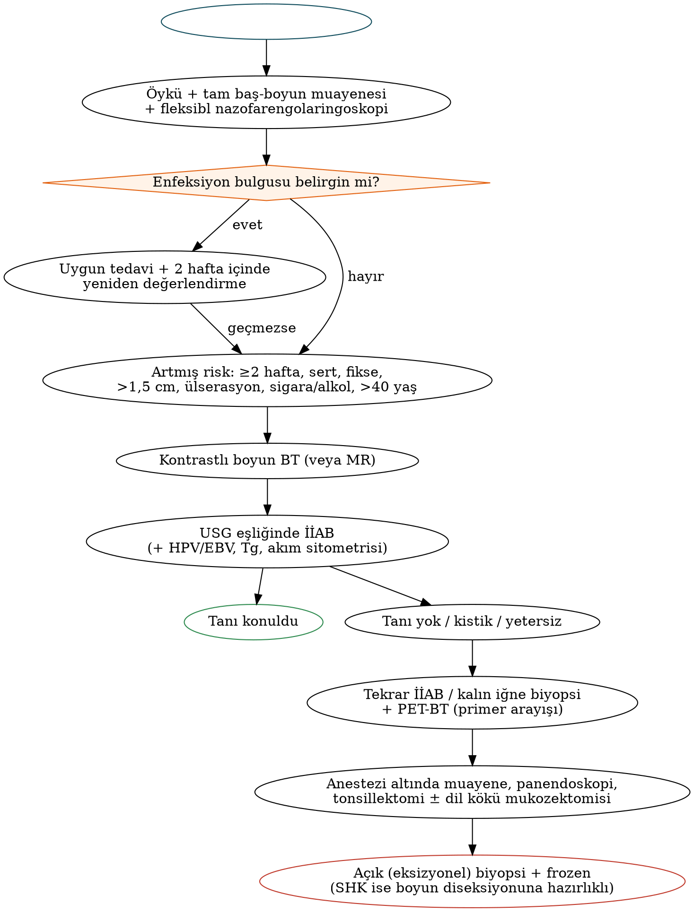

# Erişkin ve Çocukta Boyun Kitlesine Yaklaşım ve Tanısal Yöntemler

Boyun kitlesi, KBB pratiğinin en sık başvuru nedenlerinden biridir ve çoğu zaman bir hastalığın *ilk ve tek* bulgusudur. Erişkinde persistan bir boyun kitlesi, aksi kanıtlanana kadar **üst aerodijestif sistem (ÜADS) kaynaklı metastatik skuamöz hücreli karsinom (SHK)** olarak değerlendirilmelidir; çocukta ise büyük çoğunluk enfeksiyöz veya konjenitaldir. Bu bölüm yaş, yerleşim ve süreye dayalı ayırıcı tanıyı, AAO-HNS 2017 kılavuzunu, görüntüleme ve doku tanısı yöntemlerini ve pediatrik yaklaşımı ele alır.

## Epidemiyolojik çerçeve: yaş, süre ve "80 kuralı"

Yaş, ayırıcı tanıda en güçlü tek değişkendir.

Tablo: Yaşa göre boyun kitlelerinin olası nedenleri (sıklık sırasıyla)
| Yaş grubu | 1. sıra | 2. sıra | 3. sıra |
|---|---|---|---|
| Çocuk (0–15) | Enflamatuvar (reaktif lenfadenopati, lenfadenit) | Konjenital (tiroglossal kanal kisti, brankiyal anomaliler, vasküler anomaliler) | Neoplastik (lenfoma, rabdomiyosarkom, nöroblastom, tiroid karsinomu) |
| Genç erişkin (16–40) | Enflamatuvar | Konjenital | Neoplastik (lenfoma, tiroid karsinomu, **HPV ilişkili orofarenks kanseri**) |
| >40 yaş | **Neoplastik** (metastatik SHK, lenfoma, tiroid, tükürük bezi) | Enflamatuvar | Konjenital |

!!! sinav "Sınav notu — iki klasik kural"
    **80 kuralı:** 40 yaş üstü erişkinde tiroid dışı boyun kitlelerinin ≈%80'i neoplastiktir; neoplastik olanların ≈%80'i maligndir; malign olanların ≈%80'i metastatiktir ve bunların ≈%80'i klavikula üstü bir primerden (çoğunlukla ÜADS SHK) kaynaklanır. Çocuklarda ise kitlelerin ≈%80'i benigndir.
    **7 kuralı (süre):** Günler (≈7 gün) → enflamatuvar; aylar (≈7 ay) → neoplastik; yıllar (≈7 yıl) → konjenital.

!!! dikkat "Tuzak — erişkinde 'brankiyal kist'"
    40 yaş üstünde yeni ortaya çıkan **kistik lateral boyun kitlesi**, aksi kanıtlanana kadar **kistik metastazdır**: başta **HPV ilişkili orofarenks SHK** (tonsil, dil kökü) ve **papiller tiroid karsinomu**, daha az sıklıkla nazofarenks karsinomu. Genç, sigara içmeyen hastada bile "brankiyal kist" tanısıyla eksizyon yapmadan önce orofarenks muayenesi, görüntüleme ve İİAB (HPV özgül test dahil) gerekir.

## Öykü

Öykü, kitlenin doğası hakkında çoğu zaman en değerli ipuçlarını verir:

- **Süre ve seyir:** Ani başlangıç, ağrı, ateş ve hızlı küçülme enfeksiyonu; birkaç haftadır süren ağrısız büyüme neoplaziyi düşündürür. İki haftadan uzun süren ve belirgin dalgalanma göstermeyen kitle risk işaretidir.
- **Enfeksiyon öyküsü:** Üst solunum yolu enfeksiyonu, diş ağrısı, deri lezyonu, kedi teması (Bartonella), çiğ et tüketimi/kedi dışkısı (Toxoplasma), tüberküloz teması, seyahat.
- **ÜADS semptomları:** Disfaji, odinofaji, **refere otalji** (IX ve X aracılı; tonsil, dil kökü, hipofarenks, larenks lezyonlarında), ses kısıklığı, hemoptizi, solunum sıkıntısı, tek taraflı burun tıkanıklığı/epistaksis, **erişkinde tek taraflı seröz otitis media** (nazofarenks karsinomu).
- **Risk faktörleri:** Sigara (paket-yıl), alkol, betel/areka, oral seks ve partner sayısı (HPV), immünsupresyon/HIV, Güneydoğu Asya ve Akdeniz kökeni (nazofarenks karsinomu), çocuklukta boyuna radyasyon (tiroid karsinomu), önceki cilt kanseri (özellikle saçlı deri ve kulak).
- **Sistemik semptomlar:** B semptomları (ateş >38 °C, gece terlemesi, 6 ayda vücut ağırlığının >%10 kaybı), kaşıntı, **alkolle ağrıyan lenf nodları** (Hodgkin lenfoma).
- **Tiroid ve tükürük bezi semptomları:** Hiper/hipotiroidi bulguları, yemekle şişen bez (sialolitiyazis), kuru ağız ve göz (Sjögren).

## Fizik muayene

Tam bir baş-boyun muayenesi; deri ve saçlı deri, kulaklar, ağız boşluğu (bimanuel palpasyon), orofarenks (tonsil ve dil kökünün **palpasyonu**), kraniyal sinirler, tiroid ve tükürük bezlerini kapsamalı ve **fleksibl nazofarengolaringoskopi** ile tamamlanmalıdır.

Kitle şu açılardan tanımlanır: yerleşim (seviye), boyut, kıvam (yumuşak, lastik, sert), hareketlilik (çevreye fiksasyon), hassasiyet, cilt değişiklikleri (eritem, ülserasyon, fistül), **pulsatilite ve üfürüm**, transilluminasyon, yutkunma ve dil çıkarmakla hareket.

Tablo: Yerleşime göre boyun kitlesinin ayırıcı tanısı
| Yerleşim | Düşünülmesi gerekenler |
|---|---|
| Orta hat, suprahiyoid | Dermoid kist, tiroglossal kanal kisti, submental lenf nodu, ranula (dalan) |
| Orta hat, infrahiyoid | Tiroglossal kanal kisti, tiroid nodülü/piramidal lob, Delfian (prelarengeal) nod, laringosel (eksternal), timik kist |
| Seviye I (submandibular) | Lenfadenit, submandibular bez (sialoadenit, taş, tümör), lenfatik malformasyon, dalan ranula, metastaz (ağız boşluğu, yüz cildi) |
| Seviye II (üst juguler) | Reaktif nod, **metastaz (orofarenks, ağız, larenks, nazofarenks)**, brankiyal yarık kisti (çocuk/genç), **karotis cisim tümörü** (pulsatil, yatay hareketli, dikey sabit — Fontaine bulgusu), vagal schwannom/paragangliom, parotis kuyruğu tümörü |
| Seviye III–IV | Metastaz (larenks, hipofarenks, tiroid), tiroid kitlesi, lenfoma, laringosel (kombine) |
| Arka üçgen (V) | Lenfoma, **nazofarenks karsinomu metastazı**, saçlı deri kanseri metastazı, tüberküloz, lenfatik malformasyon (çocuk), lipom |
| Supraklaviküler | **Virchow nodu (solda; abdominal/torasik malignite)**, lenfoma, tiroid, akciğer ve meme kanseri, tüberküloz |
| Parotis bölgesi | Parotis tümörü (pleomorfik adenom, Warthin), intraparotid nod (cilt SHK, melanom metastazı), lenfoepitelyal kist (HIV), birinci yarık anomalisi |

!!! klinik "Klinik inci — pulsatil kitle"
    Pulsatil veya üfürüm duyulan bir boyun kitlesinde (karotis cisim tümörü, vagal paragangliom, anevrizma, psödoanevrizma) **görüntülemeden önce İİAB veya açık biyopsi yapılmaz.** Kontrastlı BT/MR anjiyografi tanı koydurucudur; paragangliomlarda biyopsi gereksiz ve tehlikelidir.

## AAO-HNS klinik uygulama kılavuzu (2017): Erişkinde boyun kitlesi

Amerikan KBB-BBC Akademisi Vakfı kılavuzu (Pynnonen ve ark., 2017), erişkinlerde boyun kitlesinin gecikmeden tanınması için çerçeve sunar ve sınavlarda sık sorgulanır.

Tablo: AAO-HNS 2017 boyun kitlesi kılavuzunun ana önerileri (özet)
| Konu | Öneri |
|---|---|
| Malignite riski — öykü | Enfeksiyöz bir neden öyküsü olmayan ve **≥2 haftadır** belirgin dalgalanma göstermeden süren veya süresi belirsiz kitle **artmış risklidir** (güçlü öneri) |
| Malignite riski — muayene | **Çevre dokulara fiksasyon, sert kıvam, >1,5 cm boyut, üzerindeki deride ülserasyon** bulgularından ≥1'i artmış risk göstergesidir (güçlü öneri) |
| Hedefe yönelik değerlendirme | Artmış riskli hastada larenks, dil kökü ve farenks mukozasının görselleştirilmesini (genellikle fleksibl endoskopi) içeren öykü ve muayene |
| Antibiyotik | Bakteriyel enfeksiyon bulgusu yoksa **rutin antibiyotik verilmemeli** (karşı öneri) — "ampirik antibiyotik ve bekle" yaklaşımı tanıyı geciktirir |
| Risk düşükse | Hastaya ek değerlendirme gerektirecek ölçütler anlatılmalı ve izlem planı belgelenmelidir |
| Görüntüleme | Artmış riskli hastada **kontrastlı boyun BT (veya MR)** (güçlü öneri) |
| Doku tanısı | Açık biyopsi yerine **İİAB** (güçlü öneri) |
| Kistik kitle | İİAB veya görüntülemede kistik olan kitlede **tanı konana kadar değerlendirmeye devam edilmeli**; benign olduğu varsayılmamalı (güçlü öneri) |
| Yardımcı testler | İİAB ve görüntülemeyle tanı konamayan artmış riskli hastada öykü ve muayeneye göre ek testler |
| Anestezi altında muayene | İİAB, görüntüleme ve yardımcı testlerle tanı/primer bulunamamışsa **açık biyopsiden önce** ÜADS'nin anestezi altında muayenesi |

!!! kilavuz "Kılavuzun özü"
    Artmış riskli erişkin boyun kitlesinde sıralama: **hedefe yönelik muayene + fleksibl endoskopi → kontrastlı BT/MR → (USG eşliğinde) İİAB → gerekirse yardımcı testler → anestezi altında muayene/panendoskopi → en son açık biyopsi.** Antibiyotik denemesi, enfeksiyon bulgusu olmadıkça yapılmaz.

## Görüntüleme yöntemleri

### Ultrasonografi

Ucuz, iyonizan radyasyon içermeyen, gerçek zamanlı ve İİAB'ye rehberlik eden bir yöntemdir. **Çocuklarda, tiroid ve tükürük bezi kitlelerinde ilk tercih** görüntülemedir. Doppler ile vaskülarite değerlendirilir.

Tablo: Lenf nodlarında benign ve malign ultrasonografik özellikler
| Özellik | Benign/reaktif lehine | Malign lehine |
|---|---|---|
| Şekil | Oval, uzun/kısa eksen oranı >2 | **Yuvarlak** (kısa/uzun eksen oranı >0,5) |
| Hilus | Ekojenik yağlı hilus korunmuş | **Hilusun kaybı** |
| Vaskülarite | Hiler | **Periferik/kaotik** |
| İç yapı | Homojen | **Nekroz/kistik değişiklik** (SHK, HPV+ OPC, PTK), **mikrokalsifikasyon** (PTK) |
| Kenar | Düzgün | Düzensiz kenar, çevre dokuya infiltrasyon (ENE) |
| Ekojenite | Hipoekoik | Tiroid benzeri hiperekojenite (PTK metastazı) |

### Bilgisayarlı tomografi

Artmış riskli erişkinde **ilk basamak** görüntülemedir. Primer tümör arayışı, nodal yük, nekroz, **radyolojik ekstranodal yayılım (iENE)**, damar ilişkisi ve kemik invazyonu hakkında bilgi verir. Kontrast madde kullanılmalıdır.

- Patolojik nod ölçütleri: **merkezi nekroz** (boyuttan bağımsız, en özgül bulgu), kısa eksen **>10 mm** (seviye II için ≈>11–15 mm), yuvarlak şekil, aynı drenaj alanında ≥3 sınırda büyüklükte nod kümesi.
- **iENE bulguları:** düzensiz/silik nod kenarı, perinodal yağ dokusunda infiltrasyon, iki veya daha fazla nodun kaynaşarak tek kitle oluşturması, komşu kas/deri/damar invazyonu. iENE, TNM-9'da nazofarenks ve HPV ilişkili orofarenks kanserinin N kategorisine girmiştir (Bölüm 9, 15, 16).
- Tiroid kanseri şüphesinde iyotlu kontrast, RAI tedavisini birkaç hafta geciktirebilir; ancak ATA 2025, ilerlemiş/invaziv hastalıkta kontrastlı kesitsel görüntülemeyi önermekte ve bu gecikmeyi kabul edilebilir saymaktadır.

### Manyetik rezonans görüntüleme

Yumuşak doku çözünürlüğü yüksektir. **Nazofarenks, parafarengeal boşluk, kafa tabanı, orbita, perinöral yayılım, dil ve ağız tabanı, parotis** değerlendirmesinde ve kemik iliği invazyonunda üstündür. Difüzyon ağırlıklı görüntüleme (ADC değerleri) tümör–enflamasyon ayrımına katkı sağlar. Hareket artefaktı (yutkunma) larenks–hipofarenkste dezavantajdır.

### PET-BT

18F-FDG PET-BT'nin başlıca endikasyonları:

1. **Primeri bilinmeyen metastatik SHK** (anestezi altında muayene ve biyopsiden *önce* yapılmalı; biyopsi sonrası enflamasyon yanlış pozitifliğe yol açar).
2. Evre III–IV hastalıkta uzak metastaz ve senkron ikinci primer taraması.
3. **Kemoradyoterapi sonrası yanıt değerlendirmesi** (tedavi bitiminden ≈12 hafta sonra). **PET-NECK** çalışması (Mehanna, NEJM 2016), N2–N3 hastalıkta planlı boyun diseksiyonu yerine PET-BT ile izlemin sağkalımda eşdeğer olduğunu ve gereksiz diseksiyonları belirgin azalttığını göstermiştir.
4. Nüks şüphesi ve radyoterapi planlaması.

Negatif prediktif değeri yüksektir (tedavi sonrası negatif PET güvenilirdir); pozitif prediktif değeri ise enflamasyon nedeniyle sınırlıdır. Waldeyer halkası ve tükürük bezlerinde fizyolojik tutulum görülebilir.

## Doku tanısı

### İnce iğne aspirasyon biyopsisi (İİAB)

Boyun kitlesinin doku tanısında **ilk tercih** İİAB'dir. Duyarlılığı ≈%90, özgüllüğü >%95 düzeyindedir; **USG eşliğinde** yapılması tanısal verimi artırır ve kistik kitlelerde solid komponenti hedeflemeye olanak verir. Tümör ekimi riski ihmal edilebilir düzeydedir.

Aspirattan yapılabilecek yardımcı incelemeler:

- **HPV özgül testleri** (yüksek riskli HPV DNA/RNA, PCR veya ISH): CAP 2025 güncellemesi, sitoloji örneklerinde p16 immünohistokimyası yerine **refleks HPV özgül test** yapılmasını güçlü öneri olarak benimsemiştir.
- **EBV (EBER in situ hibridizasyon):** Nazofarenks karsinomu metastazında pozitiftir.
- **Tiroglobulin yıkama (washout):** Papiller tiroid karsinomu metastazı (özellikle kistik nodlarda sitoloji yetersiz kaldığında).
- **Kalsitonin yıkama:** Medüller tiroid karsinomu. **PTH yıkama:** Paratiroid adenomu (tiroid nodülü/lenf nodundan ayırma).
- **Akım sitometrisi:** Lenfoma şüphesinde monoklonalite. Ancak lenfoma alt tiplendirmesi çoğu zaman doku mimarisi gerektirir.
- Kültür ve aside dirençli boyama, mikobakteri PCR'ı (tüberküloz şüphesi).

!!! dikkat "Tuzak — kistik kitlede yanıltıcı sitoloji"
    Kistik metastazlarda (HPV+ orofarenks SHK, papiller tiroid karsinomu) aspirat yalnızca makrofaj ve kist sıvısı içerebilir ve "benign kist içeriği" olarak raporlanabilir. AAO-HNS kılavuzuna göre **kistik kitle tanı konana kadar araştırılmalıdır**: USG eşliğinde solid komponentten tekrar İİAB, kalın iğne biyopsisi, HPV testi ve tiroglobulin yıkaması.

### Kalın iğne (core) biyopsi

USG eşliğinde kalın iğne biyopsisi, doku mimarisini koruduğu için **lenfoma** tanı ve alt tiplendirmesinde, tekrarlayan yetersiz İİAB'de ve bazı tükürük bezi tümörlerinde tercih edilir. Komplikasyon oranı düşüktür; büyük damarlara yakın lezyonlarda dikkat gerekir.

### Açık biyopsi: kurallar

Açık biyopsi, yukarıdaki tüm basamaklardan sonra tanı konamamışsa yapılır. Uyulması gereken kurallar:

1. Biyopsiden önce **panendoskopi/anestezi altında muayene** yapılmış (veya aynı seansta yapılacak) olmalıdır.
2. İnsizyon, olası bir **boyun diseksiyonu insizyonuna dahil edilebilecek** şekilde planlanır (genellikle yatay, cilt kırışıklıklarına paralel).
3. Mümkünse **eksizyonel** biyopsi tercih edilir; kistik kitlede kist duvarı bütün çıkarılır.
4. **Frozen kesit** istenir. SHK saptanırsa ve hasta önceden bilgilendirilmiş/onam alınmışsa aynı seansta **boyun diseksiyonuna** geçilebilir.
5. Lenfoma şüphesinde dokunun bir kısmı **formaline konmadan taze** olarak (akım sitometrisi, moleküler çalışmalar, kültür) patolojiye gönderilir.

!!! sinav "Sınav notu"
    Metastatik SHK'ya kesisel/eksizyonel açık biyopsinin ardından yapılan definitif tedavide bölgesel nüks ve yara komplikasyonlarının arttığı klasik serilerde (McGuirt ve McCabe, 1978) bildirilmiştir. Güncel serilerde bu etki tartışmalıdır; yine de ilke değişmemiştir: **önce İİAB, açık biyopsi en son seçenek.**

## Yardımcı laboratuvar testleri

Öykü ve muayeneye göre seçilir: tam kan sayımı ve periferik yayma, sedimantasyon/CRP, **EBV serolojisi** (VCA IgM, heterofil antikor), CMV ve **Toxoplasma IgM**, **Bartonella** serolojisi, HIV testi, tüberkülin deri testi veya interferon-γ salınım testi, akciğer grafisi, TSH ve gerektiğinde kalsitonin, anjiyotensin dönüştürücü enzim (sarkoidoz), LDH (lenfoma), kalsiyum ve PTH (paratiroid).

## Panendoskopi ve anestezi altında muayene

Klasik "üçlü endoskopi" (direkt laringoskopi, rijit özofagoskopi ve bronkoskopi), ÜADS kanserlerinde **senkron ikinci primer** (sıklığı yaklaşık %2–10; en sık ÜADS, akciğer ve özofagusta) taraması ve primer tümörün haritalanması için kullanılmıştır. Günümüzde PET-BT ve fleksibl endoskopinin yaygınlaşmasıyla rutin özofagoskopi ve bronkoskopi seçici hale gelmiştir. Primeri bilinmeyen metastazda anestezi altında muayene; palatin tonsillektomi ve **dil kökü mukozektomisi (TORS/TLM)** ile birlikte yapılır (Bölüm 6).

## Çocukta boyun kitlesine yaklaşım

Çocuklarda boyun kitlelerinin büyük çoğunluğu **reaktif lenfadenopati** veya lenfadenittir; ikinci sırada konjenital kitleler yer alır. Palpe edilebilir servikal lenf nodları sağlıklı çocukların yarısından fazlasında bulunur; **<1 cm** (seviye II'de 1,5 cm'ye kadar) nodlar genellikle normal kabul edilir.

- **İlk görüntüleme USG'dir** (iyonizan radyasyon yok, sedasyon gerektirmez). BT, abse ve derin boyun enfeksiyonu şüphesinde; MR, vasküler malformasyon ve tümör değerlendirmesinde kullanılır.
- Konjenital kitlelerde (tiroglossal kanal kisti, brankiyal anomaliler) yerleşim ve öykü genellikle tanı koydurucudur (Bölüm 4).
- Pediatrik malign boyun kitleleri: **lenfoma** (adölesanlarda Hodgkin, küçük çocuklarda non-Hodgkin), **rabdomiyosarkom**, **nöroblastom** (infant), **tiroid karsinomu** (adölesan), nazofarenks karsinomu (adölesan), metastatik hastalık.

!!! dikkat "Çocukta kırmızı bayraklar"
    - **Supraklaviküler** yerleşim (en güçlü malignite göstergelerinden biri)
    - Nod boyutu **>2 cm** ve antibiyotiğe rağmen **4–6 haftadan uzun** süren büyüme
    - Sert, fikse, ağrısız, kaynaşmış nodlar
    - **B semptomları**, hepatosplenomegali, sitopeni, kemik ağrısı
    - **Anormal akciğer grafisi** (mediastinal kitle, hiler adenopati)
    - Yeni doğan döneminde solid kitle (nöroblastom, teratom)

!!! klinik "Klinik inci — mediastinal kitle ve anestezi"
    Lenfoma şüphesi olan çocukta genel anestezi altında biyopsi planlanmadan önce **akciğer grafisi (gerekirse toraks BT)** zorunludur. Büyük anterior mediastinal kitle, anestezi indüksiyonu ve kas gevşetici sonrası **havayolu ve kardiyovasküler kollapsa** yol açabilir. Bu durumda lokal anestezi altında periferik nod biyopsisi, plevral sıvı sitolojisi veya kemik iliği biyopsisi tercih edilir.

Tablo: Çocuklarda boyun kitlesi — değerlendirme özeti
| Durum | Yaklaşım |
|---|---|
| Akut, hassas, ateşli unilateral nod | Ampirik anti-stafilokoksik/streptokoksik antibiyotik; 48–72 saatte yanıt yoksa veya fluktuasyon varsa USG ± drenaj |
| Subakut/kronik, ağrısız, menekşe renkli cilt değişikliği | **Atipik (non-tüberküloz) mikobakteri** — eksizyon/kürtaj (Bölüm 5) |
| Kedi teması, inokülasyon papülü | Bartonella serolojisi; çoğu kendini sınırlar, azitromisin |
| Orta hat, dil çıkarmakla hareket eden kistik kitle | Tiroglossal kanal kisti — USG ile normal tiroidin gösterilmesi, Sistrunk |
| SKM ön kenarında kistik kitle/fistül | Brankiyal anomali — görüntüleme, eksizyon |
| Doğumdan beri yumuşak, transillüminasyon veren kitle | Lenfatik malformasyon — MR, skleroterapi/sirolimus/cerrahi |
| Kırmızı bayraklar | Erken eksizyonel biyopsi (lenfoma şüphesinde açık biyopsi tercih edilir), onkoloji konsültasyonu |

## Özel durumlar

- **Tiroid kaynaklı kitle:** Yutkunmakla hareket eder; TSH, USG (TI-RADS) ve gerekirse İİAB (Bethesda) ile değerlendirilir (Bölüm 24).
- **Tükürük bezi kitlesi:** USG ± MR ve İİAB (Milan sistemi); açık insizyonel biyopsi kapsül rüptürü ve ekim riski nedeniyle önerilmez (Bölüm 23).
- **Gebelikte boyun kitlesi:** USG ve USG eşliğinde İİAB güvenlidir; BT'den kaçınılır; kontrastsız MR (ikinci–üçüncü trimester) kullanılabilir.
- **HIV pozitif hasta:** Persistan jeneralize lenfadenopati, mikobakteriyel enfeksiyon, lenfoma, Kaposi sarkomu ve parotiste benign lenfoepitelyal kistler akılda tutulmalıdır.

!!! vaka "Vaka"
    44 yaşında, sigara kullanmayan erkek hasta; 2 aydır sağ seviye II'de ağrısız, 3,5 cm kitle. Muayenede tonsiller asimetri yok. BT'de kistik, ince duvarlı nod. İlk İİAB "kist içeriği" olarak raporlanıyor. **Doğru yaklaşım:** Benign kabul etmeden USG eşliğinde solid duvardan tekrar İİAB + **HPV özgül test**, PET-BT ve ardından anestezi altında muayene, tonsillektomi ve dil kökü değerlendirmesi. En olası tanı: **HPV ilişkili orofarenks SHK'nın kistik nodal metastazı.**

!!! ozet "Kritik noktalar"
    - 40 yaş üstünde persistan boyun kitlesi aksi kanıtlanana kadar **metastatik SHK**'dır; çocukta çoğunluk enflamatuvar ve konjenitaldir (80 ve 7 kuralları).
    - AAO-HNS 2017: **≥2 hafta süren, sert, fikse, >1,5 cm veya ülsere** kitle artmış risklidir; **rutin antibiyotik verilmez**; artmış riskte **kontrastlı BT/MR** ve **açık biyopsi yerine İİAB** yapılır; **kistik kitle tanı konana kadar araştırılır.**
    - Erişkinde yeni kistik lateral kitle → **HPV+ orofarenks SHK** veya **papiller tiroid karsinomu** metastazı düşünülmelidir.
    - USG: yuvarlak şekil, hilus kaybı, periferik vaskülarite, nekroz ve mikrokalsifikasyon malignite lehinedir. BT'de **merkezi nekroz** en özgül nod bulgusudur.
    - PET-BT: primeri bilinmeyen metastazda **biyopsiden önce**; kemoradyoterapi sonrası **≈12. haftada** (PET-NECK: planlı boyun diseksiyonuna eşdeğer sağkalım).
    - CAP 2025: **sitoloji örneklerinde HPV özgül test** (p16 yerine) önerilir. Tiroglobulin/kalsitonin/PTH yıkaması özel durumlarda tanı koydurur.
    - Açık biyopsi: panendoskopiden sonra, boyun diseksiyonu insizyonuna dahil edilebilir şekilde, frozen kesitle ve lenfoma şüphesinde taze doku gönderilerek yapılır.
    - Çocukta supraklaviküler nod, >2 cm ve 4–6 haftayı aşan büyüme, B semptomları ve anormal akciğer grafisi kırmızı bayraktır; anestezi öncesi **mediastinal kitle** dışlanmalıdır.
    - Pulsatil kitlede görüntülemeden önce biyopsi yapılmaz.
