# Konjenital Boyun Kitleleri ve Vasküler Anomaliler

Konjenital boyun kitleleri çoğunlukla çocukluk çağında ortaya çıkar; ancak önemli bir kısmı ilk kez erişkinlikte, genellikle bir üst solunum yolu enfeksiyonunu izleyen ani büyüme veya apseleşme ile tanınır. Embriyolojik temeli Bölüm 1'de anlatılan bu lezyonlarda başarılı tedavinin anahtarı, **traktın tamamının** ve embriyolojik kalıntının eksizyonudur. Bu bölümde ayrıca ISSVA sınıflamasına göre vasküler tümörler ve malformasyonlar, dalan ranula, laringosel ve infantil dönemin diğer kitleleri ele alınmıştır.

## Tiroglossal kanal kisti

### Epidemiyoloji ve klinik

Tiroglossal kanal kisti (TKK), **en sık konjenital boyun kitlesidir** (konjenital boyun anomalilerinin ≈%70'i) ve çocuklarda reaktif lenfadenopatiden sonra en sık ikinci boyun kitlesidir. Toplumun yaklaşık %7'sinde tiroglossal kanal kalıntısı bulunur; olguların yaklaşık üçte biri 20 yaşından sonra tanı alır.

- **Yerleşim:** Orta hatta veya hafif paramedyan (daha sık solda); en sık **hiyoid kemiğe komşu (jukstahiyoid)** ya da hemen altında; daha az sıklıkla suprahiyoid, infrahiyoid veya dil içinde (intralingual).
- **Bulgular:** Ağrısız, yumuşak-elastik, orta hat kistik kitle; **dil çıkarma ve yutkunmayla yukarı hareket eder** (hiyoid ve foramen çekuma bağlılık). Enfeksiyon (sıklıkla üst solunum yolu enfeksiyonu sonrası) ilk başvuru nedeni olabilir.
- **Fistül primer değildir:** Orta hatta deriye açılan fistül, genellikle enfekte kistin spontan drenajı veya cerrahi insizyon sonrası **sekonder** olarak gelişir.

### Tanı

**USG** kistik yapıyı gösterir ve en önemlisi **normal yerleşimli tiroid dokusunun varlığını** doğrular. USG'de normal tiroid görülemezse **tiroid sintigrafisi** yapılır; çünkü kitle, hastanın tek işlevsel tiroid dokusu olan **ektopik tiroid** olabilir (olguların ≈%1–2'si). Rutin İİAB gerekmez; solid komponent, kalsifikasyon veya erişkin yaşta düzensiz kitle varlığında malignite açısından İİAB yapılır.

Ayırıcı tanı: dermoid/epidermoid kist (dil çıkarmakla hareket etmez), submental lenf nodu, ektopik tiroid, lipom, pilomatriksoma.

### Tedavi: Sistrunk ameliyatı

Sistrunk (1920) ameliyatı; **kist + trakt + hiyoid gövdesinin orta 1–2 cm'lik kısmı + foramen çekuma doğru dil kökü kas dokusundan bir kor**un blok halinde çıkarılmasıdır.

- **Nüks:** Basit kist eksizyonunda %30–50 iken Sistrunk ameliyatıyla ≈%3–5'e iner.
- Nüks risk faktörleri: ameliyat öncesi enfeksiyon, kist rüptürü, eksik trakt eksizyonu, intralingual uzanım, ameliyat öncesi insizyon–drenaj.
- **Akut enfeksiyonda** önce antibiyotik verilir; mümkünse insizyon–drenaj yerine iğne aspirasyonu tercih edilir; definitif cerrahi enfeksiyon gerilediğinde yapılır.
- **Revizyon cerrahisinde** daha geniş, "santral boyun diseksiyonu" tarzında; dil kökü kasından daha geniş bir manşet, hiyoidin daha geniş kısmı ve infrahiyoid kas–yağ dokusunu içeren blok eksizyon önerilir.

!!! sinav "Sınav notu"
    Sistrunk'un özü **hiyoid gövdesinin orta kısmının çıkarılmasıdır**; çünkü tiroglossal kanal hiyoidin önünden, içinden veya arkasından geçer. Ameliyat öncesi **normal tiroidin USG ile gösterilmesi** kılavuz düzeyinde vurgulanan basamaktır.

### Tiroglossal kanal karsinomu

Olguların yaklaşık **%1**'inde kist duvarında karsinom gelişir. Büyük çoğunluğu (≈%80–90) **papiller tiroid karsinomu**dur; skuamöz hücreli karsinom (epitelyal astardan) nadirdir (≈%5) ve daha kötü seyirlidir. Medüller karsinom görülmez, çünkü C hücreleri lateral taslaktan köken alır.

!!! kilavuz "ATA 2025 — Tiroglossal kanal karsinomu"
    - İlk cerrahi: **Sistrunk ameliyatı** (tümör/kist + hiyoid orta kısmı).
    - Tiroidde belirgin/şüpheli nodülarite varsa veya daha büyük tümör ve ileri yaş söz konusuysa: **Sistrunk + total tiroidektomi** (multisentrik hastalık, RAI ve izlem kolaylığı için).
    - Yaygın lokal invazyon, lenf nodu tutulumu veya uzak metastaz: **Sistrunk + total tiroidektomi** (± boyun diseksiyonu).
    - Sistrunk sonrası **Delfian/prelarengeal nod metastazı** veya yüksek riskli özellikler: tamamlayıcı tiroidektomi.

## Brankiyal anomaliler

Brankiyal anomaliler, konjenital boyun kitlelerinin ikinci büyük grubudur. Üç biçimde görülür:

- **Kist:** Dış veya iç ağzı yoktur; en sık biçimdir ve tipik olarak **ikinci–üçüncü dekatta** enfeksiyon sonrası büyüyen kitle olarak ortaya çıkar.
- **Sinüs:** Tek ağızlı kör kanal (çoğunlukla dış ağız).
- **Fistül:** Deri ile farenks arasında iki ağızlı trakt; genellikle **çocuklukta**, SKM ön kenarındaki küçük bir delikten mukoid akıntı ile fark edilir.

Tablo: Brankiyal anomalilerin karşılaştırması
| Özellik | 1. yarık | 2. ark/yarık | 3. kese/ark | 4. kese/ark |
|---|---|---|---|---|
| Sıklık | %1–8 | **%90–95** | Nadir | Çok nadir |
| Taraf | — | Bilateral olabilir (≈%2–3) | **Sol** baskın | **Sol** baskın (≈%90) |
| Tipik bulgu | Mandibula açısı/parotis bölgesinde tekrarlayan apse, kulak akıntısı | SKM ön kenarında (üst–orta 1/3 birleşimi) kistik kitle; alt 1/3'te fistül ağzı | Tekrarlayan boyun apsesi, alt boyunda kitle | **Tekrarlayan süpüratif tiroidit**, sol tiroid lobu çevresinde apse |
| İç ağız | Dış kulak yolu | Tonsiller fossa | Piriform sinüs (taban/üst) | Piriform sinüs (apeks) |
| Kritik komşuluk | **Fasiyal sinir** | İKA–EKA, IX, XII | İKA'nın arkası, SLS'nin üstü | SLS'nin altı, RLS'nin yüzeyi |

### Birinci yarık anomalileri

Work sınıflaması klasiktir:

- **Work tip I:** Yalnızca ektodermal; dış kulak yolunun **membranöz duplikasyonu**dur. Kulak kepçesinin önünde veya arkasında, dış kulak yoluna paralel seyreder ve genellikle fasiyal sinirin **lateralinde** kalır.
- **Work tip II:** Ektoderm ve mezoderm (kıkırdak) içerir; daha sıktır. **Mandibula açısının altından** başlayıp parotis içinden geçerek **dış kulak yolunun kemik–kıkırdak bileşkesine** uzanır. Trakt fasiyal sinirin lateralinden, medialinden veya dalları arasından geçebilir.

Klinik olarak tekrarlayan parotis bölgesi apsesi, "dirençli parotit", kulak akıntısı veya dış kulak yolunda kist/fistül ağzı ile kendini gösterir. Tedavi; **fasiyal sinir tanımlanarak** (genellikle yüzeyel parotidektomi insizyonu ve sinir monitörizasyonu ile) traktın tamamının, gerekirse dış kulak yolu derisi ve kıkırdağının bir bölümüyle birlikte eksizyonudur.

!!! dikkat "Tuzak"
    Tekrarlayan "parotis apsesi" nedeniyle insizyon–drenaj yapılan bir çocukta dış kulak yolunda fistül ağzı görülmesi **Work tip II** anomalisini düşündürür. Tekrarlayan drenajlar skar dokusu oluşturarak sonraki eksizyonda **fasiyal sinir hasarı** riskini artırır.

### İkinci yarık anomalileri

En sık brankiyal anomalidir. Kistler genellikle SKM'nin ön kenarında, **üst ve orta 1/3'ün birleşim yerinde** (seviye II) yerleşir; fistüllerin dış ağzı SKM ön kenarının **alt 1/3**'ündedir.

**Bailey sınıflaması (ikinci yarık kistleri):**

- **Tip I:** Yüzeyel; platismanın derininde, SKM'nin önünde.
- **Tip II:** **En sık**; SKM'nin derininde, karotis kılıfının lateralinde/üzerinde.
- **Tip III:** İKA ile EKA arasından geçerek farenks yan duvarına uzanır.
- **Tip IV:** Karotislerin medialinde, farenks duvarına (tonsiller fossa) komşu.

Görüntülemede (BT/MR) ince duvarlı, homojen kistik lezyon; SKM'yi posterolaterale, karotis kılıfını mediale/posteriora iter. Kist içeriği kolesterol kristalleri içeren sarı, bulanık sıvıdır.

**Tedavi:** Enfeksiyon kontrol altına alındıktan sonra **tam eksizyon**. Uzun fistül traktlarında **merdiven (step-ladder) insizyonlar** kullanılır; traktın içine metilen mavisi verilmesi veya fistül ağzından kateter/naylon sütür ilerletilmesi diseksiyonu kolaylaştırır. Trakt İKA–EKA arasından geçerek tonsiller fossaya ulaşır; bazı merkezler eş zamanlı tonsillektomi yapar. Primer cerrahide nüks ≈%3 iken önceki enfeksiyon veya cerrahi sonrası ≈%20'ye çıkar.

!!! dikkat "Tuzak — erişkinde kistik metastaz"
    40 yaş üstünde ilk kez ortaya çıkan "ikinci yarık kisti" tanısı, **HPV ilişkili orofarenks karsinomunun kistik metastazı** ve **papiller tiroid karsinomu metastazı** dışlanmadan konulmamalıdır (Bölüm 3). Şüphede frozen kesit ve orofarenks değerlendirmesi şarttır. "Brankiyojenik karsinom" (brankiyal kistten gelişen primer SHK) tanısı son derece nadirdir ve yalnızca kapsamlı primer araştırmasından sonra düşünülebilir.

### Üçüncü ve dördüncü kese anomalileri

Bu nadir anomaliler sıklıkla **sol** tarafta görülür ve iç ağızları **piriform sinüse** açılır. Klinik tablo, çocuk veya genç erişkinde **tekrarlayan alt boyun apsesi** veya **akut süpüratif tiroidittir**. Normal tiroid bezi, bol kanlanması ve yüksek iyot içeriği nedeniyle enfeksiyona dirençlidir; bu nedenle süpüratif tiroidit görüldüğünde piriform sinüs fistülü aranmalıdır.

- **Tanı:** Akut dönemde BT (trakt içinde hava, sol tiroid lobu çevresinde apse); sakin dönemde **baryumlu özofagogram** (sinüs traktının dolması) ve **direkt laringoskopide piriform sinüs apeksinde iç ağzın görülmesi**.
- **Tedavi:** Akut dönemde antibiyotik ve gerekirse drenaj. Definitif tedavide **endoskopik iç ağız koterizasyonu** (elektrokoter, CO₂ lazer, gümüş nitrat veya trikloroasetik asit) ilk basamak olarak giderek daha çok tercih edilir ve yüksek başarı oranına sahiptir. Nükste **açık eksizyon** (traktın piriform sinüse kadar takibi ve genellikle **ipsilateral hemitiroidektomi** ile birlikte) yapılır; RLS ve SLS risk altındadır.

!!! klinik "Klinik inci — brankiyo-oto-renal sendrom"
    Bilateral brankiyal fistüller, preaurikuler çukurlar ve işitme kaybı birlikteliğinde **BOR sendromu (EYA1, otozomal dominant)** düşünülmeli; **böbrek USG'si** ve odyolojik değerlendirme yapılmalıdır.

## Dermoid kist ve teratom

- **Dermoid kist:** Ektoderm ve mezoderm türevlerini (deri ekleri: kıl folikülleri, yağ ve ter bezleri) içerir. Boyunda en sık **submental orta hat** yerleşimlidir; hiyoide bağlı olmadığından **dil çıkarmakla hareket etmez**. Basit eksizyon yeterlidir; hiyoid rezeksiyonu gerekmez. Milohiyoidin üzerindeki (sublingual) dermoidler ağız içinden çıkarılabilir.
- **Epidermoid kist** yalnızca ektodermden, **teratoid kist/teratom** üç germ yaprağından da köken alır.
- **Servikal teratom:** Genellikle yenidoğanda büyük, solid–kistik kitledir; **polihidramniyoz** (fetal yutma bozukluğu) ve doğumda **havayolu obstrüksiyonu** ile ilişkilidir. Antenatal tanı konan havayolu tıkayıcı kitlelerde (teratom, büyük lenfatik malformasyon) **EXIT (ex utero intrapartum treatment)** prosedürü planlanır: plasental dolaşım sürerken havayolu güvenceye alınır. Tedavi cerrahi eksizyondur; AFP izlemde kullanılır. Erişkin servikal teratomlarında malignite riski çocuklara göre belirgin olarak yüksektir.

## Vasküler anomaliler

### ISSVA sınıflaması

Uluslararası Vasküler Anomalileri İnceleme Derneği (ISSVA) sınıflaması, vasküler anomalileri **endotel proliferasyonu gösteren vasküler tümörler** ve **proliferasyon göstermeyen yapısal anomaliler olan vasküler malformasyonlar** olarak ikiye ayırır. "Kavernöz hemanjiyom", "kistik higroma" ve "lenfanjiyom" gibi eski terimler artık önerilmez.

```dot
// caption: Vasküler anomalilerin sınıflaması (ISSVA 2025 güncellemesine göre sadeleştirilmiş)
digraph G {
  rankdir=TB; nodesep=0.22; ranksep=0.35;
  R [label="Vasküler anomaliler", fillcolor="#0f4c5c", fontcolor="white", color="#0f4c5c"];
  T [label="Vasküler tümörler\n(proliferatif)"]; M [label="Vasküler malformasyonlar\n(yapısal, proliferatif değil)"]; P [label="Geçici sınıflanamayan\nanomaliler (PUVA)"];
  R -> T; R -> M; R -> P;
  T1 [label="Benign: infantil hemanjiyom (GLUT-1+),\nkonjenital hemanjiyom (RICH/NICH/PICH),\npiyojenik granülom, püsküllü anjiyom"];
  T2 [label="Lokal agresif/sınırda:\nkaposiform hemanjiyoendotelyoma\n(Kasabach–Merritt fenomeni)"];
  T3 [label="Malign: anjiyosarkom,\nepiteloid hemanjiyoendotelyoma"];
  T -> T1; T -> T2; T -> T3;
  M1 [label="Yavaş akımlı: kapiller, venöz,\nlenfatik, kombine\n(PIK3CA, TEK ilişkili lezyonlar)"];
  M2 [label="Hızlı akımlı: arteriyovenöz\nmalformasyon ve fistül"];
  M3 [label="Adlandırılmış damarların\ngelişimsel anomalileri"];
  M -> M1; M -> M2; M -> M3;
}
```

!!! guncel "Güncel — ISSVA 2025"
    Mayıs 2025 Paris kongresinde güncellenen sınıflamada malformasyonlar artık öncelikle **akım hızına** göre (yavaş akımlı, hızlı akımlı, adlandırılmış damar anomalileri) gruplanır; **"basit vasküler malformasyon" terimi kaldırılmıştır**. PIK3CA ilişkili lenfatik, venöz ve kombine lezyonlar "yavaş akımlı" başlığında toplanmış; eski "intramüsküler kapiller tip hemanjiyom" yerine **"intramüsküler hızlı akımlı vasküler anomali"** terimi getirilmiş ve sınıflamaya bir **terimler sözlüğü** eklenmiştir.

### İnfantil hemanjiyom

İnfantil hemanjiyom (İH), süt çocukluğunun **en sık tümörüdür** (bebeklerin ≈%4–5'i). Kız cinsiyet (≈3:1), prematürite, düşük doğum ağırlığı ve beyaz ırkta daha sıktır.

- **Doğal seyir:** Doğumda yoktur veya öncül bir leke vardır. İlk haftalarda belirginleşir; **hızlı proliferasyon ilk 3–5 ayda** gerçekleşir ve son boyutun büyük kısmına 3 ay civarında ulaşılır. Ardından yıllar içinde yavaş **involüsyon** gelişir; involüsyon sonrası fibroyağlı doku, telenjiektazi ve skar kalabilir.
- **İmmünohistokimya:** **GLUT-1 pozitiftir** — konjenital hemanjiyom ve malformasyonlardan ayırımda belirleyicidir.
- **Komplikasyonlar:** Ülserasyon (en sık), kanama, görme yolunu kapatan periorbital lezyonlarda **ambliyopi**, burun/dudak deformitesi ve **havayolu obstrüksiyonu**.

!!! sinav "Sınav notu — sakal dağılımı ve PHACE"
    Çene, alt dudak, preaurikuler bölge ve boyun önünü kapsayan **"sakal (beard) dağılımlı" segmental hemanjiyomda** subglottik hemanjiyom riski yüksektir (yaklaşık yarıdan fazlası); stridor/bifazik stridor varsa **havayolu endoskopisi** yapılır. Büyük segmental yüz hemanjiyomlarında **PHACE sendromu** araştırılmalıdır: **P**osterior fossa malformasyonları, **H**emanjiyom, **A**rteriyel (serebrovasküler) anomaliler, **C**ardiyak defektler (aort koarktasyonu), **E**ye (göz) anomalileri; ± **S**ternal yarık/supraumblikal rafe. Propranolol öncesi **beyin ve boyun MR/MR anjiyografi ile ekokardiyografi** önerilir (inme riski).

**Tedavi:**

- Komplikasyonsuz, küçük lezyonlarda izlem; yüksek riskli lezyonlar (yüz merkezi, periorbital, havayolu, büyük segmental, ülsere) için **ilk 1 ay içinde** hemanjiyom merkezine yönlendirme önerilir (AAP 2019 kılavuzu).
- **Oral propranolol birinci basamak tedavidir** (genellikle 2–3 mg/kg/gün, bölünmüş dozlarda; Léauté-Labrèze, 2008 gözlemi ile başlamıştır). Yan etkiler: hipoglisemi (beslenmeyle birlikte verilmeli), bradikardi, hipotansiyon, bronkospazm, uyku bozukluğu. Atenolol alternatiftir.
- Küçük yüzeyel lezyonlarda **topikal timolol**; sistemik/intralezyonel steroid ikinci basamak; kalıntı telenjiektazide **pulsed-dye lazer**; kalıcı fibroyağlı doku ve deformitede cerrahi.
- **Subglottik hemanjiyom** (Bölüm 19): klasik olarak **sol posterior subglotiste** asimetrik kitle; propranolol ilk tedavi; dirençli olgularda intralezyonel steroid, lazer, açık eksizyon veya trakeotomi.

**Konjenital hemanjiyomlar** doğumda tam gelişmiş haldedir ve **GLUT-1 negatiftir**: hızlı involüsyon gösteren **RICH** (≈ilk 12–14 ayda geriler), involüsyon göstermeyen **NICH** ve kısmi involüsyon gösteren **PICH**. **Kaposiform hemanjiyoendotelyoma** ise lokal agresif bir tümördür; **Kasabach–Merritt fenomeni** (derin trombositopeni ve tüketim koagülopatisi) ile ilişkilidir — bu tablo **infantil hemanjiyomda görülmez**. Tedavide sirolimus ve vinkristin kullanılır.

### Lenfatik malformasyon

Eski adıyla kistik higroma/lenfanjiyom. Olguların yaklaşık yarısı doğumda fark edilir, **%80–90'ı 2 yaşına kadar** ortaya çıkar. Baş-boyunda en sık **arka üçgen** ve submandibular bölgede yerleşir. Yumuşak, ağrısız, **transillüminasyon** veren kitledir; üst solunum yolu enfeksiyonu veya lezyon içi kanama ile **ani büyüyebilir** ve havayolunu tehdit edebilir.

- **Makrokistik** (kistler ≥1–2 cm): skleroterapiye iyi yanıt verir.
- **Mikrokistik** (<1–2 cm): infiltratif, mukozada (dil, ağız tabanı) vezikül benzeri lezyonlar; skleroterapiye yanıt zayıf, cerrahi zor ve nüks sık.
- **Karma** tip.

**de Serres evrelemesi** (cerrahi komplikasyon ve sonucu öngörür): Evre I tek taraflı infrahiyoid, II tek taraflı suprahiyoid, III tek taraflı supra+infrahiyoid, IV bilateral suprahiyoid, V bilateral supra+infrahiyoid. **Suprahiyoid ve bilateral lezyonlar** daha morbid seyreder, daha sık trakeotomi gerektirir ve daha sık nükseder.

Prenatal nukal higroma; **Turner sendromu**, trizomiler (21, 18, 13) ve Noonan sendromu ile ilişkili olabilir. Somatik **PIK3CA** mutasyonları sık saptanır.

Tablo: Lenfatik malformasyonda tedavi seçenekleri
| Seçenek | Uygun lezyon | Notlar |
|---|---|---|
| Skleroterapi | **Makrokistik** | OK-432 (pisibanil), doksisiklin, bleomisin, etanol; tekrarlayan seanslar; komşu yapılarda ödem |
| Cerrahi eksizyon | Lokalize makrokistik, skleroterapiye dirençli | Sinirlere (VII, XI, XII, X) yakınlık; tam eksizyon çoğu zaman zor; nüks mikrokistikte yüksek |
| Sirolimus (mTOR inhibitörü) | **Mikrokistik**, yaygın/kompleks, havayolu tehdidi | Lezyon hacminde ve semptomlarda belirgin azalma; immünsupresyon izlemi |
| Alpelisib (PIK3CA inhibitörü) | PIK3CA ilişkili aşırı büyüme spektrumu (PROS) | Seçilmiş olgularda hedefe yönelik tedavi |
| Trakeotomi / EXIT | Havayolu obstrüksiyonu (özellikle evre IV–V) | Antenatal tanıda doğum planlaması |

### Venöz, arteriyovenöz ve kapiller malformasyonlar

- **Venöz malformasyon:** Yavaş akımlı; mavimsi, **sıkıştırılabilir**, Valsalva ve baş aşağı pozisyonda büyüyen kitle. Görüntülemede **flebolitler** patognomoniktir. TEK (TIE2) ve PIK3CA mutasyonları; lokalize intravasküler koagülopati (yüksek D-dimer). Tedavi: skleroterapi (etanol, bleomisin, sodyum tetradesil sülfat), Nd:YAG lazer, cerrahi, sirolimus.
- **Arteriyovenöz malformasyon (AVM):** Hızlı akımlı; sıcaklık, pulsasyon, thrill ve üfürüm. **Schöbinger evrelemesi:** I sessiz, II genişleme, III yıkım (ülserasyon, kanama), IV dekompansasyon (kalp yetmezliği). Tedavi: **süperselektif embolizasyon ve 24–72 saat içinde cerrahi rezeksiyon**. Besleyici arterin proksimal ligasyonu **kontrendikedir** (kollateral gelişimiyle lezyonu kötüleştirir). RASA1 (CM-AVM) ve MAP2K1 mutasyonları tanımlanmıştır.
- **Kapiller malformasyon (porto şarabı lekesi):** Ömür boyu kalıcıdır, yaşla koyulaşır ve kalınlaşır. V1 dağılımında **Sturge–Weber sendromu** (leptomeningeal anjiyomatozis, nöbet, glokom; somatik **GNAQ** mutasyonu) araştırılmalıdır. Tedavi pulsed-dye lazerdir.

## Diğer gelişimsel ve edinsel kitleler

### Ranula ve dalan ranula

Ranula, çoğunlukla **sublingual bezden** kaynaklanan mukus ekstravazasyonu psödokistidir (epitel astarı yoktur). **Basit (oral) ranula** ağız tabanında, milohiyoidin üzerinde mavimsi kistik kabarıklık olarak görülür. **Dalan (plunging) ranula**, milohiyoid kasındaki bir defekt veya kasın arka serbest kenarı boyunca **submandibular boşluğa** uzanır ve ağrısız, yumuşak boyun kitlesi oluşturur; ağız içi bileşen olmayabilir. Aspiratta **amilazdan zengin** tükürük sıvısı bulunur.

Tedavide en düşük nüks oranı (≈%1–2) **sublingual bezin eksizyonu** ile elde edilir (ranula içeriği boşaltılır; psödokist duvarının tamamını çıkarmak gerekmez). Marsupyalizasyonda nüks yüksektir; OK-432 skleroterapisi bir alternatiftir. Servikal yaklaşımla yalnızca kistin çıkarılması, kaynak bez bırakıldığı için nükse yol açar.

### Laringosel ve sakküler kist

**Laringosel**, larenks ventrikülünün sakkülünün (ventrikül apendiksi) **havayla dolu** genişlemesidir.

- **İnternal laringosel:** Tiroid kıkırdağın sınırları içinde, paraglottik boşlukta; ventriküler bant düzeyinde submukozal kabarıklık.
- **Eksternal laringosel:** **Tirohiyoid membranı**, SLS internal dalı ve superior larengeal damarların membranı deldiği noktadan geçerek boyunda kitle oluşturur.
- **Kombine (mikst) laringosel:** Her iki bileşen.
- Valsalva ile büyür (nefesli çalgı sanatçıları, cam üfleyiciler). Enfekte olduğunda **laringopiyosel** gelişir.
- **Ventriküler/sakküler karsinomla birliktelik** bildirildiğinden tüm hastalarda **laringoskopi** ile altta yatan tümör dışlanmalıdır.

**Sakküler kist** ise mukusla doludur ve larenks lümeniyle bağlantısı yoktur; yenidoğanda stridor nedeni olabilir. Tedavi: internal lezyonlarda endoskopik (CO₂ lazer) marsupyalizasyon/eksizyon; eksternal ve kombine lezyonlarda eksternal yaklaşım (tirohiyoid membran yoluyla, gerekirse tiroid kıkırdağın üst kenarının rezeksiyonu ile).

### Servikal timik kist ve ektopik timus

Timofarengeal kanal boyunca, mandibula açısından mediastene uzanan hat üzerinde yerleşir; çoğunlukla **2–15 yaş** arası çocuklarda, **solda** ve karotis kılıfı komşuluğunda görülür. Mediastinal uzanım açısından görüntüleme gerekir; tedavi eksizyondur.

### Fibromatozis kolli (infantın sternokleidomastoid tümörü)

Yaşamın **2.–4. haftasında**, SKM içinde sert, iğ biçimli kitle ve **tortikolis** ile kendini gösterir; sıklıkla makat geliş veya güç doğum öyküsü vardır. **USG tanı koydurucudur** (kas içinde fuziform genişleme); biyopsi gerekmez. **Germe egzersizleri ve fizik tedavi** ile olguların büyük çoğunluğu ilk yıl içinde düzelir; 1 yaşından sonra kalıcı tortikoliste SKM gevşetme (tenotomi) yapılır. Kraniyofasiyal asimetri gelişebilir.

### Diğerleri

- **Pilomatriksoma** (Malherbe'nin kalsifiye epitelyomu): Çocuklarda yüz ve boyunda, deriye yapışık, sert, taş gibi nodül; CTNNB1 (β-katenin) mutasyonu; eksizyon.
- **Lipom**, **epidermal inklüzyon kisti**, **nörofibrom** (NF1 ile birliktelik; pleksiform nörofibromda MEK inhibitörü selumetinib).

Tablo: Orta hat boyun kitlelerinin ayırıcı tanısı
| Özellik | Tiroglossal kanal kisti | Dermoid kist | Ektopik tiroid | Delfian lenf nodu |
|---|---|---|---|---|
| Yaş | Çocuk ve genç erişkin | Çocuk | Her yaş (kadın) | Erişkin |
| Dil çıkarmakla hareket | **Var** | Yok | Var olabilir | Yok |
| İçerik | Mukoid sıvı | Keratin, kıl, yağ | Tiroid dokusu | Lenfoid doku / metastaz |
| Tanı | USG (+ normal tiroid) | USG/MR | Sintigrafi, USG | USG, İİAB |
| Tedavi | **Sistrunk** | Basit eksizyon | Çoğu zaman eksizyon edilmez | Altta yatan hastalık (tiroid, larenks kanseri) |

!!! ozet "Kritik noktalar"
    - **TKK en sık konjenital boyun kitlesidir**; orta hatta, hiyoide komşu, dil çıkarmakla hareket eder. Ameliyat öncesi **USG ile normal tiroid gösterilmeli**; tedavi **Sistrunk** (nüks %3–5'e karşı basit eksizyonda %30–50).
    - TKK karsinomu ≈%1, çoğunlukla **papiller karsinom**; medüller karsinom görülmez. ATA 2025: Sistrunk ± total tiroidektomi.
    - **2. yarık anomalileri %90–95**; kist SKM ön kenarı üst–orta 1/3'te, fistül alt 1/3'te; trakt İKA–EKA arasından tonsiller fossaya. Bailey **tip II** en sık.
    - **Work tip II** 1. yarık anomalisi mandibula açısından dış kulak yoluna uzanır ve **fasiyal sinirle** yakın ilişkilidir.
    - 3./4. kese anomalileri **soldadır**, piriform sinüse açılır, **tekrarlayan süpüratif tiroidit** ile gelir; **endoskopik koterizasyon** ilk basamaktır.
    - Erişkinde "brankiyal kist" → **kistik metastaz dışlanmalı** (HPV+ OPC, PTK).
    - İnfantil hemanjiyom **GLUT-1 pozitif**, ilk aylarda prolifere olur, yıllar içinde geriler; **propranolol** birinci basamak. **Sakal dağılımı** → subglottik hemanjiyom; büyük segmental yüz lezyonu → **PHACE**. Kasabach–Merritt **kaposiform hemanjiyoendotelyomaya** özgüdür.
    - Lenfatik malformasyon: makrokistik → **skleroterapi** (OK-432, doksisiklin, bleomisin); mikrokistik → **sirolimus**; suprahiyoid/bilateral (de Serres IV–V) en morbid.
    - Venöz malformasyonda **flebolit**; AVM'de embolizasyon + 24–72 saat içinde rezeksiyon, **proksimal ligasyon yapılmaz**.
    - Dalan ranulada tedavi **sublingual bez eksizyonudur**. Laringoselde altta yatan **ventriküler karsinom** dışlanmalıdır. Fibromatozis kolli **USG ile tanınır, fizik tedaviyle düzelir.**
