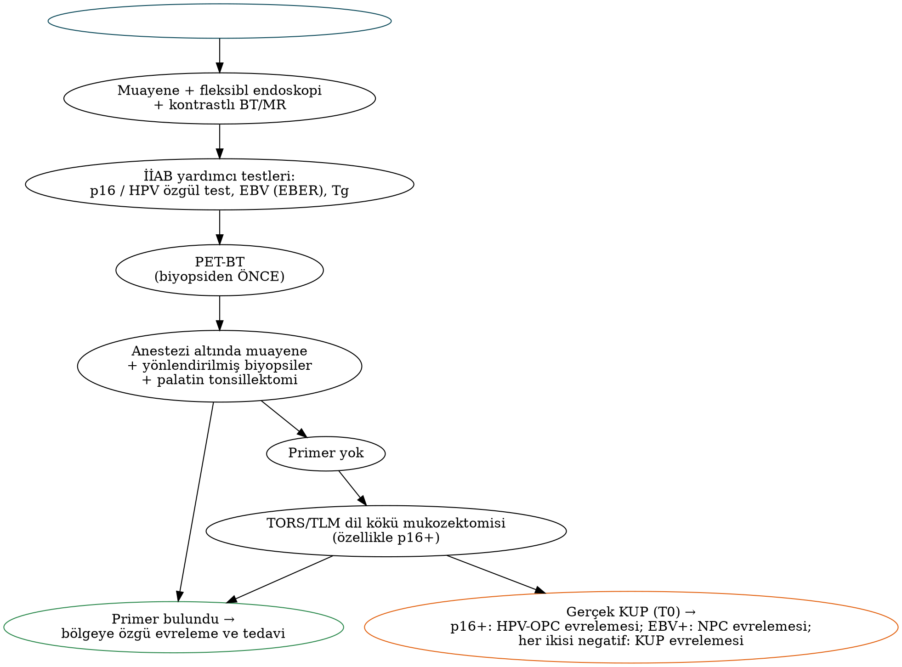

# Boyun Diseksiyonu, Sentinel Lenf Nodu ve Primeri Bilinmeyen Metastaz

Servikal lenf nodu metastazı, baş-boyun skuamöz hücreli karsinomunda (BBSHK) **tek başına en önemli prognostik faktördür**: tek bir pozitif nod sağkalımı kabaca yarıya indirir; ekstranodal yayılım (ENE) ise bu kaybı daha da artırır. Boyun diseksiyonu (BD), hem bölgesel hastalığın tedavisi hem de patolojik evreleme ve adjuvan tedavi kararının temelidir. Bu bölüm BD sınıflamasını, endikasyonları, tekniği ve komplikasyonları; klinik N0 boyunun yönetimini (elektif BD ve sentinel lenf nodu biyopsisi) ve primeri bilinmeyen metastazı ele alır.

## Tarihsel gelişim

- **Crile (1906):** Radikal boyun diseksiyonunu (RBD) sistematik olarak tanımladı.
- **Hayes Martin (1951):** RBD'yi standartlaştırdı ve yaygınlaştırdı.
- **Suárez (1963) ve Bocca (1967):** Fasyal planlara dayanan "fonksiyonel" boyun diseksiyonu — lenfatik dokunun, fasya kılıfları açılarak spinal aksesuar sinir (XI), IJV ve SKM korunarak çıkarılabileceğini gösterdi.
- **Lindberg (1972) ve Shah (1990):** Primer bölgeye göre öngörülebilir lenfatik yayılım örüntülerini tanımlayarak **selektif** diseksiyonların bilimsel temelini oluşturdu.
- **Robbins / AAO-HNS (1991; 2002 ve 2008 revizyonları):** Bugün kullanılan standart sınıflama ve seviye/alt seviye sistemi.

## Sınıflama

Tablo: AAO-HNS boyun diseksiyonu sınıflaması (2002/2008)
| Tür | Çıkarılan seviyeler | Korunan/çıkarılan lenfatik dışı yapılar | Not |
|---|---|---|---|
| **Radikal (RBD)** | I–V | **XI, IJV ve SKM çıkarılır** | Diğer tüm diseksiyonların referansı |
| **Modifiye radikal (MRBD)** | I–V | En az biri korunur: XI, IJV, SKM | Medina tip I: XI korunur; tip II: XI + IJV; tip III: üçü de korunur ("fonksiyonel/kapsamlı") |
| **Selektif (SBD)** | RBD'de çıkarılan seviyelerden en az biri korunur | Genellikle tümü korunur | Çıkarılan seviyeler parantez içinde yazılır: SBD (I–III), SBD (II–IV), SBD (II–V, retroaurikuler, suboksipital), SBD (VI) |
| **Genişletilmiş** | RBD'ye ek lenfatik grup veya lenfatik dışı yapı | Örn. retrofarengeal nodlar, parotis, üst mediastinal/paratrakeal nodlar; karotis arter, XII, X, paraspinal kaslar, deri | Hangi yapının eklendiği belirtilir |
| **Süperselektif** | ≤2 komşu seviye | — | Çoğunlukla kemoradyoterapi sonrası rezidü hastalıkta |

Selektif diseksiyonların klasik adları hâlâ yaygın kullanılır:

- **Supraomohiyoid BD = SBD (I–III):** Ağız boşluğu kanserlerinde N0 boyun. Seviye IV eklenirse "genişletilmiş supraomohiyoid" (dil kanserinde atlama metastazı riski).
- **Lateral BD = SBD (II–IV):** Orofarenks, hipofarenks ve larenks kanserleri.
- **Posterolateral BD = SBD (II–V, retroaurikuler, suboksipital):** Saçlı derinin arka kısmı ve ense cilt kanserleri (melanom, SHK).
- **Santral (anterior) kompartman diseksiyonu = SBD (VI):** Tiroid kanseri, subglottik/glottik kanserin subglottik uzanımı, hipofarenks ve servikal özofagus kanserleri. ATA 2025 tiroid kanserinde santral kompartmanı **seviye VI + üst seviye VII** olarak tanımlar.

!!! guncel "Ferlito ve ark. (2011) adlandırma önerisi"
    Belirsizliği azaltmak için her diseksiyonun **"BD + taraf + çıkarılan seviye/alt seviyeler + çıkarılan lenfatik dışı yapılar"** biçiminde kaydedilmesi önerilmiştir. Örnekler: klasik RBD → *Sağ BD (I–V, SKM, IJV, KS XI)*; sol supraomohiyoid → *Sol BD (I–III)*; santral → *BD (VI)*. Bu adlandırma operasyon notlarında ve patoloji raporlarında giderek yaygınlaşmaktadır.

## Endikasyonlar

### Terapötik ve elektif boyun diseksiyonu

- **Terapötik BD:** Klinik veya radyolojik olarak pozitif boyunda (cN+) yapılır.
- **Elektif (profilaktik) BD:** Klinik N0 boyunda gizli (okült) metastaz olasılığı yüksek olduğunda yapılır. Karar analizine dayalı klasik eşik, **okült metastaz riskinin %15–20'yi aşmasıdır** (Weiss, 1994).

Okült metastaz riskini artıran faktörler: primer bölge (supraglottis, hipofarenks, orofarenks, dil), T kategorisi, **invazyon derinliği** (ağız boşluğu), perinöral ve lenfovasküler invazyon, düşük diferansiyasyon ve tümör kalınlığı.

### cN+ boyunda diseksiyonun kapsamı

- Sınırlı nodal hastalıkta (tek veya az sayıda nod, ENE yok) **selektif BD** — adjuvan tedavi planlandığında — onkolojik olarak MRBD'ye eşdeğer kabul edilir.
- Çok seviyeli, iri (bulky) nodal hastalıkta **MRBD**; XI, IJV veya SKM'nin tümörle doğrudan tutulumunda ilgili yapı feda edilir (MRBD tip I/II veya RBD).
- Seviye IIB ve V; ağız boşluğu ve larenks kanserlerinde cN0'da nadiren tutulduğundan çıkarılmayabilir. Orofarenks ve nazofarenks kanserlerinde ise IIB daha sık tutulur.

### (Kemo)radyoterapi sonrası boyun

Geçmişte N2–N3 hastalıkta tedaviden sonra **planlı BD** rutin yapılırdı. **PET-NECK** çalışması (Mehanna, NEJM 2016), tedavi bitiminden ≈12 hafta sonra yapılan **PET-BT'ye dayalı izlemin** planlı diseksiyonla eşdeğer sağkalım sağladığını ve diseksiyon sayısını belirgin azalttığını göstermiştir. Günümüzde yalnızca PET-BT'de **rezidü/progresif hastalık** varlığında **kurtarma (salvage) BD** (sıklıkla selektif veya süperselektif) yapılır.

## Cerrahi teknik: temel basamaklar

### İnsizyonlar

İnsizyon seçimi; yeterli görüş, primer tümör rezeksiyonuyla uyum, rekonstrüksiyon ve **önceki radyoterapi** öyküsüne göre yapılır. Sık kullanılanlar: **apron (Gluck) insizyonu**, **hokey sopası (hockey-stick)** ve "utility" insizyonu, **MacFee** (iki paralel yatay insizyon; ışınlanmış boyunda flep beslenmesi açısından güvenli), Schobinger ve Y (trifurkasyonlu) insizyonlar.

!!! dikkat "Tuzak — trifurkasyon noktası"
    Trifurkasyonlu insizyonlarda üç flebin birleşme noktası **karotis arterinin üzerine** denk getirilmemelidir; özellikle ışınlanmış boyunda bu noktada yara ayrışması **karotis ekspozisyonu ve rüptürüne** yol açabilir.

### Diseksiyonun sırası (selektif/modifiye radikal BD)

1. **Subplatismal flepler** kaldırılır; eksternal juguler ven ve büyük aurikuler sinir mümkünse korunur.
2. **Seviye I:** Marjinal mandibular sinir tanımlanır veya fasiyal ven bağlanıp yukarı kaldırılarak korunur (Hayes Martin manevrası). Submental üçgen temizlenir; submandibular bez genellikle spesmenle çıkarılır. **Lingual sinir** (submandibular ganglion bağlantısı bağlanır), **Wharton kanalı** ve **XII** tanımlanır; XII çevresindeki ranin venlere dikkat edilir.
3. **SKM fasyasının** kas üzerinden sıyrılması; **XI'in seviye II'de** tanımlanması (IJV'yi çaprazladığı nokta, digastrik arka karnın hemen altında). IIB paketi XI'in altından (sinirin arkasından) diseke edilerek öne alınır.
4. **Seviye II–IV:** Lenfatik doku IJV ve karotis kılıfından ayrılır; **vagus**, **sempatik zincir** ve **frenik sinir** (prevertebral fasyanın derininde) korunur. Servikal pleksus duyusal kökleri mümkünse korunur. Omohiyoid kası seviye III–IV için işaret olarak kullanılır.
5. **Seviye IV (solda):** **Torasik kanal** ve venöz açı; şüpheli dallar bağlanır, **Valsalva** ile kaçak kontrol edilir.
6. **Seviye V:** XI arka üçgende çok yüzeyel seyreder; brakiyal pleksus ve transvers servikal damarlar korunur.
7. RBD'de IJV üstte (digastrik arka karın altında) ve altta bağlanır; SKM klavikula ve mastoidden ayrılır; XI feda edilir.
8. Spesmen **seviyelere göre işaretlenerek** patolojiye gönderilir; kapalı aspiratif dren yerleştirilir.

## Komplikasyonlar

Tablo: Boyun diseksiyonunun komplikasyonları ve yönetimi
| Komplikasyon | Sıklık / risk faktörleri | Yönetim |
|---|---|---|
| Hematom | Erken dönem; antikoagülan kullanımı | Havayolu tehlikesinde yarayı açma; reeksplorasyon |
| Seroma, enfeksiyon, yara ayrışması | Radyoterapi, diyabet, beslenme bozukluğu, farengokutanöz fistül | Drenaj, antibiyotik, debridman, flep örtümü |
| **Şilöz fistül** | **%1–2,5**; **%75–90 solda** | Düşük debide (çoğunlukla <500 mL/gün) **konservatif**: orta zincirli trigliserit diyeti veya ağızdan alımın kesilip TPN, **oktreotid**, basınçlı pansuman. Yüksek debi (sıklıkla >500–1000 mL/gün) veya konservatif başarısızlıkta **reeksplorasyon/ligasyon** veya **torasik kanal embolizasyonu**. Şilotoraks gelişebilir |
| **Omuz sendromu (XI)** | RBD'de kaçınılmaz; selektif BD'de traksiyona bağlı geçici disfonksiyon (özellikle IIB ve V diseksiyonu) | Erken **fizik tedavi**; sinir kesisinde primer onarım/greft |
| Marjinal mandibular, XII, X, lingual, frenik, sempatik, brakiyal pleksus hasarı | Seviye I–V diseksiyonu | Önleme: anatomik işaretler; hasar tipine göre rehabilitasyon |
| **Karotis rüptürü (blowout)** | Radyoterapi, fistül, yara ayrışması, enfeksiyon; mortalite yüksek | Bası, havayolu, sıvı/kan replasmanı; **endovasküler** (kaplı stent, balon oklüzyon) veya cerrahi ligasyon. Yüksek riskli hastada karotisin kas flebiyle (levator skapula, pektoralis major) örtülmesi |
| Bilateral IJV ligasyonuna bağlı yüz/serebral ödem, SIADH, körlük | Eş zamanlı bilateral RBD | Bilateral diseksiyonun **evrelenmesi** veya en az bir IJV'nin korunması |
| Pnömotoraks, hava embolisi | Alt boyun diseksiyonu; IJV yaralanması | Göğüs tüpü; hava embolisinde sol lateral dekübit/Trendelenburg, aspirasyon |
| Lenfödem (yüz–boyun) | BD + radyoterapi | Manuel lenf drenajı, kompresyon |

!!! klinik "Klinik inci — karotis rüptürü sendromu"
    Karotis rüptürü sıklıkla küçük **haberci kanamalarla** başlar. Tehdit altındaki karotis (ekspoze arter), aktif kanama ve kanamanın durduğu (sentinel) evreler tanımlanır. Haberci kanama gören ışınlanmış ve fistüllü bir hastada **acil BT anjiyografi ve endovasküler değerlendirme** hayat kurtarır.

## Klinik N0 boyunun yönetimi

cN0 boyunda dört seçenek vardır: **izlem (bekle-gör, tercihen USG ile)**, **elektif boyun diseksiyonu**, **elektif nodal radyoterapi** (primer tümör radyoterapiyle tedavi ediliyorsa) ve **sentinel lenf nodu biyopsisi (SLNB)**.

### Ağız boşluğu kanserinde elektif BD: D'Cruz çalışması

**D'Cruz ve ark. (NEJM, 2015; Tata Memorial):** Erken evre (T1–T2, cN0) lateralize ağız boşluğu SHK'lı 596 hastada **elektif BD** ile **bekle-gör (nüks olursa terapötik BD)** karşılaştırılmıştır. Elektif BD kolunda 3 yıllık genel sağkalım **%80,0** iken bekle-gör kolunda **%67,5**; hastalıksız sağkalım %69,5'e karşı %45,9 bulunmuştur. Bu çalışma, erken ağız boşluğu kanserinde elektif BD'nin standart olmasını sağlamıştır.

!!! kilavuz "NCCN — ağız boşluğu kanserinde invazyon derinliği (DOI) ve elektif BD"
    Ağız boşluğu kanserinde okült metastazın en iyi öngördürücüsü **invazyon derinliğidir (DOI)**. NCCN'e göre **DOI >3 mm** olduğunda elektif BD güçlü şekilde önerilir (D'Cruz verisi; eski sürümlerde eşik >4 mm idi); **DOI <2 mm** olduğunda elektif BD yalnızca çok seçilmiş durumlarda düşünülür; aradaki değerlerde klinik karar verilir. Deneyimli merkezlerde **SLNB**, T1–T2 N0 ağız boşluğu kanserinde elektif BD'ye alternatiftir.

### Sentinel lenf nodu biyopsisi

**Teknik:** Primer tümörün çevresine peritümöral **Tc-99m radyokolloid** enjeksiyonu → **lenfosintigrafi** (tercihen SPECT/BT) → ameliyat sırasında **gama prob** ile sentinel nod(lar)ın bulunması (± mavi boya veya indosiyanin yeşili floresansı) → nodların **seri adım kesitler ve sitokeratin immünohistokimyası** ile incelenmesi. Sentinel nod pozitifse (mikrometastaz dahil) **tamamlayıcı boyun diseksiyonu** veya radyoterapi uygulanır.

Kanıtlar:

- **SENT çalışması** (Avrupa, çok merkezli gözlemsel; Schilling 2015): Erken ağız kanserinde SLNB'nin duyarlılığı ≈%86, negatif prediktif değeri ≈%95.
- **Garrel ve ark. (JCO 2020; Fransa, randomize):** T1–T2 N0 ağız ve orofarenks SHK'da SLNB, elektif BD'ye göre bölgesel kontrol ve sağkalımda eşdeğer, **morbiditede (omuz ve boyun fonksiyonu) daha üstün** bulunmuştur.
- **Hasegawa ve ark. (JCO 2021; Japonya, randomize):** SLNB yönlendirmeli diseksiyon, elektif BD'ye göre 3 yıllık genel sağkalımda eşdeğer, boyun fonksiyonu açısından daha avantajlıdır.

!!! dikkat "Tuzak — ağız tabanı tümörlerinde SLNB"
    Ağız tabanı tümörlerinde primer enjeksiyon bölgesi seviye I'e çok yakın olduğundan radyoaktivite sentinel nodun sinyalini maskeleyebilir (**"shine-through" etkisi**); bu bölgede SLNB'nin duyarlılığı daha düşüktür. SPECT/BT ve indosiyanin yeşili bu sorunu azaltır.

Baş-boyun **melanomunda** SLNB standarttır (MSLT-I/II; Bölüm 28). Baş-boyun bölgesinde lenfatik drenajın öngörülemezliği, parotis içi sentinel nodlar ve fasiyal sinir yakınlığı teknik zorluk oluşturur.

## Ekstranodal yayılım (ENE)

ENE, tümörün lenf nodu kapsülünü aşarak çevre bağ dokusuna yayılmasıdır ve HPV ilişkisiz BBSHK'da **bölgesel nüks ve uzak metastaz riskini belirgin artıran** en güçlü nodal faktörlerden biridir.

- **Patolojik ENE (pENE):** AJCC 8'de **ENEmi (minör, ≤2 mm)** ve **ENEma (majör, >2 mm)** olarak ayrılır; evreleme açısından her ikisi de ENE pozitif sayılır.
- **Klinik ENE (cENE):** AJCC 8'de HPV ilişkisiz kanserlerde **deri invazyonu, kas invazyonu veya komşu yapılara yoğun fiksasyon, kraniyal sinir, brakiyal pleksus, sempatik zincir veya frenik sinir tutulumu** gibi fizik muayene bulgularıyla (radyoloji destekli) tanımlanır ve **cN3b** olarak evrelenir; yalnızca görüntüleme bulgusu yeterli değildir.
- **Radyolojik ENE (iENE):** TNM-9'da nazofarenks (ileri iENE → N3) ve HPV ilişkili orofarenks kanserlerinde (iENE → bir üst cN) evrelemeye girmiştir (Bölüm 9, 15, 16).

!!! sinav "Sınav notu — postoperatif kemoradyoterapi endikasyonu"
    EORTC 22931 ve RTOG 9501 çalışmalarının ortak analizinde (Bernier ve Cooper, 2005), **ENE ve/veya pozitif cerrahi sınır**, eş zamanlı sisplatinli **kemoradyoterapiden** fayda gören iki ana risk faktörü olarak belirlenmiştir. Diğer ara risk faktörleri (pT3–T4, pN2–N3, seviye IV–V nodları, perinöral/lenfovasküler invazyon) **postoperatif radyoterapi** endikasyonudur (Bölüm 10).

## Primeri bilinmeyen metastaz

### Tanım ve epidemiyoloji

Boyun lenf nodunda karsinom metastazı saptanan, ancak ayrıntılı değerlendirmeye rağmen primer tümörü bulunamayan durumdur (karsinom of unknown primary, KUP). Tüm baş-boyun kanserlerinin **≈%2–5**'ini oluşturur; HPV testi, PET-BT ve transoral cerrahinin yaygınlaşmasıyla gerçek "bilinmeyen primer" oranı azalmaktadır. Histoloji çoğunlukla SHK'dır ve bulunan gizli primerlerin büyük kısmı (**≈%80–90**) **palatin tonsil ve dil kökü** kaynaklıdır; ardından nazofarenks ve piriform sinüs gelir.

### Değerlendirme

1. Öykü ve fizik muayene, fleksibl endoskopi (nazofarenks dahil).
2. **İİAB:** SHK doğrulaması; **p16/HPV özgül test** (pozitifse → orofarenks), **EBV/EBER** (pozitifse → nazofarenks), tiroglobulin/TTF-1 (tiroid), adenokarsinomda ileri immünohistokimya.
3. Kontrastlı BT ve/veya MR.
4. **PET-BT — anestezi altında muayene ve biyopsiden önce** (biyopsi sonrası enflamasyon yanlış pozitifliğe yol açar). Primeri olguların yaklaşık üçte birinde gösterir.
5. **Anestezi altında muayene ve yönlendirilmiş biyopsiler**; **palatin tonsillektomi** (ipsilateral veya bilateral; kontralateral tonsilde de gizli primer bildirilmiştir).
6. Primer hâlâ bulunamamışsa, özellikle p16 pozitif olgularda **TORS/TLM ile dil kökü mukozektomisi (lingual tonsillektomi)** — gizli primeri olguların yarısından fazlasında ortaya koyar.

!!! hafiza "Nod yerleşimi primer hakkında ipucu verir"
    **Seviye II (p16+)** → orofarenks; **seviye II/V (EBV+)** → nazofarenks; **seviye I–III** → ağız boşluğu; **seviye IV ve VB** → hipofarenks, servikal özofagus, tiroid ve **klavikula altı** primerler (akciğer, meme, gastrointestinal sistem; sol supraklaviküler = Virchow); **parotis/preaurikuler** → saçlı deri ve kulak cilt kanseri.

### Evreleme (AJCC 8)

- **p16 pozitif** KUP → HPV ilişkili orofarenks kanseri olarak evrelenir (**T0** N1–N3).
- **EBV pozitif** KUP → nazofarenks karsinomu olarak evrelenir (**T0**).
- **p16 ve EBV negatif** → "Servikal lenf nodları ve bilinmeyen primer tümörler" bölümüne göre evrelenir; N kategorisinde HPV ilişkisiz sistem (ENE dahil) kullanılır.

### Tedavi

- **N1, ENE yok:** Tek modalite yeterli olabilir — boyun diseksiyonu (± TORS ile gizli primer arayışı) **veya** radyoterapi.
- **N2–N3 veya ENE:** Kemoradyoterapi ya da cerrahi + adjuvan (kemo)radyoterapi.
- Radyoterapi alanları tartışmalıdır: bilateral boyun + olası mukozal bölgeler (orofarenks ± nazofarenks, larenks/hipofarenks). Mukozal alanların kapsamı biyolojik belirteçlere göre daraltılır: **p16+ → orofarenks odaklı**, **EBV+ → nazofarenks odaklı**. Seçilmiş olgularda yalnızca tek taraflı boyun ışınlaması yapılabilir.
- **Prognoz:** p16 pozitif KUP'un prognozu, HPV ilişkili orofarenks kanserine benzer şekilde daha iyidir.

!!! ozet "Kritik noktalar"
    - AAO-HNS sınıflaması: **RBD (I–V + XI + IJV + SKM)**, **MRBD** (≥1 lenfatik dışı yapı korunur; Medina tip I–III), **SBD** (≥1 seviye korunur), **genişletilmiş**, **süperselektif** (≤2 seviye).
    - SBD (I–III) ağız boşluğu, SBD (II–IV) orofarenks–hipofarenks–larenks, SBD (II–V + retroaurikuler + suboksipital) arka saçlı deri, SBD (VI) tiroid/subglottis/hipofarenks.
    - Elektif BD eşiği: **okült metastaz riski >%15–20**. **D'Cruz (NEJM 2015):** erken ağız kanserinde elektif BD sağkalımı artırır (3 yıl GS %80 vs %67,5).
    - NCCN: ağız boşluğunda **DOI >3 mm** → elektif BD güçlü öneri; <2 mm → çok seçilmiş durumlar. **SLNB**, T1–T2 N0 ağız kanserinde deneyimli merkezlerde eşdeğer alternatiftir (Garrel 2020, Hasegawa 2021); ağız tabanında **shine-through** sorunu.
    - **PET-NECK:** KRT sonrası 12. haftada PET-BT ile izlem, planlı BD'ye eşdeğerdir.
    - Şilöz fistül %1–2,5, çoğunlukla solda; düşük debide konservatif, yüksek debide cerrahi/embolizasyon. Omuz sendromu XI hasarının sonucudur; bilateral IJV ligasyonundan kaçınılır.
    - **ENE + pozitif sınır → postoperatif kemoradyoterapi** (Bernier/Cooper 2005). AJCC 8'de ENEmi ≤2 mm, ENEma >2 mm; cENE (HPV−) cN3b.
    - KUP: gizli primerlerin çoğu **tonsil ve dil kökündedir**; **PET-BT biyopsiden önce**; tonsillektomi + **TORS dil kökü mukozektomisi**; p16+ → HPV-OPC, EBV+ → NPC olarak evrelenir.
