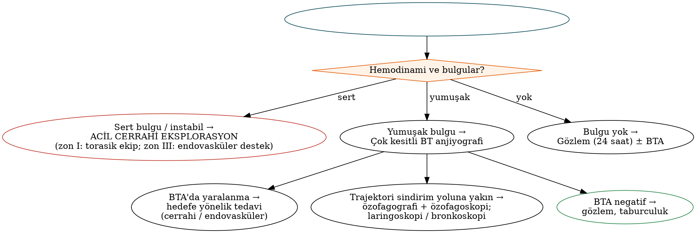

# Boyun Travması

Boyun; havayolu, sindirim yolu, büyük damarlar, omurga ve sinirlerin dar bir alanda bulunduğu, travmada hızla yaşamı tehdit eden bir bölgedir. Penetran boyun yaralanmalarında yönetim felsefesi, yarım yüzyıl önceki "zorunlu eksplorasyon" anlayışından **klinik bulgu ve BT anjiyografiye dayalı seçici yaklaşıma** dönüşmüştür. Künt travmada ise sinsi seyreden **künt serebrovasküler yaralanma** ve **larengotrakeal travma** gözden kaçırılmaya en açık tablolardır.

## Genel yaklaşım

Tüm boyun travmalarında ilk değerlendirme **ATLS** ilkelerine göre yapılır: **A**irway (havayolu, künt travmada servikal omurga korunarak), **B**reathing, **C**irculation (kanama kontrolü — **doğrudan bası**), **D**isability, **E**xposure.

- Aktif kanamada yara içine **körlemesine klemp konmaz**; doğrudan parmak basısı uygulanır. Kanayan yaraya Foley kateter yerleştirip balonu şişirerek tamponad yapmak, ameliyathaneye geçişte köprü olarak kullanılabilir.
- Platismayı geçen yaralar, damar yaralanmasında **hava embolisi** riski nedeniyle hasta Trendelenburg pozisyonunda değerlendirilmelidir; yara acil serviste lokal olarak eksplore edilmez veya sondalanmaz.
- Penetran yaralanmalarda servikal omurga instabilitesi nadirdir; rutin servikal boyunluk havayolu yönetimini zorlaştırabilir ve hematomu gizleyebilir.

!!! klinik "Klinik inci — havayolu"
    Havayolu tehlikedeyse tercih genellikle **hızlı ardışık indüksiyonla orotrakeal entübasyon** ve **cerrahi havayoluna hazırlıklı olmaktır**. Trakea yarası açıksa entübasyon doğrudan yaradan yapılabilir. Kör nazotrakeal entübasyon önerilmez. **Larengotrakeal ayrılma** şüphesinde orotrakeal girişim ayrılmayı tamamlayabileceğinden, lokal anestezi altında yaralanma seviyesinin altından **trakeotomi** tercih edilir.

## Penetran boyun travması

Penetran yaralanma, **platismanın delinmesi** ile tanımlanır. Platismayı geçmeyen yaralar yüzeyel kabul edilir.

### Anatomik zonlar

Roon ve Christensen (1979) tarafından tanımlanan üç zon, cerrahi erişim ve görüntüleme gereksinimini anlamak için hâlâ kullanılır.

Tablo: Penetran boyun yaralanmalarında anatomik zonlar
| Zon | Sınırlar | Başlıca yapılar | Özellik |
|---|---|---|---|
| **I** | Klavikula/sternal çentikten krikoide | Proksimal ana karotis, subklavyen ve vertebral arterler, brakiyosefalik damarlar, trakea, özofagus, torasik kanal, akciğer apeksi | Proksimal damar kontrolü için **sternotomi/torakotomi** gerekebilir; mortalitesi yüksek |
| **II** | Krikoidden mandibula açısına | Ana karotis bifurkasyonu, İKA ve EKA, IJV, larenks, farenks, vagus | En sık yaralanan zon; **cerrahi erişimi en kolay** |
| **III** | Mandibula açısından kafa tabanına | Distal İKA, vertebral arter, farenks, kraniyal sinirler | Cerrahi erişim zor; **anjiyografi ve endovasküler** tedavi ön plandadır |

### Bulgular: sert ve yumuşak işaretler

Güncel yaklaşımda (**"zonsuz" — no-zone yaklaşımı**; Western Trauma Association) karar, zondan bağımsız olarak klinik bulgulara göre verilir.

Tablo: Penetran boyun yaralanmasında sert ve yumuşak bulgular
| Sert bulgular → acil cerrahi | Yumuşak bulgular → BT anjiyografi |
|---|---|
| Aktif, pulsatil kanama | Stabil, büyümeyen hematom |
| Büyüyen veya pulsatil hematom | Hafif hemoptizi veya hematemez |
| Üfürüm veya thrill | Disfaji, odinofaji |
| Sıvıya yanıtsız şok | Ses değişikliği (disfoni) |
| Nabız defisiti | Subkutan amfizem |
| Damar yaralanmasını düşündüren lateralize nörolojik defisit | Yaranın büyük damarlara yakınlığı |
| Masif hemoptizi/hematemez, yaradan hava kabarcığı çıkması, havayolu tehlikesi | Venöz sızıntı |

### Tanısal yöntemler

- **Çok kesitli BT anjiyografi (BTA):** Damar ve aerodijestif yaralanmalarda duyarlılık ve özgüllüğü yüksektir; yumuşak bulgulu stabil hastada **ilk tercih** yöntemdir. Mermi parçalarının oluşturduğu artefakt değerlendirmeyi kısıtlayabilir.
- **Konvansiyonel anjiyografi:** Tanı belirsizliğinde ve eş zamanlı **endovasküler tedavi** gerektiğinde (özellikle zon I ve III).
- **Özofagus değerlendirmesi:** Suda çözünen kontrast ardından baryumlu özofagografi ve **fleksibl/rijit özofagoskopi** birlikte uygulandığında duyarlılık en yüksek düzeye ulaşır. Özofagus yaralanmaları belirtisiz başlayabilir; **24 saati aşan gecikme** mediastinit ve mortaliteyi belirgin artırır.
- **Laringoskopi ve bronkoskopi:** Ses değişikliği, hemoptizi, subkutan amfizem varlığında.

### Tedavi ilkeleri

- **Karotis arter yaralanması:** Mümkün olduğunda **primer onarım veya greftle rekonstrüksiyon**; ligasyon, onarımın mümkün olmadığı veya kontrol edilemeyen kanamalı durumlarda düşünülür. Seçilmiş olgularda endovasküler kaplı stent.
- **Vertebral arter:** Cerrahi erişimi zor olduğundan çoğunlukla **endovasküler embolizasyon**.
- **IJV:** Onarım veya ligasyon (tek taraflı ligasyon iyi tolere edilir).
- **Larenks/trakea:** Primer onarım; gerekirse trakeotomi.
- **Farenks ve özofagus:** Erken (<24 saat) **primer iki kat onarım**, kas flebi (SKM, strap kaslar) ile destekleme ve drenaj. Küçük hipofarenks yaralanmaları (piriform sinüs üstü) ağızdan beslenmenin kesilmesi ve antibiyotikle konservatif tedavi edilebilir.
- **Torasik kanal yaralanması:** Zon I sol taraf yaralanmalarında şilöz kaçak; ligasyon.

## Künt boyun travması

### Künt serebrovasküler yaralanma

Karotis ve vertebral arterlerin künt travmaya bağlı diseksiyon, intimal hasar, psödoanevrizma veya oklüzyonudur. Klinik bulgular saatler–günler sonra **inme** ile ortaya çıkabilir; bu nedenle risk taşıyan hastalarda **semptom gelişmeden** BTA ile tarama yapılmalıdır.

Tablo: Künt serebrovasküler yaralanmada tarama ölçütleri (genişletilmiş Denver ölçütleri — özet)
| Bulgular / semptomlar | Risk faktörleri (yüksek enerjili mekanizma ile birlikte) |
|---|---|
| Boyun, burun veya ağızdan arteriyel kanama | LeFort II/III kırığı, mandibula kırığı |
| 50 yaş altında servikal üfürüm | Karotis kanalını içeren kafa tabanı kırığı, kompleks kafatası kırığı |
| Büyüyen servikal hematom | Servikal omurga kırığı (özellikle C1–C3, subluksasyon, transvers foramen tutulumu) |
| Fokal nörolojik defisit (TİA, hemiparezi, Horner, vertebrobaziler bulgular) | Anoksik beyin hasarıyla birlikte "yakın asılma" |
| Kranyal BT ile açıklanamayan nörolojik bulgu | Belirgin şişlik, ağrı veya bilinç bozukluğuyla birlikte **emniyet kemeri/çamaşır ipi (clothesline)** yaralanması |
| BT/MR'de inme | GKS ≤8 olan travmatik beyin hasarı, üst kosta kırıkları ve torasik vasküler yaralanma |

**Biffl derecelendirmesi:** I — intimal düzensizlik veya <%25 daralma; II — diseksiyon/intramural hematom ile ≥%25 daralma, intraluminal trombüs veya kalkık intimal flep; III — psödoanevrizma; IV — oklüzyon; V — ekstravazasyonlu transeksiyon.

Tedavi: Derece I–IV'te **antitrombotik tedavi** (antiplatelet veya heparin) inme riskini azaltır; derece V cerrahi veya endovasküler girişim gerektirir. İzlem görüntülemesi (7–10 gün) derece değişimini değerlendirmek için yapılır.

### Larengotrakeal travma

Larenks travması nadirdir (tüm travmaların küçük bir kısmı) ancak gözden kaçırıldığında havayolu kaybına veya kalıcı ses–havayolu sekellerine yol açar. Tipik mekanizmalar: motorlu araç kazasında **direksiyon/ön panele çarpma**, **"çamaşır ipi" (clothesline)** yaralanması, boğma ve sportif darbeler.

- **Belirtiler:** Ses kısıklığı, stridor, dispne, hemoptizi, odinofaji, **subkutan amfizem**, ön boyunda hassasiyet, krepitasyon, **larenks çıkıntısının (Adem elması) kaybı**.
- **Değerlendirme:** Önce havayolu. Havayolu stabilse **fleksibl laringoskopi** ve larenksin **ince kesitli BT'si**. Eşlik eden servikal omurga, özofagus ve damar yaralanmaları araştırılır.
- **Çocuklarda** larenks daha yüksek yerleşimli ve kıkırdakları daha esnek olduğundan kırık daha az görülür; ancak dar havayolunda yumuşak doku ödemi ve hematom daha tehlikelidir.
- Erişkinde yaşla kıkırdak kalsifikasyonu arttığından kırıklar daha sık ve parçalı olabilir.

Tablo: Larenks travmasında Schaefer–Fuhrman sınıflaması ve yönetim
| Grup | Bulgular | Yönetim |
|---|---|---|
| **1** | Küçük endolarengeal hematom veya laserasyon; saptanabilir kırık yok; havayolu stabil | **Gözlem:** nemlendirilmiş hava, ses istirahati, baş elevasyonu, PPI; gerektiğinde steroid ve antibiyotik |
| **2** | Ödem, hematom, kıkırdak ekspozisyonu olmayan küçük mukozal yırtık, **deplase olmayan kırık**; değişken havayolu tehlikesi | Gözlem ± **trakeotomi**; direkt laringoskopi ve özofagoskopi; seçilmiş olgularda onarım |
| **3** | Masif ödem, geniş mukozal laserasyon, **açıkta kıkırdak**, **deplase kırık**, vokal kord hareketsizliği | **Trakeotomi + açık eksplorasyon ve onarım** (mukozal onarım, mini plakla redüksiyon ve fiksasyon) |
| **4** | Grup 3 bulguları + **ikiden fazla kırık hattı**, masif mukoza harabiyeti, **anterior komissür bozulması**, instabil kırık | Grup 3 gibi + **endolarengeal stent** (anterior komissür ve parçalı kırıkların desteklenmesi) |
| **5** | **Tam larengotrakeal ayrılma** | Lokal anestezi altında trakeotomi (distal trakea mediastene çekilmiş olabilir), **uç uca anastomoz**; bilateral RLS hasarı sık |

!!! sinav "Sınav notu — zamanlama"
    Açık onarım gerektiren larenks yaralanmalarında **erken onarım (ideal olarak ilk 24 saat, en geç 48–72 saat)** ses ve havayolu sonuçlarını belirgin iyileştirir. Gecikmiş onarımda granülasyon, fibrozis ve **larengotrakeal stenoz** riski artar. Anterior komissür yaralanmalarında **web oluşumunu** önlemek için stent veya keel kullanılır.

### Asılma ve boğulma yaralanmaları

Hiyoid ve tiroid kıkırdak kırıkları, larenks mukoza hasarı, **karotis diseksiyonu**, servikal omurga yaralanması (adli asılmada C2 "hangman" kırığı) ve gecikmiş akciğer ödemi görülebilir. "Yakın asılma" vakaları künt serebrovasküler yaralanma açısından taranmalıdır.

### Farenks–özofagus perforasyonu

Künt travma, yabancı cisim veya iyatrojenik nedenlerle (endoskopi, zor entübasyon, nazogastrik sonda) gelişebilir. Belirtiler: boyun ağrısı, odinofaji, subkutan amfizem, ateş. Suda çözünen kontrastla özofagografi ve BT tanı koydurur. **Hipofarenks** düzeyindeki küçük perforasyonlar çoğunlukla ağızdan alımın kesilmesi ve geniş spektrumlu antibiyotikle konservatif tedavi edilir; **servikal özofagus** perforasyonlarında drenaj ± onarım, torasik perforasyonlarda göğüs cerrahisi gerekir.

## Diğer yapıların yaralanmaları

- **Kraniyal sinirler:** Zon III yaralanmalarında IX–XII ve sempatik zincir; ses kısıklığı ve yutma bozukluğu vagal hasarı düşündürür.
- **Tiroid:** Bol kanlanması nedeniyle kanama; genellikle lobektomi veya primer onarım.
- **Servikal omurga ve medulla spinalis:** Penetran travmada nadir ancak nörolojik defisitle seyreder.

!!! vaka "Vaka"
    32 yaşında erkek, motosiklet kazası sonrası acil servise ses kısıklığı, ön boyunda hassasiyet ve palpasyonda krepitasyon ile getiriliyor; satürasyon normal. **Yaklaşım:** Havayolu stabil olduğundan fleksibl laringoskopi (sol vokal kordda hareket kısıtlılığı, aritenoid üzerinde hematom, açıkta kıkırdak yok) ve larenks BT'si (deplase olmayan tiroid kıkırdak kırığı) → **Schaefer–Fuhrman grup 2**. Yatırılarak havayolu izlemi, nemlendirme, baş elevasyonu, PPI ve steroid; kötüleşmede trakeotomi. Mekanizma ve krepitasyon nedeniyle **BTA ile künt serebrovasküler yaralanma** taraması ve özofagus değerlendirmesi de yapılmalıdır.

!!! ozet "Kritik noktalar"
    - Penetran yaralanma **platismanın delinmesiyle** tanımlanır. Zonlar: **I** klavikula–krikoid, **II** krikoid–mandibula açısı, **III** mandibula açısı–kafa tabanı.
    - Güncel yaklaşım "**zonsuz**"dur: **sert bulgu → acil cerrahi; yumuşak bulgu → BT anjiyografi; bulgu yok → gözlem.**
    - Sert bulgular: aktif kanama, büyüyen/pulsatil hematom, üfürüm/thrill, yanıtsız şok, nabız defisiti, nörolojik defisit, yaradan hava çıkışı, havayolu tehlikesi.
    - Özofagus yaralanmasında **özofagografi + özofagoskopi** birlikte en duyarlıdır; **>24 saat** gecikme mortaliteyi artırır.
    - Künt serebrovasküler yaralanma **gecikmiş inme** ile ortaya çıkar; Denver ölçütleriyle **asemptomatik tarama** (BTA) yapılır; Biffl I–IV antitrombotik tedavi.
    - Larenks travmasında **Schaefer–Fuhrman** sınıflaması: grup 1 gözlem; grup 2 gözlem ± trakeotomi; **grup 3–4 trakeotomi + açık onarım (grup 4'te stent)**; grup 5 larengotrakeal ayrılma — trakeotomi + anastomoz.
    - Açık onarım **ilk 24 saatte** yapılmalıdır. Larengotrakeal ayrılma şüphesinde orotrakeal entübasyon yerine lokal anestezi altında trakeotomi tercih edilir.
