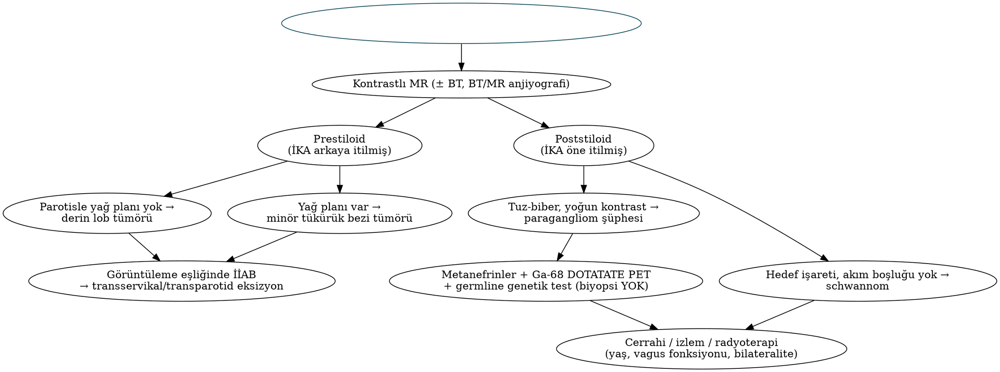

# Parafarengeal Boşluk Tümörleri, Paragangliomlar ve Nörojenik Tümörler

Parafarengeal boşluk (PFB), kafa tabanından hiyoide uzanan ters piramit şeklindeki derin bir boşluktur ve klinik muayeneye kapalıdır. Bu nedenle buradaki tümörler genellikle 2,5–3 cm'yi aştıktan sonra, orofarenkste yan duvar kabarıklığı veya mandibula açısının altında kitle olarak fark edilir. Bu bölüm PFB tümörlerine görüntüleme temelli yaklaşımı, baş-boyun paragangliomlarını (özellikle karotis cisim tümörü ve vagal paragangliom) ve sinir kılıfı tümörlerini ele alır. Temporal kemik paragangliomları otoloji kapsamında olduğundan yalnızca karşılaştırma amacıyla anılmıştır.

## Parafarengeal boşluk tümörlerinin genel özellikleri

PFB tümörleri tüm baş-boyun tümörlerinin yaklaşık **%0,5**'ini oluşturur; **≈%80'i benigndir.** Stiloid çıkıntıdan tensor veli palatiniye uzanan **tensor-vasküler-stiloid fasya**, boşluğu iki bölüme ayırır ve ayırıcı tanının temelini oluşturur (Bölüm 2).

Tablo: Parafarengeal boşluk tümörlerinin dağılımı
| Grup | Yaklaşık sıklık | Başlıca lezyonlar | Bölüm |
|---|---|---|---|
| **Tükürük bezi kökenli** | **%40–50** (en sık) | **Pleomorfik adenom** (en sık tek tümör), parotis derin lob tümörleri, minör tükürük bezi tümörleri; malign: mukoepidermoid, adenoid kistik, karsinom ex PA | Prestiloid |
| **Nörojenik** | %20–25 | **Vagal schwannom** (en sık), sempatik zincir schwannomu, nörofibrom | Poststiloid |
| **Paragangliom** | %10–15 | Vagal paragangliom, yukarı uzanan karotis cisim tümörü, juguler paragangliom uzanımı | Poststiloid |
| **Diğer** | Kalan kısım | Lenfoma, metastatik lenf nodu (lateral retrofarengeal/Rouvière: nazofarenks, orofarenks, tiroid), lipom, sinovyal sarkom, menenjiyom, brankiyal kist | Her ikisi |

### Klinik bulgular

- **Orofarengeal kabarıklık:** Tonsil ve yumuşak damağın mediale itilmesi (tonsil hipertrofisi veya peritonsiller apse ile karışabilir).
- Mandibula açısının altında ağrısız kitle; geniş tümörlerde "dumbbell" (halter) biçimli derin lob tümörü hem parotis hem farenks bileşeni gösterir.
- Östaki borusu disfonksiyonu (seröz otit), disfaji, horlama/OSA, ses değişikliği.
- **Kraniyal nöropatiler** (IX–XII), **Horner sendromu** — poststiloid lezyonlar ve maligniteyi düşündürür.
- **Ağrı ve trismus** (pterigoid kas tutulumu) çoğunlukla malignite lehinedir.

!!! dikkat "Tuzak — transoral biyopsi"
    Tonsil arkasında submukozal kabarıklık yapan bir PFB kitlesinden **transoral insizyonel biyopsi yapılmaz**: pleomorfik adenomda kapsül rüptürü ve tümör ekimine, paragangliomda ise ciddi kanamaya yol açar. Önce **kontrastlı MR/BT** yapılır; gerekirse **görüntüleme eşliğinde İİAB** (paragangliom şüphesinde biyopsi yerine biyokimyasal ve fonksiyonel görüntüleme).

### Görüntüleme ile ayırıcı tanı

Tablo: Parafarengeal boşluk kitlelerinin görüntüleme özellikleri
| Lezyon | Bölüm | Yer değiştirme paterni | MR/BT özellikleri |
|---|---|---|---|
| **Parotis derin lob tümörü** | Prestiloid | PFB yağını mediale, İKA'yı arkaya iter; **stilomandibular tüneli genişletir**; parotisle arasında yağ planı **yok** | Pleomorfik adenom: T2'de belirgin hiperintens, lobüle |
| **Minör tükürük bezi tümörü** | Prestiloid | Parotis derin lobu ile arasında **yağ planı var** | Benzer sinyal özellikleri |
| **Vagal schwannom** | Poststiloid | **İKA'yı anteromediale, IJV'yi posterolaterale iterek ikisini AYIRIR** | T2'de hiperintens, heterojen; "hedef işareti"; kistik dejenerasyon; akım boşluğu yok |
| **Sempatik zincir schwannomu** | Poststiloid | İKA ve IJV'yi **birlikte, ayırmadan** öne/laterale iter | Schwannom özellikleri; Horner olabilir |
| **Vagal paragangliom** | Poststiloid | İKA'yı öne-mediale iter, damarları ayırabilir | **"Tuz-biber" görünümü** (T1'de akım boşlukları), yoğun erken kontrastlanma |
| **Karotis cisim tümörü** | Bifurkasyon | **İKA ve EKA'yı birbirinden ayırır ("lir/lyre işareti")** | Yoğun kontrastlanma, tuz-biber görünümü |
| **Lateral retrofarengeal nod** | Retrofarengeal | İKA'yı öne-laterale iter | Nekrotik nod (nazofarenks/orofarenks/tiroid metastazı) |

!!! sinav "Sınav notu — iki kural"
    1) **Prestiloid** kitle İKA'yı **arkaya**, **poststiloid** kitle İKA'yı **öne** iter.
    2) Damarları **ayıran** poststiloid kitle → **vagal** kökenli (schwannom/paragangliom); damarları **birlikte iten** → **sempatik zincir** schwannomu; **İKA ile EKA'yı açan** kitle → **karotis cisim tümörü**.

### Cerrahi yaklaşımlar

Tablo: Parafarengeal boşluğa cerrahi yaklaşımlar
| Yaklaşım | Endikasyon | Not |
|---|---|---|
| **Transservikal** | **En sık**; çoğu benign tümör, özellikle poststiloid ve minör tükürük bezi kökenli | Submandibular insizyon; digastrik ve stilohiyoid kasların öne/yukarı çekilmesi, **stilomandibular ligamentin kesilmesi** ile boşluk genişletilir; parmakla künt diseksiyon |
| **Transservikal–transparotid** | **Parotis derin lob** tümörleri | Fasiyal sinir diseksiyonu (yüzeyel parotidektomi) sonrası derin lobun sinir altından çıkarılması |
| **Mandibulotomi (mandibular swing)** | Büyük, kafa tabanına uzanan, malign veya vasküler tümörler | En geniş erişim; morbidite yüksek (diş, mental sinir, malokluzyon) |
| **Transoral / TORS** | Seçilmiş küçük-orta prestiloid tümörler | Kapsül rüptürü ve damar kontrolü açısından deneyim gerektirir |
| **İnfratemporal fossa yaklaşımları** | Kafa tabanı/juguler foramen uzanımı | Nörootoloji ve kafa tabanı ekibiyle |

!!! klinik "Klinik inci — ilk ısırık sendromu"
    PFB cerrahisi, sempatik zincir rezeksiyonu veya EKA ligasyonu sonrası, **her öğünün ilk lokmasında** parotis bölgesinde birkaç saniye süren şiddetli kramp tarzı ağrı (**first bite syndrome**) gelişebilir. Mekanizma, parotisin sempatik denervasyonu sonrası miyoepitelyal hücrelerde parasempatik uyarıya **aşırı duyarlılıktır**. Zamanla azalabilir; tedavide parotise **botulinum toksini**, karbamazepin veya gabapentin kullanılır.

## Baş-boyun paragangliomları

### Genel özellikler

Paragangliomlar, otonom sinir sistemine eşlik eden **nöral krista kökenli** paraganglionlardan gelişen nöroendokrin tümörlerdir. Baş-boyun paragangliomları çoğunlukla **parasempatik** kökenlidir ve büyük kısmı **katekolamin salgılamaz** (<%5; salgılayanlar genellikle **dopamin** üretir). Yine de tüm hastalarda ameliyat öncesi **plazma serbest metanefrinleri (ve 3-metoksitiramin)** ölçülmelidir; salgılayan tümörde α-blokaj olmadan cerrahi hipertansif krize yol açabilir.

- **Yerleşim sıklığı:** **Karotis cisim tümörü** (baş-boyun paragangliomlarının en sık görüleni, ≈%60), juguler/timpanik (temporal kemik), **vagal**; nadiren larenks ve diğer bölgeler.
- **Histoloji:** **"Zellballen"** paterni — kromogranin ve sinaptofizin pozitif **esas (chief) hücreler** ile bunları çevreleyen **S100 pozitif sustentaküler hücreler**.
- **Malignite** histolojiyle değil, **lenf nodu veya uzak metastaz varlığıyla** tanımlanır. Karotis cisim tümörlerinde metastaz ≈%5 civarındadır; vagal tümörlerde ve **SDHB** mutasyonunda daha yüksektir.
- Kronik hipoksi (yüksek rakımda yaşam, kronik akciğer hastalığı) karotis cisim hiperplazisi ve tümörü ile ilişkilidir.

### Genetik

Baş-boyun paragangliomlarının **yaklaşık %30–40'ı kalıtsaldır**; bu nedenle **tüm hastalara germline genetik test** önerilir.

Tablo: Paragangliomlarda sık genetik sendromlar
| Gen | Özellik |
|---|---|
| **SDHD** | En sık baş-boyun paragangliomu sendromu; **multifokal** baş-boyun tümörleri; **babadan geçtiğinde** hastalık ortaya çıkar (maternal imprinting) |
| **SDHB** | Daha çok abdominal/torasik paragangliom; **metastaz riski en yüksek** gen |
| **SDHC, SDHAF2, SDHA** | Baş-boyun paragangliomları; SDHAF2 multifokal ve babadan geçiş |
| **VHL** | Feokromositoma, hemanjiyoblastom, renal karsinom |
| **RET (MEN2)** | Feokromositoma, medüller tiroid karsinomu |
| **NF1** | Feokromositoma, nörofibromlar |
| TMEM127, MAX, FH | Daha nadir; feokromositoma ağırlıklı |

Sporadik olgularda multisentrisite ≈%10 iken kalıtsal olgularda %30–50'ye ulaşır. Bu nedenle tüm vücut taraması için **Ga-68 DOTATATE PET-BT** (somatostatin reseptör görüntülemesi) — baş-boyun paragangliomları için en duyarlı fonksiyonel yöntem — önerilir. F-DOPA PET de kullanılabilir; MIBG sintigrafisinin baş-boyun lezyonlarında duyarlılığı düşüktür.

### Karotis cisim tümörü

- **Klinik:** Karotis bifurkasyonu düzeyinde, yavaş büyüyen, ağrısız kitle; **yatay düzlemde hareketli, dikey düzlemde sabit** (**Fontaine bulgusu**); pulsatilite, üfürüm. Büyük tümörlerde X, XII ve SLS bası bulguları.
- **Görüntüleme:** BT/MR anjiyografide İKA ve EKA'yı ayıran ("lir işareti"), yoğun kontrastlanan kitle; MR'de tuz-biber görünümü. Biyopsi yapılmaz.

Tablo: Karotis cisim tümöründe Shamblin sınıflaması (1971)
| Shamblin | Tanım | Cerrahi anlamı |
|---|---|---|
| **I** | Küçük, lokalize; damarlardan kolayca ayrılabilir | Subadventisyal diseksiyonla güvenli eksizyon; düşük morbidite |
| **II** | Damarları **kısmen sarar**, adventisyaya yapışık | Daha zor diseksiyon; kraniyal sinir ve damar hasarı riski artar |
| **III** | Karotis damarlarını **tamamen sarar (encasement)** | Sıklıkla **damar rezeksiyonu ve rekonstrüksiyonu** (greft) gerekir; kraniyal sinir defisiti en yüksek |

**Tedavi seçenekleri:**

- **Cerrahi eksizyon:** Genç ve sağlıklı hastada standart tedavidir. Diseksiyon, tümör ile arter arasındaki **subadventisyal düzlemde ("Gordon-Taylor beyaz çizgisi")** yapılır. Damar cerrahisi desteği ve proksimal–distal karotis kontrolü hazır olmalıdır. **Ameliyat öncesi embolizasyon** (ameliyattan 24–48 saat önce) büyük (>3 cm) veya Shamblin II–III tümörlerde kanamayı azaltmak amacıyla kullanılabilir; ancak inme riski ve faydası tartışmalıdır.
- **Bekle–tara (wait-and-scan):** Küçük, asemptomatik tümörler, ileri yaş ve yüksek cerrahi risk; yavaş büyüme hızı bu yaklaşımı destekler.
- **Radyoterapi** (konvansiyonel veya stereotaktik): Rezeke edilemeyen, ileri yaştaki veya bilateral tümörlerde **yüksek lokal kontrol** (büyümenin durdurulması) sağlar; tümör genellikle tamamen kaybolmaz.

Komplikasyonlar: **kraniyal sinir hasarı** (X, XII, SLS, marjinal mandibular), **inme**, ilk ısırık sendromu ve bilateral karotis cisim rezeksiyonu sonrası **baroreseptör yetmezliği** (labil hipertansiyon, taşikardi, baş ağrısı). Bilateral tümörlerde ikinci tarafın cerrahisinden kaçınmak veya radyoterapi tercih etmek bu nedenle önemlidir.

### Vagal paragangliom

Vagus sinirinin **inferior (nodoz) gangliyonu** düzeyinden köken alır ve poststiloid PFB'de yerleşir. İKA'yı öne-mediale iter; kafa tabanına ve juguler foramene uzanabilir.

- Ameliyat öncesi vagal paralizi (ses kısıklığı, aspirasyon) sıktır; diğer alt kraniyal sinirler (IX, XI, XII) de etkilenebilir.
- **Cerrahi eksizyon hemen her zaman vagusun feda edilmesiyle sonuçlanır** → disfoni, disfaji, aspirasyon (özellikle ileri yaşta kompansasyon zayıftır).
- Bu nedenle vagusu henüz işlevsel olan hastalarda **izlem veya radyoterapi** sıklıkla tercih edilir; ameliyat öncesi vagal paralizi gelişmiş, genç ve sağlıklı hastalarda cerrahi daha kabul edilebilirdir. Ameliyat sonrası **vokal kord medializasyonu** (enjeksiyon veya tiroplasti) erken planlanmalıdır.
- Bilateral tümörlerde **bilateral vagal kayıptan** kesinlikle kaçınılmalıdır.

!!! sinav "Sınav notu — temporal kemik paragangliomları (yalnızca ayırıcı tanı için)"
    Juguler ve timpanik paragangliomlar (Fisch ve Glasscock–Jackson sınıflamaları) pulsatil tinnitus, iletim tipi işitme kaybı ve kulak zarı arkasında kırmızı kitle (**yükselen güneş** görünümü; pnömatik otoskopide pozitif basınçla kitlenin solması — **Brown işareti**) ile kendini gösterir ve otoloji kapsamındadır. Sınavda boyun kitlesiyle birlikte **juguler foramen sendromu (Vernet: IX, X, XI)** soruluyorsa juguler/vagal paragangliom akla gelmelidir.

## Sinir kılıfı tümörleri

Tablo: Schwannom, nörofibrom ve paragangliomun karşılaştırması
| Özellik | Schwannom (nörilemmom) | Nörofibrom | Paragangliom |
|---|---|---|---|
| Köken | Schwann hücresi | Schwann hücresi + fibroblast + perinöral hücreler | Paraganglion (nöral krista) |
| Sinirle ilişki | **Kapsüllü**, sinire **eksantrik** | **Kapsülsüz**, sinir liflerinin arasında **fuziform** | Sinirle komşu (vagal) |
| Histoloji | **Antoni A** (yoğun, Verocay cisimcikleri) ve **Antoni B** (gevşek) alanlar; diffüz S100 | Dalgalı nükleuslu iğsi hücreler, miksoid stroma | Zellballen; esas hücre kromogranin+, sustentaküler S100+ |
| Sendrom | NF2 (vestibüler schwannom), schwannomatozis | **NF1** (multipl, pleksiform) | SDHx, VHL, RET, NF1 |
| Malign dönüşüm | Çok nadir | NF1'de **MPNST** riski (yaşam boyu ≈%8–13) | Metastazla tanımlanır |
| Cerrahi | **İntrakapsüler enükleasyon** ile sinir lifleri korunmaya çalışılabilir | Sinir feda edilmeden çıkarılması zordur | Subadventisyal diseksiyon (karotis cisim) |
| Görüntüleme | Hedef işareti, kistik alanlar, akım boşluğu yok | Hedef işareti; pleksiform yaygın lezyon | Tuz-biber, yoğun kontrastlanma |

- **Vagal schwannom**, PFB'nin en sık nörojenik tümörüdür. Yavaş büyür; çoğu hastada ameliyat öncesi vagal fonksiyon normaldir. Cerrahi sonrası vagal disfonksiyon riski yüksektir; **intrakapsüler (subkapsüler) enükleasyon** fasiküllerin korunma şansını artırır. Asemptomatik, yavaş büyüyen tümörlerde **izlem** makul bir seçenektir.
- **Sempatik zincir schwannomu** eksizyonu sonrası **Horner sendromu** ve **ilk ısırık sendromu** sıklıkla gelişir; hastaya ameliyat öncesi anlatılmalıdır.
- **Pleksiform nörofibrom (NF1):** Semptomatik, cerrahiye uygun olmayan pediatrik olgularda **MEK inhibitörü selumetinib** hacim azalması sağlar.
- **Malign periferik sinir kılıfı tümörü (MPNST):** NF1 zemininde veya radyoterapi sonrası gelişir; hızlı büyüme ve ağrı uyarıcıdır; geniş cerrahi eksizyon ± radyoterapi; prognoz kötüdür.

!!! ozet "Kritik noktalar"
    - PFB tümörlerinin ≈%80'i benigndir; en sık grup **tükürük bezi kökenli** (en sık tek tümör **pleomorfik adenom**), ardından **nörojenik** ve **paragangliom**.
    - **Prestiloid** lezyon İKA'yı **arkaya**, **poststiloid** lezyon **öne** iter. Derin lob tümörü stilomandibular tüneli genişletir ve parotisle arasında yağ planı yoktur.
    - Damarları **ayıran** kitle vagal kökenli, **birlikte iten** sempatik schwannom, **İKA–EKA'yı açan** (lir işareti) karotis cisim tümörüdür.
    - Transoral biyopsi yapılmaz; en sık cerrahi yaklaşım **transservikal**, derin lob tümöründe **transservikal–transparotid**. **İlk ısırık sendromu** sempatik denervasyon sonucudur; botulinum toksini ile tedavi edilir.
    - Baş-boyun paragangliomlarının ≈%30–40'ı **kalıtsaldır** (en sık **SDHD**, babadan geçiş; **SDHB** en yüksek metastaz riski) → tüm hastalara genetik test; fonksiyonel görüntülemede **Ga-68 DOTATATE PET**.
    - Malignite yalnızca **metastaz** varlığıyla tanımlanır. Ameliyat öncesi **metanefrinler** ölçülmelidir.
    - **Shamblin I–III**: III'te damar sarılı, rekonstrüksiyon ve sinir hasarı riski en yüksek. Diseksiyon **subadventisyal düzlemde**; izlem ve radyoterapi geçerli seçeneklerdir; bilateral rezeksiyon **baroreseptör yetmezliğine** yol açar.
    - **Vagal paragangliom** cerrahisi neredeyse her zaman vagus kaybına yol açar; işlevsel vagusu olan yaşlı hastada izlem veya radyoterapi tercih edilir.
    - Schwannom kapsüllü ve eksantriktir (Antoni A/B, Verocay); nörofibrom kapsülsüzdür ve NF1'de **MPNST** riski taşır.
