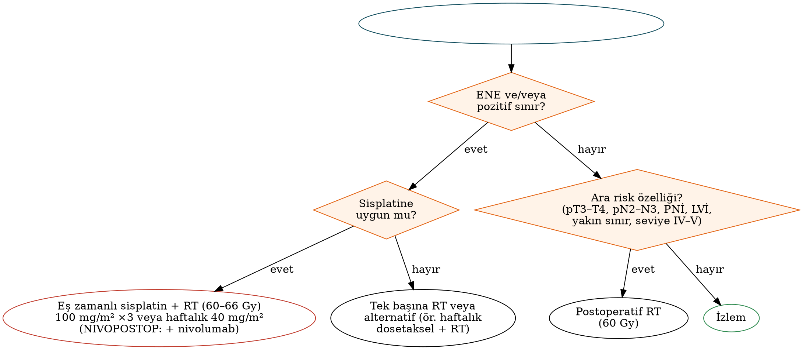

# Radyoterapi, Sistemik Tedavi ve İmmünoterapi

Baş-boyun cerrahı, adjuvan ve definitif tedavi kararlarına aktif olarak katılır; adjuvan tedavi endikasyonlarını bilmek, patoloji raporunu doğru yorumlamak ve toksisiteleri yönetmek cerrahi pratiğin parçasıdır. Bu bölüm radyobiyoloji temellerini, radyoterapi tekniklerini, postoperatif ve definitif kemoradyoterapiyi, indüksiyon kemoterapisini, rekürren/metastatik hastalıkta sistemik tedaviyi ve 2025'te pratiği değiştiren **perioperatif immünoterapi** çalışmalarını özetler. Bölgeye özgü uygulamalar (larenks koruma, HPV ilişkili orofarenks kanserinde de-eskalasyon, nazofarenks karsinomu) ilgili bölümlerde ele alınmıştır.

## Radyobiyolojinin temel ilkeleri

Fraksiyone radyoterapinin etkinliği **4R** ile açıklanır: **R**epair (normal dokuda subletal hasarın onarımı), **R**edistribution (hücrelerin duyarlı fazlara yeniden dağılımı), **R**eoxygenation (hipoksik tümör hücrelerinin yeniden oksijenlenmesi) ve **R**epopulation (tümör hücrelerinin yeniden çoğalması); beşinci R olarak **R**adyosensitivite eklenir.

- **Hızlanmış repopülasyon:** BBSHK'da tedavinin yaklaşık 3.–4. haftasından itibaren tümör hücreleri hızla çoğalır. Bu nedenle **tedavi süresinin uzaması** (aralar, gecikmeler) lokal kontrolü belirgin azaltır; kabul edilen genel kural, definitif radyoterapinin **7 haftayı** aşmamasıdır.
- **Toplam paket süresi:** Cerrahi tarihinden postoperatif radyoterapinin bitimine kadar geçen sürenin **≤11 hafta** olması daha iyi lokal kontrol ve sağkalımla ilişkilidir (Ang, 2001). Postoperatif radyoterapi tercihen cerrahiden sonraki **6 hafta içinde** başlamalıdır.
- **Hipoksi**, radyodirencin önemli nedenlerindendir (oksijen güçlendirme oranı). Anemi düzeltilmesi ve sigaranın bırakılması önerilir; DAHANCA 5'te hipoksik radyosensitizan nimorazol faydalı bulunmuştur.

### Fraksiyonasyon

- **Konvansiyonel:** 2 Gy/fraksiyon, haftada 5 fraksiyon; definitif tedavide **70 Gy/35 fraksiyon/7 hafta**.
- **Hiperfraksiyone:** Günde iki kez daha küçük dozlar (örn. 1,2 Gy × 2; toplam ≈81,6 Gy) — RTOG 9003'te daha iyi lokobölgesel kontrol.
- **Hızlandırılmış:** Toplam sürenin kısaltılması (örn. haftada 6 fraksiyon — DAHANCA 6/7; eş zamanlı boost).
- **MARCH meta-analizi:** Tek başına radyoterapi uygulanan hastalarda değiştirilmiş fraksiyonasyon sağkalımı artırır; en büyük fayda hiperfraksiyonasyondadır. Ancak eş zamanlı kemoterapiyle birlikte hızlandırılmış fraksiyonasyon, konvansiyonel kemoradyoterapiye üstün değildir (**RTOG 0129**).

### Doz düzeyleri

Tablo: Baş-boyun radyoterapisinde tipik doz düzeyleri
| Hedef | Definitif tedavi | Postoperatif tedavi |
|---|---|---|
| Makroskobik tümör / yüksek risk | **70 Gy** (2 Gy/fr) | **60 Gy**; ENE veya pozitif sınır bölgesinde **63–66 Gy** |
| Orta risk (komşu bölgeler) | 59–63 Gy | 54–60 Gy |
| Düşük risk elektif nodal alan | 50–56 Gy | 44–54 Gy |

### Teknikler

- **Yoğunluk ayarlı radyoterapi (IMRT)** ve volümetrik ark tedavisi (VMAT) standarttır. **PARSPORT** çalışması (Nutting, Lancet Oncol 2011), parotis koruyucu IMRT ile 12. ayda ≥2. derece kserostomi oranının konvansiyonel tekniğe göre belirgin azaldığını (≈%38'e karşı ≈%74) göstermiştir.
- **Görüntü kılavuzlu radyoterapi (IGRT)**, adaptif planlama.
- **Proton tedavisi (IMPT):** Dozun Bragg tepesinde sonlanması, özellikle tek taraflı tümörlerde, nazofarenks ve sinonazal tümörlerde ve reirradyasyonda normal doku korunmasını artırır. Orofarenks kanserinde IMPT ile IMRT'yi karşılaştıran randomize faz III çalışmada (MD Anderson) hastalıksız sağkalımda eşdeğerlik ve beslenme tüpü bağımlılığı gibi toksisitelerde azalma bildirilmiştir; erişim ve maliyet kısıtlayıcıdır.
- **Brakiterapi:** Dudak, dil ve seçilmiş reirradyasyon olgularında. **Stereotaktik vücut radyoterapisi (SBRT):** Reirradyasyon ve oligometastatik hastalık.

Tablo: Seçilmiş risk altındaki organ doz sınırları (yaklaşık; QUANTEC temelli)
| Organ | Önerilen sınır |
|---|---|
| Medulla spinalis | Maksimum **≤45–50 Gy** |
| Beyin sapı | Maksimum ≤54 Gy |
| Parotis | Ortalama **≤26 Gy** (en az bir bez için) |
| Submandibular bez | Ortalama ≤39 Gy |
| Mandibula | Maksimum ≤70 Gy (hacim sınırlaması); diş çekim alanına dikkat |
| Farengeal konstriktörler | Ortalama ≤50 Gy (disfaji riskini azaltır) |
| Larenks (glottis) | Ortalama ≤35–45 Gy |
| Koklea | Ortalama ≤35–45 Gy (sisplatinle birlikte daha düşük) |
| Optik sinir ve kiazma | Maksimum ≤54 Gy |

## Postoperatif radyoterapi ve kemoradyoterapi

### Endikasyonlar

Tablo: Rezeke edilmiş BBSHK'da adjuvan tedavi endikasyonları
| Risk düzeyi | Patolojik özellik | Önerilen adjuvan tedavi |
|---|---|---|
| **Yüksek risk** | **ENE** ve/veya **pozitif cerrahi sınır** | **Eş zamanlı sisplatin + radyoterapi (60–66 Gy)** |
| Orta (ara) risk | pT3–T4, pN2–N3 (veya birden fazla pozitif nod), seviye IV–V nodları (ağız boşluğu, orofarenks), **perinöral invazyon**, **lenfovasküler invazyon**, yakın sınır | **Radyoterapi** (60 Gy); seçilmiş olgularda kemoterapi eklenmesi değerlendirilebilir |
| Düşük risk | pT1–T2 N0, temiz sınır, olumsuz özellik yok | İzlem |

**Kanıt:** **EORTC 22931** (Bernier, NEJM 2004) ve **RTOG 9501** (Cooper, NEJM 2004) çalışmaları, postoperatif radyoterapiye üç haftada bir **100 mg/m² sisplatin** eklenmesinin lokobölgesel kontrolü (her iki çalışma) ve genel sağkalımı (EORTC) artırdığını göstermiştir. İki çalışmanın ortak analizinde (Bernier ve Cooper, Head Neck 2005) faydanın **ENE ve/veya pozitif sınırı** olan hastalarda yoğunlaştığı belirlenmiştir; RTOG 9501'in uzun dönem güncellemesi de bu bulguyu desteklemiştir.

!!! sinav "Sınav notu — sisplatin şeması"
    **JCOG1008** (Kiyota, JCO 2022): Postoperatif yüksek riskli hastalarda **haftalık 40 mg/m² sisplatin**, üç haftalık 100 mg/m² şemasına **eşdeğer (non-inferior)** bulunmuş ve daha az toksik olmuştur. Buna karşılık **ConCERT** (Noronha, JCO 2018; Hindistan) çalışmasında **haftalık 30 mg/m²** sisplatin, lokobölgesel kontrolde üç haftalık şemanın **gerisinde** kalmıştır. Sonuç: haftalık şema kullanılacaksa doz **40 mg/m²** olmalıdır; kümülatif sisplatin dozunun **≥200 mg/m²** olması hedeflenir.

!!! guncel "Güncel — NIVOPOSTOP (GORTEC 2018-01)"
    Rezeke edilmiş, nüks riski yüksek (ENE, pozitif sınır ve/veya çok sayıda pozitif nod gibi özellikler) lokal ileri BBSHK'da postoperatif **sisplatin-radyoterapiye nivolumab eklenmesi**, 3 yıllık hastalıksız sağkalımı **%52,5'ten %63,1'e** yükseltmiştir (HR 0,76; p=0,034). Fayda PD-L1 ifadesinden bağımsızdır. Onlarca yıl sonra sisplatin-radyoterapiye üstünlük gösteren ilk adjuvan rejimdir (ASCO 2025; Lancet 2026). Kılavuzlara ve geri ödeme sistemlerine entegrasyonu sürmektedir.

### Sisplatine uygun olmayan hasta

Sisplatin kontrendikasyonları (göreceli): kreatinin klerensi <50–60 mL/dk, ≥2. derece işitme kaybı veya tinnitus, ≥2. derece nöropati, ECOG ≥2, ileri yaş (>70) ve ciddi komorbiditeler. Bu hastalarda seçenekler: **tek başına radyoterapi**, **haftalık dosetaksel + radyoterapi** (Tata Memorial faz II/III çalışmasında sisplatine uygun olmayan hastalarda radyoterapiye göre hastalıksız ve genel sağkalımı artırmıştır) veya karboplatin temelli rejimler. Definitif tedavide **setuksimab-radyoterapi** bir seçenek olarak kalmaktadır; **NRG-HN004** çalışmasında durvalumab-radyoterapi setuksimab-radyoterapiye üstün bulunmamıştır.

## Definitif kemoradyoterapi

**MACH-NC meta-analizi** (Pignon 2000; 2009 güncellemesi), radyoterapiye **eş zamanlı kemoterapi** eklenmesinin 5 yıllık genel sağkalımı mutlak olarak ≈%6,5 artırdığını (HR ≈0,81) göstermiştir. Fayda yaşla azalır ve **70 yaş üzerinde** belirgin değildir. İndüksiyon veya adjuvan kemoterapinin sağkalıma katkısı ise anlamlı bulunmamıştır.

- **Standart rejim:** Sisplatin **100 mg/m², 1., 22. ve 43. günler** (veya haftalık 40 mg/m²) + 70 Gy radyoterapi.
- **Alternatifler:** Karboplatin + 5-FU (GORTEC 94-01), haftalık karboplatin–paklitaksel.
- **Sisplatin toksisiteleri:** Nefrotoksisite (agresif hidrasyon, magnezyum desteği), **ototoksisite** (yüksek frekanslı sensörinöral işitme kaybı, tinnitus), yüksek emetojenite (NK1 antagonisti + 5-HT3 antagonisti + deksametazon ± olanzapin), periferik nöropati, miyelosüpresyon.

### Setuksimab

**Bonner çalışması** (NEJM 2006; 5 yıllık güncelleme Lancet Oncol 2010): Lokal ileri BBSHK'da radyoterapiye EGFR monoklonal antikoru setuksimab eklenmesi, tek başına radyoterapiye göre 5 yıllık genel sağkalımı artırmıştır (≈%45,6'ya karşı %36,4). Akneiform döküntü gelişmesi daha iyi sağkalımla ilişkilidir. İnfüzyon reaksiyonları **alfa-gal** IgE duyarlılığıyla (kene ısırığı öyküsü) ilişkilidir.

!!! dikkat "Tuzak — setuksimab sisplatinin yerini tutmaz"
    HPV ilişkili orofarenks kanserinde **RTOG 1016** (Gillison, Lancet 2019) ve **De-ESCALaTE HPV** (Mehanna, Lancet 2019) çalışmalarında setuksimab-radyoterapi, sisplatin-radyoterapiye göre **daha kötü** sağkalım ve kontrol sağlamış, toksisiteyi de azaltmamıştır. Sisplatine uygun hastada standart **sisplatindir**.

### Definitif kemoradyoterapiye immünoterapi veya yeni ajan eklenmesi

**KEYNOTE-412** (pembrolizumab + KRT) ve **JAVELIN Head and Neck 100** (avelumab + KRT) çalışmaları birincil sonlanım noktasında anlamlı fayda göstermemiştir. IAP inhibitörü **ksevinapant** (TrilynX) faz III çalışması da etkisizlik nedeniyle sonlandırılmıştır. Definitif KRT sonrası adjuvan atezolizumab (**IMvoke010**) negatif sonuçlanmıştır. Bu nedenle nazofarenks dışındaki BBSHK'da definitif KRT'ye immünoterapi eklenmesinin kanıtlanmış faydası yoktur.

## İndüksiyon kemoterapisi

- **TPF (dosetaksel + sisplatin + 5-FU)**, PF'ye üstündür: **TAX 323** (Vermorken, NEJM 2007; rezeke edilemeyen hastalık) ve **TAX 324** (Posner, NEJM 2007).
- **Larenks koruma:** GORTEC 2000-01 (Pointreau, 2009) — TPF indüksiyonu PF'ye göre larenks koruma oranını artırmıştır (Bölüm 20).
- İndüksiyon ardından KRT'nin tek başına KRT'ye üstünlüğü (**PARADIGM, DeCIDE**) gösterilememiştir.
- Günümüzdeki kullanım alanları: **organ koruma** stratejilerinde yanıtın seçici olarak kullanılması, iri nodal hastalık/yüksek uzak metastaz riski, radyoterapinin gecikeceği durumlar, bazı de-eskalasyon protokolleri ve **nazofarenks karsinomu** (GP ve TPF indüksiyonu sağkalımı artırır; Bölüm 16).

## Perioperatif (neoadjuvan + adjuvan) immünoterapi

!!! guncel "Güncel — KEYNOTE-689 (Uppaluri, NEJM 2025)"
    **Hasta grubu:** Yeni tanı, rezeke edilebilir, evre III–IVA (AJCC 8) **ağız boşluğu, larenks, hipofarenks ve p16 negatif orofarenks** SHK (n=714).
    **Tasarım:** **2 kür neoadjuvan pembrolizumab** (200 mg/3 hafta) → cerrahi → risk temelli adjuvan radyoterapi ± sisplatin + pembrolizumab (radyoterapi ile 3 kür, ardından 12 kür idame; toplam 15 adjuvan kür) — standart tedaviyle karşılaştırma.
    **Sonuç:** Olaysız sağkalım belirgin uzamıştır (CPS ≥10'da HR ≈0,66; **CPS ≥1'de ortanca olaysız sağkalım 59,7 aya karşı 29,6 ay**). Neoadjuvan tedavi cerrahiyi geciktirmemiştir.
    **Önemi:** Rezeke edilebilir lokal ileri BBSHK'da yirmi yılı aşkın süre sonra ilk pozitif faz III çalışmadır; **FDA onayı 12 Haziran 2025** (PD-L1 CPS ≥1). Avrupa'da da onay almıştır.

KEYNOTE-689 ve NIVOPOSTOP birlikte, rezeke edilebilir lokal ileri BBSHK'da immünoterapinin küratif tedavi kurgusuna girişini simgeler. Pratik sorular (hangi hastada hangi strateji, PD-L1 negatif hastalar, HPV pozitif orofarenks, maliyet) yeni çalışmalarla netleşmektedir.

## Rekürren ve metastatik hastalık

### Lokobölgesel nüks

- **Kurtarma cerrahisi**, rezeke edilebilir lokobölgesel nükste en yüksek kür şansını sunar; ışınlanmış alanda komplikasyon oranı yüksektir ve vaskülarize serbest flep sıklıkla gerekir.
- Kurtarma cerrahisi sonrası **reirradyasyon** (GORTEC 99-01; Janot, JCO 2008) lokobölgesel kontrolü ve hastalıksız sağkalımı artırmış, genel sağkalımı değiştirmemiş ve toksisiteyi artırmıştır.
- Rezeke edilemeyen nükste IMRT, SBRT veya proton ile **reirradyasyon** seçilmiş hastalarda uygulanır; ciddi geç toksisite (karotis rüptürü, nekroz, fistül) riski vardır.

### Sistemik tedavi

Tablo: Rekürren/metastatik BBSHK'da temel çalışmalar
| Çalışma | Basamak | Karşılaştırma | Sonuç |
|---|---|---|---|
| **EXTREME** (Vermorken, NEJM 2008) | 1. basamak | Platin + 5-FU ± **setuksimab** | Ortanca GS 10,1'e karşı 7,4 ay; immünoterapi öncesi standart |
| **KEYNOTE-048** (Burtness, Lancet 2019) | 1. basamak | **Pembrolizumab** veya **pembrolizumab + platin + 5-FU** vs EXTREME | Pembrolizumab tek başına **CPS ≥1 ve ≥20**'de GS'yi artırır; pembrolizumab–kemoterapi tüm popülasyonda GS'yi artırır (≈13,0'a karşı 10,7 ay) |
| **TPEx** (Guigay, Lancet Oncol 2021) | 1. basamak | Dosetaksel + sisplatin + setuksimab vs EXTREME | Benzer etkinlik, daha az toksisite |
| **CheckMate 141** (Ferris, NEJM 2016) | Platin sonrası | **Nivolumab** vs araştırmacı seçimi | Ortanca GS 7,5'e karşı 5,1 ay; 1 yıllık GS ≈%36'ya karşı ≈%17 |
| **KEYNOTE-040** (Lancet 2019) | Platin sonrası | Pembrolizumab vs standart | GS'de iyileşme |
| KESTREL, EAGLE, CheckMate 651, LEAP-010 | 1./2. basamak | Durvalumab ± tremelimumab; nivolumab + ipilimumab; pembrolizumab + lenvatinib | **Negatif** (GS'de üstünlük yok) |

!!! kilavuz "Birinci basamak seçim (NCCN ilkeleri — özet)"
    - **CPS ≥1:** Pembrolizumab tek başına (özellikle düşük tümör yükü, yavaş seyir, **CPS ≥20**) **veya** pembrolizumab + platin + 5-FU (yüksek tümör yükü, semptomatik hastalık, hızlı yanıt gereksinimi).
    - **CPS <1:** Pembrolizumab + platin + 5-FU veya setuksimab temelli rejim (EXTREME/TPEx).
    - İmmünoterapi sonrası progresyonda: setuksimab temelli rejimler, taksanlar, metotreksat, klinik çalışmalar.

**Yeni ajanlar:** EGFR×LGR5 bispesifik antikoru **petosemtamab**, birinci basamakta pembrolizumabla birlikte faz II'de yüksek yanıt oranları (≈%60'ın üzerinde) göstermiş ve faz III (LiGeR-HN1/HN2) çalışmalarına alınmıştır; amivantamab ve antikor–ilaç konjugatları araştırılmaktadır. Oligometastatik hastalıkta (özellikle akciğer) metastazektomi veya SBRT seçilmiş hastalarda uzun sağkalım sağlayabilir.

## Radyoterapi toksisiteleri ve yönetimi

### Akut toksisiteler

- **Oral mukozit:** En sık doz sınırlayıcı akut toksisite; ağrı, beslenme bozukluğu, kilo kaybı. Önleme ve tedavide ağız bakımı, **benzidamin** gargarası, **fotobiyomodülasyon (düşük düzeyli lazer)** (MASCC/ISOO önerileri), sistemik analjezi (opioidler) ve gerektiğinde beslenme tüpü.
- Radyasyon dermatiti, tat kaybı (disguzi), kandidiyazis, odinofaji, ödem.

### Geç toksisiteler

- **Kserostomi:** En sık geç yan etki. Önleme: parotis koruyucu IMRT, **submandibular bez transferi** (Seikaly–Jha) seçilmiş olgularda. Tedavi: **pilokarpin** (5 mg günde 3 kez) veya sevimelin, tükürük replasmanları, şekersiz sakız, akupunktur. Amifostin sınırlı kullanılır.
- **Radyasyon çürüğü:** Ömür boyu **florür** uygulaması (kişisel taşıyıcı plaklar) ve düzenli diş kontrolü.
- **Trismus, fibrozis ve lenfödem:** Erken egzersiz programları ve cihazlar (örn. çene açma cihazları), manuel lenf drenajı.
- **Disfaji ve aspirasyon:** Konstriktör dozu ile ilişkilidir; radyoterapi sırasında **ağızdan beslenmenin sürdürülmesi ve proaktif yutma egzersizleri** ("ye ve egzersiz yap") uzun dönem tüp bağımlılığını azaltır. Striktürlerde dilatasyon.
- **Hipotiroidi:** Boyun ışınlamasından sonra %20–50; **TSH izlemi** gerekir.
- **Karotis stenozu** ve inme riski (hızlanmış ateroskleroz), radyasyona bağlı kraniyal nöropati (en sık XII), **Lhermitte bulgusu**, radyasyon miyelopatisi, temporal lob nekrozu (nazofarenks), işitme kaybı.
- **Radyasyona bağlı ikincil malignite:** Sarkom (Cahan ölçütleri: ışınlanmış alanda gelişme, yıllarca latent dönem, farklı histoloji).

### Osteoradyonekroz (ORN)

Işınlanmış kemiğin, iyileşmeden en az 3 ay boyunca açıkta kalmasıdır; en sık **mandibulada** görülür. IMRT döneminde sıklığı ≈%2–5'tir. Risk faktörleri: **yüksek mandibula dozu (>60 Gy)**, **radyoterapi sonrası diş çekimi**, sigara ve alkol, periodontal hastalık, cerrahi travma.

Tablo: Mandibula osteoradyonekrozunda Notani sınıflaması
| Notani | Tanım | Tedavi yaklaşımı |
|---|---|---|
| **I** | ORN **alveolar kemikle** sınırlı | Konservatif: hijyen, antibiyotik, yüzeyel debridman |
| **II** | ORN alveolar kemik ve/veya mandibulada **inferior alveolar (mandibular) kanal düzeyinin üstünde** sınırlı | Debridman/sekestrektomi; pentoksifilin–tokoferol (± klodronat) |
| **III** | ORN **mandibular kanalın altına** uzanır veya **deri (orokütanöz) fistülü** ve/veya **patolojik kırık** vardır | **Segmental mandibulektomi + vaskülarize serbest flep (fibula)** |

!!! dikkat "Tuzak — hiperbarik oksijen"
    Hiperbarik oksijenin ORN'yi önlemedeki rolü tartışmalıdır: Marx'ın (1985) çalışması fayda bildirmiş, ancak daha yeni randomize **HOPON** çalışması, ışınlanmış hastada diş çekimi öncesi profilaktik hiperbarik oksijenin ORN'yi anlamlı azaltmadığını göstermiştir. İlerlemiş ORN'nin kesin tedavisi **rezeksiyon ve vaskülarize kemik flebi** ile rekonstrüksiyondur.

!!! ozet "Kritik noktalar"
    - Hızlanmış repopülasyon nedeniyle **tedavi aralarından kaçınılır**; definitif RT ≤7 hafta, cerrahi–PORT bitimi (toplam paket süresi) **≤11 hafta**, PORT cerrahiden sonra **≤6 hafta** içinde başlamalı.
    - Doz: definitif **70 Gy**, postoperatif **60 Gy** (ENE/pozitif sınırda 63–66 Gy), elektif 44–56 Gy. **Parotis ortalaması ≤26 Gy**, medulla ≤45–50 Gy. PARSPORT: IMRT kserostomiyi azaltır.
    - **ENE ve/veya pozitif sınır → postoperatif sisplatin-RT** (EORTC 22931/RTOG 9501). Ara risk faktörleri → PORT.
    - Sisplatin: 100 mg/m² üç haftada bir veya **haftalık 40 mg/m²** (JCOG1008: eşdeğer); haftalık 30 mg/m² yetersiz (ConCERT). Kümülatif ≥200 mg/m².
    - **MACH-NC:** eş zamanlı KT mutlak ≈%6,5 sağkalım kazancı; >70 yaşta fayda yok. Setuksimab-RT, RT'ye üstün (Bonner) fakat **sisplatine eşdeğer değildir** (RTOG 1016, De-ESCALaTE).
    - Definitif KRT'ye immünoterapi eklenmesi (KEYNOTE-412, JAVELIN 100) **negatif**; ksevinapant başarısız.
    - **KEYNOTE-689 (2025):** rezeke edilebilir evre III–IVA BBSHK'da perioperatif pembrolizumab olaysız sağkalımı artırır; FDA onayı Haziran 2025 (CPS ≥1). **NIVOPOSTOP (2025):** yüksek riskli rezeke hastalıkta nivolumab + sisplatin-RT hastalıksız sağkalımı artırır (HR 0,76).
    - R/M birinci basamak: **KEYNOTE-048** — CPS ≥1'de pembrolizumab ± kemoterapi; platin sonrası **nivolumab** (CheckMate 141). EXTREME tarihsel standarttır.
    - ORN: risk mandibula dozu >60 Gy ve RT sonrası diş çekimi; **Notani III → segmental rezeksiyon + fibula flebi**; HBO'nun önleyici rolü tartışmalı (HOPON).
