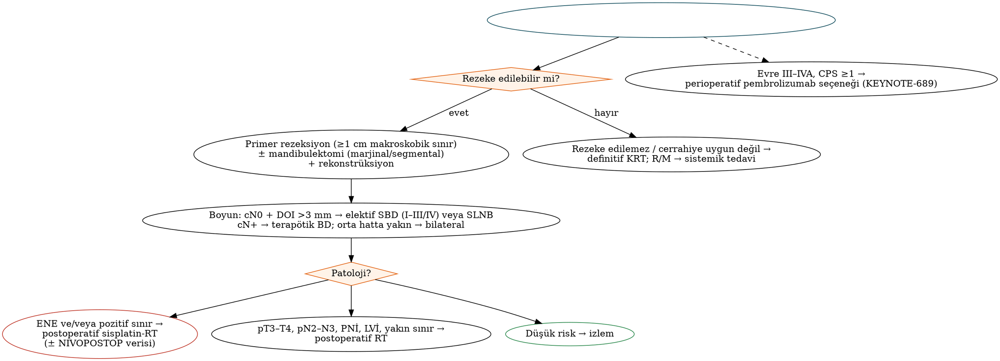

# Ağız Boşluğu Kanseri

Ağız boşluğu SHK'sı, baş-boyun bölgesinde **cerrahinin birincil tedavi** olduğu başlıca kanserdir. Radyoterapinin mandibula ve dişler üzerindeki geç etkileri ile cerrahinin iyi fonksiyonel sonuçları nedeniyle, rezeke edilebilir ağız kanserlerinde standart yaklaşım **primer cerrahi ± adjuvan (kemo)radyoterapidir**. AJCC 8 ile **invazyon derinliğinin (DOI)** T kategorisine girmesi, bu bölümün sınavlarda en sık sorgulanan konusudur.

## Epidemiyoloji ve risk faktörleri

- Batı ülkelerinde en sık alt bölge **oral dil (lateral ve ventral yüz)**, ardından **ağız tabanıdır**. Güney Asya'da betel/areka kullanımına bağlı olarak **bukkal mukoza ve gingivobukkal oluk** kanserleri ön plandadır.
- Başlıca risk faktörleri tütün, alkol, betel/areka ve dumansız tütündür (Bölüm 9). **Ağız boşluğu kanserinde HPV'nin etiyolojik rolü sınırlıdır**; p16 ifadesi prognostik değildir ve HPV temelli evreleme kullanılmaz.
- **Sigara ve alkol kullanmayan genç hastalarda (özellikle kadınlarda) dil kanseri** sıklığı artmaktadır; nedeni belirsizdir ve HPV ile ilişkili değildir.
- Fanconi anemisi ve diskeratozis konjenita genç yaşta ağız kanseri riskini belirgin artırır.

## Klinik bulgular

İyileşmeyen ülser (en sık başvuru nedeni), ağrı, **refere otalji** (lingual sinir → V3 → aurikülotemporal sinir), kanama, diş sallanması, protezin oturmaması, ağızda kitle, dizartri ve disfaji. **Alt dudakta uyuşukluk** (inferior alveolar/mental sinir) mandibula ve perinöral invazyonu, **trismus** ise pterigoid kas/mastikatör boşluk tutulumunu (T4b) düşündürür.

## Değerlendirme

- **Muayene ve palpasyon:** Tümörün boyutu, derinliği (dil kasına infiltrasyon), mandibulaya fiksasyon, orta hata uzanım, dil hareketliliği; boyun palpasyonu.
- **Biyopsi** (ülserin kenarından, nekrotik merkezden değil).
- **Görüntüleme:** **MR**, dil ve ağız tabanı tümörlerinde yumuşak doku yayılımını, orta hat aşımını ve perinöral yayılımı en iyi gösterir ve DOI'yi tahmin etmede yararlıdır. **BT**, kortikal kemik invazyonunu değerlendirir. Mandibula için panoramik grafi ve konik ışınlı/dental BT tamamlayıcıdır. İleri evrede **PET-BT** ve toraks BT.
- Diş değerlendirmesi (adjuvan radyoterapi olasılığına karşı), beslenme durumu.

## AJCC 8 evrelemesi

### İnvazyon derinliği (DOI)

DOI, tümörün **komşu normal mukozanın bazal membran düzeyinden** çizilen hatta göre, invazyonun **en derin noktasına dik uzaklığıdır**. **Tümör kalınlığından farklıdır**: ekzofitik tümörlerde kalınlık DOI'den büyük, ülseratif tümörlerde ise küçük olabilir. DOI, okült nodal metastaz ve sağkalımın güçlü bir öngördürücüsüdür.

!!! dikkat "Tuzak — DOI ≠ tümör kalınlığı"
    Ekzofitik (dışa doğru büyüyen) bir tümörün kalınlığı 12 mm iken DOI'si 3 mm olabilir. Evreleme ve elektif boyun diseksiyonu kararında kullanılan ölçüt **DOI**'dir. Klinik T evrelemesinde DOI, muayene ve görüntülemeyle tahmin edilir; kesin değer patolojik incelemeyle belirlenir.

Tablo: AJCC 8 — ağız boşluğu T kategorisi (2018 revizyonuyla)
| T | Tanım |
|---|---|
| Tis | Karsinoma in situ |
| **T1** | **≤2 cm** ve **DOI ≤5 mm** |
| **T2** | ≤2 cm ve **DOI >5 mm**; **veya** >2 cm ve ≤4 cm ve **DOI ≤10 mm** |
| **T3** | >2 cm ve ≤4 cm ve **DOI >10 mm**; **veya** >4 cm ve DOI ≤10 mm |
| **T4a** (orta düzeyde ileri lokal hastalık) | **>4 cm ve DOI >10 mm**; **veya** yalnızca komşu yapıların invazyonu: mandibula veya maksillanın **kortikal kemiğini aşan** invazyon, **maksiller sinüs** veya **yüz derisi** tutulumu |
| **T4b** (çok ileri lokal hastalık) | **Mastikatör boşluk**, **pterigoid plaklar** veya **kafa tabanı** invazyonu ve/veya **internal karotis arteri sarma** |

!!! sinav "Sınav notu — T4a ölçütleri"
    - Dişeti tümörünün kemiği veya diş soketini **yüzeyel erozyona uğratması T4a için yeterli değildir**; kortikal kemiğin aşılması gerekir.
    - AJCC 8 ile **ekstrensek dil kası invazyonu T4a ölçütü olmaktan çıkarılmıştır** (DOI bu bilgiyi karşıladığı için).
    - **Dudak** kanserinde T4a: kortikal kemiği aşan invazyon, **inferior alveolar sinir**, **ağız tabanı** veya **yüz derisi** (çene veya burun) tutulumu.

N kategorisi ve evre grupları HPV ilişkisiz baş-boyun kanserleri için ortaktır (ENE dahil; Bölüm 9).

## Cerrahi tedavi

### Primer tümör rezeksiyonu

- **Cerrahi sınır:** Hedef, tüm boyutlarda **≥1 cm makroskobik** sınırla (palpasyonla değerlendirilir) eksizyon ve patolojide **≥5 mm** temiz sınırdır. NCCN'e göre **1–5 mm yakın**, invaziv karsinom/CIS sınırda ise **pozitif** sınırdır. Spesmen fiksasyonla ve büzülmeyle %20–30'a kadar kısalabilir.
- **Frozen kesit**, mümkünse **spesmen üzerinden** yapılmalıdır. Tümör yatağından alınan ek sınırların "negatif" olması, spesmen üzerinde pozitif olan sınırı her zaman telafi etmez; pozitif/yakın sınırda **yeniden rezeksiyon** yapılabiliyorsa tercih edilir.
- **Erişim yolları:** Transoral (küçük, önde yerleşimli tümörler); **mandibular "swing" (paramedyan/medyan mandibulotomi + dudak yarma)**; **"visor" flep / pull-through** (ağız tabanı ve dil — boyundan aşağı çekilerek); büyük tümörlerde kompozit rezeksiyon.

### Mandibula yönetimi

Tablo: Mandibula rezeksiyon seçenekleri
| Yöntem | Endikasyon | Not |
|---|---|---|
| **Marjinal (kortikal) mandibulektomi** | Tümör mandibulaya **yapışık/komşu** ancak medüller kemik invazyonu yok; yalnızca minimal yüzeyel kortikal erozyon | Mandibulanın alt kenarı (sürekliliği) korunur; **en az ≈1 cm** yükseklikte kemik kalmalı; **dişsiz, atrofik ve ışınlanmış** mandibulada kırık riski yüksektir |
| **Segmental mandibulektomi** | Medüller kemik invazyonu, inferior alveolar sinir/mandibular kanal tutulumu, belirgin kemik yıkımı, atrofik mandibula, ışınlanmış kemikte tümör | Süreklilik bozulur; **vaskülarize kemik flebi (fibula)** ile rekonstrüksiyon (Bölüm 11) |

- Tümör mandibulaya çoğunlukla **alveoler kret ve dişsiz alanlardaki diş soketleri** yoluyla girer (özellikle dişsiz hastada **oklüzal yüzeyden**); kortikal kemik bir bariyerdir.
- **İnferior alveolar sinir tutulumu** (alt dudak uyuşukluğu), perinöral yayılım nedeniyle sinirin proksimal olarak kafa tabanına doğru izlenmesini ve frozen kesitle sınır kontrolünü gerektirir.

### Boyun yönetimi

- **cN0:** **DOI >3 mm** (NCCN) veya okült metastaz riski >%15–20 olduğunda **elektif boyun diseksiyonu** — genellikle **SBD (I–III)**, dil kanserinde atlama metastazı nedeniyle sıklıkla **I–IV**. **D'Cruz (NEJM 2015):** elektif BD, bekle-gör yaklaşımına göre genel sağkalımı artırır (3 yıl %80'e karşı %67,5). Deneyimli merkezlerde T1–T2 N0 tümörlerde **sentinel lenf nodu biyopsisi** eşdeğer alternatiftir (Bölüm 6).
- **cN+:** Terapötik BD (SBD veya MRBD, nodal yüke göre).
- **Orta hatta yaklaşan veya orta hattı aşan** tümörlerde (dil, ağız tabanı) **bilateral** boyun diseksiyonu düşünülür.

## Adjuvan tedavi

Adjuvan tedavi endikasyonları genel ilkeleri izler (Bölüm 10):

- **Postoperatif radyoterapi:** pT3–T4, pN2–N3 (veya birden fazla pozitif nod), seviye IV–V nodları, **perinöral invazyon**, **lenfovasküler invazyon**, yakın sınır. Ağız boşluğunda **DOI ve en kötü invazyon paterni (WPOI-5)** de risk değerlendirmesinde kullanılır.
- **Postoperatif kemoradyoterapi:** **ENE** ve/veya **pozitif sınır**.
- **Perioperatif pembrolizumab (KEYNOTE-689):** Rezeke edilebilir evre III–IVA ağız boşluğu SHK'sında, PD-L1 CPS ≥1 olan hastalarda yeni bir seçenektir (Bölüm 10).
- Primer radyoterapi; cerrahiye uygun olmayan hastalar dışında ağız boşluğunda tercih edilmez (osteoradyonekroz, daha düşük kontrol oranları). Brakiterapi seçilmiş küçük dil ve dudak tümörlerinde kullanılabilir.

## Alt bölgelere göre özellikler

Tablo: Ağız boşluğu alt bölgelerinin klinik özellikleri
| Alt bölge | Özellikler | Cerrahi notlar |
|---|---|---|
| **Oral dil** | En sık alt bölge; lateral/ventral yüz; erken ve sık nodal metastaz; **seviye IV atlama metastazı** | Parsiyel glossektomi ve ≥1 cm sınır; derinlik sınırına dikkat (en sık pozitif sınır derin sınırdır); büyük defektlerde RFFF/ALT |
| **Ağız tabanı** | Mandibulaya erken komşuluk; **Wharton kanalı** tutulumu (submandibular bez obstrüksiyonu); orta hatta yakın → bilateral drenaj | Marjinal/segmental mandibulektomi kararı; kanal tutulumunda submandibular bez rezeksiyonu |
| **Alveoler sırt (dişeti)** | Erken kemik invazyonu; diş sallanması; dişsiz hastada protez irritasyonu | Mandibula/maksilla rezeksiyonu sık gerekir |
| **Retromolar trigon** | **Pterigomandibular rafe** yoluyla pterigoid kaslar, infratemporal fossa, tonsil ve yumuşak damağa yayılım; erken mandibula ve inferior alveolar sinir invazyonu | Sıklıkla marjinal veya segmental mandibulektomi; trismus T4b'yi düşündürür |
| **Bukkal mukoza** | Betel/areka ve dumansız tütünle ilişkili; agresif seyir, yüksek lokal nüks; **verrüköz karsinom** bu bölgede sık | Tam kalınlık rezeksiyonda yanak derisi; serbest flep rekonstrüksiyonu |
| **Sert damak** | SHK görece az; **minör tükürük bezi tümörleri** (adenoid kistik, mukoepidermoid, polimorf adenokarsinom) burada sık | Parsiyel maksillektomi/palatektomi; obtüratör veya flep |

!!! klinik "Klinik inci — verrüköz karsinom"
    Verrüköz karsinom (Ackerman tümörü), SHK'nın **iyi diferansiye**, ekzofitik, "itici (pushing)" sınırlı bir alt tipidir; dumansız tütün ile ilişkilidir, en sık **bukkal mukoza ve dişetinde** görülür. **Nodal metastaz nadirdir**; tedavisi **cerrahi eksizyondur** ve boyun diseksiyonu genellikle gerekmez. Yüzeyel biyopsiler tanıyı atlayabilir; derin ve geniş biyopsi gerekir. Radyoterapinin anaplastik dönüşüme yol açtığı görüşü tartışmalı olsa da cerrahi tercih edilir. Hibrit (verrüköz + konvansiyonel SHK) tümörler konvansiyonel SHK gibi tedavi edilir.

## Dudak kanseri

- Dudak kanserlerinin büyük çoğunluğu **alt dudakta** (güneş ışınlarına maruziyet) ve **SHK** histolojisindedir; **üst dudakta bazal hücreli karsinom** daha sıktır.
- Risk faktörleri: UV, açık ten, pipo/sigara, immünsupresyon; öncül lezyon **aktinik şeilit**.
- Prognoz genellikle iyidir; nodal metastaz (seviye IA ve IB) az görülür. Kötü prognostik faktörler: büyük tümör, **komissür tutulumu**, üst dudak, perinöral invazyon (özellikle **mental sinir** yoluyla mandibular kanala yayılım).
- Tedavi: **cerrahi eksizyon** (V, W veya kalkan eksizyon) ve rekonstrüksiyon (Abbe, Estlander, Karapandzic, Bernard–Burow; Bölüm 11), aktinik şeilit eşlik ediyorsa **vermilyonektomi**. Radyoterapi (eksternal veya brakiterapi) kozmetik açıdan seçilmiş hastalarda alternatiftir.

## Prognostik faktörler ve sonuçlar

- En önemli prognostik faktör **nodal durum ve ENE**'dir; T kategorisi, **DOI**, perinöral ve lenfovasküler invazyon, **WPOI**, cerrahi sınır ve tümör tomurcuklanması da sağkalımı belirler.
- Yaklaşık 5 yıllık genel sağkalım: erken evrede (I–II) **%70–90**, ileri evrede (III–IV) **%30–50**.
- Nükslerin çoğu ilk 2 yılda görülür; ikinci primer riski yüksektir (alan kanserizasyonu).

!!! vaka "Vaka"
    58 yaşında, 40 paket-yıl sigara içen erkek; sol dil lateral kenarında 2,8 cm ülseroinfiltratif lezyon, MR'de tahmini DOI 8 mm, boyun klinik ve radyolojik N0. **Klinik evre:** >2–4 cm ve DOI ≤10 mm → **cT2N0 (evre II)**. **Tedavi:** parsiyel glossektomi (≥1 cm sınır, RFFF ile rekonstrüksiyon) + **elektif SBD (I–IV)** (DOI >3 mm). Patolojide DOI 11 mm, 1/32 pozitif nod (2,2 cm, ENE yok), PNİ var → **pT3N1**; adjuvan **radyoterapi** (PNİ, pN1 ve pT3). ENE veya pozitif sınır olsaydı **sisplatin-RT** gerekecekti.

!!! ozet "Kritik noktalar"
    - Ağız boşluğu kanserinde standart tedavi **primer cerrahi ± adjuvan (kemo)radyoterapidir**. En sık alt bölge oral dil; HPV'nin rolü sınırlıdır ve evrelemede kullanılmaz.
    - **DOI**, bazal membran düzeyinden en derin invazyon noktasına dik uzaklıktır; tümör kalınlığından farklıdır.
    - AJCC 8 (2018 revizyonu): **T1 ≤2 cm + DOI ≤5 mm; T2 ≤2 cm + DOI >5 mm veya 2–4 cm + DOI ≤10 mm; T3 2–4 cm + DOI >10 mm veya >4 cm + DOI ≤10 mm; T4a >4 cm + DOI >10 mm veya kortikal kemik/maksiller sinüs/yüz derisi; T4b mastikatör boşluk, pterigoid plaklar, kafa tabanı, İKA'yı sarma.**
    - Yüzeyel kemik/diş soketi erozyonu T4a değildir; **ekstrensek dil kası invazyonu artık T4a ölçütü değildir.**
    - Temiz sınır **≥5 mm**, yakın **1–5 mm**; frozen kesit spesmen üzerinden yapılmalıdır.
    - **Marjinal mandibulektomi** yalnızca medüller invazyon yokken ve yeterli kemik yüksekliği varken; medüller/kanal invazyonu, atrofik veya ışınlanmış mandibulada **segmental mandibulektomi + fibula**.
    - cN0'da **DOI >3 mm → elektif BD** (D'Cruz); SLNB alternatif. Dil kanserinde seviye IV atlama metastazı.
    - Verrüköz karsinom: bukkal mukoza/dişeti, dumansız tütün, nodal metastaz nadir, **cerrahi**.
    - Dudak kanseri çoğunlukla **alt dudakta SHK**, üst dudakta BHK; öncülü aktinik şeilit.
