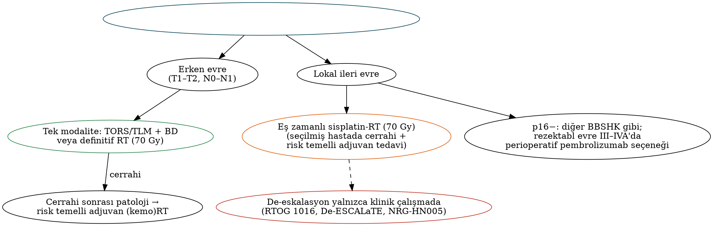

# Orofarenks Kanseri

Orofarenks kanseri, son otuz yılda epidemiyolojisi en çarpıcı biçimde değişen baş-boyun kanseridir. Batı ülkelerinde olguların büyük çoğunluğu artık **HPV ilişkili**dir; bu tümörler daha genç, sigara içmeyen hastalarda görülür, tedaviye daha iyi yanıt verir ve ayrı bir evreleme sistemiyle sınıflandırılır. Bu bölüm HPV ilişkili ve ilişkisiz orofarenks kanserinin klinik özelliklerini, p16/HPV testini (CAP 2025), AJCC 8 ve **Versiyon 9 (2026)** evrelemesini, transoral cerrahi ile radyoterapi seçeneklerini ve de-eskalasyon çalışmalarını ele alır.

## Anatomi ve alt bölgeler

Orofarenks, yumuşak damak düzeyinden hiyoid (vallekula tabanı) düzeyine uzanır. AJCC alt bölgeleri:

- **Dil kökü** (sirkumvallat papillaların arkası, vallekula dahil) — lingual tonsil dokusu.
- **Tonsil bölgesi:** palatin tonsil, tonsil fossası ve plikalar (ön ve arka).
- **Yumuşak damak** ve uvula (yalnızca oral yüzü).
- **Farenks arka ve yan duvarları.**

HPV ilişkili kanserler, **retiküle kript epitelinin** bulunduğu **palatin tonsil ve dil kökünden** köken alır. Yumuşak damak ve farenks arka duvarı tümörleri çoğunlukla HPV ilişkisizdir. Dil kökü, yumuşak damak ve farenks arka duvarı tümörlerinde **bilateral** ve **retrofarengeal** nodal yayılım sıktır.

## HPV ilişkili ve ilişkisiz orofarenks kanseri

Tablo: HPV ilişkili ve HPV ilişkisiz orofarenks kanserinin karşılaştırması
| Özellik | HPV ilişkili (p16+) | HPV ilişkisiz (p16−) |
|---|---|---|
| Etken | HPV-16 (≈%90), diğer yüksek riskli tipler | Tütün, alkol |
| Hasta profili | Daha genç (40–60), erkek, beyaz, sigara içmeyen/az içen, yüksek sosyoekonomik düzey, **oral seks partner sayısı** | Daha yaşlı, yoğun sigara–alkol |
| Yerleşim | Tonsil, dil kökü | Tüm alt bölgeler |
| Klinik sunum | **Küçük primer + büyük, sıklıkla kistik nodal metastaz**; sıklıkla boyun kitlesiyle başvuru | Ağrı, disfaji, ülsere primer |
| Histoloji | Bazaloid, nonkeratinize, keratinize olmayan SHK | Keratinize SHK |
| Moleküler | TP53 vahşi tip, Rb inaktif, **p16 aşırı ifadesi**, PIK3CA | **TP53 mutasyonu**, CDKN2A kaybı |
| Alan kanserizasyonu / ikinci primer | Düşük | Yüksek |
| Tedavi yanıtı ve prognoz | **Belirgin olarak daha iyi** (3 yıllık GS ≈%82; RTOG 0129) | Daha kötü (≈%57) |
| Uzak metastaz | Daha geç ve atipik bölgelere (çok sayıda organ, beyin, deri) olabilir | — |

!!! sinav "Sınav notu — RTOG 0129 risk grupları (Ang, NEJM 2010)"
    - **Düşük risk** (3 yıllık GS ≈%93): HPV+ ve ≤10 paket-yıl; veya HPV+, >10 paket-yıl ve N0–N2a.
    - **Orta risk** (≈%71): HPV+, >10 paket-yıl ve N2b–N3; veya HPV−, ≤10 paket-yıl ve T2–T3.
    - **Yüksek risk** (≈%46): HPV−, ≤10 paket-yıl ve T4; veya HPV− ve >10 paket-yıl.
    HPV durumu sağkalımın en güçlü belirleyicisidir; **sigara** HPV pozitif hastada bile prognozu kötüleştirir.

### HPV aşılaması

Dört ve dokuz değerlikli HPV aşıları (Gardasil 9), aşılanan kohortlarda oral HPV enfeksiyonu prevalansını belirgin azaltmıştır; aşılanmış kuşaklarda orofarenks kanseri insidansının düşmesi beklenmektedir. Gardasil 9, orofarenks ve diğer baş-boyun kanserlerinin önlenmesi endikasyonunu (hızlandırılmış onay) almıştır.

## HPV durumunun belirlenmesi

!!! kilavuz "CAP 2025 HPV testi kılavuzu güncellemesi"
    - Orofarenks SHK doku örneklerinde (orofarenks kökeni düşündüren klinik bulgularla birlikte boyun lenf nodu metastazları dahil) **p16 immünohistokimyası** yapılmalıdır.
    - p16 **pozitifliği:** tümör hücrelerinin **≥%70'inde nükleer ve sitoplazmik**, en az **orta–güçlü yoğunlukta** boyanma (NCCN 2026 ile uyumlu).
    - **HPV özgül test** (DNA/RNA ISH veya PCR) şu durumlarda yapılmalıdır: HPV ilişkili OPC prevalansının **düşük olduğu bölgeler** (Türkiye gibi), **şüpheli p16 boyanması** (%50–70 veya yaygın fakat zayıf), **p16 ile morfoloji uyumsuzluğu**, orofarenksi aşan büyük çok bölgeli tümörler ve **tonsil/dil kökü dışındaki orofarenks bölgeleri**.
    - **Sitoloji (İİAB) örneklerinde** p16 yerine **refleks HPV özgül test** önerilir.

!!! dikkat "Tuzak — p16/HPV uyumsuzluğu"
    p16 pozitif olup HPV negatif (veya tersi) olgular yaklaşık %10 oranında görülür ve prognozları **p16+/HPV+ olgulardan kötüdür**. p16, orofarenks dışında (ağız boşluğu, larenks, hipofarenks) HPV'nin güvenilir vekili değildir ve bu bölgelerde HPV temelli evreleme kullanılmaz.

## Evreleme

### T kategorisi (AJCC 8)

Tablo: AJCC 8 — orofarenks T kategorisi
| T | p16 pozitif (HPV ilişkili) | p16 negatif |
|---|---|---|
| T0 | Primer bulunamadı (p16+ nodal metastaz) | Kullanılmaz (bilinmeyen primer bölümü) |
| Tis | **Kullanılmaz** | Karsinoma in situ |
| T1 | ≤2 cm | ≤2 cm |
| T2 | >2 cm, ≤4 cm | >2 cm, ≤4 cm |
| T3 | >4 cm veya **epiglotun lingual yüzüne** uzanım | >4 cm veya epiglotun lingual yüzüne uzanım |
| T4 | **T4 (alt grup yok):** larenks, ekstrensek dil kası, medial pterigoid, sert damak, mandibula veya ötesi | **T4a:** larenks, ekstrensek dil kası, medial pterigoid, sert damak, mandibula; **T4b:** lateral pterigoid kas, pterigoid plaklar, lateral nazofarenks, kafa tabanı veya karotis arteri sarma |

Dil kökü veya vallekula tümörlerinin epiglot lingual yüzüne **mukozal** uzanımı larenks invazyonu sayılmaz.

### HPV ilişkili (p16+) orofarenks kanserinde N kategorisi ve evreler: AJCC 8 ve Versiyon 9

Tablo: HPV ilişkili OPC — klinik N (cN): AJCC 8 ve Versiyon 9
| cN | AJCC 8 | Versiyon 9 (Ocak 2026) |
|---|---|---|
| N0 | Bölgesel nod yok | Değişmedi |
| N1 | **İpsilateral**, ≤6 cm (bir veya daha fazla) | İpsilateral ≤6 cm, **iENE yok** |
| N2 | **Kontralateral veya bilateral**, ≤6 cm | Kontralateral/bilateral ≤6 cm iENE yok **veya ipsilateral ≤6 cm + iENE** |
| N3 | **>6 cm** | >6 cm **veya kontralateral/bilateral ≤6 cm + iENE** |

**iENE (radyolojik ekstranodal yayılım):** kapsülün ötesine, perinodal yağa veya komşu yapılara (deri, kas, nörovasküler yapılar) uzanımın **kesin** radyolojik bulguları ya da iki veya daha fazla nodun aradaki planları kaybolarak **kaynaşmış tek kitle** oluşturması. Versiyon 9'da **cT kategorileri ve klinik evre gruplaması değişmemiştir**; değişen yalnızca cN'dir.

Tablo: HPV ilişkili OPC — patolojik N (pN): AJCC 8 ve Versiyon 9
| pN | AJCC 8 | Versiyon 9 |
|---|---|---|
| pN1 | **≤4** metastatik nod | **pN1a:** 1 nod, ENE−; **pN1b:** 2–4 nod, ENE− |
| pN2 | **>4** metastatik nod | **>4 nod ENE−** veya **1–4 nod ENE+** |
| pN3 | (yok) | **>4 nod ve ENE+** |

Tablo: HPV ilişkili OPC — evre grupları
| Evre | Klinik (AJCC 8 = Versiyon 9) | Patolojik AJCC 8 | Patolojik Versiyon 9 |
|---|---|---|---|
| I | T0–T2 N0–N1 | T0–T2 N0–N1 | T0–T2 N0–N1 |
| II | T0–T2 N2; T3 N0–N2 | T0–T2 N2; T3–T4 N0–N1 | **T0–T2 N2–N3; T3 N0–N2** |
| III | T0–T4 N3; T4 N0–N3 | T3–T4 N2 | **T3 N3; T4 N0–N3** |
| IV | M1 | M1 | M1 |

!!! guncel "Güncel — Versiyon 9'un mantığı"
    AJCC 8'de cerrahi uygulanan HPV+ hastaların >%80'i evre I'de toplanıyor ve bu grupta risk çok heterojen kalıyordu. Versiyon 9 (Lancet Oncol 2025; 14.447 hasta) **nod sayısı ve patolojik ENE**'yi birleştirerek dağılımı dengelemiştir (evre I ≈%55, II ≈%41, III ≈%4). Patolojik ENE'nin minör/majör ayrımı prognostik bulunmamıştır. Evre karşılaştırmalarında "Will Rogers" (evre göçü) etkisi göz önünde bulundurulmalıdır.

### HPV ilişkisiz (p16−) orofarenks kanseri

N kategorisi ve evre grupları ağız boşluğu, larenks ve hipofarenks ile ortaktır (ENE dahil; Bölüm 9).

## Tedavi

### Genel ilkeler

- **Erken evre (T1–T2, N0–N1):** **Tek modalite** — **transoral cerrahi (TORS/TLM) + boyun diseksiyonu** (patolojiye göre adjuvan) **veya definitif radyoterapi** (70 Gy). İyi lateralize, küçük tonsil tümörlerinde (yumuşak damak/dil köküne minimal uzanım, N0–N1) **yalnızca ipsilateral boyun ışınlaması** kontralateral nüks riski düşük olduğundan kabul edilebilir.
- **Lokal ileri evre:** **Sisplatinli eş zamanlı kemoradyoterapi** (70 Gy) veya seçilmiş hastalarda transoral cerrahi + risk temelli adjuvan (kemo)radyoterapi. İndüksiyon kemoterapisi seçilmiş olgularda (iri N3, organ koruma) kullanılabilir.
- HPV ilişkisiz orofarenks kanseri diğer BBSHK'lar gibi tedavi edilir; KEYNOTE-689'a p16 negatif OPC dahil edilmiştir (perioperatif pembrolizumab seçeneği; Bölüm 10).

!!! dikkat "Tuzak — de-eskalasyon henüz standart değildir"
    HPV ilişkili OPC'nin iyi prognozu, tedavi yoğunluğunu azaltma (de-eskalasyon) çalışmalarını doğurmuştur. Ancak **setuksimab ile sisplatinin yer değiştirmesi** (RTOG 1016, De-ESCALaTE) ve **radyoterapi dozunun 60 Gy'e indirilmesi** (NRG-HN005) standart tedaviden **daha kötü** sonuç vermiştir. **Klinik çalışma dışında** lokal ileri HPV+ OPC'nin standart tedavisi **70 Gy + sisplatin** ya da uygun hastada cerrahi + endikasyona göre adjuvan tedavidir.

### Transoral cerrahi (TORS ve TLM)

**Transoral robotik cerrahi (TORS)** 2009'da FDA tarafından T1–T2 orofarenks tümörleri için onaylanmıştır; **transoral lazer mikrocerrahi (TLM)** benzer endikasyonlarla kullanılır. Avantajları: mandibulotomi ve farenkse dış erişim gerektirmemesi, patolojik evreleme ile adjuvan tedavinin kişiselleştirilmesi, bazı hastalarda radyoterapiden kaçınılması.

Tablo: Transoral robotik cerrahinin göreceli kontrendikasyonları
| Kategori | Örnekler |
|---|---|
| Erişim | Trismus, retrognati, büyük dil, sınırlı boyun ekstansiyonu, dişlerin konumu |
| Tümör yayılımı | **Dil kökünün >%50'sini** veya farenks arka duvarının >%50'sini içeren rezeksiyon gereksinimi, mandibula invazyonu, prevertebral fasyaya fiksasyon, pterigoid kas/kafa tabanı uzanımı |
| Damar | **Tonsil yatağında İKA'nın medial/retrofarengeal seyri**, karotis tutulumu |
| Boyun | Rezeke edilemeyen nodal hastalık (karotis sarılması), yaygın ENE nedeniyle zaten KRT gerektirecek hastalık |

**Komplikasyonlar:** En önemlisi **ameliyat sonrası kanamadır** (ölümcül olabilir). Boyun diseksiyonu sırasında **EKA dallarının (lingual, fasiyal, asendan farengeal) profilaktik ligasyonu** ağır kanamayı azaltır. Diğerleri: disfaji, aspirasyon, velofarengeal yetmezlik, dil hipoestezisi, trismus.

Açık yaklaşımlar (mandibulotomi ile "mandibular swing", lateral farengotomi, transhiyoid farengotomi) transoral erişimin yetersiz olduğu ve kurtarma cerrahisi gereken olgularda kullanılır; geniş defektler serbest flep gerektirir (Bölüm 11).

### Cerrahi mi radyoterapi mi? ORATOR çalışmaları

- **ORATOR** (Nichols, Lancet Oncol 2019): T1–T2 N0–N2 (≤4 cm) OPC'de definitif radyoterapi ile TORS + boyun diseksiyonu karşılaştırılmıştır. 1 yıllık yutma ile ilgili yaşam kalitesi (MDADI) radyoterapi kolunda istatistiksel olarak biraz daha iyi bulunmuş, ancak fark klinik olarak anlamlı eşiğin altında kalmıştır; **toksisite profilleri farklıdır** (cerrahide trismus ve kanama; radyoterapide nötropeni, işitme kaybı, tinnitus). Sağkalım benzerdir.
- **ORATOR2:** De-eskalasyon amaçlı 60 Gy radyoterapi ile TORS + azaltılmış adjuvan tedavi karşılaştırılmış; cerrahi kolda tedaviyle ilişkili ölümler nedeniyle erken sonlandırılmıştır.

## De-eskalasyon çalışmaları

Tablo: HPV ilişkili orofarenks kanserinde önemli de-eskalasyon çalışmaları
| Çalışma | Tasarım | Sonuç |
|---|---|---|
| **RTOG 1016** (Gillison, Lancet 2019) | RT + **setuksimab** vs RT + sisplatin | Setuksimab **daha kötü** GS ve progresyonsuz sağkalım; toksisite azalmadı |
| **De-ESCALaTE HPV** (Mehanna, Lancet 2019) | Düşük riskli hastada aynı karşılaştırma | Setuksimab **daha kötü** sağkalım; ciddi toksisitede fark yok |
| **NRG-HN002** (Yom, JCO 2021) | 60 Gy + haftalık sisplatin vs 60 Gy tek başına (≤10 paket-yıl) | KRT kolu önceden belirlenen 2 yıllık PFS eşiğine ulaştı (≈%90,5); RT tek başına ulaşamadı |
| **NRG-HN005** (ASTRO 2024) | **70 Gy + sisplatin** vs 60 Gy + sisplatin vs 60 Gy + nivolumab | 2 yıllık PFS **%98,1 vs %88,6 vs %90,3** → hiçbir de-eskalasyon kolu eşdeğerlik ölçütünü karşılamadı; **70 Gy + sisplatin standart kalır** |
| **ECOG-ACRIN E3311** (Ferris, JCO 2022) | TORS sonrası risk temelli adjuvan: düşük risk izlem; **orta risk 50 Gy vs 60 Gy**; yüksek risk 66 Gy + sisplatin | Orta riskte **50 Gy ile yüksek PFS (≈%95)** ve iyi yutma sonuçları — umut verici, ancak faz II |
| **PATHOS** (İngiltere) | Transoral cerrahi sonrası orta riskte 60 vs 50 Gy; yüksek riskte (ENE/pozitif sınır) KRT vs RT | Faz III sonuçları beklenmektedir |
| **ORATOR / ORATOR2** | Cerrahi vs RT; de-eskalasyonlu kollar | Yukarıda |

!!! hafiza "De-eskalasyonun iki dersi"
    1) **Sisplatin vazgeçilmezdir** — setuksimab ve nivolumab onun yerini tutmadı. 2) **Doz azaltma, seçilmiş risk grubunda ve cerrahiyle birlikte** (E3311, PATHOS) umut vaat ederken, definitif radyoterapide 60 Gy'e inmek yeterli bulunmadı (HN005).

## Alt bölgelere göre özellikler

- **Tonsil:** En sık alt bölge; iyi lateralize erken tümörlerde ipsilateral tedavi; tonsillektomi tanı ve küçük tümörlerde tedavi amacıyla yapılabilir.
- **Dil kökü:** Submukozal büyüme nedeniyle geç tanı; bilateral nodal yayılım sık; TORS ile lingual tonsillektomi primeri bilinmeyen metastazda gizli tümörü ortaya koyabilir (Bölüm 6).
- **Yumuşak damak:** Çoğunlukla HPV ilişkisiz, küçük, yüzeyel; bilateral nodal risk; fonksiyon (velofarengeal yeterlilik) açısından radyoterapi sıklıkla tercih edilir.
- **Farenks arka duvarı:** HPV ilişkisiz, retrofarengeal nod tutulumu sık; prognozu görece kötü.

## Takip ve nüks

HPV ilişkili OPC'de nükslerin çoğu ilk 2–3 yılda görülür; uzak metastazlar daha geç ortaya çıkabilir. Tedavi sonrası **12. haftada PET-BT** yanıt değerlendirmesinde standarttır (Bölüm 3). **Dolaşımdaki tümör HPV DNA'sı (ctHPV DNA)** izleminde, nüksü klinik bulgulardan önce yüksek pozitif prediktif değerle saptayabildiği gösterilmiştir; ancak henüz evreleme ve kılavuzlarda standart izlem aracı değildir.

!!! vaka "Vaka"
    52 yaşında, hiç sigara içmemiş erkek; sağ boyunda 2 aydır büyüyen 4,5 cm kistik kitle. Sağ tonsilde 2,5 cm lezyon; biyopsi p16 pozitif SHK (≥%70 güçlü nükleer + sitoplazmik), HPV özgül test pozitif. BT'de ipsilateral tek kistik nod (4,5 cm), iENE yok; PET'te uzak metastaz yok. **AJCC 8/Versiyon 9 klinik evre:** T2 N1 → **evre I**. **Seçenekler:** TORS radikal tonsillektomi + ipsilateral SBD (II–IV) ve patolojiye göre adjuvan tedavi **veya** definitif (kemo)radyoterapi. Nodun kaynaşmış olup perinodal yağa infiltre olduğu (iENE) görülseydi Versiyon 9'da **cN2 → evre II** olacaktı.

!!! ozet "Kritik noktalar"
    - HPV ilişkili OPC (HPV-16): genç, sigara içmeyen erkek; **tonsil ve dil kökü**; küçük primer + büyük kistik nod; prognoz belirgin iyi. RTOG 0129'da HPV durumu ve sigara (10 paket-yıl) risk gruplarını belirler.
    - **CAP 2025:** p16 ≥%70 nükleer + sitoplazmik, orta–güçlü; düşük prevalanslı bölgelerde, şüpheli boyanmada ve uyumsuzlukta **HPV özgül test**; **sitolojide refleks HPV özgül test**.
    - AJCC 8 p16+ OPC: Tis yok, T4 alt grupsuz; **cN1 ipsilateral ≤6 cm, cN2 kontra/bilateral ≤6 cm, cN3 >6 cm**; **pN1 ≤4, pN2 >4 nod**; klinik evre I T0–2N0–1.
    - **Versiyon 9 (Ocak 2026):** **iENE → cN bir üst kategori** (ipsilateral + iENE = cN2; bilateral + iENE = cN3); **pN1a (1 nod), pN1b (2–4), pN2 (>4 veya 1–4 + ENE), pN3 (>4 + ENE)**; patolojik evre II T0–2N2–3/T3N0–2, III T3N3/T4.
    - Erken evre: TORS/TLM + BD **veya** RT (ORATOR: benzer sonuç, farklı toksisite). Lokal ileri: **70 Gy + sisplatin** veya cerrahi + adjuvan.
    - **De-eskalasyon:** setuksimab (RTOG 1016, De-ESCALaTE) ve 60 Gy (NRG-HN005) başarısız; E3311'de TORS sonrası orta riskte 50 Gy umut verici; PATHOS sonuçları bekleniyor.
    - TORS kontrendikasyonları: yetersiz ekspozisyon, dil kökünün >%50'si, mandibula invazyonu, **medial seyirli İKA**, prevertebral fiksasyon. En önemli komplikasyon **kanama** (EKA dallarının profilaktik ligasyonu).
