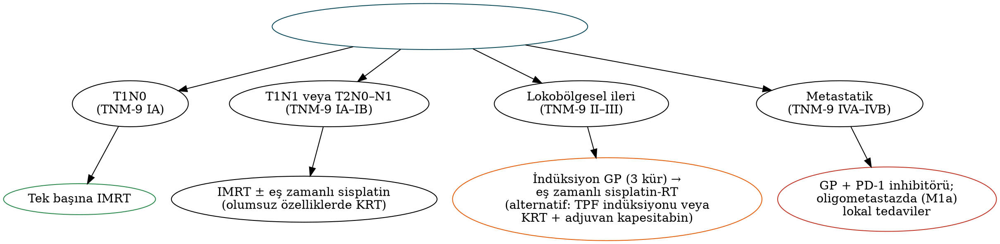

# Nazofarenks Karsinomu ve Nazofarenks Kitleleri

Nazofarenks karsinomu (NFK), coğrafi dağılımı, EBV ile ilişkisi, radyoterapiye duyarlılığı ve cerrahinin birincil tedavide yer almaması nedeniyle diğer baş-boyun kanserlerinden belirgin biçimde ayrılır. Ocak 2025'te yürürlüğe giren **TNM-9**, evre gruplarını köklü biçimde değiştirmiştir. Bu bölüm nazofarenks anatomisini, NFK'nin epidemiyolojisini, histolojisini, kliniğini, tanı ve evrelemesini, güncel tedavisini (indüksiyon kemoterapisi ve immünoterapi dahil) ve juvenil anjiyofibrom başta olmak üzere diğer nazofarenks kitlelerini ele alır.

## Nazofarenksin cerrahi anatomisi

- **Sınırlar:** Önde koanalar; arkada klivus ve C1–C2 (longus capitis); üstte sfenoid sinüs tabanı; altta yumuşak damak düzeyi; yanlarda **torus tubarius**, östaki borusu ağzı ve **Rosenmüller fossası (farengeal resesus)**.
- **Rosenmüller fossası**, torus tubariusun posterosuperiorunda yer alır ve **NFK'nin en sık başlangıç yeridir**. Endoskopide asimetri veya mukozal düzensizlik dikkatle aranmalıdır.
- **Morgagni sinüsü:** Superior konstriktörün üst kenarı ile kafa tabanı arasındaki aralık; östaki borusu ve levator veli palatini buradan geçer ve tümörün **parafarengeal boşluğa** yayılım yoludur.
- **Komşu kraniyal sinirler:** Foramen laserum ve petrosfenoidal yol üzerinden **kavernöz sinüs** (III, IV, V1, V2, **VI**); parafarengeal/poststiloid boşluk üzerinden **IX–XII** ve sempatik zincir; hipoglossal kanal (XII).
- **Lenfatik drenaj:** İlk durak **retrofarengeal (Rouvière) nodlar**; ardından seviye II ve **V (arka üçgen)**; bilateral yayılım sıktır.

## Nazofarenks karsinomu

### Epidemiyoloji ve risk faktörleri

- **Endemik bölgeler:** Güney Çin (Guangdong — "Kanton kanseri"), Güneydoğu Asya, Kuzey Afrika ve Akdeniz havzası (Türkiye'de ara insidans), Arktik bölge (İnuitler). Güney Çin'de insidans 100.000'de 20–30 iken Batı'da 1'in altındadır.
- Erkek/kadın oranı ≈2–3:1. Kuzey Afrika'da **bimodal yaş dağılımı** (adölesan ve 40–60 yaş).
- **Risk faktörleri:** **EBV**, çocuklukta **tuzlanmış balık** tüketimi (nitrozaminler), genetik yatkınlık (HLA haplotipleri, kromozom 6p), sigara, formaldehit ve ağaç tozu.

### Histoloji (DSÖ)

Tablo: Nazofarenks karsinomunun DSÖ histolojik sınıflaması
| Güncel ad | Eski DSÖ tipi | EBV ilişkisi | Özellik |
|---|---|---|---|
| **Keratinize SHK** | Tip I | Zayıf/değişken | Endemik olmayan bölgelerde daha sık; sigara/alkol ile ilişkili; radyoterapiye daha az duyarlı, prognoz daha kötü |
| **Nonkeratinize karsinom — diferansiye** | Tip II | Güçlü | — |
| **Nonkeratinize karsinom — indiferansiye** | Tip III ("lenfoepitelyoma") | **Çok güçlü** | **Endemik bölgelerde en sık**; radyoterapi ve kemoterapiye en duyarlı, prognoz en iyi |
| **Bazaloid SHK** | — | Değişken | Nadir |

EBV ilişkili tümörlerde **EBER in situ hibridizasyonu** pozitiftir; boyun metastazında EBER pozitifliği nazofarenks kökenini gösterir (Bölüm 6).

### Klinik bulgular

1. **Boyun kitlesi:** En sık başvuru bulgusudur; hastaların büyük çoğunluğunda tanıda nodal tutulum vardır ve **bilateral** tutulum sıktır. Tipik yerleşim seviye II ve **arka üçgen (V)**'dir.
2. **Burun bulguları:** Tek taraflı tıkanıklık, epistaksis, kanlı akıntı.
3. **Kulak bulguları:** Östaki borusu tıkanıklığına bağlı **erişkinde tek taraflı seröz otitis media**, iletim tipi işitme kaybı, kulak dolgunluğu.
4. **Kraniyal sinir paralizileri:** En sık **VI** (diplopi, lateral bakış kısıtlılığı) ve **V** (V2/V3 dağılımında uyuşukluk); kavernöz sinüs tutulumunda III ve IV; parafarengeal yayılımda IX–XII (Villaret, Collet–Sicard sendromları).
5. Baş ağrısı, trismus (pterigoid kas tutulumu).

!!! sinav "Sınav notu — Trotter triadı"
    **İletim tipi işitme kaybı (seröz otit), ipsilateral yumuşak damak hareketsizliği ve trigeminal (V3) nöralji/yüz ağrısı.** Erişkinde açıklanamayan **tek taraflı seröz otit** gören her hekimin **nazofarenksi endoskopik olarak değerlendirmesi** gerekir.

### Tanı

- **Endoskopi ve biyopsi** (Rosenmüller fossası dahil); şüpheli ancak normal görünümlü mukozadan da biyopsi.
- **MR**, T evrelemesinde **altın standarttır**: kafa tabanı ve kemik iliği invazyonu, intrakraniyal ve perinöral yayılım, parafarengeal ve retrofarengeal nodlar. BT kortikal kemik erozyonunu gösterir.
- **PET-BT:** İleri nodal hastalık ve lokal ileri evrede uzak metastaz taraması (en sık **kemik**, ardından akciğer ve karaciğer).
- **Plazma EBV DNA:** Tedavi öncesi düzey prognostiktir; tedavi sonrası saptanabilir olması nüks riskinin göstergesidir. Endemik bölgelerde tarama aracı olarak kullanılır (Hong Kong tarama çalışması, Chan NEJM 2017: taramada saptanan hastalar daha erken evrededir). **EBV VCA-IgA ve EBNA1-IgA** serolojisi tarama ve aile taramasında yardımcıdır.

### Evreleme: TNM-9 (AJCC Versiyon 9, Ocak 2025)

Tablo: Nazofarenks karsinomunda TNM-9 tanımları
| Kategori | Tanım |
|---|---|
| **T1** | Nazofarenkse sınırlı veya orofarenks ve/veya burun boşluğuna (septum dahil) uzanım; parafarengeal tutulum yok |
| **T2** | **Parafarengeal boşluk** ve/veya komşu yumuşak doku (medial pterigoid, lateral pterigoid, prevertebral kaslar) tutulumu |
| **T3** | Kemik yapıların kesin infiltrasyonu: **kafa tabanı (pterigoid yapılar dahil)**, **paranazal sinüsler**, **servikal vertebralar** |
| **T4** | **İntrakraniyal** uzanım, **kraniyal sinir** tutulumu (kesin radyolojik ve/veya klinik), **hipofarenks**, **orbita (inferior orbital fissür dahil)**, **parotis** veya lateral pterigoid kasın anterolateral yüzünün ötesinde yaygın yumuşak doku infiltrasyonu |
| **N1** | Tek taraflı servikal ve/veya tek ya da çift taraflı **retrofarengeal** nod; **≤6 cm**, **krikoid alt sınırının üstünde**, **ileri ENE yok** |
| **N2** | **Bilateral servikal** nodlar; ≤6 cm, krikoidin üstünde, ileri ENE yok |
| **N3** | **>6 cm** veya **krikoid alt sınırının altına uzanım** veya **ileri radyolojik ENE** (komşu kas, deri ve/veya nörovasküler demet tutulumu) |
| **M1a / M1b** | Uzak metastaz: **≤3 lezyon (M1a)** / **>3 lezyon (M1b)** |

Tablo: Nazofarenks karsinomunda evre grupları: TNM-8 ve TNM-9
| Evre | TNM-8 (2017) | TNM-9 (2025) |
|---|---|---|
| I | T1 N0 | **IA:** T1–T2 N0; **IB:** T1–T2 N1 |
| II | T1 N1; T2 N0–N1 | T1–T2 N2; T3 N0–N2 |
| III | T1–T2 N2; T3 N0–N2 | **T4 veya N3** (M0) |
| IVA | T4 veya N3 (M0) | **M1a** (≤3 lezyon) |
| IVB | M1 | **M1b** (>3 lezyon) |

!!! guncel "Güncel — TNM-9'un anlamı"
    T kategorileri **değişmemiştir**. Değişiklikler: (1) **ileri radyolojik ENE → N3**; (2) M1'in **lezyon sayısına** göre ikiye ayrılması; (3) eski evre III ve IVA'nın **evre II ve III'e** inmesi; (4) **evre IV'ün yalnızca metastatik hastalığa** ayrılması. Limitli ENE (yalnızca perinodal yağa uzanım) veya kaynaşmış nodlar N3 ölçütü değildir. TNM-8'e göre tasarlanmış tedavi çalışmalarını yorumlarken evre karşılıklarına dikkat edilmelidir (örneğin TNM-8 "evre III–IVA" ≈ TNM-9 "evre II–III").

### Tedavi

NFK'nin birincil tedavisi **radyoterapidir**; anatomik konum ve yüksek radyosensitivite nedeniyle primer cerrahi uygulanmaz.

- **Radyoterapi:** **IMRT**; primer ve tutulu nodlara **70 Gy**, bilateral elektif boyun ışınlaması (N0 boyunda seçilmiş olgularda yalnızca üst boyun). Proton tedavisi, kritik yapıların korunması açısından avantajlıdır.
- **Erken evre (TNM-8 evre I / TNM-9 IA'nın bir kısmı):** **Tek başına radyoterapi**.
- **TNM-8 evre II:** IMRT ± eş zamanlı sisplatin (T2N1 veya olumsuz özelliklerde KRT); IMRT döneminde T2N0'da kemoterapinin katkısı sınırlıdır.
- **Lokobölgesel ileri hastalık (TNM-8 evre III–IVA ≈ TNM-9 evre II–III):** **Eş zamanlı sisplatin-radyoterapi** + **indüksiyon** veya **adjuvan** kemoterapi.

Tablo: Nazofarenks karsinomunda dönüm noktası çalışmalar
| Çalışma | Tasarım | Sonuç |
|---|---|---|
| **Intergroup 0099** (Al-Sarraf, JCO 1998) | RT vs **eş zamanlı sisplatin-RT + adjuvan PF** | KRT kolunda belirgin sağkalım avantajı — KRT standardının temeli |
| **Sun ve ark.** (Lancet Oncol 2016) | **TPF indüksiyonu** + KRT vs KRT | Başarısızlıksız sağkalım ve genel sağkalımda iyileşme |
| **Zhang ve ark.** (NEJM 2019) | **Gemsitabin + sisplatin (GP) indüksiyonu** + KRT vs KRT | 3 yıllık nükssüz sağkalım ≈%85'e karşı ≈%77; uzun dönem güncellemede **genel sağkalım artışı** → **GP indüksiyonu + KRT tercih edilen yaklaşım** |
| **Chen ve ark.** (Lancet 2021) | KRT sonrası **metronomik kapesitabin** (1 yıl) vs izlem (yüksek riskli) | Başarısızlıksız sağkalımda iyileşme; iyi tolerans |
| **JUPITER-02** (Mai, Nat Med 2021) | R/M 1. basamak: GP ± **toripalimab** | Progresyonsuz ve genel sağkalımda iyileşme; **FDA onayı 2023** (NFK'de ilk immünoterapi) |
| CAPTAIN-1st, RATIONALE-309 | GP ± kamrelizumab / tislelizumab | Benzer şekilde pozitif |
| **CONTINUUM** (Lancet 2023) ve DIPPER | Lokal ileri hastalıkta sintilimab + KRT; adjuvan kamrelizumab | Olaysız sağkalımda iyileşme; kılavuzlara girişi sürmekte |

!!! kilavuz "NCCN — lokobölgesel ileri NFK"
    **İndüksiyon gemsitabin–sisplatin (3 kür) ardından eş zamanlı sisplatin-radyoterapi**, en güçlü kanıta sahip (kategori 1, tercih edilen) yaklaşımdır. Alternatifler: TPF indüksiyonu + KRT veya KRT + adjuvan kemoterapi (kapesitabin veya PF). Sisplatin kümülatif dozu **≥200 mg/m²** hedeflenir.

### Nüks ve metastatik hastalık

- **Lokal nüks:** Küçük ve rezeke edilebilir nükslerde (rT1–rT3 seçilmiş) **endoskopik nazofarenjektomi**; randomize çalışmada (Liu, Lancet Oncol 2021) rezeke edilebilir lokal nükste endoskopik cerrahi, IMRT ile reirradyasyona göre daha iyi genel sağkalım ve daha az toksisite sağlamıştır. Diğerlerinde reirradyasyon (IMRT, proton, brakiterapi, SBRT).
- **Boyun nüksü:** Kurtarma **boyun diseksiyonu** (ENE sıklığı nedeniyle sıklıkla radikal/modifiye radikal).
- **Uzak metastaz:** **GP + PD-1 inhibitörü** birinci basamak; oligometastatik hastalıkta (özellikle **M1a**) primer bölgeye ve metastazlara lokal tedavi ile uzun sağkalım mümkündür — TNM-9'daki M1a/M1b ayrımının klinik dayanağı budur.

### Geç toksisiteler

Kserostomi, **sensörinöral işitme kaybı** (sisplatin + koklea dozu), radyoterapi sonrası **kalıcı seröz otit** (ventilasyon tüpü sonrası kronik akıntı riski nedeniyle bireysel karar), **temporal lob nekrozu** (kortikosteroid, bevasizumab), kraniyal nöropati (en sık XII), **hipopituitarizm**, trismus, karotis stenozu, kafa tabanı osteoradyonekrozu, disfaji ve boyun fibrozu.

IMRT döneminde endemik serilerde 5 yıllık genel sağkalım **%80–90**'a ulaşmıştır; tedavi öncesi EBV DNA düzeyi, N kategorisi ve histoloji önemli prognostik faktörlerdir.

## Juvenil nazofarengeal anjiyofibrom

- **Hasta profili:** Neredeyse yalnızca **adölesan erkekler** (10–25 yaş); androjen reseptörü pozitif, benign ancak **lokal agresif** vasküler tümör. **Familyal adenomatöz polipozis (APC)** hastalarında risk belirgin artmıştır.
- **Köken:** **Sfenopalatin foramen** çevresi (posterolateral burun duvarı); **pterigopalatin fossaya** (maksilla arka duvarının öne bükülmesi — **Holman–Miller bulgusu**), infratemporal fossaya, orbitaya ve intrakraniyal bölgeye (orta fossa, kavernöz sinüs) yayılır.
- **Klinik:** Adölesan erkekte **tek taraflı burun tıkanıklığı ve tekrarlayan şiddetli epistaksis**; ileri olgularda yüzde şişlik ve proptozis.
- **Tanı:** Kontrastlı **BT ve MR** (tipik görünüm ve yerleşim tanı koydurucudur). **Biyopsi yapılmaz** (masif kanama riski).
- **Anjiyografi ve ameliyat öncesi embolizasyon** (ameliyattan 24–72 saat önce): Başlıca besleyici **internal maksiller arterdir**; asendan farengeal arter ve intrakraniyal uzanımda İKA dalları katılabilir.
- **Evreleme:** Radkowski (1996), Andrews/Fisch ve **UPMC** (Snyderman, 2010; embolizasyon sonrası İKA beslenmesi ve rezidü vaskülariteyi içerir).
- **Tedavi:** **Endoskopik rezeksiyon**, çoğu evrede standart yaklaşımdır; çok yaygın tümörlerde açık yaklaşımlar (midfasiyal degloving, transpalatal, lateral rinotomi, infratemporal fossa). Nüksler çoğunlukla **bazisfenoid ve pterigoid (vidian) kanal** çevresindeki rezidü dokudan gelişir; bu bölgenin drillenmesi önerilir. Rezeke edilemeyen intrakraniyal hastalıkta radyoterapi.

!!! dikkat "Tuzak"
    Adölesan erkekte tek taraflı burun tıkanıklığı ve epistaksis ile başvuran nazofarenks kitlesine **ofis koşullarında biyopsi alınmamalıdır**. Önce görüntüleme; tanı klinik–radyolojik konur.

## Diğer nazofarenks kitleleri

Tablo: Nazofarenks kitlelerinin ayırıcı tanısı
| Lezyon | Özellik |
|---|---|
| **Adenoid hipertrofisi** | Çocuklarda fizyolojik; **erişkinde** belirgin adenoid dokusu HIV, lenfoma ve NFK açısından araştırılmalıdır |
| **Tornwaldt kisti** | **Orta hatta**, farengeal bursanın (notokord kalıntısı) kisti; MR'de rastlantısal; enfekte olursa (Tornwaldt hastalığı) kötü koku, oksipital baş ağrısı, postnazal akıntı → endoskopik marsupyalizasyon |
| Retansiyon kisti | Lateral yerleşimli, küçük, mukus dolu |
| **Lenfoma** | Waldeyer halkasında DLBCL; ekstranodal NK/T hücreli lenfoma (nazal tip; EBV+; orta hat destrüksiyonu) |
| Minör tükürük bezi tümörleri | Adenoid kistik karsinom, pleomorfik adenom |
| **Kordom** | **Klivus** kaynaklı, orta hat, kemik destrüksiyonu, T2'de belirgin hiperintens; fizaliferöz hücreler, **brakiüri** pozitif; cerrahi + yüksek doz (proton) radyoterapi |
| Menenjiyom, kraniyofarenjiyom | Kafa tabanı/intrakraniyal uzanım |
| **Ensefalosel** | Çocukta orta hatta kitle; ağlamakla büyür (Furstenberg testi); **biyopsi kontrendike** (BOS kaçağı, menenjit) → MR |
| Juvenil anjiyofibrom | Yukarıda |

!!! ozet "Kritik noktalar"
    - NFK en sık **Rosenmüller fossasından** başlar; ilk nodal durak **retrofarengeal nodlardır**; seviye II ve **V** tutulumu ve bilateral yayılım sıktır.
    - Endemik bölgelerde **nonkeratinize indiferansiye karsinom** (EBV güçlü ilişkili, prognozu en iyi) baskındır; **EBER** pozitifliği nazofarenks kökenini gösterir.
    - Klinik: boyun kitlesi (en sık), burun tıkanıklığı/epistaksis, **erişkinde tek taraflı seröz otit**, **VI** ve V paralizisi; **Trotter triadı**.
    - MR T evrelemesinde altın standarttır; **plazma EBV DNA** prognoz, izlem ve taramada kullanılır.
    - **TNM-9 (2025):** T değişmedi; **ileri iENE → N3**; **M1a ≤3 / M1b >3 lezyon**; evreler **IA T1–2N0, IB T1–2N1, II T1–2N2/T3N0–2, III T4 veya N3, IVA M1a, IVB M1b**.
    - Tedavi **radyoterapidir** (IMRT 70 Gy). Erken evre RT; lokobölgesel ileri hastalıkta **GP indüksiyonu + sisplatin-RT** (Zhang NEJM 2019) tercih edilir; TPF indüksiyonu ve adjuvan kapesitabin alternatiflerdir. Al-Sarraf (Intergroup 0099) KRT standardını kurmuştur.
    - R/M hastalıkta **GP + PD-1 inhibitörü** (toripalimab — JUPITER-02, FDA 2023). Rezeke edilebilir lokal nükste **endoskopik nazofarenjektomi**, reirradyasyondan üstündür.
    - **JNA:** adölesan erkek, tek taraflı tıkanıklık + şiddetli epistaksis, sfenopalatin foramen, **Holman–Miller bulgusu**; **biyopsi yok**; internal maksiller arter embolizasyonu + endoskopik rezeksiyon.
    - Orta hat kitlelerinde Tornwaldt kisti, kordom (klivus, brakiüri) ve çocukta **ensefalosel** (biyopsi kontrendike) akılda tutulmalıdır.
