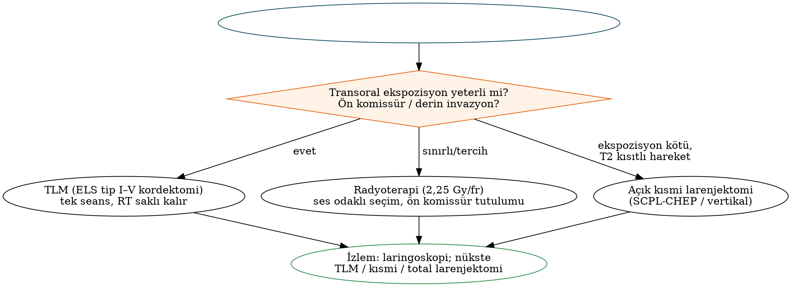

# Larenks Kanseri

Larenks kanseri, Türkiye'de ve birçok ülkede en sık görülen baş-boyun kanseridir ve neredeyse tamamen **sigarayla** ilişkilidir. Tedavisi, onkolojik kontrolü sağlarken **ses, yutma ve doğal havayolunu** korumak gibi zorlu bir dengeyi gerektirir. Bu bölüm larenks kanserinin yayılım yollarını, AJCC 8 evrelemesini, erken evre glottik ve supraglottik kanserde transoral cerrahi ile radyoterapiyi, açık kısmi larenjektomileri, **organ koruma** çalışmalarını, total larenjektomiyi ve ses rehabilitasyonunu ele alır. Anatomik temel için Bölüm 18'e bakınız.

## Epidemiyoloji ve klinik

- Erkeklerde belirgin olarak sıktır (50–70 yaş); **sigara** en güçlü risk faktörüdür, alkol özellikle supraglottik kanserde katkı sağlar. HPV'nin rolü sınırlıdır.
- **Glottik** kanser, birçok seride en sık alt bölgedir ve **erken ses kısıklığı** ile kendini gösterdiği için genellikle erken evrede tanınır. **Supraglottik** kanser sessiz ilerler: disfaji, odinofaji, **refere otalji**, boğuk ses ve **boyun kitlesi** (tanıda nodal metastaz %25–50, bilateral risk yüksek). **Subglottik** kanser nadirdir (<%5); dispne/stridor ile geç tanınır ve paratrakeal nodlara yayılır.

## Yayılım yolları

- **Glottik tümörler:** Kord boyunca yüzeyel yayılım; **ön komissür** tutulumu — **Broyles ligamenti** (vokal ligamentlerin tiroid kıkırdağa perikondriyumsuz tutunduğu bölge) kıkırdak invazyonuna kısa yol oluşturur. Derinde **tiroaritenoid kas** invazyonu kord hareketini kısıtlar (**T2**); **paraglottik boşluk** invazyonu kord fiksasyonuna yol açar (**T3**). **Subglottik uzanım** (önde ≈1 cm, arkada ≈5 mm'yi aşması) kısmi larenjektomi seçeneklerini sınırlar.
- **Transglottik tümörler:** Ventrikülü aşarak paraglottik boşluk yoluyla supraglottis ve glottisi birlikte tutar; nodal metastaz ve kıkırdak invazyonu daha sıktır.
- **Supraglottik tümörler:** Epiglot deliklerinden **preepiglottik boşluğa** (T3), ariepiglottik kıvrımdan **piriform sinüse** ("marjinal bölge"), ventriküler banttan paraglottik boşluğa yayılır.
- **Kıkırdak invazyonu** çoğunlukla **kemikleşmiş alanlarda** başlar; iç korteks tutulumu **T3**, dış korteksin aşılması **T4a**'dır.

## Değerlendirme

- Laringoskopi ve **videostroboskopi** (mukozal dalganın kaybı derin invazyonu düşündürür), **NBI**.
- **Mikrolaringoskopi ve biyopsi**; açılı teleskoplarla haritalama (ön komissür, ventrikül, subglottis).
- **BT:** Kıkırdak invazyonu (skleroz, erozyon, liziz, ekstralarengeal yayılım), preepiglottik/paraglottik yağ dokusunun silinmesi, nodlar. **MR** kıkırdak invazyonunda daha duyarlı ancak enflamasyon nedeniyle daha az özgüldür.
- İleri evrede PET-BT ve toraks BT; ameliyat öncesi **solunum fonksiyonu** (kısmi larenjektomi adaylarında aspirasyonu tolere edebilme).

## AJCC 8 evrelemesi

Tablo: AJCC 8 — larenks T kategorisi
| T | Supraglottis | Glottis | Subglottis |
|---|---|---|---|
| **T1** | Tek alt bölgeye sınırlı, kord hareketi normal | Kord(lar)a sınırlı (ön/arka komissür tutulabilir), hareket normal — **T1a tek kord, T1b iki kord** | Subglottise sınırlı |
| **T2** | Supraglottisin >1 komşu alt bölgesi, glottis veya supraglottis dışı bölge (dil kökü, vallekula, piriform sinüs medial duvarı) mukozası; **larenks fiksasyonu yok** | **Supraglottis ve/veya subglottise uzanım** ve/veya **kord hareketinde kısıtlılık** | Kord(lar)a uzanım; hareket normal veya kısıtlı |
| **T3** | Larenkse sınırlı + **kord fiksasyonu** ve/veya **postkrikoid bölge, preepiglottik boşluk, paraglottik boşluk** ve/veya **tiroid kıkırdak iç korteksi** | Larenkse sınırlı + **kord fiksasyonu** ve/veya **paraglottik boşluk** ve/veya **tiroid kıkırdak iç korteksi** | Larenkse sınırlı + kord fiksasyonu ve/veya paraglottik boşluk ve/veya tiroid kıkırdak iç korteksi |
| **T4a** | **Tiroid kıkırdak dış korteksini aşma** ve/veya larenks dışı dokular (trakea, derin ekstrensek dil kası dahil boyun yumuşak dokuları, strap kaslar, tiroid, özofagus) | Supraglottisle aynı | **Krikoid veya tiroid kıkırdak** invazyonu ve/veya larenks dışı dokular |
| **T4b** | **Prevertebral boşluk**, **karotis arteri sarma**, **mediastinal yapılar** | Aynı | Aynı |

N kategorisi ve evre grupları HPV ilişkisiz kanserlerle ortaktır (Bölüm 9).

!!! sinav "Sınav notu — sık sorulanlar"
    - **Kord hareketinde kısıtlılık → T2**; **fiksasyon → T3**.
    - **Preepiglottik veya paraglottik boşluk tutulumu → T3** (kord hareketinden bağımsız).
    - Tiroid kıkırdak **iç korteks → T3**, **dış korteksi aşma → T4a**. Subglottik kanserde **krikoid invazyonu T4a**'dır.
    - Erken glottik kanser (T1N0) lenfatik yoksunluk nedeniyle **nadiren metastaz yapar**; elektif boyun tedavisi gerekmez. Supraglottik kanserde ise cN0'da bile **bilateral elektif boyun tedavisi** gerekir.

## Erken glottik kanser (Tis, T1, T2)

### Seçenekler

- **Karsinoma in situ:** Endoskopik eksizyon (CO₂ lazer) veya radyoterapi; yakın izlem.
- **T1–T2:** **Transoral lazer mikrocerrahi (TLM)** veya **radyoterapi** (birbirine eşdeğer lokal kontrol); daha az sıklıkla açık kısmi larenjektomi.
  - **Radyoterapi:** T1'de fraksiyon başına **2,25 Gy** (örn. 63 Gy/28 fraksiyon), T2'de 65,25 Gy/29 fraksiyon. Yamazaki'nin randomize çalışmasında 2,25 Gy fraksiyonlar, 2 Gy'e göre daha iyi lokal kontrol sağlamıştır. Elektif boyun ışınlaması yapılmaz.
  - **TLM:** Tek seans, tekrarlanabilir, radyoterapiyi gelecekteki bir nüks/ikinci primer için saklar, maliyet avantajlı. Küçük rezeksiyonlarda (tip I–II kordektomi) ses sonuçları radyoterapiye benzer; derin rezeksiyonlarda (tip III–V) ses daha kötü olabilir.
  - Lokal kontrol T1'de ≈%85–95'tir; **ön komissür tutulumu** ve **kısıtlı kord hareketi (T2)** her iki yöntemde de kontrolü düşürür.
- Radyoterapi sonrası nüksler TLM, açık kısmi veya total larenjektomi ile kurtarılabilir.

Tablo: Avrupa Larengoloji Derneği (ELS) endoskopik kordektomi sınıflaması
| Tip | Rezeksiyon düzeyi |
|---|---|
| **I** | Subepitelyal (yüzeyel lamina propria) |
| **II** | Subligamentöz (vokal ligament dahil) |
| **III** | Transmüsküler (vokalis kasının bir kısmı) |
| **IV** | Total (tiroid kıkırdak iç perikondriyumuna kadar) |
| **Va** | Genişletilmiş — karşı kordu (ön komissür dahil) içeren |
| **Vb** | Aritenoidi içeren |
| **Vc** | Subglottisi içeren |
| **Vd** | Ventrikülü içeren |
| **VI** | Ön komissürektomi + bilateral ön kordektomi (ön komissür kaynaklı tümörler) |

## Erken supraglottik kanser

T1–T2 N0 supraglottik kanserde seçenekler: **radyoterapi** (primer + **bilateral elektif boyun**) veya **transoral (TLM/TORS) ya da açık supraglottik larenjektomi + bilateral boyun diseksiyonu (II–IV)** ± adjuvan tedavi.

**Horizontal (açık) supraglottik larenjektomi** (Alonso, 1947; ELS sınıflamasında **açık parsiyel horizontal larenjektomi — OPHL tip I**): epiglot, preepiglottik boşluk, ariepiglottik kıvrımlar ve ventriküler bantlar ventrikül düzeyinin üstünden çıkarılır; **gerçek kordlar ve aritenoidler korunur**.

- Uygun aday: T1–T2 (ve yalnızca preepiglottik boşluk tutulumlu seçilmiş T3), **kord hareketi normal**, ön komissür/ventrikül ve tiroid kıkırdak tutulumu yok, postkrikoid alan sağlam, dil kökü tutulumu sınırlı ve **yeterli akciğer rezervi** (geçici aspirasyonu tolere edebilmek için).
- Ameliyat sonrası geçici trakeotomi ve yoğun yutma rehabilitasyonu gerekir.

## Açık kısmi larenjektomiler

Tablo: Başlıca açık kısmi larenjektomiler
| Ameliyat | Çıkarılan | Korunan | Endikasyon | Kontrendikasyon |
|---|---|---|---|---|
| **Supraglottik (OPHL I)** | Epiglot, preepiglottik boşluk, AE kıvrımlar, ventriküler bantlar | Gerçek kordlar, aritenoidler, (hiyoid) | T1–T2 supraglottik, seçilmiş T3 (preepiglottik) | Kord fiksasyonu, ventrikül/ön komissür, kıkırdak invazyonu, kötü akciğer rezervi |
| **Suprakrikoid — CHEP** (OPHL II) | Tiroid kıkırdağın tamamı, iki taraf gerçek ve yalancı kordlar, paraglottik boşluklar, ± bir aritenoid | **Krikoid, hiyoid, epiglot**, en az bir **krikoaritenoid ünite** | Glottik T1b (ön komissür), **T2–T3** (paraglottik invazyona bağlı kısıtlılık/fiksasyon, **aritenoid hareketli**) | **Aritenoid fiksasyonu**, subglottik uzanım (önde >1 cm, arkada >5 mm), **krikoid invazyonu**, ekstralarengeal yayılım, kötü akciğer rezervi |
| **Suprakrikoid — CHP** (OPHL II) | CHEP + **epiglot ve preepiglottik boşluk** | Krikoid, hiyoid, en az bir krikoaritenoid ünite | Supraglottik veya transglottik tümör (glottis uzanımlı) | Yukarıdakiler + hiyoid/vallekula tutulumu |
| **Supratrakeal** (OPHL III) | OPHL II + krikoidin bir kısmı | Bir krikoaritenoid ünite | Sınırlı subglottik uzanım | — |
| Vertikal (hemi)larenjektomi | Bir kord ve tiroid laminasının bir bölümü | Karşı kord | Tarihsel olarak T1–T2 glottik | Günümüzde büyük ölçüde TLM/RT ile yer değiştirmiştir |
| Near-total larenjektomi (Pearson) | Larenksin büyük kısmı | Fonasyon için miyomukozal şant | Seçilmiş ileri tümörler | Kalıcı trakeostoma gerekir |

!!! sinav "Sınav notu — krikoaritenoid ünite"
    Suprakrikoid larenjektominin olmazsa olmazı, en az bir **fonksiyonel krikoaritenoid ünitenin** (aritenoid + krikoid + ilgili kaslar + RLS ve SLS) korunmasıdır. Bu nedenle **aritenoid fiksasyonu** (krikoaritenoid eklem tutulumu) ve **krikoid invazyonu** kesin kontrendikasyondur. Rekonstrüksiyonda krikoid hiyoide (ve epiglota) yaklaştırılır: CHEP (epiglot korunur) veya CHP (epiglot çıkarılır). Hasta stomasız konuşur ve yutar; ses kaba ancak işlevseldir.

## İleri evre larenks kanseri (T3–T4)

### Organ koruma çalışmaları

Tablo: Larenks korumada dönüm noktası çalışmalar
| Çalışma | Hasta grubu | Kollar | Ana sonuç |
|---|---|---|---|
| **VA Larenks Çalışması** (NEJM 1991) | Evre III–IV larenks | İndüksiyon **PF** → yanıt verenlere RT (yanıtsızlara total larenjektomi) vs **total larenjektomi + RT** | 2 yıllık sağkalım **eşdeğer** (≈%68); kemoterapi kolunda **larenks ≈%64 korundu**; T4'lerde kurtarma larenjektomisi oranı yüksek |
| **RTOG 91-11** (Forastiere, NEJM 2003; uzun dönem JCO 2013) | Evre III–IV (T2–T3 ve düşük hacimli T4; büyük kıkırdak destrüksiyonu ve >1 cm dil kökü tutulumu dışlandı) | İndüksiyon PF → RT vs **eş zamanlı sisplatin-RT** vs tek başına RT | **Larenks koruma en yüksek eş zamanlı KRT kolunda** (10 yılda ≈%82 vs %68 vs %64); larenjektomisiz sağkalımda KRT ve indüksiyon benzer ve RT'den iyi; 10 yıllık genel sağkalımda fark yok (KRT kolunda kansere bağlı olmayan ölümlerde artış eğilimi) |
| **GORTEC 2000-01** (Pointreau, JNCI 2009) | Larenks/hipofarenks, total larenjektomi adayları | İndüksiyon **TPF vs PF** | TPF ile **larenks koruma daha yüksek** |
| **TREMPLIN** (Lefebvre, JCO 2013) | TPF'ye yanıt verenler | RT + sisplatin vs RT + setuksimab | Benzer larenks koruma |
| **EORTC 24891** (Lefebvre, 1996) | Hipofarenks (piriform sinüs, AE kıvrım) | İndüksiyon PF → RT vs cerrahi + RT | Eşdeğer sağkalım, larenks korunması (Bölüm 17) |

!!! kilavuz "ASCO larenks koruma kılavuzu (2018 güncellemesi) — özet"
    - **T1–T2:** Larenks koruyucu cerrahi (TLM, açık kısmi) veya radyoterapi; uygun hastada larenks korunmalıdır.
    - **T3–T4a (seçilmiş):** **Eş zamanlı sisplatin-RT**, **indüksiyon kemoterapisi + yanıta göre RT/KRT** veya **total larenjektomi + adjuvan tedavi**; hasta tercihleri ve fonksiyon tartışılmalıdır.
    - **Kıkırdağı aşan ve/veya larenks dışı yumuşak dokuya uzanan T4a** tümörlerde ve **tedavi öncesi işlevsiz larenkste** (ağır aspirasyon, trakeotomiye bağımlılık) **total larenjektomi** daha iyi sonuç verir.
    - 70 yaş üstü veya komorbid hastalarda eş zamanlı kemoterapinin faydası sınırlıdır.

!!! dikkat "Tuzak — T4a larenks kanserinde organ koruma"
    Büyük kıkırdak destrüksiyonu ve ekstralarengeal yayılımı olan T4a tümörler, organ koruma çalışmalarından büyük ölçüde dışlanmıştır. Kayıt verileri, bu hastalarda cerrahi dışı tedavinin yaygınlaşmasıyla sağkalımın kötüleştiğini düşündürmektedir. **Hacimli T4a → primer total larenjektomi + adjuvan (kemo)radyoterapi.**

### Total larenjektomi

**Total larenjektomi** (ilk kez Billroth, 1873) larenksin tamamının hiyoidle (genellikle) birlikte çıkarılması, farenksin kapatılması ve **kalıcı trakeostoma** oluşturulmasıdır; solunum ve sindirim yolları kalıcı olarak ayrılır.

- Genellikle **bilateral boyun diseksiyonu** (II–IV); subglottik/transglottik uzanımda ve T4'te **paratrakeal (VI) diseksiyon** ve **ipsilateral hemitiroidektomi** (veya total tiroidektomi) eklenir.
- Farenks kapatma: primer (T veya düz hat) veya flep ile.
- **Primer trakeoözofageal ponksiyon** (ses protezi) aynı seansta yapılabilir.

### Kurtarma (salvage) total larenjektomisi ve farengokutanöz fistül

(Kemo)radyoterapi sonrası nükste total larenjektomi, komplikasyon oranı yüksek bir ameliyattır. **Farengokutanöz fistül** primer larenjektomide ≈%10 iken kurtarma cerrahisinde **≈%25–35**'e ulaşabilir.

- **Risk faktörleri:** Önceki (kemo)radyoterapi, düşük albümin ve hemoglobin, **hipotiroidi**, pozitif cerrahi sınır, eş zamanlı boyun diseksiyonu, geniş farenks rezeksiyonu.
- **Önleme:** Farenks kapamasının üzerine **vaskülarize doku (onlay PMMF veya serbest flep)** konması fistül oranını anlamlı azaltır; ameliyat öncesi hipotiroidinin ve beslenmenin düzeltilmesi.
- **Tedavi:** Çoğu fistül konservatif tedaviyle (ağızdan alımın kesilmesi, basınçlı pansuman, antibiyotik, yara bakımı) kapanır; büyük veya inatçı fistüllerde flep ile onarım. **Karotisin açığa çıkması ve rüptürü** açısından izlem önemlidir.

### Stomal nüks

Trakeostoma çevresinde tümör nüksüdür ve prognozu kötüdür. **Risk faktörleri:** subglottik uzanım, **ameliyat öncesi trakeotomi**, paratrakeal nod tutulumu, yetersiz sınır. **Önleme:** paratrakeal diseksiyon, acil trakeotomi gerekirse larenjektominin kısa sürede yapılması, gerektiğinde stomanın radyoterapi alanına alınması. Sisson sınıflaması stomanın üst/alt yarı ve özofagus/mediasten tutulumuna göre evreler.

## Total larenjektomi sonrası fizyoloji ve ses rehabilitasyonu

**Fizyolojik değişiklikler:** Burun hava akımının kaybına bağlı **koku duyusunda azalma** ve nemlendirme kaybı (kabuklanma, trakeit), Valsalva yapamama (kabızlık, ağır kaldırma güçlüğü), disfaji (psödoepiglot, striktür) ve hipotiroidi (tiroidektomi ± radyoterapi).

Tablo: Total larenjektomi sonrası ses rehabilitasyonu seçenekleri
| Yöntem | Özellik |
|---|---|
| **Trakeoözofageal ponksiyon (TEP) + ses protezi** (Singer–Blom, 1980) | **Altın standart**; primer veya sekonder ponksiyon; tek yönlü valf; başarı ≈%80–90; akıcı ve doğala yakın ses |
| Özofagus konuşması | Hava yutularak farengoözofageal segmentin titreştirilmesi; öğrenmesi zor, başarı düşük |
| Elektrolarenks | Boyun veya ağız içi cihaz; mekanik ses; hızlı öğrenilir |

Tablo: Ses protezi sorunları ve çözümleri
| Sorun | Neden | Çözüm |
|---|---|---|
| **Protezin içinden sızıntı** | Valf yetmezliği, **kandida kolonizasyonu** | Protez değişimi, antifungal tedavi |
| **Protezin çevresinden sızıntı** | Ponksiyonun genişlemesi | Daha kısa/geniş flanşlı protez, büzme dikişi, enjeksiyon, geçici çıkarma |
| Ses üretememe / zorlu ses | **Farengoözofageal spazm** | **Botulinum toksini**; önlemede larenjektomi sırasında farengeal pleksus nörektomisi veya krikofarengeal miyotomi |
| Protezin yerinden çıkması/aspirasyonu | — | Bronkoskopik çıkarma |
| Granülasyon | — | Koterizasyon, protez boyutunun ayarlanması |

**Isı–nem değiştirici (HME) filtreler** öksürük, balgam ve trakeit şikâyetlerini azaltır. Koku rehabilitasyonunda burundan hava akımı oluşturma manevrası ("kibar esneme") kullanılır.

## Larenksin diğer malign tümörleri

- **Verrüköz karsinom:** Çoğunlukla glottiste; nodal metastaz nadir; **TLM/cerrahi eksizyon**.
- **İğsi hücreli (sarkomatoid) karsinom:** Polipoid kitle.
- **Nöroendokrin neoplaziler:** İyi diferansiye (tipik karsinoid), **orta derecede diferansiye (atipik karsinoid — larenksin en sık nöroendokrin tümörü**; supraglottis/aritenoid; cerrahi) ve kötü diferansiye (küçük hücreli — sistemik kemoterapi + radyoterapi).
- **Kondrosarkom:** Larenksin **en sık sarkomu**; çoğunlukla **krikoid arka laminasında**, düşük dereceli; fonksiyon koruyucu konservatif cerrahi.

## Prognoz

Erken glottik kanserde 5 yıllık sağkalım **%85–95**, ileri evre larenks kanserinde **%40–60** civarındadır. Aynı evrede **supraglottik** kanserin prognozu glottik kanserden kötüdür (lenfatik yayılım). En önemli prognostik faktörler T ve N kategorisi, ENE, cerrahi sınır ve komorbiditedir.

!!! ozet "Kritik noktalar"
    - Glottik kanser erken ses kısıklığıyla tanınır ve lenfatik yoksunluk nedeniyle erken evrede nadiren metastaz yapar; supraglottik kanser sessizdir ve cN0'da bile **bilateral boyun tedavisi** gerektirir.
    - **Broyles ligamenti** ön komissürde kıkırdak invazyonu yoludur; paraglottik boşluk transglottik yayılım ve fiksasyonun, preepiglottik boşluk supraglottik yayılımın yoludur.
    - AJCC 8: **kısıtlı hareket T2, fiksasyon T3; preepiglottik/paraglottik boşluk ve iç korteks T3; dış korteks ve larenks dışı yayılım T4a**; T1a tek kord, T1b iki kord.
    - Erken glottik kanser: **TLM veya RT** (2,25 Gy/fr) eşdeğer kontrol; ELS kordektomi tipleri I–VI. Ön komissür ve kısıtlı hareket kontrolü düşürür.
    - **SCPL (CHEP/CHP)** için en az bir **krikoaritenoid ünite** korunmalı; **aritenoid fiksasyonu ve krikoid invazyonu kontrendikasyon**.
    - **VA 1991:** indüksiyon PF ile organ koruma, eşdeğer sağkalım. **RTOG 91-11:** larenks korumada **eş zamanlı sisplatin-RT** en iyi. **GORTEC 2000-01:** TPF > PF.
    - **Hacimli T4a ve işlevsiz larenks → primer total larenjektomi** + adjuvan tedavi.
    - Kurtarma larenjektomisinde fistül %25–35; **onlay vaskülarize flep** riski azaltır. Stomal nüks riski subglottik uzanım ve ameliyat öncesi trakeotomiyle artar.
    - Ses rehabilitasyonunda altın standart **TEP + ses protezi**; protez içinden sızıntı (valf/kandida) → değişim, çevresinden sızıntı (ponksiyon genişlemesi) → boyut ayarı; farengoözofageal spazm → **botulinum**.
