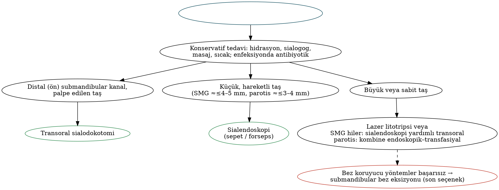

# Tükürük Bezlerinin Non-neoplastik Hastalıkları

Tükürük bezi hastalıklarının büyük çoğunluğu enflamatuvar ve obstrüktiftir. Sialendoskopinin yaygınlaşmasıyla birlikte tedavi felsefesi, bezin çıkarılmasından **bezin korunmasına** doğru değişmiştir. Bu bölüm tükürük bezlerinin anatomisi ve fizyolojisini, akut ve kronik sialadenitleri, sialolitiyazisi, Sjögren sendromu ve IgG4 ilişkili hastalık başta olmak üzere sistemik hastalıkları, kserostomi, sialore ve Frey sendromunu ele alır. Tükürük bezi tümörleri Bölüm 23'te işlenmiştir.

## Anatomi ve fizyoloji

Tablo: Majör tükürük bezlerinin karşılaştırması
| Özellik | Parotis | Submandibular | Sublingual |
|---|---|---|---|
| Salgı tipi | **Seröz** | **Mikst** (seröz ağırlıklı seromüköz) | **Müköz** |
| Kanal | **Stensen** (≈5–7 cm; masseterin üzerinden geçip buksinatörü deler, **üst 2. molar** karşısında açılır) | **Wharton** (≈5 cm; milohiyoidin arka kenarını dolanır, **sublingual karünkülde** açılır) | **Rivinus** kanalları (çok sayıda) ve **Bartholin** kanalı (Wharton'a açılır) |
| Parasempatik yol | İnferior salivatuar çekirdek → **IX** → timpanik (Jacobson) sinir → **küçük petrozal sinir** → **otik ganglion** → **aurikülotemporal sinir (V3)** | Süperior salivatuar çekirdek → **VII (nervus intermedius)** → **korda timpani** → lingual sinir → **submandibular ganglion** | Submandibular ile aynı |
| Kritik komşuluk | **Fasiyal sinir** bezi yüzeyel (≈%80) ve derin lob olarak cerrahi açıdan ayırır; retromandibular ven ve EKA bez içinde; intraparotid lenf nodları | **Marjinal mandibular sinir** (yüzeyde), **lingual sinir** (kanalı çaprazlar), **XII** (derinde), fasiyal arter ve ven | Ağız tabanı, lingual sinir, Wharton kanalı |

**Minör tükürük bezleri** (600–1000 adet) çoğunlukla müköz yapıdadır ve en yoğun olarak **sert–yumuşak damak bileşkesinde**, dudaklarda ve bukkal mukozada bulunur. Lingual sinirin Wharton kanalıyla ilişkisi klasiktir: sinir kanalın önce **lateralinden**, sonra **altından** geçerek **medialine** ulaşır.

**Tükürük salgısı:** Günde ≈1–1,5 litre. İstirahatte salgının çoğunu (≈%65–70) **submandibular bez**, uyarılmış durumda ise önemli kısmını **parotis** sağlar. **İki aşamalı hipotez:** asinüslerde izotonik primer salgı oluşur; kanallarda Na⁺ ve Cl⁻ geri emilir, K⁺ ve HCO₃⁻ salgılanır → son tükürük **hipotoniktir**. Tükürük amilaz (parotis), müsin, lizozim, IgA, laktoferrin ve histatinler içerir; bikarbonat tampon görevi görür. Sempatik uyarı vazokonstriksiyon ve koyu tükürük, parasempatik uyarı bol sulu tükürük oluşturur.

## Değerlendirme

- **Öykü:** Yemekle ilişkili şişlik ve ağrı (**sialik kolik**) obstrüksiyonu düşündürür; ağız ve göz kuruluğu, sistemik semptomlar, ilaçlar, radyoterapi/RAI öyküsü.
- **Muayene:** Bimanuel palpasyon, kanal ağzının incelenmesi ve bez masajıyla **pü** veya berrak tükürük gelişinin değerlendirilmesi.
- **Görüntüleme:** **USG** ilk basamaktır (taş, apse, kitle, Sjögren'deki parankimal değişiklikler). Taş için **kontrastsız BT** çok duyarlıdır. Kitlelerde MR. Duktal patolojide **MR sialografi**; konvansiyonel sialografi (Sjögren'de "kar fırtınası" görünümlü sialektazi) giderek terk edilmektedir. Sintigrafi bez fonksiyonunu gösterir (Warthin tümörü ve onkositom aktivite tutar).
- **Sialendoskopi:** Hem tanısal hem tedavi edici.
- **Laboratuvar:** Amilaz, anti-SSA/Ro ve anti-SSB/La, ANA, RF, IgG4, ACE, HIV ve HCV; **minör tükürük bezi (dudak) biyopsisi**.

## Akut sialadenitler

### Akut süpüratif sialadenit

En sık **parotiste** görülür. Risk faktörleri: ileri yaş, **dehidratasyon**, ameliyat sonrası dönem (klasik olarak batın cerrahisi sonrası), düşkünlük, kötü ağız hijyeni, antikolinerjik ve diüretik ilaçlar, Sjögren sendromu. En sık etken **Staphylococcus aureus**'tur (MRSA dahil); streptokoklar, anaeroblar ve hastanede yatan hastalarda Gram negatif basiller.

- **Bulgular:** Ağrılı, kızarık, sıcak şişlik; bez masajıyla **Stensen kanalından pü gelmesi**.
- **Tedavi:** Hidrasyon, **sialogoglar** (limon şekeri), sıcak uygulama, masaj, ağız hijyeni ve stafilokokları kapsayan IV antibiyotik (ampisilin-sulbaktam ± vankomisin). 48–72 saatte yanıt yoksa **USG/BT ile apse** araştırılır; apse varsa USG eşliğinde aspirasyon veya parotidektomi insizyonuyla flep kaldırılıp **fasiyal sinir dallarına paralel** küçük insizyonlarla drenaj yapılır.
- Prematüre bebeklerde **neonatal süpüratif parotit** görülebilir.

### Viral sialadenitler

**Kabakulak (paramiksovirüs)**, aşılanmamış çocuklarda (4–10 yaş) en sık viral parotit nedenidir; tipik olarak **bilateral** parotit ile seyreder. Komplikasyonlar: **orşit** (puberte sonrası erkek), ooforit, pankreatit, aseptik menenjit/ensefalit ve **tek taraflı sensörinöral işitme kaybı**. Tanı: serum IgM, bukkal sürüntüde PCR, amilaz yüksekliği. Tedavi destekleyicidir; MMR aşısı ile korunulur. Diğer viral nedenler: CMV, EBV, coxsackie, influenza, parainfluenza ve HIV.

### Juvenil rekürren parotit (JRP)

Çocuklarda (sıklıkla 3–6 yaş) tekrarlayan, obstrüktif olmayan parotit ataklarıdır; bir taraf daha semptomatik olsa da görüntülemede çoğunlukla bilateraldir. USG'de çok sayıda hipoekoik alan (**sialektazi**) görülür. Çoğu olgu **puberteyle** geriler. Ataklarda antibiyotik; **sialendoskopi ile irigasyon (± steroid)** atak sıklığını azaltır. Sjögren sendromu ve immün yetmezlik (IgA eksikliği) açısından araştırılmalıdır.

## Sialolitiyazis ve obstrüktif hastalık

Taşların **%80–90'ı submandibular bezde** görülür.

!!! sinav "Sınav notu — taşlar neden submandibular bezde?"
    **Wharton kanalı** daha uzundur ve **yerçekimine karşı yukarı** doğru seyreder; submandibular tükürük daha **alkali**, daha **viskoz (müsinden zengin)** ve **kalsiyum–fosfat** içeriği daha yüksektir. Submandibular taşların büyük çoğunluğu **radyoopaktır**; parotis taşları ise daha sık **radyolüsendir** ve daha küçüktür.

- **Belirtiler:** Yemek sırasında ağrılı şişlik (sialik kolik), tekrarlayan enfeksiyon; kronik obstrüksiyonda bez fibrozu.
- **Konservatif tedavi:** Hidrasyon, sialogoglar, masaj, sıcak uygulama, enfeksiyonda antibiyotik.

Tablo: Sialolitiyazisde girişimsel tedavi seçenekleri
| Yöntem | Uygun olgu |
|---|---|
| **Transoral sialodokotomi** | Ağız tabanından palpe edilen **distal (ön) submandibular kanal taşları**; kanal açılıp marsupyalize edilir |
| **Sialendoskopi (sepet/forseps)** | Küçük ve hareketli taşlar (submandibularda ≈≤4–5 mm, parotiste ≈≤3–4 mm) |
| **İntraduktal lazer litotripsi** (Ho:YAG) / ekstrakorporeal litotripsi | Daha büyük taşlar |
| **Sialendoskopi yardımlı transoral yaklaşım** | Submandibular **hiler** taşlar (lingual sinir korunarak) |
| Kombine endoskopik–transfasiyal yaklaşım | Büyük parotis taşları |
| **Submandibular bez eksizyonu** | Bez koruyucu yöntemlerin başarısız olduğu veya uygulanamadığı olgular (son seçenek) |

Taş çıkarıldıktan sonra bez fonksiyonu sıklıkla düzelir; bu nedenle **bezin korunması** hedeflenir.

- **Duktal stenoz/striktür:** Parotiste daha sık; kronik enflamasyon, RAI ve travma sonrası. Sialendoskopik **balon dilatasyonu** ve stent.
- **Radyoaktif iyot sialadeniti:** Doza bağımlıdır; **parotis** (sodyum–iyot simporter ifadesi daha yüksek) daha sık etkilenir; kserostomi ve obstrüktif semptomlara yol açar. ATA 2025, RAI sonrası **hidrasyon** gibi genel koruyucu önlemleri önerir; obstrüktif semptomlarda sialendoskopi yararlıdır.
- **Kronik sklerozan sialadenit (Küttner tümörü):** Submandibular bezde sert, tümörü taklit eden kitle; günümüzde **IgG4 ilişkili hastalığın** bir görünümü olarak kabul edilir.

## Sistemik hastalıklarda tükürük bezi tutulumu

### Sjögren sendromu

Ekzokrin bezlerin otoimmün hastalığıdır; kadınlarda belirgin olarak sıktır (≈9:1), 40–60 yaşlarında görülür. **Primer** veya başka bir bağ dokusu hastalığına (RA, SLE, skleroderma) **sekonder** olabilir. Kserostomi, kseroftalmi, tekrarlayan/kalıcı bilateral parotis büyümesi ve eklem dışı bulgular (artralji, Raynaud, vaskülit, nöropati, renal tübüler asidoz, interstisyel akciğer hastalığı) görülür.

Tablo: Sjögren sendromu ACR/EULAR 2016 sınıflama ölçütleri (en az bir göz/ağız kuruluğu semptomu olan hastada)
| Ölçüt | Puan |
|---|---|
| Dudak minör tükürük bezi biyopsisinde **fokal lenfositik sialadenit, fokus skoru ≥1 (4 mm²'de)** | **3** |
| **Anti-SSA/Ro** pozitifliği | **3** |
| Oküler boyanma skoru ≥5 (veya van Bijsterveld ≥4), en az bir gözde | 1 |
| **Schirmer testi ≤5 mm/5 dk**, en az bir gözde | 1 |
| Uyarılmamış tüm tükürük akım hızı **≤0,1 mL/dk** | 1 |

Toplam **≥4 puan** primer Sjögren sendromu sınıflamasını karşılar. Dışlama ölçütleri: baş-boyuna radyoterapi öyküsü, aktif HCV enfeksiyonu, AIDS, sarkoidoz, amiloidoz, GVHD ve IgG4 ilişkili hastalık.

!!! dikkat "Tuzak — Sjögren'de lenfoma"
    Sjögren hastalarında **non-Hodgkin lenfoma** riski genel popülasyona göre belirgin artmıştır; en sık tip parotiste **MALT lenfoma (ekstranodal marjinal zon lenfoması)**dır. Risk göstergeleri: **kalıcı parotis büyümesi**, purpura, **düşük C4**, kriyoglobulinemi, lenfadenopati, splenomegali ve monoklonal gamopati. Tek taraflı, sert veya hızla büyüyen parotis kitlesi gelişen Sjögren hastasında **biyopsi** (USG eşliğinde kalın iğne veya parotidektomi) yapılmalıdır.

Tedavi semptomatiktir: tükürük replasmanları, muskarinik agonistler (**pilokarpin, sevimelin**), göz damlaları; sistemik tutulumda hidroksiklorokin ve rituksimab. Sialendoskopik irigasyon obstrüktif semptomları azaltabilir.

### IgG4 ilişkili hastalık

Çok sayıda organı tutabilen, tümör benzeri lezyonlarla seyreden fibroenflamatuvar bir hastalıktır. Baş-boyunda iki klasik görünümü vardır:

- **Mikulicz hastalığı:** Bilateral **lakrimal** ve tükürük (parotis/submandibular) bezi büyümesi.
- **Küttner tümörü:** Submandibular bezin kronik sklerozan sialadeniti.

Tanı: serum IgG4 yüksekliği (her olguda yoktur) ve histopatolojide yoğun **lenfoplazmositer infiltrasyon, storiform fibrozis, obliteratif flebit** ve bol **IgG4 pozitif plazma hücresi** (IgG4/IgG oranı >%40). ACR/EULAR 2019 sınıflama ölçütleri kullanılır. **Glukokortikoidlere yanıt çok iyidir**; dirençli veya nükseden olgularda rituksimab.

!!! guncel "Güncel — IgG4 ilişkili hastalıkta ilk onaylı tedavi (Nisan 2025)"
    CD19 hedefli B hücre deplesyonu yapan **inebilizumab**, randomize plasebo kontrollü **MITIGATE** çalışmasında alevlenme riskini yaklaşık **%87 azaltmış** ve IgG4 ilişkili hastalık için FDA onayı alan **ilk ilaç** olmuştur.

### Diğer sistemik nedenler

- **Sarkoidoz:** Parotis tutulumu; **Heerfordt sendromu** (üveoparotid ateş: üveit, parotis şişliği, fasiyal paralizi, ateş); nonkazeifiye granülom, ACE yüksekliği; steroid.
- **HIV ilişkili tükürük bezi hastalığı:** Parotiste **bilateral, çok sayıda benign lenfoepitelyal kist** ve difüz infiltratif lenfositoz sendromu. Bilateral kistik parotis büyümesinde **HIV testi** yapılmalıdır. Tedavi: antiretroviral tedavi (gerilemeye yol açar), aspirasyon ± skleroterapi (doksisiklin), izlem; parotidektomi nadiren gerekir.
- **Sialadenozis (sialozis):** Enflamatuvar ve neoplastik olmayan, **bilateral, ağrısız parotis büyümesi**; diyabet, alkolizm/siroz, malnütrisyon, **bulimiya**, hipotiroidi ve ilaçlarla ilişkilidir. Histolojide asiner hipertrofi; altta yatan neden tedavi edilir.
- **Pnömoparotit:** Nefesli çalgı sanatçıları ve cam üfleyicilerde kanaldan hava girişi; krepitasyon.
- **Kimura hastalığı:** Asyalı genç erkeklerde parotis/postaurikuler bölgede ağrısız kitleler, **eozinofili ve yüksek IgE**, nefrotik sendrom.
- İyodlu kontrast madde sonrası geçici parotis şişliği ("iyot kabakulağı").

## Kserostomi

**Nedenler:** **İlaçlar** (en sık; antikolinerjikler, antidepresanlar, antihistaminikler, diüretikler ve diğer antihipertansifler, opioidler), **baş-boyun radyoterapisi** (parotis ortalama dozu >26 Gy), Sjögren sendromu, RAI, dehidratasyon, diyabet, anksiyete ve GVHD.

**Sonuçlar:** Diş boyun bölgesinde **çürükler**, kandidiyazis, disfaji, tat bozukluğu, ağızda yanma ve uyku bozukluğu.

**Tedavi ve önleme:** Hidrasyon, tükürük replasmanları, şekersiz sakız ve pastiller, **pilokarpin** (5 mg günde 3 kez; terleme yan etkisi; kontrolsüz astım ve dar açılı glokomda kontrendike) ve sevimelin, florür uygulamaları, alkollü gargaralardan kaçınma, akupunktur. Radyoterapide **parotis koruyucu IMRT** ve seçilmiş hastalarda **submandibular bez transferi** (Seikaly–Jha).

## Sialore ve salya akması

Gerçek tükürük artışı (hipersalivasyon; örn. klozapin) nadirdir; salya akmasının çoğu **nöromüsküler kontrol bozukluğuna** bağlıdır (serebral palsi, ALS, Parkinson, inme).

- **Değerlendirme:** Salya Akması Şiddet ve Sıklık Ölçeği (Thomas-Stonell ve Greenberg).
- **Tedavi basamakları:** Oral motor terapi → **antikolinerjikler** (glikopirolat — serebral palsili çocuklarda onaylı, skopolamin bandı) → **botulinum toksini** (USG eşliğinde submandibular ± parotis bezlerine; etkisi ≈3–6 ay) → cerrahi: **submandibular kanal relokasyonu** (tonsil plikalarının arkasına; aspirasyon riski olanlarda uygun değildir), **submandibular bez eksizyonu ± parotis kanal ligasyonu** ("dört kanal ligasyonu" dahil), timpanik nörektomi.

## Frey sendromu (gustatuvar terleme)

Parotidektomi sonrası, yemek yerken parotis bölgesindeki deride **terleme ve kızarıklık**tır. Mekanizma, **aurikülotemporal sinirin parasempatik liflerinin**, kesilmiş sempatik liflerin yerine deri ter bezlerini innerve edecek şekilde **aberran rejenerasyonudur**; belirtiler ameliyattan aylar sonra başlar. Subjektif sıklık düşük olsa da **Minor nişasta–iyot testiyle** objektif olarak çok daha fazla hastada gösterilebilir.

- **Önleme:** Kalın deri flebi, SMAS katının korunması/plikasyonu ve araya doku konması (SMAS flebi, SKM flebi, temporoparietal fasya, aselüler dermis).
- **Tedavi:** Birinci basamak **intradermal botulinum toksini A** (etki aylarca sürer, tekrarlanabilir); topikal antiperspiranlar (alüminyum klorür), topikal glikopirolat; dirençli olgularda araya doku konan revizyon cerrahisi veya timpanik nörektomi.
- Forseps doğum sonrası aurikülotemporal sinir travmasına bağlı olarak **çocuklarda** da görülebilir ve sıklıkla **gıda alerjisiyle** karıştırılır.

!!! ozet "Kritik noktalar"
    - Parotis seröz, submandibular mikst, sublingual müköz. Parotisin parasempatik yolu **IX → küçük petrozal → otik ganglion → aurikülotemporal (V3)**; submandibular/sublingual bezlerinki **VII → korda timpani → lingual → submandibular ganglion**.
    - Stensen kanalı üst 2. molar karşısında, Wharton kanalı sublingual karünkülde açılır; lingual sinir Wharton'u lateralden–alttan–mediale doğru çaprazlar.
    - **Akut süpüratif parotit:** dehidrate/postoperatif yaşlı hasta, **S. aureus**; hidrasyon, sialogog, anti-stafilokokal antibiyotik; yanıtsızlıkta apse araştırması.
    - **Kabakulak:** bilateral parotit, orşit, menenjit, **tek taraflı SNİK**. **JRP:** 3–6 yaş, sialektazi, puberteyle geriler; sialendoskopik irigasyon.
    - Taşların **%80–90'ı submandibular**dır (uzun, yukarı seyirli kanal; alkali, viskoz, kalsiyumdan zengin tükürük); çoğu radyoopak. Tedavide **bez koruyucu** yaklaşım: sialodokotomi, sialendoskopi, litotripsi; eksizyon son seçenek.
    - **Sjögren (ACR/EULAR 2016):** fokus skoru ≥1 (3), anti-SSA (3), oküler boyanma, Schirmer ≤5 mm, tükürük ≤0,1 mL/dk (1'er puan); **≥4**. **MALT lenfoma** riski; kalıcı parotis büyümesi, purpura, düşük C4 uyarıcıdır.
    - **IgG4 ilişkili hastalık:** Mikulicz (lakrimal + tükürük bezleri) ve **Küttner tümörü** (submandibular); storiform fibrozis, obliteratif flebit, IgG4+ plazma hücreleri; **steroide çok iyi yanıt**; 2025'te **inebilizumab** onaylandı.
    - Bilateral kistik parotis → **HIV** (benign lenfoepitelyal kistler). Sialadenozis: diyabet, alkol, bulimiya. **Heerfordt:** üveit + parotit + fasiyal paralizi + ateş.
    - Kserostominin en sık nedeni **ilaçlar**; radyoterapide parotis ortalama dozu ≤26 Gy hedeflenir; pilokarpin.
    - **Frey sendromu:** aurikülotemporal parasempatik liflerin ter bezlerine aberran rejenerasyonu; **Minor testi**; tedavide **botulinum toksini**.
