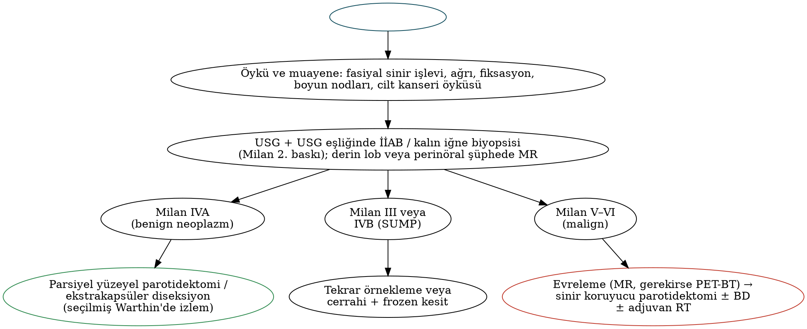

# Tükürük Bezi Tümörleri ve Parotis Cerrahisi

Tükürük bezi tümörleri, baş-boyun tümörlerinin yalnızca %3–6'sını oluştursa da **histolojik çeşitliliği en fazla** olan gruptur ve son yıllarda moleküler patoloji ile hedefe yönelik tedavilerde hızlı bir gelişme yaşanmıştır. **DSÖ 2022 (5. baskı)** sınıflaması, **Milan sitopatoloji sistemi 2. baskısı (2023)** ve Ocak 2026'da yürürlüğe giren **AJCC Versiyon 9 tükürük bezi evrelemesi** bu bölümün güncel temelini oluşturur. Parotis cerrahisi ve fasiyal sinir yönetimi de burada ele alınmıştır.

## Epidemiyoloji

Tablo: Tükürük bezi tümörlerinin dağılımı ve malignite oranları
| Bez | Tüm tükürük bezi tümörleri içindeki payı | Malignite oranı | En sık benign | En sık malign |
|---|---|---|---|---|
| **Parotis** | **≈%70–80** | **≈%20–25** | Pleomorfik adenom | **Mukoepidermoid karsinom** |
| **Submandibular** | ≈%10–15 | **≈%40–50** | Pleomorfik adenom | **Adenoid kistik karsinom** |
| **Sublingual** | <%1 | **≈%70–90** | — | Adenoid kistik karsinom |
| **Minör tükürük bezleri** | ≈%10–15 | **≈%50–80** | Pleomorfik adenom | **Adenoid kistik karsinom** (en sık damak) |

!!! sinav "Sınav notu — ters boyut kuralı"
    **Bez küçüldükçe malignite olasılığı artar:** parotis < submandibular < minör < sublingual. **Pleomorfik adenom** her bezde en sık tümördür. Tüm bezler birlikte değerlendirildiğinde ve çocuklarda **en sık malign tümör mukoepidermoid karsinomdur**; submandibular, sublingual ve minör tükürük bezlerinde ise **adenoid kistik karsinom** öne çıkar. İnfantlarda en sık tükürük bezi tümörü **infantil hemanjiyomdur** (parotis).

Risk faktörleri: iyonizan radyasyon (atom bombası maruziyeti, çocuklukta radyoterapi → özellikle mukoepidermoid karsinom), **sigara (Warthin tümörü)**, bazı mesleksel maruziyetler ve HIV (lenfoepitelyal lezyonlar).

## Klinik bulgular ve malignite göstergeleri

Tümörlerin çoğu **ağrısız, yavaş büyüyen kitle** olarak ortaya çıkar. Maligniteyi düşündüren bulgular:

- Hızlı büyüme, **ağrı**,
- **Fasiyal sinir zayıflığı** (en güçlü klinik malignite göstergelerinden biri),
- Deriye veya derin dokulara **fiksasyon**, deride ülserasyon,
- **Servikal lenfadenopati**,
- **Trismus** (parafarengeal/pterigoid uzanım), derin lob/parafarengeal bileşen.

!!! dikkat "Tuzak"
    **Parotis kitlesi + fasiyal paralizi = aksi kanıtlanana kadar malignite.** Benign tümörler nadiren fasiyal paraliziye yol açar. "Bell paralizisi" tanısı konup düzelmeyen veya kademeli ilerleyen fasiyal paralizide parotis ve fasiyal sinir seyri **MR** ile değerlendirilmelidir (perinöral yayılım).

## Değerlendirme

- **USG:** İlk basamak; kitlenin karakterizasyonu, lenf nodları ve İİAB/kalın iğne rehberliği.
- **MR:** Derin lob ve parafarengeal uzanım, **perinöral yayılım** (fasiyal sinirin stilomastoid foramene, V3'ün foramen ovaleye doğru izlenmesi — özellikle adenoid kistik karsinom), ADC değerleri (pleomorfik adenomda yüksek, Warthin tümöründe ve malign tümörlerde düşük). **Pleomorfik adenom T2'de belirgin hiperintens ve lobüledir.**
- **BT:** Kemik erozyonu; **PET-BT:** yüksek dereceli tümörlerde evreleme (Warthin tümörü ve onkositom **FDG tutar** → yanlış pozitiflik).
- **Tc-99m perteknetat sintigrafisi:** Warthin tümörü ve onkositom aktivite tutar ("sıcak" nodül).

### Doku tanısı ve Milan sistemi

**İİAB**, malignite tanısında ≈%80–90 duyarlılık ve >%95 özgüllüğe sahiptir. **USG eşliğinde kalın iğne biyopsisi** daha yüksek doğruluk sağlar ve ekim riski çok düşüktür. **Açık insizyonel biyopsi kontrendikedir** (kapsül rüptürü, tümör ekimi, fasiyal sinir riski). Ameliyat sırasında **frozen kesit**, benign–malign ayrımında yüksek doğrulukla kullanılabilir ancak tümör tipi ve derecesinde sınırlıdır.

Tablo: Milan Tükürük Bezi Sitopatolojisi Raporlama Sistemi — 2. baskı (2023)
| Kategori | Malignite riski (yaklaşık) | Önerilen yaklaşım |
|---|---|---|
| **I.** Tanısal olmayan | ≈%15 | Klinik/radyolojik korelasyon, (USG eşliğinde) tekrar İİAB |
| **II.** Neoplastik olmayan | ≈%11 | Klinik izlem ve radyolojik korelasyon |
| **III.** Önemi belirsiz atipi (AUS) | ≈%30 | Tekrar İİAB veya cerrahi |
| **IVA.** Neoplazm: benign | **<%3** | Cerrahi veya klinik izlem |
| **IVB.** Belirsiz malign potansiyelli tükürük bezi neoplazmı (**SUMP**) | ≈%35 | Cerrahi |
| **V.** Malignite şüphesi | ≈%83 | Cerrahi |
| **VI.** Malign | ≈%98 | Cerrahi (mümkünse düşük/yüksek derece belirtilir) |

## DSÖ 2022 sınıflamasının öne çıkan noktaları

- **Yeni benign antiteler:** interkale duktus adenomu, striye duktus adenomu, **sklerozan polikistik adenom** (artık neoplazm), keratokistom.
- **Yeni malign antiteler:** **mikrosekretuvar adenokarsinom** (MEF2C-SS18), **sklerozan mikrokistik adenokarsinom**.
- **Müsinöz adenokarsinom** (AKT1 E17K) alt tipleriyle tanımlanmış; **kribriform adenokarsinom**, **polimorf adenokarsinomun** bir alt tipi olarak kabul edilmiştir.
- **İntraduktal karsinom** (2017 sınıflamasında eski "düşük dereceli kribriform kistadenokarsinom"un yerini almıştı): 2022'de **interkale kanal benzeri, apokrin, onkositik ve mikst** alt tipleri tanımlanmıştır.
- Tanıda füzyon genleri (MAML2, MYB, NR4A3, ETV6-NTRK3, EWSR1-ATF1, PLAG1/HMGA2) giderek daha fazla kullanılmaktadır.

## Benign tümörler

Tablo: Pleomorfik adenom ve Warthin tümörünün karşılaştırması
| Özellik | Pleomorfik adenom | Warthin tümörü |
|---|---|---|
| Sıklık | **En sık tükürük bezi tümörü** (parotis tümörlerinin ≈%60–70'i) | İkinci en sık benign tümör |
| Yerleşim | Tüm bezler (parotis en sık; yüzeyel lob) | **Neredeyse yalnızca parotis**, genellikle **alt kutup/kuyruk** |
| Demografi | Kadın, 30–50 yaş | Yaşlı; **sigara içenler** (güçlü ilişki); kadınlarda artış |
| Bilateralite/multifokalite | Nadir | **≈%10–15 bilateral**, multifokal |
| Histoloji | Epitelyal + miyoepitelyal hücreler, **kondromiksoid stroma** ("mikst tümör"); **eksik kapsül, psödopodlar** | İki sıralı **onkositik epitel** + lenfoid stroma; intraparotid lenf nodundan köken |
| Genetik | **PLAG1**, **HMGA2** yeniden düzenlenmeleri | — |
| Görüntüleme | T2'de belirgin hiperintens, lobüle; yüksek ADC | Kistik–solid; düşük ADC; **sintigrafide sıcak**, FDG tutulumu |
| Malign dönüşüm | **Var** (zamanla artar; ≈5 yılda %1,5 → 15 yılda ≈%10): **karsinom ex pleomorfik adenom** | Çok nadir |
| Tedavi | Normal doku manşetiyle **tam eksizyon** (parsiyel yüzeyel parotidektomi/ekstrakapsüler diseksiyon); **enükleasyon yapılmaz** | Eksizyon; tanıdan emin olunan yaşlı/komorbid hastada **izlem** seçeneği |

!!! sinav "Sınav notu — pleomorfik adenomda nüks"
    Psödopodlar ve eksik kapsül nedeniyle **enükleasyon sonrası nüks %20–45**'e ulaşırken parsiyel/yüzeyel parotidektomi sonrası ≈%1–4'tür. **Kapsül rüptürü ve tümör saçılması** nüks riskini artırır. Nükseden pleomorfik adenom çoğunlukla **multinodülerdir**, tekrarlayan cerrahide fasiyal sinir riski yüksektir; seçilmiş olgularda adjuvan radyoterapi düşünülür.

Diğer benign tümörler:

- **Onkositom:** Yaşlılarda parotiste; mitokondriden zengin onkositler; sintigrafide sıcak.
- **Bazal hücreli adenom:** Parotiste monomorf bazaloid hücreler; membranöz tipi **Brooke–Spiegler sendromu** (CYLD; dermal silindromlar) ile ilişkilidir.
- **Miyoepitelyom**, **kanaliküler adenom** (yaşlı kadınlarda **üst dudak** minör tükürük bezi), sebase adenom, duktal papillomlar.
- İnfantlarda parotiste **infantil hemanjiyom** (propranolol; Bölüm 4) ve lenfatik malformasyon.

## Malign tümörler

Tablo: Başlıca malign tükürük bezi tümörleri
| Tümör | Tipik yer/hasta | Moleküler belirteç | Biyolojik davranış ve ayırt edici özellik |
|---|---|---|---|
| **Mukoepidermoid karsinom (MEK)** | **Parotis** (en sık), damak; çocukta ve radyasyon sonrası en sık malignite | **CRTC1–MAML2** füzyonu (t(11;19)) — çoğunlukla düşük/orta derece, iyi prognoz | Müköz, intermediyer ve epidermoid hücreler; **derece prognozu belirler** (düşük dereceli indolent; yüksek dereceli agresif, nodal metastaz sık) |
| **Adenoid kistik karsinom (AKK)** | **Submandibular, minör (damak)**, sublingual | **MYB–NFIB** füzyonu (t(6;9)) veya MYBL1; solid tipte NOTCH1 | **Perinöral invazyon** (atlayan lezyonlarla sinir boyunca ilerleme), yavaş fakat ısrarcı seyir, **geç lokal nüks ve akciğer metastazı**; nodal metastaz düşük; paternler: **tübüler (en iyi), kribriform (en sık; "İsviçre peyniri"), solid (en kötü)** |
| **Asinik hücreli karsinom** | Parotis; kadın, genç erişkin ve çocuk | **NR4A3** aktivasyonu (t(4;9)); **DOG1+**; PAS+ diastaz dirençli zimojen granülleri | Çoğunlukla düşük dereceli, 5 yıllık sağkalım yüksek; geç nüks; nadiren yüksek dereceli dönüşüm |
| **Sekretuvar karsinom** (eski MASC) | Parotis | **ETV6–NTRK3** (t(12;15)); S100+, mammaglobin+ | Düşük dereceli; ileri olguda **NTRK inhibitörleri** (larotrektinib, entrektinib, repotrektinib) |
| **Polimorf adenokarsinom** | **Neredeyse yalnızca minör bezler — en sık damak**; yaşlı kadın | **PRKD1** mutasyonu; kribriform alt tipte PRKD1–3 füzyonları | "Tek sıra" dizilim, hedef şeklinde perinöral invazyon; prognoz iyi; kribriform alt tip (dil kökü) nodal metastaza eğilimli |
| **Tükürük kanal karsinomu** | Parotis; yaşlı erkek; sıklıkla ex-PA | **Androjen reseptörü** (≈%70–90), **HER2** amplifikasyonu (≈%25–40) | Meme duktal karsinomuna benzer, komedonekroz; **çok agresif** (nodal ve uzak metastaz sık, 5 yıllık sağkalım düşük) |
| **Karsinom ex pleomorfik adenom** | Uzun süredir var olan PA'da **ani hızlı büyüme**, fasiyal paralizi | PLAG1/HMGA2 + karsinom bileşenine ait değişiklikler | Karsinom bileşeni sıklıkla tükürük kanal karsinomu; **intrakapsüler/minimal invaziv** formlarda prognoz çok iyi, **yaygın invaziv** formda kötü |
| **Epitelyal–miyoepitelyal karsinom** | Parotis | **HRAS** | Bifazik (iç duktal + dış berrak miyoepitelyal); genellikle düşük dereceli |
| Hiyalinize berrak hücreli karsinom | Minör bezler (dil kökü, damak) | **EWSR1–ATF1** | Düşük dereceli |
| Mikrosekretuvar adenokarsinom | Ağız içi minör bezler | **MEF2C–SS18** | Yeni antite; düşük dereceli |

!!! klinik "Klinik inci — adenoid kistik karsinom"
    AKK'de cerrahi sınırın **sinir boyunca** frozen kesitle kontrol edilmesi önemlidir (V2 için foramen rotundum, V3 için foramen ovale, fasiyal sinir için stilomastoid foramen). **Adjuvan radyoterapi hemen her zaman** önerilir. Akciğer metastazları yıllarca yavaş seyredebilir; 5 yıllık sağkalım iyi olmasına karşın 15–20 yıllık sağkalım belirgin düşer. Etkili bir sistemik tedavi yoktur (lenvatinib ve aksitinib sınırlı aktivite gösterir).

### Diğer malign durumlar

- **Parotiste SHK:** Primer SHK son derece nadirdir; büyük çoğunluğu **saçlı deri, kulak ve yüz cilt SHK'sının intraparotid nod metastazıdır** → parotidektomi + boyun diseksiyonu + adjuvan radyoterapi (± cemiplimab verisi; Bölüm 28). TNM-9'da SHK tükürük bezi evrelemesinden çıkarılmıştır.
- **Parotis lenfoması:** MALT lenfoma (Sjögren zemininde), DLBCL, foliküler lenfoma.
- **Metastazlar:** Cilt SHK (en sık), melanom, Merkel hücreli karsinom; uzak organlardan (akciğer, meme, böbrek) nadiren.

## Evreleme

**AJCC 8 (majör tükürük bezleri):** T1 ≤2 cm, T2 >2–4 cm (her ikisinde de parankim dışı yayılım yok), T3 >4 cm ve/veya **parankim dışı yayılım** (klinik/makroskobik; yalnızca mikroskobik yayılım sayılmaz), T4a deri, mandibula, kulak kanalı ve/veya fasiyal sinir, T4b kafa tabanı, pterigoid plaklar veya karotisi sarma. N kategorisi HPV ilişkisiz mukozal kanserlerle ortaktı; minör tükürük bezi tümörleri yerleşim bölgesine göre evreleniyordu.

Tablo: AJCC Versiyon 9 / TNM-9 tükürük bezi karsinomu evrelemesi (Ocak 2026)
| Kategori | Tanım |
|---|---|
| Kapsam | **Majör ve minör** tükürük bezi karsinomları **tek sistemde**; SHK, nöroendokrin karsinom ve bazoskuamöz karsinom **kapsam dışı**; karsinom ex PA ayrı tip değil (karsinom tipine ve derecesine göre) |
| T | AJCC 8 ile aynı ölçütler; T3 için **makroskobik/klinik parankim dışı yayılım** (yumuşak doku veya adsız sinir), T4a için **kemik invazyonu** ve adlandırılmış sinir (örn. fasiyal sinir) |
| **N0** | Bölgesel nod yok |
| **N1** | **1–3 pozitif nod, ENE yok** |
| **N2** | **>3 pozitif nod veya herhangi bir nodda ENE** (parotis içi + servikal nodlar birlikte sayılır) |
| **Evre I** | T1 N0 |
| **Evre II** | T2 N0 |
| **Evre IIIA** | T1–T2 N1 veya T3–T4 N0 |
| **Evre IIIB** | Herhangi T N2 veya T3–T4 N1 |
| **Evre IV** | **M1** |

## Parotis cerrahisi

### Fasiyal sinirin cerrahi anatomisi

Fasiyal sinir **stilomastoid foramenden** çıkar; parotise girmeden önce **posterior aurikuler siniri** ve **digastrik arka karın–stilohiyoid** dallarını verir. Bez içinde **pes anserinus**ta **temporofasiyal** (üst) ve **servikofasiyal** (alt) bölümlere ayrılır ve beş ana dal oluşturur: **temporal (frontal), zigomatik, bukkal, marjinal mandibular, servikal**. Dallanma paternleri bireyler arasında belirgin değişkenlik gösterir (Davis ve Katz–Catalano sınıflamaları). **Frontal dal**, tragusun 0,5 cm altından kaşın lateralinin 1,5 cm üstüne çizilen **Pitanguy çizgisi** boyunca, zigomatik arkın üzerinde **temporoparietal fasyanın** içinde seyreder.

Tablo: Fasiyal sinir ana gövdesinin bulunmasında kullanılan işaretler
| İşaret | İlişki |
|---|---|
| **Tragal pointer** (tragus kıkırdağının ucu) | Sinir, pointerın ≈1 cm **derininde ve ön-altında** (değişken; tek başına güvenilir değil) |
| **Timpanomastoid sütür** | **En güvenilir işaret**; sinir, sütürün "düşme noktasının" **≈6–8 mm derininde** |
| **Digastrik arka karın** | Sinir, kasın mastoide tutunduğu yerin **üst kenarı düzeyinde ve aynı derinlikte** |
| **Stiloid çıkıntı** | Sinir stiloid çıkıntının **yüzeyinde (posterolateralinde)** |
| **Retrograd diseksiyon** | Ana gövdeye ulaşılamıyorsa (büyük tümör, revizyon) periferik bir dal (marjinal mandibular veya Stensen kanalı boyunca bukkal dal) izlenerek geriye doğru |
| Mastoidektomi | Stilomastoid foramen düzeyindeki tümörlerde ana gövdeye mastoid içinden ulaşmak için |

### Parotidektomi tipleri

Tablo: Parotis cerrahisinde rezeksiyon tipleri
| Yöntem | Tanım | Endikasyon |
|---|---|---|
| **Ekstrakapsüler diseksiyon** | Kapsülün hemen dışında, formal sinir diseksiyonu yapmadan tümör eksizyonu | Küçük (≈<3–4 cm), hareketli, yüzeyel benign tümörler (deneyimli ellerde düşük nüks ve komplikasyon) |
| **Parsiyel yüzeyel parotidektomi** | Tümörün 1–2 cm normal doku manşetiyle, ilgili sinir dallarının tanımlanarak çıkarılması | **Benign tümörlerde günümüzün en sık yöntemi** |
| **Yüzeyel parotidektomi** | Fasiyal sinirin lateralindeki tüm dokunun çıkarılması | Yüzeyel lob tümörleri, düşük dereceli malignite |
| **Total parotidektomi** (sinir koruyucu) | Yüzeyel + derin lob | Derin lob tümörleri, yüksek dereceli malignite |
| **Radikal parotidektomi** | Total parotidektomi + **fasiyal sinir rezeksiyonu** | Ameliyat öncesi paralizi veya sinirin tümörle doğrudan tutulumu |
| **Genişletilmiş radikal** | + deri, mandibula, mastoid/temporal kemik, masseter | Lokal ileri malignite |

İnsizyon: modifiye **Blair** insizyonu (preaurikuler–mastoid–servikal) veya kozmetik **yüz germe (ritidektomi) insizyonu**. **Fasiyal sinir monitörizasyonu** yaygın olarak kullanılır; sinirin tanımlanmasını kolaylaştırır, özellikle revizyon cerrahisinde yararlıdır.

### Malign tümörde fasiyal sinir ve boyunun yönetimi

- **Ameliyat öncesi işlevsel olan ve tümörle sarılmamış sinir korunur**; tümör sinirden sıyrılarak çıkarılır ve **adjuvan radyoterapi** eklenir.
- **Ameliyat öncesi paralizi** veya makroskobik sinir invazyonu varsa sinir rezeke edilir; proksimal ve distal sinir sınırları frozen kesitle kontrol edilir ve **aynı seansta rekonstrüksiyon** (kablo greft — büyük aurikuler/sural sinir, masseterik sinir transferi, statik yöntemler; Bölüm 11) yapılır.
- **Boyun:** cN+ hastalıkta terapötik boyun diseksiyonu; cN0'da **yüksek dereceli histolojiler** (yüksek dereceli MEK, tükürük kanal karsinomu, NOS adenokarsinom), **T3–T4** ve fasiyal sinir tutulumunda okült metastaz riski yüksek olduğundan **elektif boyun diseksiyonu** (en az seviye II–III, intraparotid nodlar dahil).

!!! kilavuz "Adjuvan radyoterapi endikasyonları (tükürük bezi karsinomu)"
    **Yüksek dereceli histoloji**, **T3–T4**, **pozitif veya yakın sınır**, **perinöral invazyon** (özellikle AKK), lenfovasküler invazyon, **nodal metastaz** (özellikle çoklu veya ENE), sinirden sıyrılarak çıkarılan tümör ve derin lob/parafarengeal tutulum. Eş zamanlı kemoterapinin rutin rolü kanıtlanmamıştır.

### Komplikasyonlar

Tablo: Parotidektomi komplikasyonları
| Komplikasyon | Not |
|---|---|
| **Geçici fasiyal sinir zayıflığı** | Sık (en sık **marjinal mandibular dal**); çoğu haftalar–aylar içinde düzelir |
| **Kalıcı fasiyal paralizi** | Benign tümör cerrahisinde düşük (%0–4); revizyon ve total parotidektomide daha yüksek |
| **Büyük aurikuler sinir hipoestezisi** | Kulak memesinde uyuşukluk; çok sık; zamanla azalır |
| **Frey sendromu** | Aurikülotemporal parasempatik liflerin aberran rejenerasyonu; botulinum toksini (Bölüm 22) |
| Tükürük fistülü / sialosel | Aspirasyon, basınçlı pansuman, **botulinum toksini**, antikolinerjik |
| Kozmetik çökme | Yağ grefti, SMAS veya SKM flebi, aselüler dermis |
| İlk ısırık sendromu | Derin lob ve parafarengeal cerrahi sonrası (Bölüm 8) |
| Hematom, enfeksiyon, nüks | — |

Fasiyal paralizide **göz koruması** önceliklidir: suni gözyaşı ve gece pomadı, nem odası, bantlama, göz kapağına altın/platin ağırlık, tarsorafi.

## Submandibular bez ve minör tükürük bezi tümörleri

- **Submandibular bez tümörleri:** Yaklaşık yarısı maligndir (en sık AKK). Benign tümörlerde **submandibular bez eksizyonu**; malign tümörlerde bezle birlikte **seviye I–III boyun diseksiyonu** ve endikasyona göre adjuvan radyoterapi. Risk altındaki sinirler: **marjinal mandibular, lingual ve hipoglossal**.
- **Minör tükürük bezi tümörleri:** En sık **damakta** (sert–yumuşak damak bileşkesi) görülür ve **%50–80'i maligndir** (en sık AKK, MEK ve polimorf adenokarsinom). Tedavi; gerektiğinde kemikle birlikte geniş eksizyon (palatektomi/maksillektomi) ve obtüratör veya flep ile rekonstrüksiyondur.

## Sistemik ve hedefe yönelik tedavi

Rekürren/metastatik hastalıkta **kapsamlı moleküler profilleme** önerilir (NCCN):

- **NTRK füzyonu** (sekretuvar karsinom): larotrektinib, entrektinib, repotrektinib.
- **HER2 pozitif** tükürük kanal karsinomu: trastuzumab + dosetaksel, trastuzumab emtansin, **trastuzumab derukstekan**.
- **Androjen reseptörü pozitif** tükürük kanal karsinomu: **androjen deprivasyon tedavisi** (bikalutamid + LHRH agonisti).
- **AKK:** lenvatinib, aksitinib (sınırlı yanıt); progresyon göstermeyen akciğer metastazlarında izlem.
- Yüksek tümör mutasyon yükü veya PD-L1 pozitifliğinde pembrolizumab; sitotoksik rejimler (sisplatin, doksorubisin, siklofosfamid).

## Pediatrik tükürük bezi tümörleri

İnfantlarda en sık tümör **infantil hemanjiyom**dur. Solid tümörler arasında **pleomorfik adenom** en sık benign, **mukoepidermoid karsinom** en sık malign tümördür (ikinci sırada asinik hücreli karsinom). Çocuklarda solid tükürük bezi tümörlerinin malign olma oranı erişkinlerden yüksektir.

!!! ozet "Kritik noktalar"
    - Parotis tümörlerinin ≈%75–80'i benigndir; **bez küçüldükçe malignite oranı artar**. En sık tümör **pleomorfik adenom**; parotiste ve çocukta en sık malign **MEK**, submandibular/minör/sublingual bezde **AKK**.
    - Parotis kitlesi + **fasiyal paralizi** → malignite. İlk görüntüleme **USG**, derin lob ve perinöral yayılım için **MR**; açık insizyonel biyopsi kontrendike.
    - **Milan 2. baskı:** I %15, II %11, III %30, **IVA <%3, IVB (SUMP) %35**, V %83, VI %98.
    - **Pleomorfik adenom:** psödopodlar → **enükleasyon yok**; PLAG1/HMGA2; zamanla artan malign dönüşüm (karsinom ex PA). **Warthin:** parotis alt kutbu, **sigara**, bilateral/multifokal, sintigrafide sıcak, FDG tutar.
    - Moleküler eşleştirmeler: **MEK → CRTC1-MAML2; AKK → MYB-NFIB; asinik → NR4A3/DOG1; sekretuvar → ETV6-NTRK3; polimorf → PRKD1; EMK → HRAS; hiyalinize berrak hücreli → EWSR1-ATF1; mikrosekretuvar → MEF2C-SS18.** Tükürük kanal karsinomu **AR+/HER2+**, çok agresif.
    - **AKK:** perinöral yayılım, kribriform en sık/solid en kötü, geç akciğer metastazı, hemen her zaman adjuvan RT.
    - **AJCC Versiyon 9 (2026):** majör + minör tek sistem; **N1 = 1–3 nod ENE−, N2 = >3 nod veya ENE**; evre IIIA/IIIB; **evre IV yalnızca M1**; SHK kapsam dışı.
    - Fasiyal sinir işaretleri: **timpanomastoid sütür (6–8 mm derinde) en güvenilir**, tragal pointer, digastrik arka karın, stiloid; ulaşılamazsa **retrograd** diseksiyon.
    - İşlevsel ve sarılmamış sinir korunur (+ adjuvan RT); paralizi veya makroskobik invazyonda rezeksiyon + **aynı seansta kablo greft**. Yüksek derece/T3–T4'te **elektif boyun diseksiyonu**.
    - Komplikasyonlar: geçici marjinal mandibular zayıflık, kulak memesi uyuşukluğu, **Frey sendromu**, sialosel (botulinum).
