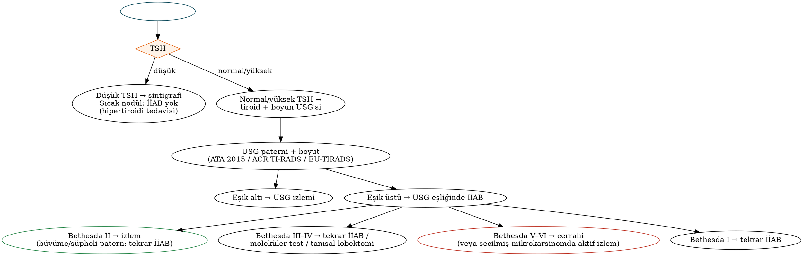

# Tiroid Fizyolojisi, Benign Tiroid Hastalıkları ve Nodül Değerlendirmesi

Tiroid cerrahisi, KBB–baş-boyun cerrahisinin en sık uygulanan büyük ameliyatlarından biridir. Doğru cerrahi endikasyon; tiroid fizyolojisinin, hipertiroidi ve hipotiroidi nedenlerinin, tiroiditlerin, guatrın ve tiroid nodülünün sistematik değerlendirmesinin iyi bilinmesine dayanır. Bu bölüm tiroid fizyolojisini, fonksiyon testlerini, Graves hastalığı başta olmak üzere hipertiroidiyi, tiroiditleri, guatrı (substernal guatr dahil) ve tiroid nodülü değerlendirmesini (ATA 2015, ACR TI-RADS, EU-TIRADS, **Bethesda 2023**, moleküler testler, ablatif tedaviler) ele alır. Tiroid kanserleri Bölüm 25'te, tiroidektomi tekniği Bölüm 26'da işlenmiştir.

## Cerrahi anatomiye kısa bakış

Tiroid iki lob ve trakeanın 2.–4. halkaları önündeki **istmustan** oluşur; ağırlığı 15–25 g'dır. Erişkinlerin bir kısmında **piramidal lob** bulunur. Bez, **gerçek kapsül** ve pretrakeal fasyadan oluşan **yalancı kapsül** ile sarılıdır. Arka-medialde **Berry ligamenti** bezi krikoid ve üst trakea halkalarına bağlar; **RLS bu bölgede bezle en yakın ilişkidedir**.

- **Arterler:** Superior tiroid arter (EKA'nın ilk dalı), inferior tiroid arter (tiroservikal trunkus), olguların küçük bir kısmında **tiroidea ima** arteri (brakiyosefalik trunkus veya aort arkından).
- **Venler:** Superior, **orta** (arter eşliği olmayan, tiroidektomide genellikle ilk bağlanan ven) ve inferior tiroid venleri.
- **Lenfatikler:** Santral kompartman (VI), lateral boyun (II–V) ve üst mediasten (VII).

## Tiroid fizyolojisi

1. **İyot alımı:** Bazolateral membrandaki **sodyum–iyot simporter (NIS)** ile; apikal taşınma pendrin aracılığıyla.
2. **Oksidasyon ve organifikasyon:** **Tiroid peroksidaz (TPO)**, H₂O₂ varlığında iyodu tiroglobulin üzerindeki tirozin kalıntılarına bağlar (MIT, DIT).
3. **Eşleşme (coupling):** MIT + DIT → **T3**; DIT + DIT → **T4**. Hormonlar kolloidde tiroglobuline bağlı depolanır.
4. **Salgılama:** Endositoz ve proteoliz; salgılanan hormonun ≈%90'ı **T4**'tür. Periferde **deiyodinazlar** T4'ü aktif **T3**'e (D1, D2) veya inaktif **rT3**'e (D3) dönüştürür.
5. **Taşınma:** Başlıca TBG, ayrıca transtiretin ve albümin; serbest fraksiyonlar çok küçüktür.

**Düzenleme:** Hipotalamik TRH → hipofiz TSH → tiroid; serbest hormonlarla negatif geri bildirim.

!!! sinav "Sınav notu — iyotla ilgili iki fenomen"
    - **Wolff–Chaikoff etkisi:** Yüksek doz iyot **organifikasyonu geçici olarak baskılar** ve günler içinde "kaçış" gelişir; Graves ameliyatı öncesi **Lugol solüsyonu/SSKI** kullanımının temelidir (bezin vaskülaritesini ve kanamayı azaltır). Kaçış gelişmezse hipotiroidi oluşur.
    - **Jod–Basedow fenomeni:** Otonom nodülü olan veya iyot eksikliği bulunan hastada iyot yüküyle (kontrast madde, amiodaron) **hipertiroidi** gelişmesi.

**Kalsitonin**, parafoliküler C hücrelerinden salgılanır ve medüller tiroid karsinomunun belirtecidir.

### Fonksiyon testleri ve görüntüleme

- **TSH:** En iyi tarama testi; serbest T4 ve T3 ile birlikte yorumlanır.
- **Antikorlar:** Anti-TPO ve anti-tiroglobulin (Hashimoto), **TSH reseptör antikoru (TRAb/TSI)** (Graves).
- **Tiroglobulin:** Total tiroidektomi sonrası diferansiye tiroid kanseri izleminde tümör belirteci (preoperatif rutin ölçümü önerilmez).
- **Sintigrafi/radyoaktif iyot uptake'i (Tc-99m perteknetat, I-123):** **Sıcak (hiperfonksiyone) nodüllerde malignite son derece nadirdir**; TSH baskılı hastada sıcak nodülde İİAB gerekmez. Tiroiditlerde uptake düşük, Graves'te difüz yüksektir.

## Hipertiroidi

### Graves hastalığı

TSH reseptörünü uyaran antikorlarla (TRAb) seyreden otoimmün hastalıktır; 20–50 yaş kadınlarda sıktır. **Difüz guatr, oftalmopati** (sigara kötüleştirir; RAI tedavisi aktif oftalmopatiyi alevlendirebilir), pretibial miksödem ve akropaki görülebilir. Tanı: baskılı TSH, yüksek serbest T4/T3, **TRAb pozitifliği**, sintigrafide difüz artmış tutulum, Doppler'de belirgin artmış vaskülarite ("tiroid inferno").

Tablo: Graves hastalığında tedavi seçenekleri
| Seçenek | Avantaj | Dezavantaj / not |
|---|---|---|
| **Antitiroid ilaçlar** (metimazol tercih edilir; **PTU** gebeliğin ilk trimesterinde ve tiroid fırtınasında) | Remisyon şansı (12–18 aylık tedaviyle ≈%30–50), hipotiroidi riski yok | Nüks sık; **agranülositoz** (boğaz ağrısı/ateşte hemogram), PTU ile **hepatotoksisite**, döküntü |
| **Radyoaktif iyot (I-131)** | Kesin, ayaktan, ucuz | Kalıcı hipotiroidi; **gebelik ve emzirmede kontrendike**; aktif orta–ağır oftalmopatide dikkat (steroid koruması) |
| **Cerrahi (total tiroidektomi)** | Hızlı ve kesin kontrol; doku tanısı | Cerrahi riskler (RLS, hipoparatiroidi); ömür boyu levotiroksin. Subtotal tiroidektomi nüks nedeniyle tercih edilmez |

!!! kilavuz "Graves hastalığında cerrahi endikasyonları (ATA 2016 hipertiroidi kılavuzu temelinde)"
    **Büyük guatr** (≈≥80 g) veya **bası semptomları**, düşük RAI uptake'i, **eşlik eden şüpheli/malign nodül**, **orta–ağır aktif oftalmopati**, **6 ay içinde gebelik planı** (veya gebelikte definitif tedavi gerekirse ikinci trimester), eşlik eden hiperparatiroidi, antitiroid ilaç yan etkileri/başarısızlığı ve hasta tercihi.

**Ameliyat öncesi hazırlık:** Metimazol ve β-blokerle **ötiroidizm** sağlanır; ameliyattan önceki ≈10 gün **potasyum iyodür (Lugol/SSKI)** verilir; **D vitamini eksikliği** düzeltilir (Graves'te "aç kemik" benzeri hipokalsemi riski yüksektir). Acil durumlarda β-bloker, kortikosteroid, kolestiramin ve iyot kombinasyonuyla hızlı hazırlık yapılabilir.

### Toksik multinodüler guatr ve toksik adenom

Daha ileri yaşta görülür; antitiroid ilaçlar remisyon sağlamaz. Tedavi: **RAI** veya **cerrahi** (toksik adenomda lobektomi, toksik MNG'de total tiroidektomi); seçilmiş toksik adenomlarda **radyofrekans ablasyon**.

### Tiroid fırtınası

Hayatı tehdit eden tirotoksikozdur (Burch–Wartofsky skoru). Tedavi: **β-bloker (propranolol)**, **PTU** (periferik T4→T3 dönüşümünü de baskılar) veya metimazol, **iyot (tiyonamidden en az 1 saat sonra)**, **hidrokortizon**, soğutma, sıvı ve tetikleyicinin tedavisi; dirençli olgularda plazmaferez ve acil tiroidektomi.

### Amiodarona bağlı tirotoksikoz

**Tip 1:** Altta nodüler hastalıkta iyot yükü (artmış sentez; tiyonamid). **Tip 2:** Destrüktif tiroidit (kortikosteroid). Dirençli olgularda tiroidektomi kurtarıcıdır.

## Hipotiroidi

İyot yeterli bölgelerde en sık neden **Hashimoto tiroiditi**dir; dünyada ise iyot eksikliğidir. İyatrojenik nedenler: RAI, tiroidektomi ve **boyuna radyoterapi** (baş-boyun kanseri tedavisinden sonra %20–50). İlaçlar: amiodaron, lityum ve **immün kontrol noktası inhibitörleri** (tiroidit sık görülen bir immün ilişkili yan etkidir). Tedavi levotiroksindir (≈1,6 µg/kg/gün).

## Tiroiditler

Tablo: Tiroiditlerin karşılaştırması
| Tiroidit | Klinik | Laboratuvar / görüntüleme | Tedavi |
|---|---|---|---|
| **Hashimoto** (kronik lenfositik) | Sert-lastik kıvamlı guatr, hipotiroidi | Anti-TPO/anti-Tg yüksek; histolojide onkositik (Hürthle) değişiklik | Levotiroksin; **hızla büyüyen guatrda primer tiroid lenfoması** dışlanmalı |
| **Subakut granülomatöz (de Quervain)** | Viral enfeksiyon sonrası **ağrılı, hassas** tiroid, ateş | **Sedimantasyon yüksek**, RAI uptake **düşük**; trifazik seyir (tirotoksik → hipotiroid → ötiroid) | NSAİİ, steroid, β-bloker |
| Ağrısız (sessiz) ve postpartum | Ağrısız, geçici tirotoksikoz/hipotiroidi | Uptake düşük; anti-TPO sıklıkla pozitif | Semptomatik |
| **Akut süpüratif** | Ateş, ağrılı kızarık şişlik; çocukta **sol piriform sinüs fistülü** | USG/BT'de apse | Antibiyotik, drenaj, fistülün tedavisi (Bölüm 4) |
| **Riedel** (invaziv fibröz) | **Taş sertliğinde, fikse** guatr; bası, RLS paralizisi, hipoparatiroidi; anaplastik karsinom/lenfomayı taklit eder | IgG4 ilişkili hastalık spektrumu; retroperitoneal fibrozis, sklerozan kolanjit ile birliktelik | Tanı için açık biyopsi; **steroid, tamoksifen, rituksimab**; yalnızca havayolu dekompresyonu için sınırlı cerrahi (istmusektomi) |

!!! dikkat "Tuzak — Hashimoto zemininde hızla büyüyen guatr"
    Hashimoto tiroiditi olan yaşlı bir kadında **haftalar içinde hızla büyüyen, bası yapan guatr**, primer **tiroid lenfoması** (MALT veya DLBCL) veya **anaplastik karsinom** açısından acilen değerlendirilmelidir. Lenfoma tanısında İİAB yetersiz kalabilir; **kalın iğne biyopsisi** (veya açık biyopsi) ve akım sitometrisi gerekir. Lenfomanın tedavisi kemoterapi ± radyoterapidir; cerrahi yalnızca tanı veya havayolu için yapılır.

## Guatr

Difüz veya multinodüler olabilir. **İyot eksikliği** endemik guatrın başlıca nedenidir; Türkiye'de endemik guatr bölgeleri bulunmakta olup 1998'den itibaren **zorunlu tuz iyotlaması** uygulanmaktadır.

- **Belirtiler:** Kozmetik şikâyet, **bası** (dispne, disfaji, pozisyonel solunum güçlüğü), ses kısıklığı (malignite veya RLS basısını düşündürür), süperior vena kava sendromu.
- **Pemberton bulgusu:** Kollar başın üzerine kaldırıldığında yüzde pletore ve venöz dolgunluk — **göğüs girişi obstrüksiyonu** (substernal guatr).
- **Değerlendirme:** TSH, USG, substernal uzanımda **BT** (trakea deviasyonu/basısı, mediastinal ilişki), akım–volüm eğrisi, laringoskopi.

### Substernal (retrosternal) guatr

Tanımlar değişkendir (bezin önemli bir kısmının — çoğu tanımda ≥%50'sinin — göğüs girişinin altında olması). Bası semptomları, ilerleyici büyüme, havayolu riski ve malignite olasılığı nedeniyle genellikle **cerrahi** önerilir; RAI etkinliği sınırlıdır.

- Olguların **büyük çoğunluğu servikal yaklaşımla** çıkarılabilir (mediastinal kısım genellikle boyundaki damarlardan beslenir ve künt diseksiyonla yukarı alınabilir).
- **Sternotomi** gerektirebilecek durumlar: **posterior mediastinal** uzanım (büyük damarların arkasına, aort arkının altına), mediastinal kan desteği olan **ektopik mediastinal tiroid**, mediastinal yapılara invaze malignite, yapışıklıklı **nüks guatr**, göğüs girişinden geniş "buzdağı" biçimli torasik kısım, karinaya kadar uzanım.
- Ameliyat sonrası **trakeomalazi** nadirdir.

**Nontoksik multinodüler guatrda** seçenekler: izlem, cerrahi (bilateral hastalıkta total tiroidektomi, tek taraflı baskın nodülde lobektomi), cerrahiye uygun olmayanlarda RAI (rhTSH destekli) ve baskın nodülde ablasyon. Benign nodüllerde **TSH süpresyonu artık önerilmemektedir**.

## Tiroid nodülü değerlendirmesi

Palpasyonla saptanan nodül sıklığı %4–7 iken USG ile bu oran yaşa bağlı olarak %20–70'e çıkar; nodüllerin yaklaşık **%7–15'i maligndir**.

**Malignite risk faktörleri:** Çocuklukta baş-boyuna **radyasyon**, ailede tiroid kanseri veya kalıtsal sendromlar (MEN2, Cowden/PTEN, FAP, Carney, Werner, DICER1), erkek cinsiyet, uç yaşlar, hızlı büyüme, sert ve fikse nodül, ses kısıklığı, boyunda lenfadenopati, **PET'te fokal FDG tutulumu** (insidentalomaların ≈üçte biri malign).

!!! guncel "Güncel durum"
    **ATA 2025 kılavuzu yalnızca diferansiye tiroid kanserini kapsamaktadır**; tiroid nodülü için ayrı bir ATA kılavuzu hazırlanmaktadır ve Ekim 2026 itibarıyla yayımlanmamıştır. Bu nedenle nodül değerlendirmesinde **ATA 2015** önerileri, **ACR TI-RADS (2017)** ve **Avrupa Tiroid Derneği 2023 kılavuzu (EU-TIRADS)** kullanılmaya devam etmektedir. Sitolojide **Bethesda 2023 (3. baskı)** geçerlidir.

### İlk yaklaşım

1. **TSH:** Düşükse sintigrafi → sıcak nodülde İİAB gerekmez (hipertiroidi tedavisi). Normal/yüksekse →
2. **Tiroid ve boyun USG'si** → nodülün USG paterni ve boyutuna göre İİAB kararı; şüpheli lenf nodunda nod İİAB'si + **tiroglobulin yıkama**.

Tablo: ATA 2015 — USG risk paternleri ve İİAB eşikleri
| Patern | Tanım | Malignite riski | İİAB eşiği |
|---|---|---|---|
| **Yüksek şüphe** | Solid hipoekoik nodül/komponent + ≥1: **düzensiz kenar** (infiltratif, mikrolobüle), **mikrokalsifikasyon**, **uzunluğun genişlikten fazla olması (taller-than-wide)**, ekstrüzyonlu rim kalsifikasyonu, **ekstratiroidal yayılım** | %70–90 | **≥1 cm** |
| **Orta şüphe** | Düzgün kenarlı hipoekoik solid nodül, şüpheli özellik yok | %10–20 | **≥1 cm** |
| **Düşük şüphe** | İzoekoik/hiperekoik solid veya eksantrik solid alanlı kısmen kistik nodül | %5–10 | **≥1,5 cm** |
| **Çok düşük şüphe** | **Süngerimsi (spongiform)** veya şüpheli özelliği olmayan kısmen kistik nodül | <%3 | **≥2 cm** veya izlem |
| **Benign** | Tamamen kistik | <%1 | İİAB gerekmez (semptomda boşaltma) |

Tablo: ACR TI-RADS (2017) puanlama ve İİAB/izlem eşikleri
| Özellik | Puanlar |
|---|---|
| Yapı | Kistik/süngerimsi 0 · mikst 1 · solid 2 |
| Ekojenite | Anekoik 0 · hiper/izoekoik 1 · hipoekoik 2 · çok hipoekoik 3 |
| Şekil | Genişlik > uzunluk 0 · **uzunluk > genişlik 3** |
| Kenar | Düzgün/silik 0 · lobüle/düzensiz 2 · **ekstratiroidal yayılım 3** |
| Ekojenik odaklar | Yok/büyük kuyruklu yıldız 0 · makrokalsifikasyon 1 · periferik (rim) 2 · **noktasal ekojenik odaklar 3** |
| **TR1** (0 puan) — benign | İİAB yok |
| **TR2** (2 puan) — şüpheli değil | İİAB yok |
| **TR3** (3 puan) — hafif şüpheli | İİAB **≥2,5 cm**; izlem ≥1,5 cm |
| **TR4** (4–6 puan) — orta şüpheli | İİAB **≥1,5 cm**; izlem ≥1 cm |
| **TR5** (≥7 puan) — yüksek şüpheli | İİAB **≥1 cm**; izlem ≥0,5 cm |

**EU-TIRADS (ETA 2023):** EU-TIRADS 2 benign (İİAB yok); 3 düşük risk (İİAB **>20 mm**); 4 orta risk (**>15 mm**); 5 yüksek risk (**>10 mm**; 5–10 mm arası seçilmiş olgularda İİAB veya aktif izlem).

### Sitoloji: Bethesda 2023 (3. baskı)

Tablo: Bethesda Tiroid Sitopatolojisi Raporlama Sistemi — 3. baskı (2023)
| Kategori | Ortalama malignite riski | Genel yaklaşım |
|---|---|---|
| **I.** Tanısal olmayan | ≈%13 | USG eşliğinde tekrar İİAB |
| **II.** Benign | ≈%4 | Klinik ve USG izlemi |
| **III.** Önemi belirsiz atipi (**AUS**) | ≈%22 | Tekrar İİAB, **moleküler test**, tanısal lobektomi veya izlem |
| **IV.** Foliküler neoplazm (**FN**; onkositik alt tip dahil) | ≈%30 | Moleküler test, **tanısal lobektomi** |
| **V.** Malignite şüphesi | ≈%74 | Moleküler test, lobektomi veya (near-)total tiroidektomi |
| **VI.** Malign | ≈%97 | Lobektomi veya (near-)total tiroidektomi; seçilmiş düşük riskli mikrokarsinomda **aktif izlem** |

!!! sinav "Sınav notu — Bethesda 3. baskıdaki değişiklikler"
    Her kategori için **tek bir ad** kullanılır: kategori III yalnızca **"AUS"** (FLUS terimi kaldırıldı; nükleer atipi ve diğer atipiler alt sınıflanır), kategori IV yalnızca **"foliküler neoplazm"** ("FN şüphesi" terimi kaldırıldı; **onkositik foliküler neoplazm** alt tipi). Çocuklar için ayrı malignite riskleri tanımlanmıştır (daha yüksek). NIFTP'nin malign kabul edilmemesi riskleri etkiler.

### Moleküler testler

Belirsiz sitolojide (Bethesda III–IV) cerrahi kararını yönlendirmek için kullanılır:

- **Afirma GSC** (genomik dizileme sınıflayıcı): esas olarak **dışlayıcı (rule-out)** test; "benign" sonuç cerrahiden kaçınmayı destekler (yüksek NPV).
- **ThyroSeq v3** (DNA/RNA yeni nesil dizileme paneli): hem dışlayıcı hem doğrulayıcı (yüksek NPV, orta–yüksek PPV).
- Değişikliklerin anlamı: **BRAF V600E** PTK için çok özgül; **RAS** mutasyonları foliküler paternli lezyonlarda (NIFTP, foliküler adenom, FTK); **TERT promoter** mutasyonu ve **TP53** agresif davranış; RET/PTC, PAX8–PPARG, NTRK ve ALK füzyonları.

### Benign nodülün izlemi ve ablatif tedaviler

- İzlem aralığı USG paternine göre belirlenir: **yüksek şüpheli patern ve benign sitoloji** → 12 ay içinde tekrar İİAB; düşük–orta şüphede 12–24 ay; çok düşük şüphede ≥24 ay.
- **Anlamlı büyüme:** En az iki boyutta ≥%20 (en az 2 mm) artış veya hacimde >%50 artış → tekrar İİAB.
- **Radyofrekans ablasyon (RFA):** İki kez (veya benign USG özellikleri varsa bir kez) benign sitolojisi doğrulanmış, **semptomatik veya kozmetik sorun yaratan solid benign nodüllerde**; 1 yılda hacimde ≈%50–80 azalma. Mikrodalga ve lazer ablasyon benzer amaçla kullanılır.
- **Perkütan etanol enjeksiyonu (PEI):** Boşaltma sonrası tekrarlayan **kistik/ağırlıklı kistik** nodüllerde birinci basamaktır.
- **İnsidentalomalar:** BT/MR'de rastlantısal küçük nodüller çoğu zaman ek inceleme gerektirmez; **PET'te fokal tutulum** gösteren nodül USG ve İİAB ile değerlendirilmelidir.
- **Gebelikte nodül:** USG ve İİAB güvenlidir; papiller karsinom cerrahisi çoğunlukla doğum sonrasına ertelenebilir, belirgin büyüme veya ileri hastalıkta ikinci trimesterde yapılır.

!!! ozet "Kritik noktalar"
    - Tiroid hormon sentezi: **NIS** ile iyot alımı → **TPO** ile organifikasyon → eşleşme → salgılanan hormonun ≈%90'ı T4; aktif hormon T3. **Wolff–Chaikoff** (iyot fazlası organifikasyonu geçici baskılar — Lugol), **Jod–Basedow** (iyot yüküyle hipertiroidi).
    - Sıcak nodül neredeyse hiç malign değildir; TSH düşük + sıcak nodülde İİAB yapılmaz.
    - **Graves:** TRAb, difüz guatr, oftalmopati. Tedavi: metimazol (PTU: 1. trimester ve fırtına), RAI (gebelikte kontrendike; aktif oftalmopatide dikkat), total tiroidektomi. Cerrahi endikasyonları: büyük guatr/bası, malign nodül, orta–ağır oftalmopati, yakın gebelik planı. Ameliyat öncesi ötiroidizm + **Lugol** + D vitamini.
    - **Tiroid fırtınası:** β-bloker, PTU, (1 saat sonra) iyot, hidrokortizon.
    - **De Quervain:** ağrılı, ESR yüksek, uptake düşük; **Riedel:** taş sert, IgG4 spektrumu, steroid/tamoksifen, sınırlı cerrahi; **Hashimoto + hızlı büyüyen guatr → lenfoma/anaplastik** (kalın iğne biyopsisi).
    - **Pemberton bulgusu** göğüs girişi obstrüksiyonunu gösterir; substernal guatrın çoğu **servikal** yolla çıkarılır; posterior mediastinal uzanım/ektopik mediastinal tiroid sternotomi gerektirebilir.
    - ATA 2015 İİAB eşikleri: **yüksek ve orta şüphe ≥1 cm, düşük ≥1,5 cm, çok düşük ≥2 cm**, tamamen kistik İİAB yok. **ACR TI-RADS:** TR3 ≥2,5 cm, TR4 ≥1,5 cm, TR5 ≥1 cm. **EU-TIRADS:** 3 >20 mm, 4 >15 mm, 5 >10 mm.
    - **Bethesda 2023:** I %13, II %4, **III (AUS) %22, IV (FN) %30**, V %74, VI %97; FLUS ve "FN şüphesi" terimleri kaldırıldı.
    - Moleküler testler: **Afirma GSC** dışlayıcı, **ThyroSeq v3** dışlayıcı + doğrulayıcı; BRAF V600E PTK'ya özgül, RAS foliküler paternli lezyonlar, TERT agresiflik.
    - Benign semptomatik solid nodülde **RFA**, kistik nodülde **etanol**; benign nodülde TSH süpresyonu önerilmez.
