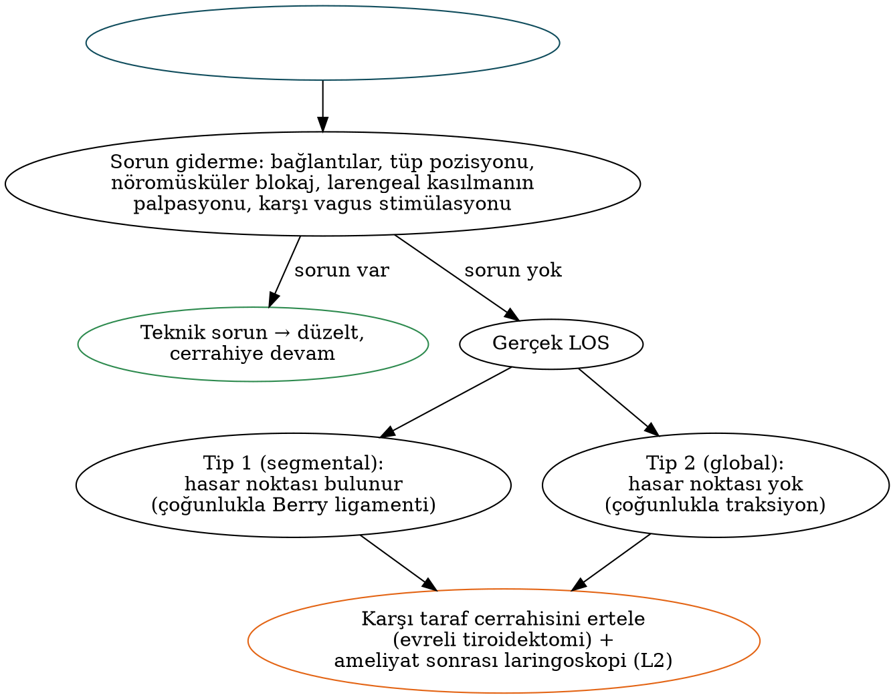

# Tiroidektomi: Teknik, Nöromonitörizasyon ve Komplikasyonlar

Tiroidektominin başarısı yalnızca hastalığın tam çıkarılmasıyla değil, **rekürren larengeal sinirin (RLS), süperior larengeal sinirin dış dalının (SLS-DD) ve paratiroidlerin korunmasıyla** ölçülür. Kocher'in bir asır önce standartlaştırdığı ilkeler — iyi görüş, kansız alan, kapsüle yakın diseksiyon — bugün de geçerlidir; bunlara **intraoperatif nöromonitörizasyon (IONM)**, paratiroid otofloresansı ve uzaktan erişimli teknikler eklenmiştir. Bu bölüm tiroidektominin teknik basamaklarını, sinir ve paratiroid anatomisini, IONM standartlarını, komplikasyonların önlenmesini ve yönetimini ele alır.

## Ameliyat öncesi hazırlık

- **Ses değerlendirmesi** tüm hastalarda; **laringoskopi** disfoni varlığında, RLS/vagusu riske atmış önceki boyun/üst toraks cerrahisinde ve **yaygın santral tutulum, posterior ETE veya lateral metastazlı kanserde** (ATA 2025). Birçok merkez tüm hastalarda rutin laringoskopi uygular.
- USG ile hastalığın haritalanması; gerekirse kesitsel görüntüleme (substernal uzanım, invaziv hastalık; sağ retroözofageal subklavyen arter → nonrekürren sinir uyarısı).
- TSH, kalsiyum, PTH ve **25-OH D vitamini** (eksiklik ameliyat sonrası hipokalsemiyi artırır); Graves'te ötiroidizm ve Lugol hazırlığı (Bölüm 24).
- Antikoagülan/antiplatelet yönetimi; bilgilendirilmiş onam (RLS hasarı, hipoparatiroidi, kanama, skar).

## Cerrahi teknik: total tiroidektomi

1. **Pozisyon ve insizyon:** Omuz altına destekle boyun ekstansiyonu; sternal çentiğin yaklaşık iki parmak üstünden, doğal cilt kıvrımında **Kocher (yaka) insizyonu** (çoğunlukla 4–6 cm).
2. **Subplatismal flepler:** Yukarıda tiroid kıkırdak, aşağıda sternal çentik düzeyine kadar.
3. **Strap kasların ayrılması:** Orta hattaki avasküler rafeden (linea alba servikalis); sternohiyoid ve sternotiroid laterale çekilir. Büyük guatrda üst kutba erişim için sternotiroid kası (ansa servikalis korunarak) kesilebilir.
4. **Orta tiroid veninin** bağlanması ve lobun mediale rotasyonu.
5. **Üst kutup:** Krikotiroid kas ile üst kutup arasındaki **avasküler Reeves boşluğu** (sternotiroid–larengeal üçgen) açılır; superior tiroid damarları **kapsüle yakın ve dal dal** bağlanır (SLS-DD'nin korunması).
6. **Alt kutup:** İnferior tiroid venleri bağlanır; **alt paratiroid** (RLS düzleminin önünde) tanımlanıp kanlanmasıyla birlikte korunur; tirotimik ligament.
7. **RLS'nin tanımlanması** ve izlenmesi (aşağıda).
8. **Üst paratiroid** (krikotiroid bileşke düzeyinde, lobun arka yüzünde, RLS'nin dorsalinde) pedikülüyle korunur.
9. **Berry ligamenti** bölgesinde dikkatli diseksiyon (sinirin en sık yaralandığı yer; traksiyon ve termal hasar riski), istmus ve karşı taraf. IONM ile ilk tarafta sinyal doğrulandıktan sonra karşı tarafa geçilir.
10. Hemostaz, Valsalva manevrası ile kontrol; **rutin dren önerilmez** (ATA 2025); katlı kapama.

### RLS'nin cerrahi anatomisi ve tanımlanması

- **Sağ RLS** subklavyen arterin altından dönerek trakeoözofageal oluğa daha **oblik** girer; **sol RLS** aort arkından döner ve olukta daha **dikey** seyreder.
- **İnferior tiroid arter** ile ilişkisi değişkendir (arterin önünden, arkasından veya dalları arasından geçebilir).
- **Zuckerkandl tüberkülü:** RLS olguların büyük çoğunluğunda tüberkülün **medialinde/derininde** seyreder — tüberkül "sinire işaret eden ok" gibidir.
- **Berry ligamenti:** Sinir ligamentin derininden, içinden veya lateralinden geçebilir.
- **Ekstralarengeal dallanma:** RLS'nin larenkse girmeden önce dallara ayrılması sıktır; motor lifler genellikle **ön dalda** bulunur — ön dal korunmalıdır.
- **Nonrekürren larengeal sinir:** Sağda ≈%0,5–1, **arteria lusoria** ile birlikte (Bölüm 1); solda son derece nadirdir.

Tablo: RLS'nin tanımlanmasında cerrahi yaklaşımlar
| Yaklaşım | Yer | Avantaj |
|---|---|---|
| **Lateral** | Lobun orta kısmında, inferior tiroid arter düzeyinde | En sık kullanılan yaklaşım |
| **İnferior** | Göğüs girişinde (Simon üçgeni: lateralde ana karotis, medialde özofagus/trakeoözofageal oluk, üstte inferior tiroid arter) | Sinirin daha sabit seyrettiği yer; **reoperasyonlarda** ve santral diseksiyonda yararlı |
| **Süperior** | Sinirin larenkse giriş noktası (krikotiroid eklem çevresi) | **Büyük ve substernal guatrda** |
| Mediale (yukarıdan aşağı) | Üst kutup serbestleştirildikten sonra | Seçilmiş olgular |

### Süperior larengeal sinirin dış dalı

SLS-DD krikotiroid kası innerve eder; hasarında **tiz seslere çıkamama, ses yorgunluğu ve ses projeksiyonunda azalma** görülür — profesyonel ses kullanıcılarında önemlidir.

Tablo: SLS dış dalının superior tiroid damarlarla ilişkisi — Cernea sınıflaması
| Tip | Tanım | Risk |
|---|---|---|
| **1** | Sinir, superior tiroid damarları üst kutbun **>1 cm üstünde** çaprazlar | Düşük |
| **2a** | Sinir, damarları üst kutbun **<1 cm üstünde** çaprazlar | Orta |
| **2b** | Sinir, damarları üst kutbun **üst kenarının altında** çaprazlar | **En yüksek** (büyük guatrlarda daha sık) |

Friedman sınıflaması sinirin inferior konstriktör kasla ilişkisini tanımlar (kasın yüzeyinde seyreden sinir daha savunmasızdır). Korunmanın temel ilkesi, üst kutbu kaudale ve laterale çekerken **damarları kapsüle yakın ve tek tek bağlamaktır**; IONM ile krikotiroid kasılması gözlenerek sinir doğrulanabilir.

## İntraoperatif nöromonitörizasyon (IONM)

Endotrakeal tüp yüzey elektrotlarıyla vokal kord kasılmalarının EMG kaydı esasına dayanır.

Tablo: Uluslararası Nöral Monitörizasyon Çalışma Grubu (INMSG) standart basamakları
| Basamak | İşlem |
|---|---|
| **L1** | Ameliyat öncesi laringoskopi |
| **V1** | Diseksiyondan önce **vagus** stimülasyonu (sistemin ve tüp pozisyonunun doğrulanması; nonrekürren sinir ipucu) |
| **R1** | RLS'nin tanımlandığı anda stimülasyon |
| **R2** | Diseksiyon tamamlandıktan sonra RLS stimülasyonu |
| **V2** | Rezeksiyon sonrası vagus stimülasyonu (**en güvenilir prognostik bilgi**) |
| **L2** | Ameliyat sonrası laringoskopi |

- Tipik stimülasyon akımı **1–2 mA**; yeterli yanıt için genlik ≈**100 µV**'nin üzerinde olmalıdır.
- **Sinyal kaybı (LOS):** Başlangıçta yeterli olan yanıtın, kuru alanda 1–2 mA stimülasyonla **<100 µV**'ye düşmesi veya kaybolması. Önce **sorun giderme algoritması** uygulanır (cihaz bağlantıları, tüp pozisyonu, nöromüsküler blokaj, larengeal kasılmanın palpasyonu, karşı vagus stimülasyonu).
- **Tip 1 (segmental) LOS:** Hasar noktası sinir boyunca belirlenebilir (ör. Berry ligamenti). **Tip 2 (global) LOS:** Sinirin tamamında sinyal yok; genellikle **traksiyon** hasarı; hasar noktası belirlenemez.
- **Evreli (staged) tiroidektomi:** İlk tarafta LOS gelişirse karşı taraf cerrahisi ertelenir; böylece **bilateral vokal kord paralizisi ve trakeotomi** önlenir. Normal sinyalin negatif prediktif değeri çok yüksektir; LOS'un pozitif prediktif değeri ise daha düşüktür.
- **Sürekli IONM** (vagal elektrotla): Genlikte **>%50 azalma ve latansta >%10 artış** ("kombine olay") yaklaşan hasarı haber verir ve traksiyonun gevşetilmesini sağlar.
- Randomize çalışmalar ve meta-analizler, IONM'nin tüm hastalarda kalıcı RLS paralizisini anlamlı azalttığını kesin olarak göstermemiştir; ancak **reoperasyon, kanser, Graves ve büyük guatr** gibi yüksek riskli durumlarda sinirin tanımlanmasını kolaylaştırır ve evreli cerrahi kararıyla **bilateral paraliziyi önler**. ATA 2025: IONM özellikle total ve reoperatif kanser cerrahisinde kullanılabilir; **ilk taraftan sonra karşı tarafa geçmeden önce sinir bütünlüğü doğrulanmalıdır**.

## Komplikasyonlar

### RLS hasarı

Deneyimli ellerde geçici paralizi yaklaşık %2–10, kalıcı paralizi ≈%0,5–2 oranındadır; **reoperasyon, kanser ve santral diseksiyonda** artar.

- **Tek taraflı paralizi:** Ses kısıklığı, aspirasyon; erken laringoskopi, ses terapisi ve gerektiğinde **enjeksiyon laringoplastisi** (Bölüm 19).
- **Bilateral paralizi:** Ekstübasyon sonrası **stridor ve havayolu acili** → reentübasyon; trakeotomi; sinir sürekliliği varsa 6–12 ay bekleme; kalıcılıkta posterior kordotomi/aritenoidektomi.
- **Kesilen sinir:** Primer uç uca onarım; gerginlik varsa **ansa servikalis–RLS anastomozu** (hareket değil, kas tonusu ve daha iyi ses sağlar).
- **Kanserin tuttuğu sinir:** Ameliyat öncesi işlevsel ve tümör sinirden sıyrılabiliyorsa sinir korunur (mikroskobik rezidü RAI ile tedavi edilir); ameliyat öncesi paralize veya tümörle sarılmış sinir rezeke edilir (mümkünse aynı seansta reinnervasyon).

### Hipoparatiroidi ve hipokalsemi

Total tiroidektomi sonrası **geçici hipokalsemi** sıktır (serilere göre ≈%20–30), **kalıcı hipoparatiroidi** (>6–12 ay süren) ≈%1–3'tür.

- **Mekanizmalar:** Paratiroidlerin devaskülarizasyonu, istemeden çıkarılması (spesmenlerde rastlantısal paratiroidektomi sık), Graves ve hipertiroidi zemininde **"aç kemik"**.
- **Önleme:** Kapsüle yakın diseksiyon; inferior tiroid arterin ana gövdesi yerine **dallarının tiroide yakın** bağlanması; paratiroidlerin pedikülüyle korunması; devaskülarize/çıkarılmış bezin frozen kesitle doğrulanıp **1–2 mm'lik parçalar halinde kasa (SKM; MEN ve sekonder HPT'de önkol) ototransplantasyonu**. **Yakın kızılötesi otofloresans** (paratiroid dokusu ≈820 nm'de floresans verir) bezlerin tanınmasına, **indosiyanin yeşili anjiyografisi** canlılığın değerlendirilmesine yardımcıdır.
- **PTH temelli yönetim (ATA 2025):** Ameliyat sonrası erken PTH düşükse (genellikle <10–15 pg/mL) hipokalsemi riski yüksektir → **kalsiyum + kalsitriol** başlanır; normal PTH güvenli taburculuğu destekler. Rutin veya seçici profilaktik kalsiyum ve D vitamini, hipokalsemiyi ve hastanede kalışı azaltır.

Tablo: Hipokalsemi bulguları ve tedavisi
| Konu | Ayrıntı |
|---|---|
| Belirtiler | Ağız çevresi ve parmak uçlarında **parestezi**, kas krampları, tetani, larengospazm, nöbet; EKG'de **QT uzaması** |
| **Chvostek bulgusu** | Fasiyal sinire (kulak önünde) vurmakla yüz kaslarında seğirme |
| **Trousseau bulgusu** | Tansiyon manşonunun sistolik basıncın üzerinde 3 dakika şişirilmesiyle **karpal spazm** (daha özgül) |
| Hafif–orta | **Oral kalsiyum** (elementer 1–3 g/gün, bölünmüş dozlarda) **+ kalsitriol** (0,25–1 µg/gün; PTH düşükse) |
| Ağır/semptomatik | **IV kalsiyum glukonat** (%10, 10–20 mL 10 dakikada; ardından infüzyon) |
| Mutlaka kontrol | **Magnezyum** — hipomagnezemi PTH salgısını ve etkisini bozar; düzeltilmeden hipokalsemi düzelmez |
| Kronik hipoparatiroidi | Kalsiyum + kalsitriol; hiperkalsiüri ve nefrokalsinoz izlemi; seçilmiş hastalarda PTH replasmanı (2024'te onaylanan uzun etkili **palopegteriparatid**) |

### Boyunda hematom

Sıklığı ≈%1'dir; **büyük çoğunluğu ilk 6 saatte**, nadiren 24 saate kadar gelişir. Risk faktörleri: erkek cinsiyet, ileri yaş, **Graves hastalığı**, antikoagülan kullanımı, bilateral cerrahi, hipertansiyon, öğürme/öksürük. Havayolu tehlikesi doğrudan trakea basısından çok **venöz/lenfatik konjesyona bağlı larenks ödemiyle** gelişir.

!!! dikkat "Acil yaklaşım — yatak başında yarayı aç"
    Boyunda hızla büyüyen şişlik ve solunum sıkıntısında hasta ameliyathaneye götürülmeyi beklemeden **yatak başında cilt dikişleri ve strap kaslar açılarak** hematom boşaltılır (İngiltere'de "SCOOP": **S**kin exposure — boynu açığa çıkar, **C**ut sutures — dikişleri kes, **O**pen skin — cildi aç, **O**pen muscles — kasları aç, **P**ack — yarayı tamponla); ardından ameliyathanede kanama kontrolü yapılır. Larenks ödemi nedeniyle entübasyon zor olabilir; cerrahi havayoluna hazırlıklı olunmalıdır.

### Diğer komplikasyonlar

- **SLS-DD hasarı** (perde ve projeksiyon kaybı).
- **Tiroid fırtınası** (yetersiz hazırlanmış hipertiroid hastada).
- **Trakeomalazi** (nadir; uzun süreli büyük guatr); ekstübasyonda havayolu kollapsı → entübasyonun sürdürülmesi, trakeopeksi veya trakeotomi.
- Seroma, yara enfeksiyonu (nadir), lateral diseksiyonda şilöz kaçak, Horner sendromu, özofagus yaralanması, substernal guatrda pnömotoraks, hipertrofik skar/keloid.
- **Sinir hasarı olmaksızın ses ve yutma şikâyetleri** (strap kas ve larengotrakeal fiksasyona bağlı; çoğu geçici).
- Total tiroidektomi sonrası beklenen hipotiroidi; **lobektomi sonrası hastaların bir kısmında** levotiroksin gerekir.

## Ameliyat sonrası bakım

Seçilmiş hastalarda (deneyimli merkez, güvenilir hasta, yakın ikamet) **günübirlik tiroidektomi** güvenle yapılabilir; hasta en az birkaç saat hematom açısından izlenir. Kalsiyum protokolleri, ses değerlendirmesi ve ses anormalse **laringoskopi** yapılır; belgelenmiş RLS hasarında hasta **konuşma-dil terapistine** ve ses uzmanına yönlendirilir (ATA 2025).

## Minimal invaziv ve uzaktan erişimli tiroidektomi

Tablo: Tiroide alternatif cerrahi erişim yolları
| Teknik | Özellik | Not |
|---|---|---|
| **MIVAT** (Miccoli) | 1,5–2 cm'lik santral insizyon, endoskop yardımı | Küçük nodüller, seçilmiş düşük riskli kanser |
| Transaksiller (robotik) | Koltuk altı insizyonu | Boyunda iz yok; brakiyal pleksus ve uzun diseksiyon alanı |
| Bilateral aksillo-meme yaklaşımı (BABA) | Koltuk altı ve meme areolası | Bilateral görüş |
| Retroaurikuler (yüz germe) | Kulak arkası insizyon | Terris tekniği |
| **TOETVA** (transoral endoskopik tiroidektomi, vestibüler yaklaşım; Anuwong, 2016) | Alt dudak vestibülünden üç küçük insizyon | **Görünür iz yok**; geçici **mental sinir** hipoestezisi, CO₂ embolisi, enfeksiyon (temiz-kontamine) riski; genellikle küçük benign nodüller ve seçilmiş düşük riskli DTK |

Uzaktan erişimli tekniklerde hasta seçimi ve deneyim belirleyicidir; deneyimli merkezlerde RLS ve paratiroid sonuçları konvansiyonel cerrahiye yakındır.

## Özel durumlar

- **Substernal guatr:** Çoğu servikal yolla çıkarılır; sternotomi endikasyonları Bölüm 24'te. IONM ve süperior RLS yaklaşımı yararlıdır.
- **Reoperatif tiroid cerrahisi:** RLS ve paratiroid riski belirgin yüksektir. Ameliyat öncesi laringoskopi, ayrıntılı USG haritalama, **lateral ("arka kapı") yaklaşım** (SKM ile strap kaslar arasından), IONM ve gerekirse evreli cerrahi önerilir.
- **Trakea, larenks veya özofagus invazyonu:** Yüzeyel invazyonda **sıyırma (shave)**, derin/lümen içi invazyonda pencere veya halka rezeksiyonu (Shin sınıflaması; Bölüm 21), seçilmiş olgularda parsiyel/total larenjektomi.
- **Graves:** Kanama ve hipokalsemi riski daha yüksek; **total tiroidektomi** önerilir.
- **Gebelik:** Gerekirse **ikinci trimesterde**.
- **Çocuklar:** Hipokalsemi riski erişkinlerden yüksektir; deneyimli yüksek hacimli cerrah tercih edilmelidir.

!!! ozet "Kritik noktalar"
    - Kapsüle yakın diseksiyon; superior tiroid damarlarının **Reeves boşluğunda, kapsüle yakın ve dal dal** bağlanması (SLS-DD); inferior tiroid arterin **dallarının** bağlanması (paratiroid kanlanması).
    - RLS işaretleri: inferior tiroid arter, trakeoözofageal oluk, **Zuckerkandl tüberkülü (sinir medialinde)**, **Berry ligamenti (en sık hasar yeri)**, Simon üçgeni. Ekstralarengeal dallanmada **ön dal motordur**. Sağda **nonrekürren sinir** ≈%0,5–1 (arteria lusoria).
    - **Cernea:** tip 1 >1 cm üstte, 2a <1 cm üstte, **2b üst kutup kenarının altında (en riskli)**.
    - INMSG: **L1–V1–R1–R2–V2–L2**; LOS <100 µV; tip 1 segmental, tip 2 global (traksiyon). İlk tarafta LOS → **evreli tiroidektomi**; bilateral paralizinin önlenmesi IONM'nin en önemli katkısıdır.
    - Kalıcı RLS paralizisi ≈%0,5–2; bilateral paralizide stridor → reentübasyon/trakeotomi. Kesilen sinirde uç uca onarım veya **ansa–RLS** anastomozu.
    - Geçici hipokalsemi sık, kalıcı ≈%1–3. **PTH temelli** kalsiyum/kalsitriol; devaskülarize bez **ototransplantasyonu**; otofloresans ve ICG. **Chvostek, Trousseau**; ağır olguda IV kalsiyum glukonat; **magnezyum** düzeltilmeli.
    - Hematom ≈%1, çoğu **ilk 6 saatte**; mekanizma larenks ödemi; **yatak başında yarayı aç**.
    - Rutin dren önerilmez. **TOETVA**: iz yok; mental sinir hipoestezisi ve CO₂ embolisi riski. Reoperasyonda lateral yaklaşım + IONM.
