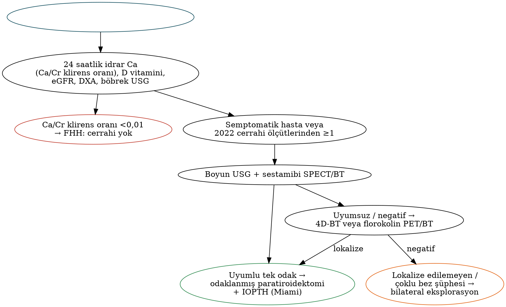

# Paratiroid Hastalıkları ve Cerrahisi

Primer hiperparatiroidi en sık görülen endokrin hastalıklardan biridir ve günümüzde çoğunlukla rutin biyokimyasal testlerde **asemptomatik hiperkalsemi** olarak saptanır. Başarılı paratiroid cerrahisi; biyokimyasal tanının doğru konmasına, görüntülemenin "tanı değil yer belirleme" aracı olduğunun bilinmesine, **embriyolojik göç yollarının** (Bölüm 1) hatırlanmasına ve intraoperatif PTH izlemine dayanır. Bu bölüm paratiroid fizyolojisini, primer hiperparatiroidinin tanı ve cerrahi endikasyonlarını (**5. Uluslararası Çalıştay, 2022**), lokalizasyon yöntemlerini, cerrahi stratejileri, kalıtsal sendromları, sekonder ve tersiyer hiperparatiroidiyi ve paratiroid karsinomunu ele alır.

## Anatomi ve fizyoloji

Normal paratiroid bezi yaklaşık 5 × 3 × 1 mm boyutunda, 30–50 mg ağırlığında, sarı-kahverengi bir dokudur. Olguların çoğunda **dört bez** bulunur; ≈%13'ünde süpernümerer bez (en sık timusta) vardır. **Üst bezler RLS düzleminin dorsalinde, alt bezler ventralinde** yer alır; her ikisi de çoğunlukla inferior tiroid arterden beslenir (ayrıntılı ektopi haritası için Bölüm 1).

**Parathormon (PTH)**, esas hücrelerdeki **kalsiyum duyarlı reseptör (CaSR)** aracılığıyla serum iyonize kalsiyumuna yanıt olarak salgılanır ve:

- Kemikte (osteoblast RANKL aracılığıyla) **rezorpsiyonu** artırır,
- Distal tübülde kalsiyum geri emilimini artırır, **fosfatüriye** yol açar,
- Böbrekte **1α-hidroksilasyonu** artırarak kalsitriol aracılığıyla bağırsaktan kalsiyum emilimini artırır.

PTH'nin **yarılanma ömrü ≈3–5 dakikadır**; intraoperatif PTH izleminin dayanağı budur.

## Primer hiperparatiroidi (PHPT)

### Etiyoloji ve klinik

Tablo: Primer hiperparatiroidinin nedenleri
| Neden | Sıklık |
|---|---|
| **Tek adenom** | **≈%80–85** |
| Çoklu bez hastalığı (hiperplazi) | ≈%10–15 (MEN1, MEN2A, lityum, ailesel formlar) |
| Çift adenom | ≈%2–5 |
| **Paratiroid karsinomu** | **<%1** |

Kadınlarda (≈3:1), özellikle postmenopozal dönemde sıktır.

!!! hafiza "Klasik bulgular — 'taşlar, kemikler, karın ağrıları, iniltiler, tuvalet'"
    **Böbrek taşı** ve nefrokalsinoz; **kemik** hastalığı (osteoporoz — özellikle **distal 1/3 radiusta** kortikal kayıp, **osteitis fibrosa sistika**, kahverengi tümörler, orta falankslarda radiyal subperiostal rezorpsiyon, kafatasında "tuz-biber" görünümü); **gastrointestinal** yakınmalar (kabızlık, peptik ülser, pankreatit); **nöropsikiyatrik** belirtiler (depresyon, yorgunluk, kognitif bozukluk); **poliüri**. Ayrıca hipertansiyon ve kas güçsüzlüğü.

### Biyokimyasal tanı

- **Hiperkalsemi + yüksek veya hiperkalsemiye göre uygunsuz normal PTH**.
- **Normokalsemik PHPT:** Total ve iyonize kalsiyum normal, PTH yüksek; tanıdan önce sekonder nedenler (**D vitamini eksikliği**, KBH, hiperkalsiüri, tiyazid ve lityum) dışlanmalıdır.
- **24 saatlik idrar kalsiyumu:** **Ailesel hipokalsiürik hiperkalseminin (FHH)** dışlanması için zorunludur — CaSR fonksiyon kaybı mutasyonu, otozomal dominant; **kalsiyum/kreatinin klirens oranı <0,01** FHH'yi düşündürür. **FHH'de cerrahi endike değildir.**
- 25-OH D vitamini, kreatinin/eGFR, **DXA** (lomber, kalça ve **distal 1/3 radius**), böbrek görüntülemesi (taş, nefrokalsinoz).

Tablo: Hiperkalseminin ayırıcı tanısı
| PTH aracılı (PTH yüksek/uygunsuz normal) | PTH'den bağımsız (PTH baskılı) |
|---|---|
| Primer hiperparatiroidi | **Malignite:** PTHrP (SHK — humoral hiperkalsemi), osteolitik metastazlar, multipl miyelom, lenfoma (kalsitriol) |
| Tersiyer hiperparatiroidi | Granülomatöz hastalıklar (sarkoidoz, tüberküloz — kalsitriol) |
| FHH | D vitamini zehirlenmesi |
| Lityum kullanımı | Tirotoksikoz, immobilizasyon, süt-alkali sendromu, tiyazidler |

Hastanede yatan hastada hiperkalseminin en sık nedeni **malignite**, ayaktan hastada **primer hiperparatiroididir**.

### Cerrahi endikasyonları

Semptomatik PHPT'de **cerrahi** endikedir. Asemptomatik hastada ise aşağıdaki ölçütlerden biri yeterlidir.

!!! kilavuz "5. Uluslararası Asemptomatik PHPT Çalıştayı (Bilezikian ve ark., JBMR 2022) — cerrahi endikasyonları"
    - **Serum kalsiyumu**, üst normal sınırın **>1 mg/dL (0,25 mmol/L)** üzerinde.
    - **İskelet:** Lomber omurga, total kalça, femur boynu veya **distal 1/3 radiusta T skoru ≤ −2,5**; görüntülemeyle saptanan **vertebra kırığı**.
    - **Böbrek:** **eGFR <60 mL/dk**; görüntülemeyle **nefrolitiyazis veya nefrokalsinoz**; **hiperkalsiüri** (24 saatlik idrar kalsiyumu kadında **>250 mg/gün**, erkekte **>300 mg/gün**).
    - **Yaş <50.**
    - Kontrendikasyon yoksa, ölçütleri karşılamayan hastalarda da cerrahi **her zaman uygun bir seçenektir** (tek küratif tedavi).

Cerrahi uygulanmayan hastalarda: hidrasyon, tiyazid ve lityumdan kaçınma, **D vitamininin (≈30 ng/mL'ye) tamamlanması**, gerektiğinde **sinakalset** (kalsiyumu düşürür, kemik yoğunluğunu artırmaz) ve kemik için bisfosfonat/denosumab; yıllık kalsiyum ve eGFR, 1–2 yılda bir DXA izlemi.

## Lokalizasyon çalışmaları

!!! dikkat "Temel ilke"
    Görüntüleme **tanı koymak için değil**, biyokimyasal olarak kanıtlanmış hiperparatiroidide **cerrahi stratejiyi belirlemek** için yapılır. Negatif görüntüleme cerrahi endikasyonu ortadan kaldırmaz; bu hastalar deneyimli cerrah tarafından **bilateral eksplorasyonla** tedavi edilebilir.

Tablo: Paratiroid lokalizasyon yöntemleri
| Yöntem | Özellik |
|---|---|
| **Boyun USG'si** (tercihen cerrah tarafından) | Ucuz, radyasyonsuz; tek adenomda iyi duyarlılık; eş zamanlı tiroid nodüllerini gösterir; obezite ve ektopik bezlerde sınırlı |
| **Tc-99m sestamibi sintigrafisi ± SPECT/BT** | Mitokondriden zengin oksifil hücrelerde ilacın **gecikmeli yıkanması**; tek adenomda yüksek, **çoklu bez hastalığında düşük** duyarlılık; yanlış pozitiflik: onkositik tiroid nodülleri, lenf nodları |
| **4D-BT** (dört fazlı) | Adenomda **arteriyel fazda hızlı kontrastlanma ve hızlı yıkanma**; yüksek duyarlılık; **reoperasyon ve negatif sintigrafide** değerli; radyasyon dozu |
| **18F-florokolin PET/BT** | Çok yüksek duyarlılık; Avrupa'da (EANM) ilk veya ikinci basamakta giderek artan kullanım |
| MR (4D-MR) | Radyasyonsuz alternatif |
| Seçici venöz örnekleme | Lokalize edilemeyen reoperasyon olgularında |
| İİAB + PTH yıkama | İntratiroidal paratiroid şüphesinde; **karsinom şüphesinde yapılmaz** (ekim → paratiromatozis) |

**USG ve sestamibi uyumluysa** hasta **odaklanmış (minimal invaziv) paratiroidektomi** için uygun adaydır.

## Cerrahi teknikler

### Bilateral boyun eksplorasyonu ve odaklanmış paratiroidektomi

- **Bilateral boyun eksplorasyonu:** Dört bezin tanımlanması; tarihsel altın standarttır ve kür oranı ≈%95–98'dir. Lokalize edilemeyen hastalık, **çoklu bez şüphesi** (MEN, lityum, ailesel formlar, sekonder HPT), uyumsuz görüntüleme ve eş zamanlı tiroid cerrahisinde gereklidir.
- **Odaklanmış (minimal invaziv) paratiroidektomi:** İyi lokalize tek adenomda küçük insizyonla hedefe yönelik eksizyon ve **intraoperatif PTH (IOPTH)** doğrulaması; kür oranları benzer, ameliyat süresi ve morbidite daha azdır; lokal anestezi altında da yapılabilir. Video yardımlı (MIVAP), endoskopik ve radyo-yönlendirmeli (gama prob) varyantları vardır.

### İntraoperatif PTH izlemi

Tablo: IOPTH ölçütleri
| Ölçüt | Tanım |
|---|---|
| **Miami ölçütü** (en yaygın) | Bez çıkarıldıktan **10 dakika sonra** PTH'nin, **insizyon öncesi veya eksizyon öncesi değerlerden yüksek olanına göre ≥%50 düşmesi** |
| Viyana | İnsizyon öncesi değere göre 10. dakikada ≥%50 düşüş |
| Roma ve Halle | Ek olarak referans aralığına (Halle: düşük-normal) düşüş şartı |

Yeterli düşüş olmaması **çoklu bez hastalığını** düşündürür ve eksplorasyonun genişletilmesini gerektirir. Frozen kesit dokunun paratiroid olduğunu doğrular; ancak adenom–hiperplazi ayrımında güvenilir değildir.

### Kayıp bezin bulunması

Tablo: Bulunamayan paratiroid bezinde sistematik arama
| Kayıp bez | Aranacak yerler |
|---|---|
| **Üst bez** | RLS'nin **dorsali**, trakeoözofageal oluk, **retroözofageal ve retrofarengeal** alan (posterior mediastene kadar), karotis kılıfı, lob üst kutbunun arkası, nadiren intratiroidal |
| **Alt bez** | **Tirotimik ligament ve servikal timus** (transservikal timektomi), **karotis kılıfı boyunca karotis bifurkasyonuna kadar** (inmemiş bez), intratiroidal (intraoperatif USG; son çare olarak ipsilateral lobektomi), anterior mediasten |

Körlemesine tiroidektomi erken bir adım olmamalıdır; dört normal bez bulunmuşsa **süpernümerer/ektopik beşinci bez** (en sık timusta) düşünülmelidir.

### Çoklu bez hastalığında cerrahi

- **Subtotal paratiroidektomi:** 3,5 bezin çıkarılması, yaklaşık **50 mg** kadar iyi kanlanan bir kalıntının bırakılması (klip/dikişle işaretlenir).
- **Total paratiroidektomi + ototransplantasyon:** Bezin parçalarının **önkol brakiyoradyalis kasına** yerleştirilmesi (gelecekte lokal anestezi altında revizyon kolaylığı) ± kriyoprezervasyon.
- **Bilateral servikal timektomi** (süpernümerer bezler), özellikle MEN1 ve sekonder HPT'de.

### Sonuçlar ve komplikasyonlar

**Kür**, ameliyattan sonra en az **6 ay normokalsemi** ile tanımlanır. İlk 6 ay içinde süren hiperkalsemi **persistan**, 6 aylık normokalsemiden sonra ortaya çıkan hiperkalsemi **rekürren** hastalıktır. Başarısızlığın başlıca nedenleri gözden kaçan çoklu bez hastalığı ve ektopik bezlerdir.

Komplikasyonlar: RLS hasarı (nadir), hematom, geçici hipokalsemi ve **aç kemik sendromu**, subtotal/total paratiroidektomi ve reoperasyon sonrası kalıcı hipoparatiroidi.

!!! sinav "Sınav notu — aç kemik sendromu"
    Kemik döngüsü yüksek hastalarda (yüksek ALP, osteitis fibrosa, büyük adenom, sekonder HPT) paratiroidektomi sonrası kemiğe hızlı mineral girişiyle gelişen **uzamış ve ağır hipokalsemi, hipofosfatemi ve hipomagnezemidir**. Önleme: ameliyat öncesi **D vitamini tamamlanması**. Tedavi: yüksek doz oral (gerekirse IV) kalsiyum, kalsitriol ve magnezyum. (Tiroidektomi sonrası hipoparatiroidide ise fosfat yüksek veya normaldir.)

## Kalıtsal hiperparatiroidi sendromları

Tablo: Kalıtsal hiperparatiroidi sendromları
| Sendrom | Gen | Paratiroid tutulumu | Diğer bulgular | Cerrahi yaklaşım |
|---|---|---|---|---|
| **MEN1** | **MENIN** (11q13) | **≈%90–95**; genellikle ilk bulgu (20–25 yaş); **asimetrik çoklu bez hiperplazisi** | Pankreatik nöroendokrin tümörler (gastrinoma, insülinoma), hipofiz adenomu (prolaktinoma) | **Subtotal (3,5 bez)** veya total + ototransplantasyon **+ bilateral servikal timektomi**; odaklanmış cerrahi uygun değil; nüks sık |
| **MEN2A** | **RET** | ≈%20–30; daha hafif, sıklıkla bir–iki bez büyük | Medüller tiroid karsinomu, feokromositoma | Yalnızca büyümüş bezlerin çıkarılması; **önce feokromositoma** tedavi edilir |
| MEN4 | CDKN1B | MEN1 benzeri | — | MEN1 gibi |
| **Hiperparatiroidi–çene tümörü (HPT-JT)** | **CDC73** (parafibromin) | Sıklıkla tek adenom; **paratiroid karsinomu riski belirgin artmış** | **Mandibula/maksilla ossifiye fibromları**, böbrek kistleri/tümörleri, uterus tümörleri | Bezin dikkatli, gerekirse en blok eksizyonu; yakın izlem |
| **FHH** | CaSR (tip 1), GNA11, AP2S1 | Hafif hiperkalsemi, **düşük idrar kalsiyumu** | Benign seyir | **Cerrahi endike değil**; homozigot formda (neonatal ağır HPT) acil total paratiroidektomi |

**Lityuma bağlı hiperparatiroidi** çoklu bez hastalığı ile daha sık ilişkilidir; bilateral eksplorasyon önerilir.

## Sekonder ve tersiyer hiperparatiroidi

Tablo: Primer, sekonder ve tersiyer hiperparatiroidinin karşılaştırması
| Özellik | Primer | Sekonder (renal) | Tersiyer |
|---|---|---|---|
| Mekanizma | Otonom bez (adenom/hiperplazi) | **KBH** → fosfat retansiyonu, düşük kalsitriol, hipokalsemi, FGF23 artışı → **bezlerin uyarılması ve hiperplazisi** | Uzun süreli sekonder HPT sonrası **otonom** PTH salgısı; sıklıkla **böbrek nakli sonrası** |
| Kalsiyum | Yüksek | **Düşük veya normal** | **Yüksek** |
| Fosfat | Düşük/normal | **Yüksek** | Değişken |
| PTH | Yüksek | Çok yüksek | Yüksek |
| Tedavi | Paratiroidektomi | Fosfat bağlayıcılar, aktif D vitamini (kalsitriol, parikalsitol), **kalsimimetikler** (sinakalset, etelkalsetid); dirençli olguda subtotal veya total + ototransplantasyonlu paratiroidektomi | Subtotal paratiroidektomi (veya sinakalset) |

- **Sekonder HPT'de paratiroidektomi endikasyonları (KDIGO 2017 ilkeleri):** Tıbbi tedaviye dirençli ağır hiperparatiroidi, kontrol edilemeyen hiperkalsemi/hiperfosfatemi, **kalsifilaksi** (kalsifik üremik arteriyolopati — ağrılı deri nekrozu, yüksek mortalite), ağır kemik hastalığı ve kaşıntı. Diyaliz hastalarında hedef PTH, üst normal sınırın yaklaşık 2–9 katıdır.
- **Tersiyer HPT'de endikasyonlar:** Nakilden sonra yaklaşık bir yılı aşan kalıcı hiperkalsemi, ağır hiperkalsemi, hiperkalsemiye bağlı greft disfonksiyonu, kemik hastalığı/taş ve kalsifilaksi.
- Nakil adaylarında, adinamik kemik hastalığı ve kalıcı hipoparatiroidi riski nedeniyle **ototransplantasyonsuz total paratiroidektomiden** kaçınılır.

## Paratiroid karsinomu

PHPT olgularının **%1'inden azını** oluşturur.

- **Klinik ipuçları:** **Ağır hiperkalsemi** (sıklıkla >14 mg/dL), **çok yüksek PTH** (çoğunlukla üst sınırın >5 katı), **palpe edilebilir boyun kitlesi**, RLS paralizisi, eş zamanlı kemik ve böbrek hastalığı.
- Görünüşte sporadik olguların bir kısmında **germline CDC73** mutasyonu bulunur; immünohistokimyada **parafibromin kaybı** tanıya yardımcıdır.
- **Tanı histolojiktir:** Çevre dokulara invazyon, **anjiyoinvazyon**, lenfatik ve perinöral invazyon veya metastaz (DSÖ 2022). Bu ölçütleri tam karşılamayan şüpheli lezyonlar "**atipik paratiroid tümörü**" olarak adlandırılır.
- **Tedavi:** **En blok rezeksiyon** — tümör + **ipsilateral tiroid lobu** + tutulan yapılar (strap kaslar, invaze RLS); **kapsül rüptüründen kaçınılmalıdır** (paratiromatozis ve nüks). Şüpheli santral nodlarda santral diseksiyon; profilaktik lateral diseksiyonun yeri yoktur. **İİAB önerilmez.**
- Nüks sıktır; ölüm çoğunlukla tümör yükünden çok **kontrol edilemeyen hiperkalsemiye** bağlıdır. Hiperkalsemi yönetiminde sinakalset, bisfosfonatlar ve denosumab kullanılır.

!!! dikkat "Tuzak — ameliyat sırasında karsinomu tanımak"
    Sert, gri-beyaz, çevre dokuya (tiroid, strap kaslar, RLS) **yapışık** büyük bir paratiroid kitlesi karsinom açısından uyarıcıdır. Bu durumda bez "adenom gibi" kapsülünden enükle edilmemeli, **ipsilateral lobektomiyle en blok** çıkarılmalıdır; ilk ameliyatın yeterliliği prognozun en önemli belirleyicisidir.

## Hiperkalsemik kriz

Serum kalsiyumu genellikle >14 mg/dL'dir; bilinç bulanıklığı, dehidratasyon ve böbrek yetmezliği gelişir. Tedavi: **agresif IV serum fizyolojik**, volüm yerine konduktan sonra gerekirse kıvrım diüretikleri, **kalsitonin** (hızlı etki, taşifilaksi), **IV bisfosfonat** (zoledronik asit; etkisi 2–4 günde başlar), böbrek yetmezliğinde **denosumab**, sinakalset; granülomatöz hastalık, lenfoma veya D vitamini zehirlenmesinde glukokortikoid; dirençli olguda diyaliz. PHPT'ye bağlı krizde hasta stabilize edilince **erken paratiroidektomi** yapılır.

## Reoperatif paratiroid cerrahisi

Önce tanı yeniden doğrulanır (**FHH dışlanır**, biyokimya tekrarlanır), önceki ameliyat notları ve patoloji incelenir; **en az iki uyumlu lokalizasyon çalışması** (USG, sestamibi SPECT/BT, 4D-BT, kolin PET; gerekirse venöz örnekleme) elde edilir. Ameliyatta IOPTH ve IONM kullanılır; **lateral ("arka kapı") yaklaşım** skar dokusundan kaçınmayı sağlar.

!!! ozet "Kritik noktalar"
    - PHPT'nin ≈%80–85'i **tek adenom**, %10–15'i çoklu bez hastalığı, karsinom <%1. PTH yarılanma ömrü **3–5 dk** (IOPTH'nin temeli).
    - Tanı biyokimyasaldır: hiperkalsemi + yüksek/uygunsuz normal PTH; **24 saatlik idrar kalsiyumu** ile **FHH (Ca/Cr klirens oranı <0,01)** dışlanır — FHH'de cerrahi yok. Normokalsemik PHPT'de D vitamini eksikliği ve sekonder nedenler dışlanmalı.
    - **2022 cerrahi ölçütleri:** Ca >ÜNS + 1 mg/dL; **T skoru ≤ −2,5** (lomber, kalça, femur boynu, **distal 1/3 radius**) veya vertebra kırığı; **eGFR <60**, taş/nefrokalsinoz, **hiperkalsiüri >250 (K)/>300 (E) mg/gün**; **yaş <50**. Semptomatik hastada her zaman cerrahi.
    - Görüntüleme tanı koymaz, yer belirler: **USG + sestamibi SPECT/BT** uyumluysa odaklanmış cerrahi; negatif/reoperasyonda **4D-BT** veya **kolin PET**.
    - **Miami ölçütü:** eksizyondan 10 dk sonra PTH'nin en yüksek bazal değere göre **≥%50 düşmesi**.
    - Kayıp **üst bez** → RLS dorsali, trakeoözofageal oluk, retroözofageal alan; kayıp **alt bez** → tirotimik ligament/timus, karotis kılıfı (inmemiş bez), intratiroidal.
    - Çoklu bez hastalığında **subtotal (3,5 bez)** veya **total + önkola ototransplantasyon** ± servikal timektomi. **Aç kemik sendromu:** hipokalsemi + **hipofosfatemi** + hipomagnezemi.
    - **MEN1** (MENIN): ≈%95 PHPT, asimetrik hiperplazi, subtotal + timektomi; **MEN2A**: hafif PHPT, önce feokromositoma; **HPT-JT (CDC73)**: çene ossifiye fibromları ve **karsinom riski**.
    - **Sekonder HPT:** KBH, düşük/normal Ca, yüksek fosfat; kalsimimetik ve D vitamini analogları, dirençlide paratiroidektomi (kalsifilaksi). **Tersiyer HPT:** nakil sonrası hiperkalsemi.
    - **Paratiroid karsinomu:** Ca >14, PTH çok yüksek, **palpabl kitle**, RLS paralizisi; **parafibromin kaybı**; İİAB yok; **ipsilateral lobektomiyle en blok rezeksiyon**, kapsül rüptürü yok.
