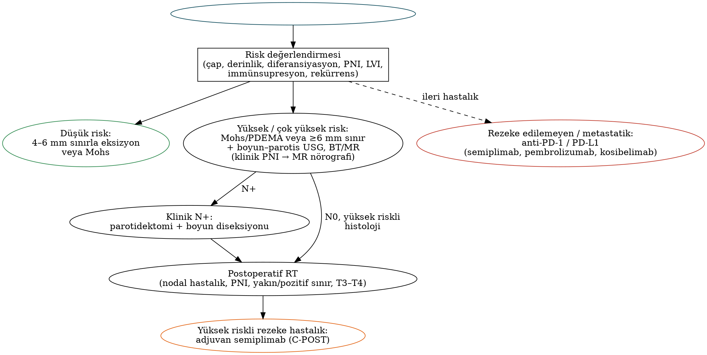

# Cilt Kanserleri, Lenfomalar, Sarkomlar ve Diğer Tümörler

Baş-boyun bölgesi, güneşe en çok maruz kalan bölge olarak **keratinosit kanserlerinin** (bazal ve skuamöz hücreli karsinom) ve **melanomun** önemli bir kısmına ev sahipliği yapar. Bu tümörlerin cerrahi yönetimi; yüzün estetik alt birimlerine saygı, parotis ve boyun lenfatiklerinin bilinmesi ve son yıllarda baş döndürücü hızla gelişen **immünoterapi** verileriyle birlikte ele alınmalıdır. Bölümün ikinci yarısında baş-boyunda SHK'den sonra en sık görülen malignite grubu olan **lenfomalar**, nadir ama sınavda sık sorulan **sarkomlar** ve **Langerhans hücreli histiyositoz, Castleman hastalığı** gibi diğer antiteler özetlenmiştir.

## Keratinosit kanserlerine genel bakış

Melanom dışı cilt kanserleri insanda en sık görülen kanserlerdir; ≈%75–80'i **bazal hücreli karsinom (BHK)**, ≈%20'si **kutanöz skuamöz hücreli karsinomdur (kSKH)**. BHK'lerin ≈%80'i baş-boyunda, en sık **burunda** yerleşir. İmmünkompetan bireylerde BHK:kSKH oranı ≈4:1 iken **solid organ nakli** alıcılarında bu oran tersine döner.

Tablo: Keratinosit kanserlerinde risk etmenleri
| Etmen | Açıklama |
|---|---|
| **Ultraviyole (UVB > UVA)**, açık ten (Fitzpatrick I–II) | Kümülatif güneş maruziyeti → kSKH; aralıklı yoğun maruziyet ve çocuklukta güneş yanığı → BHK ve melanom |
| **İmmünsupresyon** | Solid organ naklinde kSKH riski **≈65–250 kat** artar; daha agresif seyir. KLL ve HIV de riski artırır |
| Genetik sendromlar | **Kseroderma pigmentozum** (nükleotid eksizyon onarımı), okülokütanöz albinizm, **Gorlin sendromu** (PTCH1) |
| Kronik yara ve skar | **Marjolin ülseri** (yanık skarı, kronik ülser) — agresif kSKH |
| Diğer | İyonizan radyasyon, arsenik, HPV, vorikonazol, BRAF inhibitörleri (keratoakantom/kSKH) |

## Bazal hücreli karsinom

BHK yavaş büyüyen, lokal olarak destrüktif ama **metastazı son derece nadir** (≈%0,003–0,5) bir tümördür. Hedgehog yolağı aktivasyonu (sıklıkla **PTCH1** fonksiyon kaybı → SMO aktivasyonu) patogenezin merkezindedir. Histolojide **periferik palizatlanma**, stromadan **retraksiyon artefaktı** (yarıklar) ve BerEP4 pozitifliği tipiktir.

Tablo: BHK alt tipleri ve biyolojik davranış
| Alt tip | Klinik özellik | Risk |
|---|---|---|
| **Nodüler** (≈%50–60) | İnci görünümlü, telenjiektazik papül; santral ülserasyon ("rodent ülser") | Düşük |
| Yüzeyel | Gövdede eritemli, ince plak | Düşük |
| **Morfeaform (sklerozan), infiltratif, mikronodüler** | Skar benzeri, sınırları belirsiz; geniş **subklinik yayılım** | **Yüksek** |
| **Bazoskuamöz (metatipik)** | kSKH benzeri davranış, metastaz potansiyeli | **Yüksek** |
| Pigmente | Melanomla karışabilir | Düşük |

!!! sinav "Gorlin–Goltz (nevoid BHK) sendromu"
    **PTCH1** (9q22.3) mutasyonu, otozomal dominant. Genç yaşta **çok sayıda BHK**, çenede **odontojenik keratokistler** (Bölüm 12), **avuç içi/ayak tabanı çukurcukları**, **falks serebri kalsifikasyonu**, bifid kaburga, frontal çıkıntı ve medulloblastom (özellikle SUFU). Bu hastalarda **radyoterapiden kaçınılır** (alanda yeni BHK'ler gelişir).

### Risk sınıflaması ve tedavi

NCCN sınıflamasında **baş-boyun yerleşimi, boyutundan bağımsız olarak yüksek risk** özelliğidir; ayrıca sınırların belirsizliği, rekürren tümör, immünsupresyon, önceki RT alanı, agresif histolojik alt tip ve **perinöral invazyon** yüksek risk ölçütleridir. Gövde ve ekstremitede <2 cm, sınırları belirgin, primer nodüler/yüzeyel tümörler düşük risklidir.

- **Düşük riskli BHK:** **4 mm** klinik sınırla standart eksizyon (<2 cm, sınırları belirgin tümörlerde ≈%95 temizlik); yüzeyel BHK'de küretaj-elektrodesikasyon, topikal **imikimod/5-FU** veya fotodinamik tedavi.
- **Yüksek riskli BHK:** **Mohs mikrografik cerrahisi** (tüm periferik ve derin sınırın intraoperatif incelenmesi; doku koruyucu; primer BHK'de kür ≈%99) veya **PDEMA** (periferik ve derin "en face" sınır değerlendirmesi) / frozen kesit eşliğinde eksizyon. Defekt, sınırlar kesinleşmeden lokal fleple kapatılmamalıdır.
- **Radyoterapi:** Cerrahiye uygun olmayan, genellikle >60 yaş hastalarda; genetik sendromlar ve bağ dokusu hastalıklarında kontrendikedir.
- **Lokal ileri/metastatik BHK:** **Hedgehog yolağı inhibitörleri** (SMO inhibitörleri **vismodegib, sonidegib**) — yan etkiler: kas krampları, tat bozukluğu, alopesi, kilo kaybı; teratojenik. Hedgehog inhibitörüne yanıtsız veya intoleran hastada **semiplimab** (anti-PD-1).

!!! klinik "Klinik inci — yüzde 'H bölgesi' ve embriyonik kaynaşma hatları"
    Burun kanadı, nazolabial oluk, iç kantus, periaurikuler bölge ve kulak kepçesi gibi embriyonik kaynaşma hatlarında BHK derine ve kemik/kıkırdak boyunca **beklenenden geniş** yayılır. Bu alanlarda **Mohs cerrahisi** nüksü en aza indirir; rekonstrüksiyon (Bölüm 11) yalnızca **negatif sınır** doğrulandıktan sonra planlanmalıdır.

## Kutanöz skuamöz hücreli karsinom

### Öncül lezyonlar ve klinik

- **Aktinik keratoz:** Güneş hasarlı ciltte pürüzlü, eritemli makül/papül; tek lezyonun yıllık invaziv kSKH'ye ilerleme riski düşüktür (≈%0,1), ancak hastaların çoğunda çok sayıda lezyon vardır ("alan kanserizasyonu").
- **Bowen hastalığı:** kSKH in situ; iyi sınırlı, kepekli eritemli plak.
- **Keratoakantom:** Haftalar içinde hızla büyüyen, ortasında **keratin tıkacı** bulunan krater şeklinde nodül; kendiliğinden gerileyebilir, ancak iyi diferansiye kSKH'den histolojik ayrımı güç olduğundan **kSKH gibi tedavi edilir** (eksizyon).

kSKH'de genel nodal metastaz oranı ≈%2–5'tir; ancak yüksek risk özellikleri varlığında belirgin artar. Yüz, saçlı deri ve kulak kepçesi tümörlerinde ilk nodal istasyon sıklıkla **parotis (intraparotid/periparotid) nodlarıdır**; güneşin yoğun olduğu Avustralya'da **parotisin en sık malignitesi metastatik kSKH'dir**.

Tablo: kSKH'de yüksek risk özellikleri (NCCN ve AJCC 8 temelinde)
| Klinik | Histopatolojik |
|---|---|
| Çap >2 cm (**>4 cm: çok yüksek risk**) | Derinlik **>6 mm** veya **subkutan yağ dokusunun ötesine** invazyon |
| **Baş-boyun yerleşimi** (özellikle **kulak, dudak**, şakak) | **Kötü diferansiyasyon**; desmoplastik, akantolitik, adenoskuamöz alt tipler |
| Sınırları belirsiz veya **rekürren** tümör | **Perinöral invazyon** (≥0,1 mm çaplı veya dermis altındaki sinir) |
| **İmmünsupresyon** | **Lenfovasküler invazyon** |
| Önceki RT ya da kronik enflamasyon alanı | Kemik invazyonu |
| Hızlı büyüme; **nörolojik belirtiler** (uyuşma, karıncalanma, fasiyal güçsüzlük) | — |

### Evreleme

AJCC 8, kSKH için **yalnızca baş-boyun bölgesine** özgü bir evreleme tanımlar. Nodal (N) sınıflama, HPV ile ilişkisiz mukozal SHK ile aynıdır ve **ENE** içerir (Bölüm 9).

Tablo: Baş-boyun kSKH — AJCC 8 T sınıflaması
| T | Tanım |
|---|---|
| Tis | Karsinoma in situ |
| T1 | En büyük çap **<2 cm** |
| T2 | **≥2 cm, <4 cm** |
| T3 | **≥4 cm** veya **minör kemik erozyonu** veya **perinöral invazyon** veya **derin invazyon** (>6 mm ya da subkutan yağın ötesi) |
| T4a | Belirgin **kortikal kemik/kemik iliği** invazyonu |
| T4b | **Kafa tabanı** invazyonu ve/veya kafa tabanı foramen tutulumu |

Alternatif **Brigham and Women's Hospital (BWH)** evrelemesi dört risk etmenini sayar — çap ≥2 cm, kötü diferansiyasyon, ≥0,1 mm sinirde perinöral invazyon, subkutan yağın ötesine invazyon: T1 (0 etmen), **T2a** (1), **T2b** (2–3), **T3** (≥4 etmen veya kemik invazyonu). Nodal metastaz ve hastalığa bağlı ölümlerin büyük çoğunluğu T2b–T3 grubunda toplanır; prognostik ayrımı AJCC 8'den daha iyidir.

!!! sinav "Perinöral invazyon: insidental mi, klinik mi?"
    - **İnsidental (mikroskopik) PNI:** Yalnızca histolojide saptanır; ≥0,1 mm çaplı sinirde veya dermis altında ise T3'e yükseltir ve adjuvan RT gerekçesidir.
    - **Klinik/radyolojik PNI:** Yüzde uyuşma, karıncalanma ("formikasyon"), ağrı veya fasiyal güçsüzlük; **MR nörografi** ile sinir boyunca kontrast tutulumu. En sık **V2 (infraorbital sinir)** ve **fasiyal sinir** tutulur; tümör **Meckel boşluğu**, foramen rotundum/ovale ve stilomastoid foramene "atlayan" lezyonlarla ilerleyebilir. Kafa tabanı tutulumu **T4b**'dir; tedavi alanı sinir yolu boyunca kafa tabanına kadar uzatılır.

### Cerrahi tedavi

- **Primer tümör:** Düşük riskli tümörlerde **4–6 mm**, yüksek riskli tümörlerde **≥6 mm** klinik sınır veya **Mohs/PDEMA**. Kemik ya da kıkırdak tutulumunda segmenter rezeksiyon; sinir tutulumunda frozen kesitle proksimal sinir sınırı.
- **Klinik N+ hastalık:** **Parotidektomi** (yüzeyel veya total; fasiyal sinir doğrudan tutulmadıkça korunur) + primer yerleşimine göre planlanan **boyun diseksiyonu**.
- **Klinik N0:** Rutin elektif parotidektomi/boyun diseksiyonu önerilmez; **çok yüksek riskli** (T3–T4, rekürren kulak/şakak) tümörlerde parotis + seviye II–III seçilmiş olgularda düşünülebilir. Sentinel lenf nodu biyopsisi araştırma düzeyindedir.

Tablo: kSKH ve melanomda primer yerleşimine göre lenfatik drenaj ve cerrahi
| Primer yerleşim | İlk drenaj | Klinik N+ hastalıkta cerrahi |
|---|---|---|
| Alın, şakak, ön saçlı deri, yanak, kulak kepçesi ön yüzü | **Parotis** → seviye II | **Parotidektomi + seviye I–III** (yüz önü için I dahil) |
| Dudak, çene, burun, yanak alt bölümü | Seviye I (submental/submandibular) → II | Seviye I–III |
| Kulak kepçesi arkası, arka saçlı deri, ense | **Postaurikular, suboksipital** → seviye II ve V | **Posterolateral boyun diseksiyonu** (II–V + postaurikular/suboksipital nodlar) |

### Adjuvan radyoterapi ve sistemik tedavi

**Postoperatif RT endikasyonları:** nodal hastalık (parotis ve/veya boyun; özellikle ENE veya çoklu nod), **perinöral invazyon** (özellikle adı olan/kalın sinir), yeniden eksize edilemeyen yakın/pozitif sınır, T3–T4 tümör, rekürren tümör ve immünsupresyon.

!!! kilavuz "Postoperatif RT'ye kemoterapi eklenmeli mi? — TROG 05.01"
    Yüksek riskli baş-boyun kSKH'li 321 hastada postoperatif RT'ye **haftalık karboplatin eklenmesi** lokorejyonel kontrolü ve sağkalımı **iyileştirmemiştir** (Porceddu, JCO 2018). Mukozal SHK'nin aksine kSKH'de **postoperatif RT tek başına** standarttır; eşzamanlı kemoterapi rutin değildir.

Tablo: İleri evre kSKH'de immün kontrol noktası inhibitörleri
| İlaç | Hedef | Dayanak çalışma (onay) | Yanıt oranı |
|---|---|---|---|
| **Semiplimab** | PD-1 | EMPOWER-CSCC-1 (FDA 2018) | ≈%45–50; kalıcı yanıtlar |
| **Pembrolizumab** | PD-1 | KEYNOTE-629 (FDA 2020–2021) | ≈%35–50 |
| **Kosibelimab** | PD-L1 | CK-301-101 (**FDA Aralık 2024**) | ≈%47 (metastatik) |
| Setuksimab | EGFR | — | İmmünoterapiye uygun olmayan hastalarda (ör. nakil alıcıları) |

!!! guncel "Adjuvan ve neoadjuvan immünoterapi (2022–2025)"
    - **C-POST** (Rischin, NEJM 2025): Cerrahi + postoperatif RT sonrası yüksek riskli kSKH (ENE'li veya çoklu nodal hastalık, T4, perinöral invazyon, ek risk etmenli rekürren tümör); **semiplimab vs plasebo**. Hastalıksız sağkalım **HR 0,32**; 24 aylık DFS **%87,1 vs %64,1**. **FDA onayı: 8 Ekim 2025** — yüksek riskli kSKH'de cerrahi ve RT sonrası **ilk adjuvan immünoterapi**.
    - **KEYNOTE-630:** Benzer popülasyonda adjuvan pembrolizumab, ara analizde **etkisizlik nedeniyle durdurulmuştur** (24 aylık RFS %78,3 vs %68,6; HR 0,76; anlamlı değil). Aynı sınıftan iki ajanın farklı sonuçları, hasta seçimi ve çalışma tasarımı farklarıyla açıklanmaktadır.
    - **Neoadjuvan semiplimab** (Gross, NEJM 2022; faz 2, rezektabl evre II–IV): 4 doz sonrası **patolojik tam yanıt %51**, majör patolojik yanıt %13. Organ ve yüz koruyucu, yanıta göre uyarlanmış cerrahi stratejiler araştırılmaktadır.

!!! dikkat "Tuzak — nakil alıcısında kSKH"
    Solid organ nakli alıcılarında kSKH daha erken, çok odaklı ve agresiftir. Yönetimde nakil ekibiyle birlikte **immünsupresyonun azaltılması** ve kalsinörin inhibitörlerinden **mTOR inhibitörlerine (sirolimus)** geçiş, sistemik retinoid (asitretin) ile kemoprevansiyon düşünülür. İmmün kontrol noktası inhibitörleri **greft rejeksiyonu** riski taşır; karar multidisipliner verilmelidir. Nikotinamid, immünkompetan yüksek riskli hastalarda yeni keratinosit kanserlerini ≈%23 azaltmış (ONTRAC), nakil alıcılarında ise anlamlı yarar göstermemiştir (ONTRANS).

## Melanom

Kutanöz melanomların ≈%20–25'i baş-boyunda görülür. Bu bölgedeki melanomlar karmaşık ve öngörülmesi güç lenfatik drenaj, estetik/fonksiyonel nedenlerle sınırlı rezeksiyon olanağı ve özellikle **saçlı deri** yerleşiminde daha kötü prognozla ilişkilidir.

Tablo: Melanomun klinikopatolojik alt tipleri
| Alt tip | Özellik |
|---|---|
| **Yüzeyel yayılan** | En sık tip (≈%60–70); uzun radyal büyüme fazı |
| **Nodüler** | ≈%15–30; erken **dikey büyüme**; kabarık, sert, hızla büyüyen lezyon; kötü prognoz |
| **Lentigo maligna melanom** | Yaşlı, kronik güneş hasarlı **yüz derisi**; uzun in situ faz (**lentigo maligna**); sınırları belirsiz |
| Akral lentiginöz | Avuç içi, ayak tabanı, tırnak altı; koyu tenlilerde en sık tip |
| **Desmoplastik** | Baş-boyunda sık; **nörotropizm**; S100/SOX10 (+), HMB-45 ve Melan-A sıklıkla (−); saf formda nodal yayılım düşük, lokal nüks yüksek |
| Mukozal | Sinonazal kavite ve ağız boşluğu — Bölüm 29 |

!!! hafiza "ABCDE ve 'çirkin ördek yavrusu'"
    **A**simetri, **B**order (düzensiz kenar), **C**olor (renk çeşitliliği), **D**iameter (>6 mm), **E**volution (boyut, şekil, renk değişimi). Hastanın diğer nevüslerinden farklı görünen lezyon (**çirkin ördek yavrusu işareti**) şüphelidir.

### Tanı ve patoloji

**Tam kat eksizyonel biyopsi** (1–3 mm sınır) altın standarttır; eksizyon ekseni olası geniş eksizyonu ve lenfatik akımı bozmayacak şekilde planlanmalı, biyopsi aşamasında geniş sınır ve lokal flepten kaçınılmalıdır. Yüzde büyük lezyonlarda (ör. lentigo maligna) en şüpheli alandan insizyonel/punch biyopsi kabul edilebilir.

Patoloji raporunda **Breslow kalınlığı** (lokalize hastalıkta en önemli prognostik etmen), **ülserasyon**, mitoz sayısı, mikrosatellitler, lenfovasküler invazyon, nörotropizm ve sınır durumu bulunmalıdır. İmmünohistokimyada S100, SOX10, HMB-45, Melan-A ve PRAME; moleküler olarak **BRAF V600** (≈%40–50), **NRAS** (≈%20), **KIT** (akral/mukozal) ve NF1 (desmoplastik) değişiklikleri önemlidir.

Tablo: Melanom — AJCC 8 T sınıflaması ve önerilen cerrahi sınırlar (NCCN)
| T | Breslow kalınlığı | Ülserasyon | Klinik eksizyon sınırı |
|---|---|---|---|
| Tis | In situ | — | **0,5–1 cm** (lentigo malignada daha geniş/aşamalı eksizyon) |
| T1a | **<0,8 mm** | Yok | **1 cm** |
| T1b | <0,8 mm ülserli **veya 0,8–1,0 mm** | Var/yok | 1 cm |
| T2 (a/b) | >1,0–2,0 mm | a: yok · b: var | **1–2 cm** |
| T3 (a/b) | >2,0–4,0 mm | a: yok · b: var | **2 cm** |
| T4 (a/b) | **>4,0 mm** | a: yok · b: var | 2 cm |

AJCC 8'de mitoz sayısı T1 alt sınıflamasından çıkarılmış ve eşik **0,8 mm** olarak belirlenmiştir. Baş-boyunda fonksiyonel/estetik alt birimlerde sınır, negatif histolojik sınırı sağlamak koşuluyla uyarlanabilir.

### Sentinel lenf nodu biyopsisi

- **T1a:** Genellikle önerilmez (SLN pozitifliği <%5).
- **T1b:** Tartışılır ve **düşünülür** (pozitiflik ≈%5–10).
- **T2–T4 (>1 mm):** **Önerilir** (pozitiflik T kategorisiyle artarak ≈%15–35+).

Baş-boyunda SLNB, **preoperatif lenfosintigrafi + SPECT/BT** ile planlanır; olguların ≈1/3'ünde drenaj klinik olarak beklenenden farklıdır ve çoklu havzalara olabilir. Parotis içindeki sentinel nodlar **fasiyal sinir monitörizasyonu** eşliğinde çıkarılır. Baş-boyunda yanlış negatiflik oranı gövde ve ekstremiteye göre daha yüksektir. SLNB, geniş eksizyonla **aynı seansta veya önce** yapılmalıdır; önceden yapılan geniş eksizyon ve lokal flep rekonstrüksiyonu lenfatik haritalamayı bozar.

!!! kilavuz "MSLT-I ve MSLT-II: sentinel lenf nodu ve tamamlayıcı diseksiyon"
    - **MSLT-I** (Morton, NEJM 2014): Orta kalınlıktaki (1,2–3,5 mm) melanomda SLNB'ye dayalı evreleme hastalıksız sağkalımı artırmış, tüm popülasyonda melanoma özgü sağkalımı değiştirmemiştir; SLNB'nin değeri **evreleme ve bölgesel kontroldür**.
    - **MSLT-II** (Faries, NEJM 2017): SLN pozitif 1939 hastada **hemen tamamlayıcı lenf nodu diseksiyonu (CLND)** ile **USG ile nodal izlem** karşılaştırıldı. 3 yıllık melanoma özgü sağkalım **her iki kolda ≈%86** (fark yok); CLND nodal havza kontrolünü artırdı (ek nodal metastaz oranı %11,5), ancak **lenfödem %24,1 vs %6,3** idi. DeCOG-SLT çalışması benzer sonuç verdi.
    - **Sonuç:** SLN pozitif hastada rutin CLND yerine **USG ile düzenli nodal izlem** ve **adjuvan sistemik tedavi** standarttır.

### Klinik nod pozitif hastalık ve sistemik tedavi

Klinik/radyolojik nodal hastalıkta klasik tedavi **terapötik boyun diseksiyonu**dur (ön saçlı deri, yüz ve kulak primerlerinde **parotidektomi** eklenir). Günümüzde ise bu hastalarda cerrahi öncesinde **neoadjuvan immünoterapi** standart seçenek hâline gelmiştir.

!!! guncel "Neoadjuvan immünoterapi: evre III melanomda paradigma değişikliği"
    - **SWOG S1801** (Patel, NEJM 2023): Rezektabl evre IIIB–IV; **neoadjuvan pembrolizumab** (3 doz) → cerrahi → adjuvan (15 doz) ile cerrahi → adjuvan (18 doz) karşılaştırıldı; **2 yıllık olaysız sağkalım %72 vs %49**.
    - **NADINA** (Blank, NEJM 2024): Makroskopik evre III; **neoadjuvan ipilimumab + nivolumab (2 kür)** → cerrahi (yanıta göre adjuvan) ile cerrahi + adjuvan nivolumab karşılaştırıldı; **12 aylık olaysız sağkalım %83,7 vs %57,2**. Majör patolojik yanıt elde edilen hastalarda adjuvan tedaviye gerek kalmadı.
    - Klinik olarak nod pozitif hasta, ameliyattan önce multidisipliner kurulda neoadjuvan tedavi açısından değerlendirilmelidir.

- **Adjuvan tedavi (rezeke evre III):** Anti-PD-1 — **nivolumab** (CheckMate 238) veya **pembrolizumab** (KEYNOTE-054); **BRAF V600** mutantlarda **dabrafenib + trametinib** (COMBI-AD). **Evre IIB–IIC:** pembrolizumab (KEYNOTE-716) veya nivolumab (CheckMate 76K).
- **Adjuvan nodal RT:** ANZMTG 01.02/TROG 02.01'de lenf nodu havzası nüksünü azaltmış, sağkalımı değiştirmemiş ve lenfödemi artırmıştır; modern sistemik tedavi çağında seçilmiş hastalara sınırlıdır. **Desmoplastik/nörotropik** melanomda dar sınırda primer bölgeye adjuvan RT düşünülebilir.
- **İleri hastalık:** **İpilimumab + nivolumab** (CheckMate 067; uzun dönem sağkalım platosu), **nivolumab + relatlimab** (anti-LAG-3; RELATIVITY-047), BRAF/MEK inhibitörleri (dabrafenib–trametinib, enkorafenib–binimetinib), seçilmiş hastalarda **TIL tedavisi** (lifileucel, FDA 2024). Beyin metastazında ipilimumab + nivolumab ve stereotaktik radyocerrahi.

## Merkel hücreli karsinom

Merkel hücreli karsinom (MHK), yaşlı, açık tenli ve immünsüprese bireylerde güneşe maruz deride görülen **agresif nöroendokrin** bir cilt kanseridir; olguların ≈%50'si baş-boyundadır. İki etiyolojik yolu vardır: **Merkel hücre poliomavirüsü (MCPyV)** ilişkili (Kuzey yarımkürede ≈%80) ve **UV ilişkili** (yüksek tümör mutasyon yükü).

!!! hafiza "AEIOU — Merkel hücreli karsinom"
    **A**symptomatic (ağrısız, hassasiyetsiz), **E**xpanding rapidly (hızlı büyüme), **I**mmunosuppression, **O**lder than 50, **U**V-exposed site (güneşe maruz açık ten). Kırmızı-mor, parlak, kubbe şeklinde nodül tipiktir.

Tablo: Merkel hücreli karsinom ile küçük hücreli akciğer kanseri metastazının ayrımı
| Belirteç | Merkel hücreli karsinom | Küçük hücreli akciğer kanseri |
|---|---|---|
| **CK20** | **Pozitif — paranükleer "nokta" paterni** | Negatif |
| **TTF-1** | **Negatif** | Pozitif |
| Nöroendokrin belirteçler (sinaptofizin, kromogranin, INSM1) | Pozitif | Pozitif |
| Nörofilaman | Sıklıkla pozitif | Negatif |
| MCPyV (CM2B4) | ≈%80 pozitif | Negatif |

- **Evreleme:** AJCC 8 — T1 ≤2 cm, T2 >2–5 cm, T3 >5 cm, T4 fasya, kas, kıkırdak veya kemik invazyonu. Tanıda **PET-BT** önerilir; seropozitif hastalarda **MCPyV onkoprotein antikor** titresi izlemde kullanılır.
- **Nodal hastalık:** Tanıda ≈%30 klinik nodal tutulum; klinik N0 hastalarda **okült nodal metastaz ≈%25–30** olduğundan **SLNB tüm uygun hastalarda önerilir** (geniş eksizyondan önce veya aynı seansta).
- **Cerrahi:** **1–2 cm** sınırla geniş eksizyon (fasyaya kadar) veya Mohs/PDEMA; ardından çoğu hastada primer bölgeye **adjuvan RT** (küçük, geniş sınırla çıkarılmış, düşük riskli tümörler hariç). SLN pozitifse nodal RT ve/veya lenf nodu diseksiyonu.
- **İleri hastalık:** Birinci basamakta **immünoterapi** — avelumab (JAVELIN Merkel 200), pembrolizumab (KEYNOTE-017), retifanlimab (FDA 2023); platin–etoposid yanıtları kısa sürelidir.

!!! guncel "STAMP (ECOG-ACRIN EA6174) — adjuvan pembrolizumab"
    Rezeke edilmiş MHK'li 293 hastada adjuvan pembrolizumab ile izlem karşılaştırılmıştır (ESMO 2025). 2 yıllık nükssüz sağkalım **%73 vs %66** ile **istatistiksel anlamlılığa ulaşmamış**, ancak **uzak metastazsız sağkalım** pembrolizumab kolunda anlamlı olarak daha iyi bulunmuştur (uzak metastaz riskinde ≈%42 azalma). Bu veriler rutin adjuvan kullanımı desteklememekte, **uzak yayılım riski yüksek** seçilmiş hastalarda tartışmaya açmaktadır.

## Baş-boyun lenfomaları

Lenfomalar, baş-boyunda SHK'den sonra en sık görülen malignite grubudur ve çoğunlukla **ağrısız servikal lenfadenopati** ile ortaya çıkar. Tanının temel kuralı, doku mimarisini koruyan **eksizyonel biyopsi** (veya yeterli sayıda kalın iğne biyopsisi) ve dokunun bir kısmının **formaline konmadan taze** gönderilmesidir (akım sitometrisi, sitogenetik, moleküler çalışmalar; Bölüm 3). İİAB tek başına alt tiplendirme için yetersizdir.

Tablo: Hodgkin ve non-Hodgkin lenfomanın karşılaştırılması
| Özellik | Hodgkin lenfoma | Non-Hodgkin lenfoma |
|---|---|---|
| Yaş | İki tepe (**15–35** ve >55 yaş) | Yaşla artar |
| Yayılım | **Komşu nod gruplarına sıralı** (öngörülebilir) | Sıçrayıcı, yaygın |
| Ekstranodal tutulum | Nadir | **Sık** (Waldeyer halkası, sinonazal, tükürük bezi, tiroid) |
| Baş-boyun sunumu | Servikal/supraklaviküler nod (≈%70–80), mediastinal kitle | Servikal nod ve **Waldeyer halkası** (tonsil > nazofarenks > dil kökü) |
| Patoloji | **Reed–Sternberg hücresi: CD15+, CD30+, CD45−** | ≈%85 B hücreli (CD20+); T/NK hücreli |
| Tedavi (özet) | ABVD/AVD ± tutulmuş alan RT (ISRT); ileri evrede immünoterapi kombinasyonları | Alt tipe göre (R-CHOP, RT, asparaginaz temelli rejimler) |

### Hodgkin lenfoma

Klasik Hodgkin lenfomanın alt tipleri: **nodüler sklerozan** (en sık; genç kadın, mediastinal tutulum), **mikst sellüler** (EBV, HIV, yaşlı), lenfositten zengin ve lenfositten fakir (en kötü prognoz). Ayrı bir antite olan **nodüler lenfosit predominant** tipte CD20 pozitif "patlamış mısır" (LP) hücreleri görülür. **B semptomları** (ateş, gece terlemesi, 6 ayda >%10 kilo kaybı), kaşıntı, **alkol alımıyla nodlarda ağrı** ve Pel–Ebstein ateşi klasik bulgulardır.

Evreleme **Lugano** sınıflaması (modifiye Ann Arbor) ve **PET-BT** ile yapılır; tedavi yanıtı **Deauville 5 puanlı skalasıyla** (1–3 negatif) değerlendirilir. Erken evrede 2–4 kür **ABVD** ± düşük doz **ISRT** (20–30 Gy), ileri evrede PET'e göre uyarlanmış AVD veya immünoterapi/brentuksimab içeren rejimler kullanılır.

!!! guncel "SWOG S1826 (NEJM 2024)"
    İleri evre klasik Hodgkin lenfomada **nivolumab + AVD**, brentuksimab vedotin + AVD ile karşılaştırılmış; 2 yıllık progresyonsuz sağkalım **%92 vs %83** bulunmuş ve daha iyi tolere edilmiştir. Nivolumab-AVD, ileri evre hastalıkta yeni bir standart seçenek olarak benimsenmiştir.

### Non-Hodgkin lenfoma alt tipleri

Tablo: Baş-boyunda önemli non-Hodgkin lenfoma alt tipleri
| Alt tip | Sitogenetik / belirteç | Tipik baş-boyun sunumu | Not |
|---|---|---|---|
| **Diffüz büyük B hücreli (DLBCL)** | CD20+; MYC, BCL2, BCL6 yeniden düzenlenmeleri | Waldeyer halkası, servikal nod, tiroid | **En sık NHL**; R-CHOP ± RT; seçilmiş ileri evrede Pola-R-CHP (POLARIX) |
| Foliküler | **t(14;18) — BCL2** | Ağrısız, yavaş büyüyen nodlar | Endolen; DLBCL'ye transformasyon |
| **MALT (ekstranodal marjinal zon)** | t(11;18) (mide), trizomi 3 | **Parotis (Sjögren)**, **tiroid (Hashimoto)**, oküler adneks | Lokalize hastalıkta düşük doz RT (≈24 Gy) |
| Mantle hücreli | **t(11;14) — siklin D1**, CD5+ | Waldeyer halkası, yaygın nodlar | Agresif |
| **Burkitt** | **t(8;14) — MYC**; Ki-67 ≈%100; "yıldızlı gökyüzü" | Endemik form: Afrika'da çocuklarda **çene** (EBV) | Çok hızlı büyüme; **tümör lizis sendromu** riski |
| KLL/küçük lenfositik | CD5+, CD23+ | Jeneralize LAP | kSKH riski artmış |
| **Ekstranodal NK/T hücreli, nazal tip** | **EBV (EBER+)**, CD56+, sitoplazmik CD3ε+, granzim B | Burun, orta hat destrüksiyonu, **damak perforasyonu** | Asparaginaz temelli KT + RT; plazma EBV DNA ile izlem |
| Plazmablastik | CD138+, EBV+, CD20− | HIV'li hastada **ağız boşluğu** | Kötü prognoz |

!!! dikkat "Tuzak — orta hat destrüktif lezyonu"
    Burun septumu ve sert damakta ilerleyici nekroz/perforasyon ile başvuran hastada ayırıcı tanı: **ekstranodal NK/T hücreli lenfoma** (Doğu Asya ve Latin Amerika'da sık; angiyosentrik/angiyodestrüktif, geniş nekroz — **derin ve tekrarlanan biyopsi** gerekir), **granülomatozis ile polianjiit** (c-ANCA/PR3), **kokaine bağlı orta hat destrüktif lezyon** (sıklıkla p-ANCA/HNE-ANCA pozitif), enfeksiyonlar (mukormikoz, leyşmanyaz, tüberküloz, sifiliz) ve SHK. Yüzeyel biyopsiler çoğunlukla yalnızca nekroz ve enflamasyon gösterir.

### Lenfoma tanı ve evreleme ilkeleri

- **Waldeyer halkası** tutulumunda tanı için **tonsillektomi** veya derin biyopsi; tek taraflı tonsil büyümesinde lenfoma akla gelmelidir (Bölüm 14).
- **Evreleme (Lugano):** I — tek nodal bölge veya tek ekstranodal lezyon (IE); II — diyaframın aynı tarafında ≥2 nodal bölge (IIE: komşu ekstranodal uzanım); III — diyaframın iki tarafında nodal tutulum; IV — komşu olmayan ekstranodal tutulum.
- **DLBCL'de Uluslararası Prognostik İndeks (IPI):** yaş >60, evre III–IV, yüksek LDH, ECOG ≥2, >1 ekstranodal bölge.
- **Ekstramedüller plazmasitom:** Olguların **≈%80'i baş-boyunda** (sinonazal kavite, nazofarenks) görülür; CD138 pozitif monoklonal plazma hücreleri. **Multipl miyelom dışlanmalıdır** (kemik iliği, serum/idrar protein elektroforezi, serbest hafif zincirler, PET-BT). Tedavi **RT (40–50 Gy)**; miyeloma ilerleme ≈%10–30.

## Baş-boyun sarkomları

Sarkomlar baş-boyun malignitelerinin ≈%1'ini oluşturur. Çocuklarda **rabdomiyosarkom**, erişkinlerde ise osteosarkom, kondrosarkom, anjiyosarkom ve undiferansiye pleomorfik sarkom öne çıkar. **Histolojik derece** (FNCLCC) ve **cerrahi sınır durumu** en önemli prognostik etmenlerdir; lenf nodu metastazı genel olarak nadirdir (<%5).

!!! hafiza "Lenf nodu metastazı yapan sarkomlar — 'SCARE'"
    **S**inovyal sarkom, **C**lear cell (berrak hücreli) sarkom, **A**njiyosarkom, **R**abdomiyosarkom, **E**pitelioid sarkom.

Tablo: Baş-boyun yumuşak doku sarkomu — AJCC 8 T sınıflaması
| T | Tanım |
|---|---|
| T1 | ≤2 cm |
| T2 | >2 cm, ≤4 cm |
| T3 | >4 cm |
| T4a | Orbita, kafa tabanı/dura, santral kompartman organları, yüz iskeleti veya pterigoid kas invazyonu |
| T4b | Beyin parankimi, **karotis arter sarılması**, prevertebral kas invazyonu veya perinöral yolla SSS tutulumu |

Tanıda **MR** ve gelecekteki rezeksiyon hattı içinden yapılan **kalın iğne biyopsisi** temel yaklaşımdır. Tedavinin temeli **R0 geniş rezeksiyondur**; yüksek dereceli, >5 cm veya yakın/pozitif sınırlı tümörlerde **adjuvan RT** eklenir; kemoterapi rabdomiyosarkom, Ewing sarkomu ve osteosarkom gibi kemosensitif tümörlerde standarttır.

Tablo: Baş-boyunda önemli sarkomlar
| Sarkom | Yaş / yerleşim | Tanısal ipucu | Tedavi |
|---|---|---|---|
| **Rabdomiyosarkom** | Çocuk (sıklıkla <10 yaş); orbita, parameningeal ve diğer bölgeler | **Desmin, miyogenin, MyoD1**; alveolar tipte **PAX3/PAX7–FOXO1** | **Kemoterapi (VAC) + RT**; cerrahi seçilmiş olgularda |
| **Osteosarkom (çene)** | **30–40 yaş** (uzun kemik osteosarkomundan ≈10–20 yıl geç); mandibula ≈ maksilla | "Güneş ışını" görünümü; periodontal aralıkta **simetrik genişleme (Garrington belirtisi)** | **Negatif sınırlı geniş rezeksiyon** (en önemli prognostik etmen) ± neoadjuvan KT |
| **Kondrosarkom** | Larenks (**krikoid arka lamina**), çene, petroklival bölge | Kondroid matriks; "halka ve yay" kalsifikasyonları | Fonksiyon koruyucu cerrahi; RT'ye görece dirençli |
| **Anjiyosarkom** | **Yaşlı erkek; saçlı deri ve yüz** | Morluk benzeri, çok odaklı, sınırları belirsiz; **CD31, ERG**; RT sonrası formda **MYC amplifikasyonu** | Geniş eksizyon + geniş alan RT; haftalık **paklitaksel** |
| **Dermatofibrosarkoma protuberans** | Genç-orta yaş; gövde > baş-boyun | **CD34+**; **COL1A1–PDGFB [t(17;22)]**; storiform patern, yağ dokusuna "bal peteği" infiltrasyonu | **Mohs** veya geniş eksizyon; ileri hastalıkta **imatinib** |
| **Sinovyal sarkom** | 15–40 yaş; **hipofarenks, parafarengeal boşluk** | **SS18–SSX [t(X;18)]**; TLE1 | Cerrahi + RT ± ifosfamid temelli KT |
| MPNST | **NF1** (olguların ≈%50'si) | Pleksiform nörofibromda ağrı/hızlı büyüme; H3K27me3 kaybı | Geniş rezeksiyon + RT |
| **Kaposi sarkomu** | HIV; ağızda en sık **sert damak** | **HHV-8 (LANA-1)** | Antiretroviral tedavi; lezyon içi vinblastin, RT, lipozomal doksorubisin |
| Ewing sarkomu | Çocuk/genç; mandibula | **EWSR1–FLI1 [t(11;22)]**; CD99 | Kemoterapi + lokal tedavi |

### Rabdomiyosarkom

Çocukluk çağının en sık yumuşak doku sarkomudur ve olguların ≈%35–40'ı baş-boyunda görülür. Yerleşim prognozu belirler:

- **Orbita:** En iyi prognoz.
- **Parameningeal** (nazofarenks, burun boşluğu, paranazal sinüsler, orta kulak/mastoid, infratemporal ve pterigopalatin fossa): **En kötü prognoz**; kafa tabanı erozyonu, kraniyal sinir felci ve intrakraniyal uzanım riski.
- **Orbita dışı–parameningeal olmayan** (saçlı deri, yüz, ağız boşluğu, orofarenks, larenks, parotis, boyun): Ara prognoz.

Histolojik olarak **embriyonal tip** (en sık, küçük çocuklar; mukozal yüzeylerde polipoid "üzüm salkımı" görünümlü **botryoid** varyant) **alveolar tipten** (adölesanlar; **PAX3/PAX7–FOXO1** füzyonu; kötü prognoz) daha iyi seyirlidir. Risk sınıflamasında yerleşim, boyut (≤5 cm), nodal durum, IRS klinik grubu (I: tam rezeke; II: mikroskopik rezidü/rezeke bölgesel nod; III: makroskopik rezidü; IV: uzak metastaz) ve **füzyon durumu** kullanılır. Tedavinin omurgası **multiajan kemoterapi** (vinkristin, aktinomisin D, siklofosfamid — VAC) ve **lokal kontrol için RT**'dir; cerrahi, ciddi fonksiyonel/kozmetik kayıp olmadan tam rezeksiyon mümkünse yapılır.

!!! sinav "Radyasyona bağlı sarkom — Cahan ölçütleri"
    (1) Sarkom **daha önce ışınlanmış alanda** gelişmeli; (2) **latent dönem** olmalı (≥3–4 yıl; ortanca ≈10 yıl); (3) histoloji primer tümörden **farklı** olmalı; (4) bölge ışınlama öncesinde normal olmalıdır. En sık tipler **undiferansiye pleomorfik sarkom** ve **osteosarkomdur**; prognoz kötüdür ve tedavi negatif sınırlı cerrahiye dayanır.

!!! klinik "Klinik inci — çenede osteosarkom ile osteomiyelit/MRONJ ayrımı"
    Diş çekimi sonrası iyileşmeyen alveol, ağrı, parestezi (mental sinir) ve diş mobilitesi osteomiyelit veya ilaçla ilişkili osteonekroz (Bölüm 12) sanılabilir. Radyografide **periodontal aralığın simetrik genişlemesi**, düzensiz osteolitik/osteoblastik alanlar ve "güneş ışını" periost reaksiyonu varlığında **biyopsi** geciktirilmemelidir.

## Diğer antiteler

### Langerhans hücreli histiyositoz

Langerhans hücreli histiyositoz (LHH), **klonal miyeloid** bir neoplazidir; olguların ≈%50–60'ında **BRAF V600E**, bir kısmında MAP2K1 mutasyonu bulunur. Lezyonel hücreler **CD1a, langerin (CD207) ve S100** pozitiftir; elektron mikroskopisinde "tenis raketi" görünümlü **Birbeck granülleri** vardır. En sık 1–3 yaşta görülür.

- **Baş-boyun bulguları:** Kafatasında keskin sınırlı, "zımbayla delinmiş" **litik lezyonlar**, mandibulada alveoler kemik kaybına bağlı **"havada yüzen dişler"**, servikal lenfadenopati, seboreik dermatit benzeri saçlı deri döküntüsü, orbita ve temporal kemik tutulumu.
- **Sınıflama:** Tek sistem tek odaklı (eskiden **eozinofilik granülom**), tek sistem çok odaklı ve **çok sistemli** (risk organı — karaciğer, dalak, kemik iliği — tutulumu olan/olmayan) hastalık. **Hand–Schüller–Christian üçlüsü:** diabetes insipidus, ekzoftalmi, litik kafatası lezyonları; **Letterer–Siwe:** süt çocuğunda akut yaygın form.
- **Tedavi:** Tek odaklı kemik lezyonunda **küretaj** ± lezyon içi steroid; kraniyofasiyal "SSS riskli" lezyonlarda (orbita, temporal kemik, sfenoid, maksilla gibi — diabetes insipidus riski) ve çok sistemli hastalıkta **vinblastin + prednizolon**; dirençli olgularda **BRAF/MEK inhibitörleri**.

### Castleman hastalığı ve diğer lenfoproliferatif taklitçiler

Tablo: Castleman hastalığının formları
| Form | Özellik | Tedavi |
|---|---|---|
| **Unisentrik (UCD)** | Tek nod bölgesi (mediasten, boyun); çoğunlukla **hiyalen-vasküler** tip ("soğan kabuğu" manto, "lolipop" damarlar); semptomsuz | **Cerrahi eksizyon küratif**; rezeke edilemezse RT |
| **HHV-8 ilişkili multisentrik** | HIV'li hastalar; Kaposi sarkomu birlikteliği; sistemik enflamatuvar semptomlar | Rituksimab ± kemoterapi, antiretroviral tedavi |
| **İdiyopatik multisentrik (iMCD)** | IL-6 aracılı sistemik enflamasyon; **TAFRO** alt tipi (trombositopeni, anazarka, ateş, retikülin fibrozu, organomegali) | **Siltuksimab** (anti-IL-6) birinci basamak; tosilizumab |

Lenfomayı taklit edebilen diğer antiteler — **Kikuchi–Fujimoto**, **Rosai–Dorfman** (S100+, CD1a−, emperipolezis), sarkoidoz ve enfeksiyöz lenfadenitler (Bölüm 5) ile **Kimura hastalığı** ve **IgG4 ilişkili hastalık** (Bölüm 22) — ayırıcı tanıda mutlaka düşünülmeli; tanı her zaman yeterli doku örneğine dayanmalıdır.

!!! ozet "Kritik noktalar"
    - BHK: en sık burunda; **metastaz çok nadir**; morfeaform/infiltratif ve bazoskuamöz alt tipler yüksek riskli. Düşük riskte **4 mm** sınır; yüksek riskte (baş-boyun, rekürren, agresif histoloji) **Mohs/PDEMA**. İleri hastalıkta **vismodegib/sonidegib**, ardından semiplimab. **Gorlin: PTCH1**, odontojenik keratokist, avuç içi çukurcukları, falks kalsifikasyonu — RT'den kaçın.
    - kSKH yüksek risk: **>2 cm (>4 cm çok yüksek)**, derinlik **>6 mm**/yağın ötesi, kötü diferansiyasyon, **PNI (≥0,1 mm)**, LVI, kulak/dudak, immünsupresyon (nakilde **65–250 kat** risk). **AJCC 8 (yalnız baş-boyun):** T1 <2, T2 2–<4, **T3 ≥4 cm veya PNI/derin invazyon/minör kemik erozyonu**, T4a kortikal kemik, **T4b kafa tabanı**.
    - Yüz/saçlı deri/kulak kSKH ve melanomunda ilk istasyon **parotis**; N+ hastada **parotidektomi + boyun diseksiyonu**, ardından **postoperatif RT** (karboplatin eklemenin yararı yok — **TROG 05.01**).
    - kSKH immünoterapisi: **semiplimab, pembrolizumab, kosibelimab (2024)**; **C-POST: adjuvan semiplimab DFS HR 0,32 (FDA Ekim 2025)**; KEYNOTE-630 (pembrolizumab) etkisiz; neoadjuvan semiplimab pCR **%51**.
    - Melanom: **Breslow** en önemli prognostik etmen; T1a **<0,8 mm**. Sınır: in situ 0,5–1 cm, ≤1 mm 1 cm, 1–2 mm 1–2 cm, >2 mm **2 cm**. **SLNB:** T1b'de düşün, **T2+ öner**; baş-boyunda lenfosintigrafi + SPECT/BT.
    - **MSLT-II:** SLN+ hastada CLND melanoma özgü sağkalımı değiştirmez (≈%86) → **USG izlemi**. **Neoadjuvan immünoterapi** (S1801, **NADINA**) klinik evre III'te yeni standart; adjuvan anti-PD-1 veya BRAF/MEK.
    - **Merkel:** CK20 paranükleer nokta (+), **TTF-1 (−)**; MCPyV ≈%80; **SLNB herkese**; 1–2 cm sınır + adjuvan RT; ileri evrede avelumab/pembrolizumab/retifanlimab; **STAMP**: RFS anlamlı değil, uzak metastaz azalmış.
    - Lenfoma: **eksizyonel biyopsi + taze doku**; Hodgkin'de Reed–Sternberg **CD15+/CD30+**, sıralı nodal yayılım; NHL'de en sık **DLBCL**, en sık ekstranodal bölge **Waldeyer halkası**. **NK/T hücreli lenfoma: EBV+, CD56+, orta hat destrüksiyonu.** Burkitt **t(8;14)**, mantle **t(11;14)**, foliküler **t(14;18)**. Ekstramedüller plazmasitom: %80 baş-boyun, miyelom dışlanır, RT.
    - Sarkom: sınır ve derece en önemli; nodal yayılım nadir (**SCARE** istisnaları). **Rabdomiyosarkom:** orbita en iyi, **parameningeal en kötü**; alveolar tip **PAX–FOXO1**; KT + RT. Çene osteosarkomu: **Garrington belirtisi**, sınır en önemli. **Anjiyosarkom:** yaşlı erkek saçlı derisi, CD31/ERG. **DFSP:** CD34+, COL1A1–PDGFB, imatinib. **Sinovyal: SS18–SSX.** Radyasyona bağlı sarkom: **Cahan ölçütleri**.
    - **LHH:** CD1a/CD207/S100, Birbeck granülleri, **BRAF V600E**; "havada yüzen dişler". **Castleman:** unisentrikte eksizyon küratif; iMCD'de **siltuksimab**.
